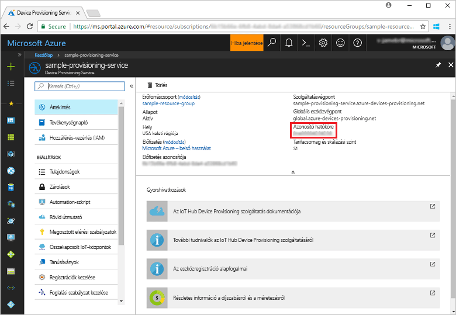
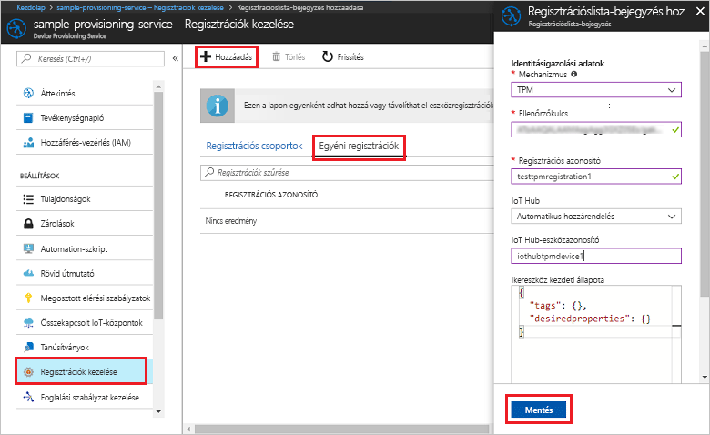
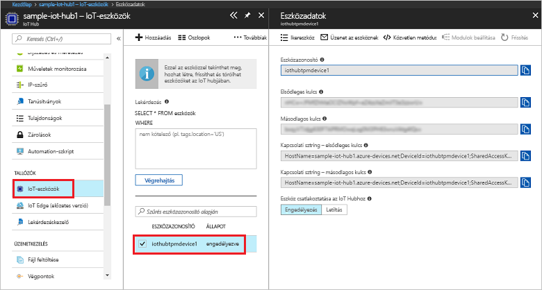

# <a name="create-and-provision-a-simulated-tpm-device-using-c-device-sdk-for-iot-hub-device-provisioning-service"></a>Szimulált TPM-eszköz létrehozása és kiépítése az IoT Hub Device Provisioning Service-hez készült C# eszközoldali SDK-val

[!INCLUDE [iot-dps-selector-quick-create-simulated-device-tpm](../../includes/iot-dps-selector-quick-create-simulated-device-tpm.md)]

Ezek a lépések bemutatják, hogyan hozhat létre Azure IoT Hub C# SDK-val szimulált TPM-eszközt egy Windows operációs rendszert futtató fejlesztői gépen, és hogyan kötheti össze ezt a szimulált eszközt a Device Provisioning Service-szel és az IoT Hubbal. A mintakód a Windows TPM-szimulátort használja az eszköz [Hardveres biztonsági moduljaként (HSM)](https://azure.microsoft.com/blog/azure-iot-supports-new-security-hardware-to-strengthen-iot-security/). 

Amennyiben nem ismeri az automatikus kiépítés folyamatát, olvassa el [az automatikus kiépítés alapfogalmait](concepts-auto-provisioning.md) ismertető cikket is. A folytatás előtt mindenképpen végezze el az [IoT Hub eszközkiépítési szolgáltatás beállítása az Azure Portallal](./quick-setup-auto-provision.md) szakasz lépéseit. 

[!INCLUDE [IoT DPS basic](../../includes/iot-dps-basic.md)]

<a id="setupdevbox"></a>
## <a name="prepare-the-development-environment"></a>A fejlesztési környezet előkészítése 

1. Győződjön meg arról, hogy a [.NET Core SDK](https://www.microsoft.com/net/download/windows) telepítve van a gépén. 

1. Győződjön meg arról, hogy a(z) `git` telepítve van a gépen, és a parancsablakból elérhető környezeti változókhoz van adva. A [Software Freedom Conservancy's Git ügyfél eszközeiben](https://git-scm.com/download/) találja a telepíteni kívánt `git` eszközök legújabb verzióját, amely tartalmazza a **Git Bash** eszközt, azt a parancssori alkalmazást, amellyel kommunikálhat a helyi Git-adattárral. 

4. Nyisson meg egy parancssort vagy a Git Basht. Klónozza a C#-hoz készült Azure IoT SDK GitHub-tárházát:
    
    ```cmd
    git clone --recursive https://github.com/Azure/azure-iot-sdk-csharp.git
    ```

## <a name="provision-the-simulated-device"></a>A szimulált eszköz kiépítése


1. Jelentkezzen be az Azure Portalra. A bal oldali menüben kattintson az **Összes erőforrás** gombra, és nyissa meg Device Provisioning Service-t. Az **Áttekintés** panelen jegyezze fel az **_Azonosító hatóköre_** értéket.

     


2. Egy parancssorban módosítsa a könyvtárakat a TPM-eszközkiépítési minta projektkönyvtárára.

    ```cmd
    cd .\azure-iot-sdk-csharp\provisioning\device\samples\ProvisioningDeviceClientTpm
    ```

2. Írja be az alábbi parancsot, és futtassa a TPM-eszközkiépítési mintát. Az `<IDScope>` értéket cserélje le a kiépítési szolgáltatás Azonosító hatóköre értékére. 

    ```cmd
    dotnet run <IDScope>
    ```

1. A parancsablak megjeleníti az eszközök beléptetéséhez szükséges **_ellenőrzőkulcsot_**, **_regisztrációs azonosítót_** és egy javasolt **_eszközazonosítót_**. Jegyezze fel ezeket az értékeket. 
   > [!NOTE]
   > Ne keverje össze a parancskimenetet tartalmazó ablakot a TPM-szimulátor kimenetét tartalmazó ablakkal. Lehet, hogy a parancsablakra kell kattintania, hogy az előtérbe kerüljön.

     


4. Az Azure Portal Device Provisioning Service összefoglalási panelén válassza a **Regisztrációk kezelése** lehetőséget. Válassza az **Egyéni regisztrációk** fület, és kattintson a felül lévő **Hozzáadás** gombra. 

5. A **Beléptetési listabejegyzés hozzáadása** területen adja meg a következő információkat:
    - Válassza a **TPM** elemet az identitás igazolási *Mechanizmusaként*.
    - Írja be a TPM-eszköz *Regisztrációs azonosítóját* és *Ellenőrzőkulcsát*. 
    - Kiválaszthatja a kiépítési szolgáltatáshoz kapcsolódó egyik IoT hubot.
    - Adjon meg egy egyedi eszközazonosítót. Beírhatja a mintakimenetben javasolt eszközazonosítót, vagy megadhat egy saját értéket. Ha saját azonosítót használ, ne adjon meg bizalmas adatokat az eszköz elnevezésekor. 
    - Frissítse az **Eszköz kezdeti ikerállapotát** az eszköz kívánt kezdeti konfigurációjával.
    - Ha végzett, kattintson a **Mentés** gombra. 

      

   Sikeres beléptetés esetén az eszköz *Regisztrációs azonosítója* megjelenik az *Egyéni beléptetések* lapon lévő listában. 

6. A szimulált eszköz beléptetéséhez nyomja le az Enter billentyűt (az **_ellenőrzőkulcsot_**, a **_regisztrációs azonosítót_** és egy javasolt **_eszközazonosítót_** megjelenítő) parancsablakban. Figyelje meg az eszköz rendszerindítását szimuláló és az eszközkiépítési szolgáltatáshoz az IoT Hub információk lekérése érdekében kapcsolódó üzeneteket. 

1. Ellenőrizze, hogy a rendszer kiépítette-e az eszközt. Ha sikeresen kiépíti a szimulált eszközt a kiépítési szolgáltatáshoz csatolt IoT Hubon, az eszköz azonosítója megjelenik a hub **IoT-eszközök** panelén. 

     

    Ha módosította az *Eszköz kezdeti ikerállapota* alapértelmezett értékét az eszköz beléptetési bejegyzésében, az lekérheti és felhasználhatja a kívánt ikerállapotot a központból. További információ: [Eszközök ikerállapotának megismerése és használata az IoT hubon](../iot-hub/iot-hub-devguide-device-twins.md)


## <a name="clean-up-resources"></a>Az erőforrások eltávolítása

Ha azt tervezi, hogy folytatja az eszközügyfél minta használatát és megismerését, akkor ne törölje a rövid útmutatóban létrehozott erőforrásokat. Ha nem folytatja a munkát, akkor a következő lépésekkel törölheti a rövid útmutatóhoz létrehozott összes erőforrást.

1. Zárja be az eszközügyfél minta kimeneti ablakát a gépen.
1. Zárja be a TPM szimulátor ablakát a gépen.
1. Az Azure Portal bal oldali menüjében kattintson az **Összes erőforrás** lehetőségre, majd válassza ki az eszközkiépítési szolgáltatást. Az **Összes erőforrás** panel felső részén kattintson a **Törlés** elemre.  
1. Az Azure Portal bal oldali menüjében kattintson az **Összes erőforrás** lehetőségre, majd válassza ki az IoT Hubot. Az **Összes erőforrás** panel felső részén kattintson a **Törlés** elemre.  

## <a name="next-steps"></a>További lépések

Ebben a rövid útmutatóban egy szimulált TPM-eszközt hozott létre a gépen, majd kiépítette azt az IoT Hubon az IoT Hub Device Provisioning Service használatával. Ha szeretné megismerni a TPM-eszköz programozott regisztrációjának folyamatát, lépjen tovább a TPM-eszközök programozott regisztrációjának rövid útmutatójára. 

> [!div class="nextstepaction"]
> [Azure rövid útmutató – TPM-eszköz regisztrációja az Azure IoT Hub Device Provisioning Service-be](quick-enroll-device-tpm-csharp.md)
