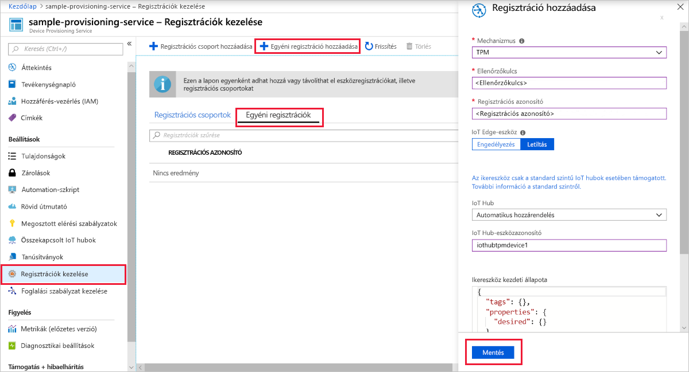
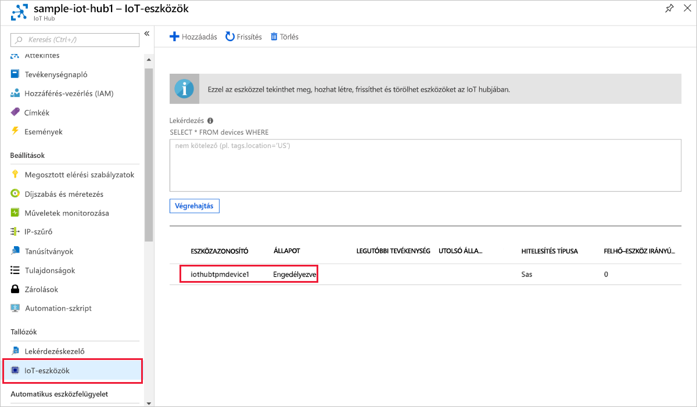

# <a name="quickstart-create-and-provision-a-simulated-tpm-device-using-c-device-sdk-for-iot-hub-device-provisioning-service"></a>Rövid útmutató: szimulált TPM-eszköz létrehozása és kiépítése a IoT Hub Device Provisioning Service C# eszköz SDK-val

[!INCLUDE [iot-dps-selector-quick-create-simulated-device-tpm](../../includes/iot-dps-selector-quick-create-simulated-device-tpm.md)]

Ezek a lépések bemutatják, hogyan lehet az [Azure IoT C# -minták](https://github.com/Azure-Samples/azure-iot-samples-csharp) használatával szimulálni a TPM-eszközt egy Windows operációs rendszert futtató fejlesztői gépen. A minta a szimulált eszközt is összekapcsolja egy IoT Hub a Device kiépítési szolgáltatás használatával. 

A mintakód a Windows TPM-szimulátort használja az eszköz [Hardveres biztonsági moduljaként (HSM)](https://azure.microsoft.com/blog/azure-iot-supports-new-security-hardware-to-strengthen-iot-security/). 

Amennyiben nem ismeri az automatikus kiépítés folyamatát, olvassa el [az automatikus kiépítés alapfogalmait](concepts-auto-provisioning.md) ismertető cikket is. Emellett a folytatás előtt végezze el az [IoT Hub eszközkiépítési szolgáltatás beállítása az Azure Portallal](./quick-setup-auto-provision.md) című cikk lépéseit. 

Az Azure IoT Device Provisioning Service kétféle típusú regisztrációt támogat:

- [Regisztrációs csoportok](concepts-service.md#enrollment-group): Több kapcsolódó eszköz regisztrálásához.
- [Egyéni regisztrációk](concepts-service.md#individual-enrollment): Egyetlen eszköz regisztrálásához.

Ez a cikk az egyéni regisztrációkat ismerteti.

[!INCLUDE [IoT Device Provisioning Service basic](../../includes/iot-dps-basic.md)]

<a id="setupdevbox"></a>
## <a name="prepare-the-development-environment"></a>A fejlesztési környezet előkészítése 

1. Győződjön meg arról, hogy a [.net Core 2,1 SDK vagy újabb verziója](https://www.microsoft.com/net/download/windows) telepítve van a gépen. 

1. Győződjön meg arról, hogy a(z) `git` telepítve van a gépen, és a parancsablakból elérhető környezeti változókhoz van adva. A [Software Freedom Conservancy's Git ügyfél eszközeiben](https://git-scm.com/download/) találja a telepíteni kívánt `git` eszközök legújabb verzióját, amely tartalmazza a **Git Bash** eszközt, azt a parancssori alkalmazást, amellyel kommunikálhat a helyi Git-adattárral. 

1. Nyisson meg egy parancssort vagy a Git Basht. Az Azure IoT-minták klónozása a C# GitHub-tárházban:

    ```cmd
    git clone https://github.com/Azure-Samples/azure-iot-samples-csharp.git
    ```

## <a name="provision-the-simulated-device"></a>A szimulált eszköz kiépítése

1. Jelentkezzen be az Azure portálra. Válassza a **minden erőforrás** gombot a bal oldali menüben, és nyissa meg az eszköz kiépítési szolgáltatását. Az **Áttekintés** panelen jegyezze fel az **_azonosító hatókörének_** értékét.

     

1. Egy parancssorban módosítsa a könyvtárakat a TPM-eszközkiépítési minta projektkönyvtárára.

    ```cmd
    cd .\azure-iot-samples-csharp\provisioning\Samples\device\TpmSample
    ```

1. Írja be az alábbi parancsot, és futtassa a TPM-eszközkiépítési mintát. Az `<IDScope>` értéket cserélje le a kiépítési szolgáltatás Azonosító hatóköre értékére. 

    ```cmd
    dotnet run <IDScope>
    ```

    Ez a parancs egy külön parancssorban fogja elindítani a TPM-lapka szimulátort. Windows rendszeren a Windows biztonsági riasztása megkérdezi, hogy szeretné-e engedélyezni a Simulator. exe programot a nyilvános hálózatokon való kommunikációhoz. A minta esetében megszakíthatja a kérelmet.

1. Az eredeti parancssorablakban megjelenik a **_jóváhagyó kulcs_** , a **_regisztrációs azonosító_** , valamint az eszköz beléptetéséhez szükséges javasolt **_eszköz-azonosító_** . Jegyezze fel ezeket az értékeket. Ezeket az értékeket fogja használni az eszköz kiépítési szolgáltatási példányában lévő egyéni regisztráció létrehozásához. 
   > [!NOTE]
   > Ne keverje össze a parancskimenetet tartalmazó ablakot a TPM-szimulátor kimenetét tartalmazó ablakkal. Előfordulhat, hogy ki kell választania az eredeti parancssorablakot, hogy az előtérbe kerüljön.

     

1. A Azure Portal eszköz kiépítési szolgáltatás menüjében válassza a **regisztrációk kezelése**lehetőséget. Válassza az **Egyéni regisztrációk** fület, és válassza az **Egyéni regisztráció hozzáadása** gombot a felső részen. 

1. A **beléptetés hozzáadása** panelen adja meg a következő adatokat:
   - Válassza a **TPM** elemet az identitás igazolási *Mechanizmusaként*.
   - Adja meg a TPM-eszköz *regisztrációs azonosítóját* és a *jóváhagyás kulcsát* a korábban feljegyzett értékek közül.
   - Válassza ki a kiépítési szolgáltatáshoz kapcsolódó egyik IoT hubot.
   - Ha kívánja, megadhatja az alábbi információkat is:
       - Adjon meg egy egyedi *eszköz-azonosítót* (a javasolt egyet, vagy adja meg a sajátját). Ne használjon bizalmas adatokat az eszköz elnevezésekor. Ha úgy dönt, hogy nem ad meg egyet, a rendszer a regisztrációs azonosítót fogja használni az eszköz azonosítására.
       - Frissítse az **Eszköz kezdeti ikerállapotát** az eszköz kívánt kezdeti konfigurációjával.
   - Ha elkészült, kattintson a **Save (Mentés** ) gombra. 

       

   Sikeres beléptetés esetén az eszköz *Regisztrációs azonosítója* megjelenik az *Egyéni beléptetések* lapon lévő listában. 

1. A szimulált eszköz regisztrálásához nyomja le az *ENTER* billentyűt a parancsablakban (amely a **_jóváhagyás kulcsát_** , a **_regisztrációs azonosítót_** és a javasolt **_eszköz azonosítóját_** jeleníti meg). Figyelje meg az eszköz rendszerindítását szimuláló és az eszközkiépítési szolgáltatáshoz az IoT Hub információk lekérése érdekében kapcsolódó üzeneteket. 

1. Ellenőrizze, hogy a rendszer kiépítette-e az eszközt. Ha sikeresen kiépíti a szimulált eszközt a kiépítési szolgáltatáshoz kapcsolódó IoT hub-ra, az eszköz azonosítója megjelenik a hub **IoT-eszközök** paneljén. 

     

    Ha módosította az *Eszköz kezdeti ikerállapota* alapértelmezett értékét az eszköz beléptetési bejegyzésében, az lekérheti és felhasználhatja a kívánt ikerállapotot a központból. További információ: [Eszközök ikerállapotának megismerése és használata az IoT hubon](../iot-hub/iot-hub-devguide-device-twins.md).

## <a name="clean-up-resources"></a>Az erőforrások eltávolítása

Ha azt tervezi, hogy folytatja a munkát, és megkeresi az eszköz ügyféloldali mintáját, ne törölje az ebben a rövid útmutatóban létrehozott erőforrásokat. Ha nem folytatja a műveletet, a következő lépésekkel törölheti az ebben a rövid útmutatóban létrehozott összes erőforrást.

1. Zárja be az eszközügyfél minta kimeneti ablakát a gépen.
1. Zárja be a TPM szimulátor ablakát a gépen.
1. A Azure Portal bal oldali menüjében válassza a **minden erőforrás** lehetőséget, majd válassza ki az eszköz kiépítési szolgáltatását. Az **Áttekintés** panel felső részén kattintson a **Törlés** gombra a ablaktábla tetején.  
1. A Azure Portal bal oldali menüjében válassza a **minden erőforrás** lehetőséget, majd válassza ki az IoT hubot. Az **Áttekintés** panel felső részén kattintson a **Törlés** gombra a ablaktábla tetején.  

## <a name="next-steps"></a>Következő lépések

Ebben a rövid útmutatóban létrehozott egy TPM-mel szimulált eszközt a gépen, és kiosztotta azt az IoT hubhoz a IoT Hub Device Provisioning Service használatával. A TPM-eszköz programozott módon történő regisztrálásának megismeréséhez folytassa a TPM-eszköz programozott beléptetését bemutató rövid útmutatóval. 

> [!div class="nextstepaction"]
> [Azure rövid útmutató – TPM-eszköz regisztrálása az Azure-ban IoT Hub Device Provisioning Service](quick-enroll-device-tpm-csharp.md)
