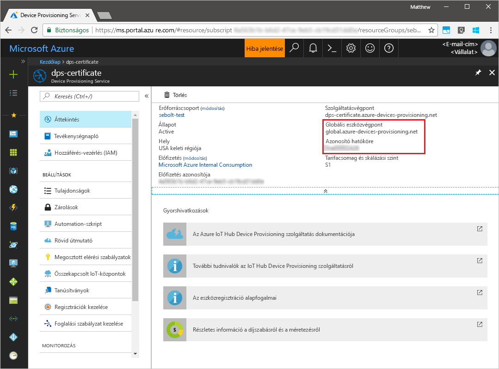
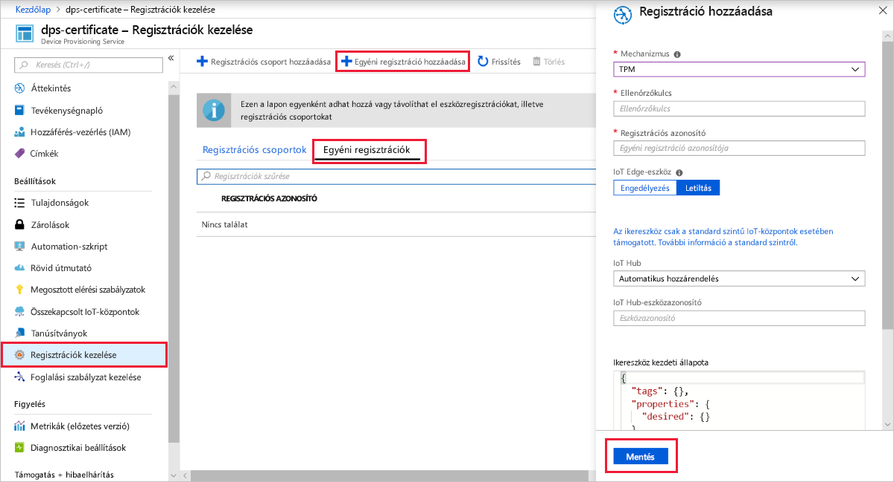
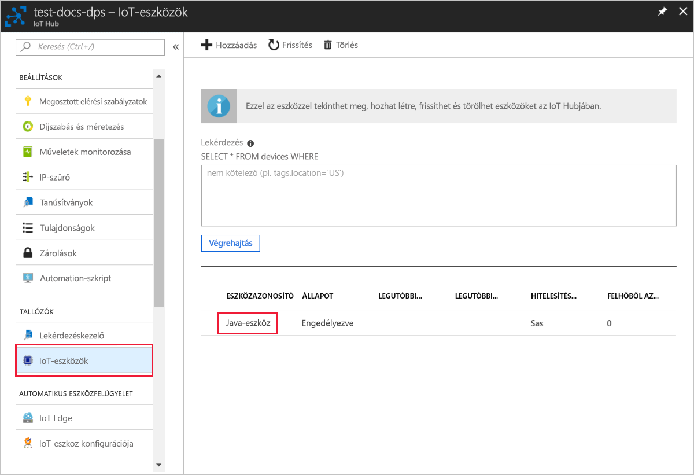

# <a name="create-and-provision-a-simulated-tpm-device-using-java-device-sdk-for-azure-iot-hub-device-provisioning-service"></a>Szimulált TPM-eszköz létrehozása és kiépítése az Azure IoT Hub Device Provisioning Service-hez készült Java eszközoldali SDK-val

[!INCLUDE [iot-dps-selector-quick-create-simulated-device-tpm](../../includes/iot-dps-selector-quick-create-simulated-device-tpm.md)]

Ezek a lépések bemutatják, hogyan hozhat létre szimulált eszközt egy Windows operációs rendszert futtató fejlesztői gépen, hogyan futtathatja a Windows TPM szimulátort az eszköz [hardveres biztonsági moduljaként (HSM-jeként)](https://azure.microsoft.com/blog/azure-iot-supports-new-security-hardware-to-strengthen-iot-security/), és hogyan használhatja a kódmintát, hogy ezt a szimulált eszközt összekösse az eszközkiépítési szolgáltatással és az IoT Hubbal. 

Amennyiben nem ismeri az automatikus kiépítés folyamatát, olvassa el [az automatikus kiépítés alapfogalmait](concepts-auto-provisioning.md) ismertető cikket is. A folytatás előtt mindenképpen végezze el az [IoT Hub eszközkiépítési szolgáltatás beállítása az Azure Portallal](./quick-setup-auto-provision.md) szakasz lépéseit. 

Az Azure IoT Device Provisioning Service kétféle típusú regisztrációt támogat:
- [Regisztrációs csoportok](concepts-service.md#enrollment-group): Több kapcsolódó eszköz regisztrálásához.
- [Egyéni regisztrációk](concepts-service.md#individual-enrollment): Egyetlen eszköz regisztrálásához.

Ez a cikk az egyéni regisztrációkat ismerteti.

[!INCLUDE [IoT Device Provisioning Service basic](../../includes/iot-dps-basic.md)]

## <a name="prepare-the-environment"></a>A környezet előkészítése 

1. Győződjön meg arról, hogy a [Java SE Development Kit 8](https://aka.ms/azure-jdks) telepítve van a gépén.

1. Töltse le és telepítse a [Mavent](https://maven.apache.org/install.html).

1. Győződjön meg arról, hogy a(z) `git` telepítve van a gépen, és a parancsablakból elérhető környezeti változókhoz van adva. A [Software Freedom Conservancy's Git ügyfél eszközeiben](https://git-scm.com/download/) találja a telepíteni kívánt `git` eszközök legújabb verzióját, amely tartalmazza a **Git Bash** eszközt, azt a parancssori alkalmazást, amellyel kommunikálhat a helyi Git-adattárral. 

1. Nyisson meg egy parancssort. Klónozza a GitHub-tárházat az eszközszimuláció kódmintájának beszerzéséhez.
    
    ```cmd/sh
    git clone https://github.com/Azure/azure-iot-sdk-java.git --recursive
    ```

1. Futtassa a [TPM](https://docs.microsoft.com/windows/device-security/tpm/trusted-platform-module-overview)-szimulátort. Kattintson a **Hozzáférés engedélyezése** elemre a _Windows tűzfal_ beállításmódosításának engedélyezéséhez. A 2321-es és a 2322-es portokon lévő szoftvercsatornán keresztül figyel. Ne zárja be ezt az ablakot; a rövid útmutató végéig futnia kell ennek a szimulátornak. 

    ```cmd/sh
    .\azure-iot-sdk-java\provisioning\provisioning-tools\tpm-simulator\Simulator.exe
    ```

    

1. Egy különálló parancssorban keresse meg a gyökérmappát, és építse fel a mintafüggőségeket.

    ```cmd/sh
    cd azure-iot-sdk-java
    mvn install -DskipTests=true
    ```

1. Lépjen a mintamappára.

    ```cmd/sh
    cd provisioning/provisioning-samples/provisioning-tpm-sample
    ```

1. Jelentkezzen be az Azure Portalra, a bal oldali menüben kattintson a **Minden erőforrás** gombra, és nyissa meg a Device Provisioning Service-t. Jegyezze fel az _Azonosító hatóköre_ és a _Kiépítési szolgáltatás globális végpontja_ értéket.

    

1. Szerkessze az `src/main/java/samples/com/microsoft/azure/sdk/iot/ProvisioningTpmSample.java` fájlt, hogy az tartalmazza a korábban feljegyzett _Azonosító hatóköre_ és _Kiépítési szolgáltatás globális végpontja_ értéket.  

    ```java
    private static final String idScope = "[Your ID scope here]";
    private static final String globalEndpoint = "[Your Provisioning Service Global Endpoint here]";
    private static final ProvisioningDeviceClientTransportProtocol PROVISIONING_DEVICE_CLIENT_TRANSPORT_PROTOCOL = ProvisioningDeviceClientTransportProtocol.HTTPS;
    ```

1. A projekt felépítése. Lépjen a célmappára, és futtassa a létrehozott jar-fájlt.

    ```cmd/sh
    mvn clean install
    cd target
    java -jar ./provisioning-tpm-sample-{version}-with-deps.jar
    ```

1. A program elkezd futni. Jegyezze fel a következő szakaszhoz az _Ellenőrzőkulcsot_ és a _Regisztrációs azonosítót_, és hagyja futni a programot.

    
    

## <a name="create-a-device-enrollment-entry"></a>Eszközregisztrációs bejegyzés létrehozása

1. Jelentkezzen be az Azure Portalra, a bal oldali menüben kattintson a **Minden erőforrás** gombra, és nyissa meg a Device Provisioning Service-t.

1. Az eszközkiépítési szolgáltatás összefoglalás panelén válassza a **Beléptetések kezelése** lehetőséget. Válassza az **Egyéni regisztrációk** fület, és kattintson a felül lévő **Egyéni regisztráció hozzáadása** gombra. 

1. A **Regisztráció hozzáadása** alatt adja meg a következő információkat:
    - Válassza a **TPM** elemet az identitás igazolási *Mechanizmusaként*.
    - Írja be a TPM-eszköz előzőleg feljegyzett *Regisztrációs azonosítóját* és *Ellenőrzőkulcsát*. 
    - Válassza ki a kiépítési szolgáltatáshoz kapcsolódó egyik IoT hubot.
    - Adjon meg egy egyedi eszközazonosítót. Ne használjon bizalmas adatokat az eszköz elnevezésekor.
    - Frissítse az **Eszköz kezdeti ikerállapotát** az eszköz kívánt kezdeti konfigurációjával.
    - Ha végzett, kattintson a **Mentés** gombra. 

      

   Sikeres beléptetés esetén az eszköz *Regisztrációs azonosítója* megjelenik az *Egyéni regisztrációk* lapon lévő listában. 


## <a name="simulate-the-device"></a>Az eszköz szimulálása

1. A gépén a Java-mintakódot futtató parancsablakban nyomja le az Enter billentyűt az alkalmazás futtatásának folytatásához. Figyelje meg az eszköz rendszerindítását szimuláló és az eszközkiépítési szolgáltatáshoz az IoT Hub információk lekérése érdekében kapcsolódó üzeneteket.  

    

1. Ha sikeresen kiépíti a szimulált eszközt a kiépítési szolgáltatáshoz csatolt IoT Hubon, az eszköz azonosítója megjelenik a hub **Device Explorer** panelén.

     

    Ha módosította az *Eszköz kezdeti ikerállapota* alapértelmezett értékét az eszköz beléptetési bejegyzésében, az lekérheti és felhasználhatja a kívánt ikerállapotot a központból. További információ: [Eszközök ikerállapotának megismerése és használata az IoT hubon](../iot-hub/iot-hub-devguide-device-twins.md)


## <a name="clean-up-resources"></a>Az erőforrások eltávolítása

Ha azt tervezi, hogy folytatja az eszközügyfél minta használatát és megismerését, akkor ne törölje a rövid útmutatóban létrehozott erőforrásokat. Ha nem folytatja a munkát, akkor a következő lépésekkel törölheti a rövid útmutatóhoz létrehozott összes erőforrást.

1. Zárja be az eszközügyfél minta kimeneti ablakát a gépen.
1. Zárja be a TPM szimulátor ablakát a gépen.
1. Az Azure Portal bal oldali menüjében kattintson az **Összes erőforrás** lehetőségre, majd válassza ki az eszközkiépítési szolgáltatást. Nyissa meg a szolgáltatás **Regisztrációk kezelése** paneljét, majd kattintson az **Egyéni regisztrációk** lapra. Válassza ki a rövid útmutatóban regisztrált eszköz *REGISZTRÁCIÓS AZONOSÍTÓJÁT*, majd kattintson a felül található **Törlés** gombra. 
1. Az Azure Portal bal oldali menüjében kattintson az **Összes erőforrás** lehetőségre, majd válassza ki az IoT Hubot. Nyissa meg a hub **IoT-eszközök** paneljét, válassza ki a rövid útmutatóban regisztrált eszköz *ESZKÖZAZONOSÍTÓJÁT*, majd kattintson a felül található **Törlés** gombra.

## <a name="next-steps"></a>További lépések

Ebben a rövid útmutatóban egy szimulált TPM-eszközt hozott létre a gépen, majd kiépítette azt az IoT Hubon az IoT Hub Device Provisioning Service használatával. Ha szeretné megismerni a TPM-eszköz programozott regisztrációjának folyamatát, lépjen tovább a TPM-eszközök programozott regisztrációjának rövid útmutatójára. 

> [!div class="nextstepaction"]
> [Azure rövid útmutató – TPM-eszköz regisztrációja az Azure IoT Hub Device Provisioning Service-be](quick-enroll-device-tpm-java.md)
