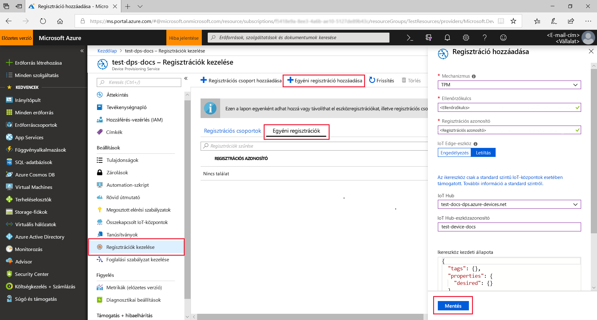
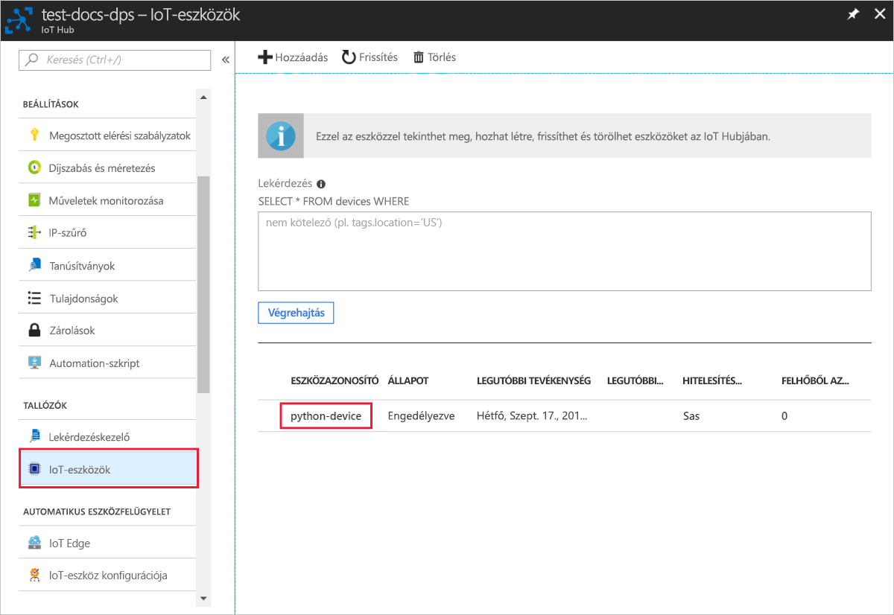

# <a name="quickstart-create-and-provision-a-simulated-tpm-device-using-python-device-sdk-for-iot-hub-device-provisioning-service"></a>Quickstart: Create and provision a simulated TPM device using Python device SDK for IoT Hub Device Provisioning Service

[!INCLUDE [iot-dps-selector-quick-create-simulated-device-tpm](../../includes/iot-dps-selector-quick-create-simulated-device-tpm.md)]

Ezek a lépések bemutatják, hogyan hozhat létre szimulált eszközt egy Windows operációs rendszert futtató fejlesztői gépen, hogyan futtathatja a windowsos TPM-szimulátort az eszköz [hardveres biztonsági moduljaként (HSM-jeként)](https://azure.microsoft.com/blog/azure-iot-supports-new-security-hardware-to-strengthen-iot-security/), és hogyan használhatja a Python-kódmintát, hogy ezt a szimulált eszközt összekösse az eszközkiépítési szolgáltatással és az IoT Hubbal. 

Amennyiben nem ismeri az automatikus kiépítés folyamatát, olvassa el [az automatikus kiépítés alapfogalmait](concepts-auto-provisioning.md) ismertető cikket is. Emellett a folytatás előtt végezze el az [IoT Hub eszközkiépítési szolgáltatás beállítása az Azure Portallal](./quick-setup-auto-provision.md) című cikk lépéseit. 

Az Azure IoT Device Provisioning Service kétféle típusú regisztrációt támogat:
- [Regisztrációs csoportok](concepts-service.md#enrollment-group): Több kapcsolódó eszköz regisztrálásához.
- [Egyéni regisztrációk](concepts-service.md#individual-enrollment): Egyetlen eszköz regisztrálásához.

Ez a cikk az egyéni regisztrációkat ismerteti.

[!INCLUDE [IoT Device Provisioning Service basic](../../includes/iot-dps-basic.md)]

> [!NOTE]
> This guide only applies to the now-deprecated V1 Python SDK. Simulated TPM devices are not yet been supported in V2. The team is currently hard at work bringing V2 to feature parity.

## <a name="prepare-the-environment"></a>A környezet előkészítése 

1. Make sure you have installed either [Visual Studio](https://visualstudio.microsoft.com/vs/) 2015 or later, with the 'Desktop development with C++' workload enabled for your Visual Studio installation.

1. Töltse le és telepítse a [CMake buildelési rendszert](https://cmake.org/download/).

1. Győződjön meg arról, hogy a(z) `git` telepítve van a gépen, és a parancsablakból elérhető környezeti változókhoz van adva. A [Software Freedom Conservancy's Git ügyfél eszközeiben](https://git-scm.com/download/) találja a telepíteni kívánt `git` eszközök legújabb verzióját, amely tartalmazza a **Git Bash** eszközt, azt a parancssori alkalmazást, amellyel kommunikálhat a helyi Git-adattárral. 

1. Nyisson meg egy parancssort vagy a Git Basht. Klónozza a GitHub-adattárat az eszközszimuláció kódmintájához:
    
    ```cmd/sh
    git clone --single-branch --branch v1-deprecated https://github.com/Azure/azure-iot-sdk-python.git --recursive
    ```

1. Hozzon létre egy mappát a GitHub-adattár helyi másolatában a CMake buildelési folyamathoz. 

    ```cmd/sh
    cd azure-iot-sdk-python/c
    mkdir cmake
    cd cmake
    ```

1. A kódminta Windows TPM szimulátort használ. Futtassa az alábbi parancsot a SAS jogkivonat-hitelesítés engedélyezéséhez. Ez egy Visual Studio megoldást is létrehoz a szimulált eszközhöz.

    ```cmd/sh
    cmake -Duse_prov_client:BOOL=ON -Duse_tpm_simulator:BOOL=ON ..
    ```

1. Egy különálló parancssorban keresse meg a TPM-szimulátor mappáját, és futtassa a [TPM](https://docs.microsoft.com/windows/device-security/tpm/trusted-platform-module-overview)-szimulátort. Kattintson a **Hozzáférés engedélyezése** elemre. A 2321-es és a 2322-es portokon lévő szoftvercsatornán keresztül figyel. Ne zárja be ezt a parancsablakot; a rövid útmutató végéig futnia kell ennek a szimulátornak. 

    ```cmd/sh
    .\azure-iot-sdk-python\c\provisioning_client\deps\utpm\tools\tpm_simulator\Simulator.exe
    ```

    


## <a name="create-a-device-enrollment-entry"></a>Eszközregisztrációs bejegyzés létrehozása

1. Nyissa meg a *cmake* mappában létrehozott `azure_iot_sdks.sln` nevű megoldást, és építse fel azt a Visual Studióban.

1. Kattintson a jobb gombbal a **tpm_device_provision** projektre, és válassza a **Set as Startup Project** (Beállítás kezdőprojektként) lehetőséget. Futtassa a megoldást. A kimeneti ablak megjeleníti az eszközök beléptetéséhez szükséges **_ellenőrzőkulcsot_** és **_regisztrációs azonosítót_** . Jegyezze fel ezeket az értékeket. 

    

1. Jelentkezzen be az Azure Portalra, a bal oldali menüben kattintson a **Minden erőforrás** gombra, és nyissa meg a Device Provisioning Service-t.

1. Az eszközkiépítési szolgáltatás összefoglalás panelén válassza a **Beléptetések kezelése** lehetőséget. Válassza az **Egyéni regisztrációk** fület, és kattintson a felül lévő **Egyéni regisztráció hozzáadása** gombra. 

1. A **Regisztráció hozzáadása** alatt adja meg a következő információkat:
   - Válassza a **TPM** elemet az identitás igazolási *Mechanizmusaként*.
   - Írja be a TPM-eszköz *Regisztrációs azonosítóját* és *Ellenőrzőkulcsát*. 
   - Válassza ki a kiépítési szolgáltatáshoz kapcsolódó egyik IoT hubot.
   - Adjon meg egy egyedi eszközazonosítót. Ne használjon bizalmas adatokat az eszköz elnevezésekor.
   - Frissítse az **Eszköz kezdeti ikerállapotát** az eszköz kívánt kezdeti konfigurációjával.
   - Ha végzett, kattintson a **Mentés** gombra. 

       

   Sikeres beléptetés esetén az eszköz *Regisztrációs azonosítója* megjelenik az *Egyéni beléptetések* lapon lévő listában. 


## <a name="simulate-the-device"></a>Az eszköz szimulálása

1. Töltse le és telepítse a [Python 2.x-es vagy 3.x-es verzióját](https://www.python.org/downloads/). Mindenképp a rendszernek megfelelő, 32 vagy 64 bites telepítést használja. Amikor a rendszer erre kéri, mindenképp adja hozzá a Pythont a platformspecifikus környezeti változókhoz.
    - Ha Windows operációs rendszert használ, a [Visual C++ terjeszthető csomagra](https://www.microsoft.com/download/confirmation.aspx?id=48145) van szükség a Python natív DLL-jei használatához.

1. A Python-csomagok létrehozásához kövesse [ezeket az utasításokat](https://github.com/Azure/azure-iot-sdk-python/blob/master/doc/python-devbox-setup.md).

   > [!NOTE]
   > A `build_client.cmd` futtatása esetén mindenképp használja a `--use-tpm-simulator` jelzőt.
   > 
   > [!NOTE]
   > A `pip` használata esetén mindenképp telepítse az `azure-iot-provisioning-device-client` csomagot is. Vegye figyelembe, hogy a kiadott PIP-csomagok az igazi TPM-et használják, nem a szimulátort. A szimulátor használatához a fordítást a `--use-tpm-simulator` jelzőt használva a forrásból kell elvégeznie.

1. Lépjen a mintákat tartalmazó mappára.

    ```cmd/sh
    cd azure-iot-sdk-python/provisioning_device_client/samples
    ```

1. A Python IDE használatával módosítsa a **provisioning\_device\_client\_sample.py** nevű Python-szkriptet. Módosítsa a *GLOBAL\_PROV\_URI* és az *ID\_SCOPE* változót a korábban feljegyzett értékekre. Arról is győződjön meg, hogy a *SECURITY\_DEVICE\_TYPE* változó `ProvisioningSecurityDeviceType.TPM` értékre van állítva.

    ```python
    GLOBAL_PROV_URI = "{globalServiceEndpoint}"
    ID_SCOPE = "{idScope}"
    SECURITY_DEVICE_TYPE = ProvisioningSecurityDeviceType.TPM
    PROTOCOL = ProvisioningTransportProvider.HTTP
    ```

    

1. Futtassa a mintát. 

    ```cmd/sh
    python provisioning_device_client_sample.py
    ```

1. Figyelje meg az eszköz rendszerindítását szimuláló és az eszközkiépítési szolgáltatáshoz az IoT Hub információk lekérése érdekében kapcsolódó üzeneteket. 

    

1. Ha sikeresen kiépíti a szimulált eszközt a kiépítési szolgáltatáshoz csatolt IoT Hubon, az eszköz azonosítója megjelenik a hub **Device Explorer** panelén.

     

    Ha módosította az *Eszköz kezdeti ikerállapota* alapértelmezett értékét az eszköz beléptetési bejegyzésében, az lekérheti és felhasználhatja a kívánt ikerállapotot a központból. További információ: [Eszközök ikerállapotának megismerése és használata az IoT hubon](../iot-hub/iot-hub-devguide-device-twins.md)


## <a name="clean-up-resources"></a>Az erőforrások eltávolítása

Ha azt tervezi, hogy folytatja az eszközügyfél minta használatát és megismerését, akkor ne törölje a rövid útmutatóban létrehozott erőforrásokat. Ha nem folytatja a munkát, akkor a következő lépésekkel törölheti a rövid útmutatóhoz létrehozott összes erőforrást.

1. Zárja be az eszközügyfél minta kimeneti ablakát a gépen.
1. Zárja be a TPM szimulátor ablakát a gépen.
1. Az Azure Portal bal oldali menüjében kattintson az **Összes erőforrás** lehetőségre, majd válassza ki az eszközkiépítési szolgáltatást. Open the **Manage Enrollments** blade for your service, and then click the **Individual Enrollments** tab. Select the *REGISTRATION ID* of the device you enrolled in this Quickstart, and click the **Delete** button at the top. 
1. Az Azure Portal bal oldali menüjében kattintson az **Összes erőforrás** lehetőségre, majd válassza ki az IoT Hubot. Nyissa meg a hub **IoT-eszközök** paneljét, válassza ki a rövid útmutatóban regisztrált eszköz *ESZKÖZAZONOSÍTÓJÁT*, majd kattintson a felül található **Törlés** gombra.

## <a name="next-steps"></a>Következő lépések

Ebben a rövid útmutatóban egy szimulált TPM-eszközt hozott létre a gépen, majd kiépítette azt az IoT Hubon az IoT Hub Device Provisioning Service használatával. Ha szeretné megismerni a TPM-eszköz programozott regisztrációjának folyamatát, lépjen tovább a TPM-eszközök programozott regisztrációjának rövid útmutatójára. 

> [!div class="nextstepaction"]
> [Azure rövid útmutató – TPM-eszköz regisztrációja az Azure IoT Hub Device Provisioning Service-be](quick-enroll-device-tpm-python.md)
