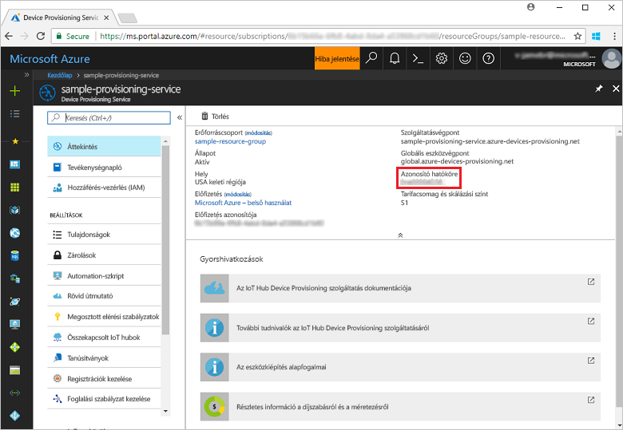
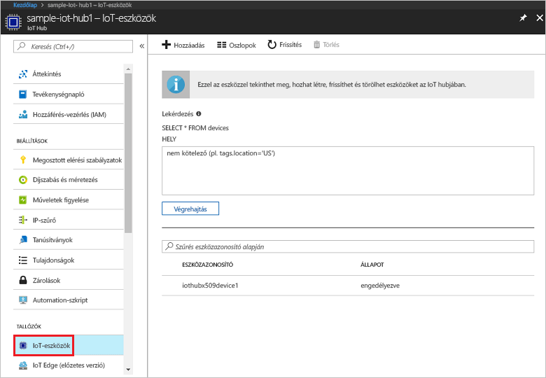

# <a name="create-and-provision-a-simulated-x509-device-using-c-device-sdk-for-iot-hub-device-provisioning-service"></a>Szimulált X.509-eszköz létrehozása és kiépítése az IoT Hub Device Provisioning Service-hez készült C# eszközoldali SDK-val
[!INCLUDE [iot-dps-selector-quick-create-simulated-device-x509](../../includes/iot-dps-selector-quick-create-simulated-device-x509.md)]

Ezek a lépések bemutatják, hogyan hozhat létre [Azure IoT Hub C# SDK](https://github.com/Azure/azure-iot-sdk-csharp)-val szimulált X.509-eszközt egy Windows operációs rendszert futtató fejlesztői gépen, és hogyan kötheti össze ezt a szimulált eszközt a Device Provisioning Service-szel és az IoT Hubbal.

A folytatás előtt végezze el az [IoT Hub eszközkiépítési szolgáltatás beállítása az Azure Portallal](./quick-setup-auto-provision.md) szakasz lépéseit.

[!INCLUDE [IoT DPS basic](../../includes/iot-dps-basic.md)]

<a id="setupdevbox"></a>
## <a name="prepare-the-development-environment"></a>A fejlesztési környezet előkészítése 

1. Győződjön meg arról, hogy a [.NET Core SDK](https://www.microsoft.com/net/download/windows) telepítve van a gépén. 

1. Győződjön meg arról, hogy a(z) `git` telepítve van a gépen, és a parancsablakból elérhető környezeti változókhoz van adva. A [Software Freedom Conservancy's Git ügyfél eszközeiben](https://git-scm.com/download/) találja a telepíteni kívánt `git` eszközök legújabb verzióját, amely tartalmazza a **Git Bash** eszközt, azt a parancssori alkalmazást, amellyel kommunikálhat a helyi Git-adattárral. 

4. Nyisson meg egy parancssort vagy a Git Basht. Klónozza a [C#-hoz készült Azure IoT SDK](https://github.com/Azure/azure-iot-sdk-csharp) GitHub-tárházát:
    
    ```cmd
    git clone --recursive https://github.com/Azure/azure-iot-sdk-csharp.git
    ```

## <a name="create-a-self-signed-x509-device-certificate-and-individual-enrollment-entry"></a>Önaláírt X.509-eszköztanúsítvány és egyéni regisztrációs bejegyzés létrehozása

1. Egy parancssorban módosítsa a könyvtárakat az X.509-eszközkiépítési minta projektkönyvtárára.

    ```cmd
    cd .\azure-iot-sdk-csharp\provisioning\device\samples\ProvisioningDeviceClientX509
    ```

1. A mintakód úgy lett beállítva, hogy egy jelszóval védett PKCS12 formázott fájlban (certificate.pfx) tárolt X.509-tanúsítványokat használja. Ezenfelül szükség lesz egy nyilvános kulcsú tanúsítványfájlra is (certificate.cer), amely egy egyéni beléptetés létrehozására szolgál a rövid útmutató későbbi részében. Önaláírt tanúsítvány és a hozzátartozó .cer és .pfx fájlok létrehozásához futtassa az alábbi parancsot:

    ```cmd
    powershell .\GenerateTestCertificate.ps1
    ```

2. A szkript kér egy PFX-jelszót. Jegyezze meg ezt a jelszót, mert a minta futtatásakor használnia kell.

      


4. Jelentkezzen be az Azure Portalra, a bal oldali menüben kattintson az **Összes erőforrás** gombra, és nyissa meg az eszközkiépítési szolgáltatását.

4. Az eszközkiépítési szolgáltatás összefoglalás panelén válassza a **Beléptetések kezelése** lehetőséget. Válassza az **Egyéni beléptetések** fület, és kattintson a felül lévő **Hozzáadás** gombra. 

5. A **Beléptetési listabejegyzés hozzáadása** területen adja meg a következő információkat:
    - Válassza az **X.509** elemet az identitás igazolási *Mechanizmusaként*.
    - A *Tanúsítványfájl (.pem vagy .cer)* területen válassza ki az előző lépésben létrehozott **certificate.cer** tanúsítványfájlt a *Fájlkezelő* vezérlővel.
    - Az **Eszközazonosító** mezőt hagyja üresen. Az eszköz kiépítésekor a rendszer az eszközazonosítót az X.509-tanúsítványban lévő **iothubx509device1** köznapi névre állítja be. A rendszer ezt a nevet használja az egyéni regisztrációs bejegyzés regisztrációs azonosítójaként s. 
    - Ha kívánja, megadhatja az alábbi információkat is:
        - Válassza ki a kiépítési szolgáltatáshoz kapcsolódó egyik IoT hubot.
        - Frissítse az **Eszköz kezdeti ikerállapotát** az eszköz kívánt kezdeti konfigurációjával.
    - Ha végzett, kattintson a **Mentés** gombra. 

      

   Sikeres regisztráció esetén az X.509 regisztrációs bejegyzés **iothubx509device1** azonosítóval jelenik meg a *Regisztrációs azonosító* oszlopban az *Egyéni regisztrációk* lapon. 

## <a name="provision-the-simulated-device"></a>A szimulált eszköz kiépítése

1. Jegyezze fel az **_Azonosító hatóköre_** értéket az eszközkiépítési szolgáltatás **Áttekintés** paneljéről.

     


2. Írja be az alábbi parancsot az X.509-eszköz kiépítési mintájának összeállításához és futtatásához. Az `<IDScope>` értéket cserélje le a kiépítési szolgáltatás Azonosító hatóköre értékére. 

    ```cmd
    dotnet run <IDScope>
    ```

6. Amikor a rendszer kéri, adja meg a korábban létrehozott PFX-fájl jelszavát. Figyelje meg az eszköz rendszerindítását szimuláló és az eszközkiépítési szolgáltatáshoz az IoT Hub információk lekérése érdekében kapcsolódó üzeneteket. 

     

1. Ellenőrizze, hogy a rendszer kiépítette-e az eszközt. Ha sikeresen kiépíti a szimulált eszközt a kiépítési szolgáltatáshoz csatolt IoT Hubon, az eszköz azonosítója megjelenik a hub **IoT-eszközök** panelén. 

     

    Ha módosította az *Eszköz kezdeti ikerállapota* alapértelmezett értékét az eszköz beléptetési bejegyzésében, az lekérheti és felhasználhatja a kívánt ikerállapotot a központból. További információ: [Eszközök ikerállapotának megismerése és használata az IoT hubon](../iot-hub/iot-hub-devguide-device-twins.md)


## <a name="clean-up-resources"></a>Az erőforrások eltávolítása

Ha azt tervezi, hogy folytatja az eszközügyfél minta használatát és megismerését, akkor ne törölje a rövid útmutatóban létrehozott erőforrásokat. Ha nem folytatja a munkát, akkor a következő lépésekkel törölheti a rövid útmutatóhoz létrehozott összes erőforrást.

1. Zárja be az eszközügyfél minta kimeneti ablakát a gépen.
1. Zárja be a TPM szimulátor ablakát a gépen.
1. Az Azure Portal bal oldali menüjében kattintson az **Összes erőforrás** lehetőségre, majd válassza ki az eszközkiépítési szolgáltatást. Az **Összes erőforrás** panel felső részén kattintson a **Törlés** elemre.  
1. Az Azure Portal bal oldali menüjében kattintson az **Összes erőforrás** lehetőségre, majd válassza ki az IoT Hubot. Az **Összes erőforrás** panel felső részén kattintson a **Törlés** elemre.  

## <a name="next-steps"></a>További lépések

Ebben a rövid útmutatóban egy szimulált X.509-eszközt hozott létre a Windows rendszerű gépén, amelyet aztán kiépített az IoT Hubon a portál Azure IoT Hub Device Provisioning Service szolgáltatásával. Ha szeretné megismerni az X.509-eszköz programozott regisztrációjának folyamatát, lépjen tovább az X.509-eszközök programozott regisztrációjának rövid útmutatójára. 

> [!div class="nextstepaction"]
> [Azure rövid útmutató – X.509-eszközök regisztrációja az Azure IoT Hub Device Provisioning Service-be](quick-enroll-device-x509-node.md)
