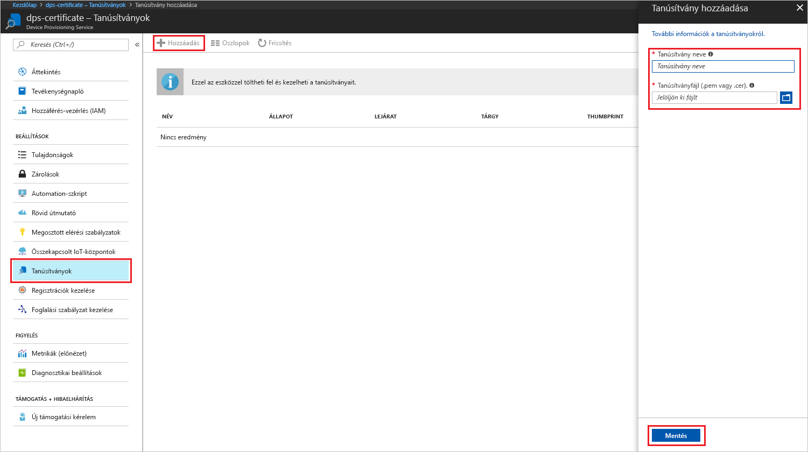
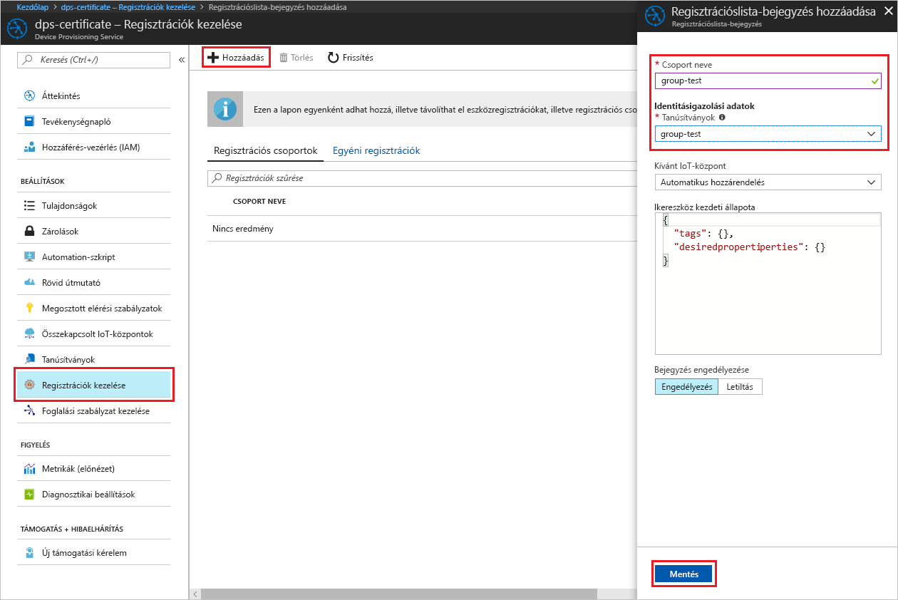

# <a name="create-and-provision-an-x509-simulated-device-using-nodejs-device-sdk-for-iot-hub-device-provisioning-service"></a>Szimulált X.509-eszköz létrehozása és kiépítése az IoT Hub Device Provisioning Service-hez készült Node.js eszközoldali SDK-val
[!INCLUDE [iot-dps-selector-quick-create-simulated-device-x509](../../includes/iot-dps-selector-quick-create-simulated-device-x509.md)]

Az IoT Hub Device Provisioning Service az IoT Hub segédszolgáltatása, amely beavatkozás nélkül teszi lehetővé az eszközkiépítést az IoT Hubon. A Device Provisioning Service-szel több millió eszköz kiépítését végezheti el biztonságosan és skálázható módon.

Az eszközkiépítés két lépésből áll. Az első lépés a megfelelő regisztrációs bejegyzés létrehozása a Device Provisioning Service-ben a megoldás egyéni követelményei alapján.  A második lépés kapcsolat létesítése az eszköz és a Device Provisioning Service között, valamint az eszköz regisztrálása az IoT Hubon. Ha mindkét lépés befejeződött, az eszköz kiépítettnek tekinthető. A Device Provisioning Service a két lépés automatizálásával biztosítja az eszközök zökkenőmentes kiépítését. További információk: [A Device Provisioning Service-szel kapcsolatos fogalmak](https://docs.microsoft.com/en-us/azure/iot-dps/concepts-service).

Ezek a lépések bemutatják, hogyan hozhat létre regisztrációs bejegyzést a Device Provisioning Service-ben, hogyan szimulálhat egy X.509-eszközt a fejlesztői gépén, hogyan csatlakoztatja a szimulált eszközt a Device Provisioning Service-hez, és hogyan regisztrálhatja ezt az eszközt az IoT Hubon az [Azure IoT Hubhoz készült Node.js eszközoldali SDK segítségével](https://github.com/Azure/azure-iot-sdk-node).

[!INCLUDE [IoT DPS basic](../../includes/iot-dps-basic.md)]

## <a name="prepare-the-environment"></a>A környezet előkészítése 

1. A folytatás előtt végezze el az [IoT Hub Device Provisioning Service Azure Portallal való beállítását](./quick-setup-auto-provision.md) ismertető cikk lépéseit.

1. Győződjön meg arról, hogy a [Node.js 4.0-s vagy újabb verziója](https://nodejs.org) telepítve van a gépén.

1. Győződjön meg arról, hogy a [Git](https://git-scm.com/download/) telepítve van a gépen, és a parancsablakból elérhető környezeti változókhoz van adva. 

1. Győződjön meg arról, hogy az [OpenSSL](https://www.openssl.org/) telepítve van a gépen, és a parancsablakból elérhető környezeti változókhoz van adva. Ez a kódtár létrehozható és telepíthető valamilyen forrásból, vagy letölthető és telepíthető [külső féltől](https://wiki.openssl.org/index.php/Binaries), például [innen](https://sourceforge.net/projects/openssl/). 

    > [!NOTE]
    > Ha már létrehozta az X.509 _fő-_, _köztes_, és/vagy _levéltanúsítványát_, kihagyhatja ezt a lépést és a tanúsítvány létrehozásával kapcsolatos további lépéseket.
    >


## <a name="create-an-enrollment-entry"></a>regisztrációs bejegyzés létrehozása

Regisztrációnak az esetlegesen a későbbiekben regisztrált eszközök Device Provisioning Service-ben tárolt rekordját nevezzük. A regisztrációs rekord információkat tartalmaz az eszközről vagy eszközcsoportról, köztük az X-509-tanúsítvány részleteit és további regisztrációs információkat. A Device Provisioning Service kétféle regisztrációtípust támogat: az _egyéni regisztrációt_ és a _regisztrációs csoportot_. További információk: [regisztrációval kapcsolatos fogalmak](https://docs.microsoft.com/en-us/azure/iot-dps/concepts-service#enrollment).

Ha saját X.509-teszttanúsítványokat hoz létre, tekintse meg a [biztonsági alapelveket](https://docs.microsoft.com/en-us/azure/iot-dps/concepts-security#x509-certificates) azzal kapcsolatban, hogy melyik tanúsítványokra van szükség a megoldásához, valamint [az Azure IoT Device Provisioning Device SDK for Node.js-hez használható eszközöket ismertető](https://github.com/azure/azure-iot-sdk-node/tree/master/provisioning/tools) szakaszt a megvalósítás részleteiért.

1. Nyisson meg egy parancssort. Klónozza a GitHub-adattárat a kódmintákhoz:
    
    ```cmd/sh
    git clone https://github.com/Azure/azure-iot-sdk-node.git --recursive
    ```

1. Lépjen a tanúsítványt létrehozó szkripthez, és állítsa össze a projektet. 

    ```cmd/sh
    cd azure-iot-sdk-node/provisioning/tools
    npm install
    ```

1. Hozza létre a regisztrációs információkat a következő módszerek egyikével, a beállításnak megfelelően:

    - **Egyéni regisztráció**:

        1. A saját _tanúsítványnevét_ használva hozza létre a _levéltanúsítványt_ a szkript futtatásával. Vegye figyelembe, hogy a levéltanúsítvány köznapi neve lesz a [regisztrációs azonosító](https://docs.microsoft.com/en-us/azure/iot-dps/concepts-device#registration-id), ezért csak kisbetűket, alfanumerikus karaktereket és kötőjeleket használjon.

        ```cmd/sh
        node create_test_cert.js device {certificate-name}
        ```
         
        1. Az **Azure** Portalon nyissa meg a **Device Provisioning Service** összefoglalási paneljét. Válassza a **Regisztrációk kezelése**, majd az **Egyéni regisztrációk** fület, és kattintson a felül lévő **Hozzáadás** gombra. 

        1. A **Beléptetési listabejegyzés hozzáadása** területen adja meg a következő információkat:
            - Válassza az **X.509** elemet az identitás igazolási *Mechanizmusaként*.
            - A *Tanúsítványfájl (.pem vagy .cer)* területen válassza ki az előző lépésben létrehozott **_{tanúsítványnév}\_cert.pem_** tanúsítványfájlt a *Fájlkezelő* vezérlővel.
            - Ha kívánja, megadhatja az alábbi információkat is:
                - Válassza ki a kiépítési szolgáltatáshoz kapcsolódó egyik IoT hubot.
                - Adjon meg egy egyedi eszközazonosítót. Ne használjon bizalmas adatokat az eszköz elnevezésekor. 
                - Frissítse az **Eszköz kezdeti ikerállapotát** az eszköz kívánt kezdeti konfigurációjával.
            - Ha végzett, kattintson a **Mentés** gombra. 

          

    Sikeres regisztráció esetén az X.509-eszköz **{tanúsítványnév}** azonosítóval megjelenik a *Regisztrációs azonosító* oszlopban, az *Egyéni regisztrációk* lapon. Jegyezze fel ezt az értéket későbbi használatra.

    - **Regisztrációs csoportok**: 

        1. A saját _gyökérneve_ használatával hozza létre a _főtanúsítványt_ a szkript futtatásával.

        ```cmd/sh
        node create_test_cert.js root {root-name}
        ```

        1. Az **Azure** Portalon nyissa meg a **Device Provisioning Service** összefoglalási paneljét. Válassza a **Tanúsítványok** lehetőséget, és kattintson a felül lévő **Hozzáadás** gombra.

        1. A **Tanúsítvány hozzáadása** területen adja meg a következő információkat:
            - Adjon meg egy egyedi tanúsítványnevet.
            - Válassza ki a korábban létrehozott **_{gyökérnév}\_cert.pem_** fájlt.
            - Ha végzett, kattintson a **Mentés** gombra.

        

        1. Válassza ki az újonnan létrehozott tanúsítványt:
            - Kattintson az **Ellenőrző kód létrehozása** lehetőségre. Másolja ki a kapott kódot.
            - Hozza létre az _ellenőrző_ tanúsítványt. Adja meg az _ellenőrzőkódot_, vagy kattintson a jobb gombbal, és illessze be a futó Node szkriptablakba a következő paranccsal:

                ```cmd/sh
                node create_test_cert.js verification {rootname_cert} {verification code}
                ```

            - Az *Ellenőrző tanúsítvány (.pem vagy .cer fájl)* területen válassza ki az előző lépésekben létrehozott **_verification_cert.pem_** tanúsítványfájlt a *Fájlkezelő* vezérlővel. Kattintson az **Ellenőrzés** lehetőségre.

            

        1. Válassza a **Regisztrációk kezelése** lehetőséget. Válassza a **Regisztrációs csoportok** lapot, és kattintson a felül található **Hozzáadás** gombra.
            - Adjon meg egy egyedi csoportnevet.
            - Válassza ki a korábban létrehozott egyedi tanúsítványnevet.
            - Ha kívánja, megadhatja az alábbi információkat is:
                - Válassza ki a kiépítési szolgáltatáshoz kapcsolódó egyik IoT hubot.
                - Frissítse az **Eszköz kezdeti ikerállapotát** az eszköz kívánt kezdeti konfigurációjával.

        

        Sikeres regisztráció esetén az X.509-eszközcsoport megjelenik a *Csoportnév* oszlopban a *Regisztrációs csoportok* lapon. Jegyezze fel ezt az értéket későbbi használatra.

        1. A saját _tanúsítványneve_ mögé a korábban használt _gyökérnevet_ fűzve hozza létre a _levéltanúsítványt_ a szkript futtatásával. A levéltanúsítvány köznapi neve lesz a [regisztrációs azonosító](https://docs.microsoft.com/en-us/azure/iot-dps/concepts-device#registration-id), ezért csak kisbetűket, alfanumerikus karaktereket és kötőjeleket használjon.

            ```cmd/sh
            node create_test_cert.js device {certificate-name} {root-name}
            ```

        > [!NOTE]
        > Létrehozhat _köztes_ tanúsítványokat is a `node create_test_cert.js intermediate {certificate-name} {parent-name}` paranccsal. Ehhez ügyeljen arra, hogy utolsó lépésként hozza létre a _levéltanúsítványt_, amelynek gyökereként/szülőjeként az utolsó _köztes_ tanúsítványt használja. További információkért tekintse meg az [eszközhozzáférés szabályozásával kapcsolatos](https://docs.microsoft.com/en-us/azure/iot-dps/concepts-security#controlling-device-access-to-the-provisioning-service-with-x509-certificates) témakört.
        >


## <a name="simulate-the-device"></a>Az eszköz szimulálása

Az [Azure IoT Hub Node.js eszközoldali SDK](https://github.com/Azure/azure-iot-sdk-node) segítségével könnyedén szimulálhatóak eszközök. További információkért tekintse meg az [eszközökkel kapcsolatos alapelveket ismertető](https://docs.microsoft.com/en-us/azure/iot-dps/concepts-device) témakört.

1. Az Azure Portalon válassza ki a Device Provisioning Service **Áttekintés** panelét, és jegyezze fel a **_Globális eszközvégpont_** és az **_Azonosító hatóköre_** értékét.

     

1. Másolja a _tanúsítványt_ és a _kulcsot_ a mintamappába.

    ```cmd/sh
    copy .\{certificate-name}_cert.pem ..\device\samples\{certificate-name}_cert.pem
    copy .\{certificate-name}_key.pem ..\device\samples\{certificate-name}_key.pem
    ```

1. Keresse meg az eszköz tesztszkriptjét, és állítsa össze a projektet. 

    ```cmd/sh
    cd ..\device\samples
    npm install
    ```

1. Szerkessze a **register\_x509.js** fájlt. A következő módosítások elvégzése után mentse a fájlt.
    - A `provisioning host` elemet cserélje le a fenti **1. lépésben** feljegyzett**_globális eszközvégpontra_**.
    - Az `id scope` elemet cserélje le a fenti **1. lépésben** feljegyzett**_azonosító-hatókörre_**. 
    - A `reigstration id` elemet cserélje le az előző szakaszban feljegyzett **_regisztrációs azonosítóra_** vagy **_csoportnévre_**.
    - A `cert filename` és a `key filename` elemet cserélje le a fenti **2. lépésben** másolt fájlokra. 

1. Futtassa a szkriptet, és ellenőrizze, hogy az eszköz sikeresen lett-e kiépítve.

    ```cmd/sh
    node register_x509.js
    ```   

1. A portálon lépjen a kiépítési szolgáltatáshoz csatolt IoT hubhoz, és nyissa meg az **IoT-eszközök** panelt. Ha sikeresen kiépíti a szimulált X.509-eszközt a hubon, az eszköz azonosítója megjelenik az **IoT-eszközök** panelen, a hozzá tartozó *ÁLLAPOT* pedig **engedélyezett** lesz. Ha már a minta eszközalkalmazás futtatása előtt megnyitotta a panelt, akkor lehet, hogy rá kell kattintania a fenti **Frissítés** gombra. 

     

    Ha módosította az *Eszköz kezdeti ikerállapota* alapértelmezett értékét az eszköz beléptetési bejegyzésében, az lekérheti és felhasználhatja a kívánt ikerállapotot a központból. További információ: [Eszközök ikerállapotának megismerése és használata az IoT hubon](../iot-hub/iot-hub-devguide-device-twins.md).


## <a name="clean-up-resources"></a>Az erőforrások eltávolítása

Ha azt tervezi, hogy folytatja az eszközügyfél minta használatát és megismerését, akkor ne törölje a rövid útmutatóban létrehozott erőforrásokat. Ha nem folytatja a munkát, akkor a következő lépésekkel törölheti a rövid útmutatóhoz létrehozott összes erőforrást.

1. Zárja be az eszközügyfél minta kimeneti ablakát a gépen.
1. Az Azure Portal bal oldali menüjében kattintson az **Összes erőforrás** lehetőségre, majd válassza ki az eszközkiépítési szolgáltatást. Nyissa meg a szolgáltatás **Regisztrációk kezelése** paneljét, majd kattintson az **Egyéni regisztrációk** vagy **Regisztrációs csoportok** lapra. Válassza ki az ezen rövid útmutatóban regisztrált eszköz *REGISZTRÁCIÓS AZONOSÍTÓJÁT* vagy *CSOPORTNEVÉT*, majd kattintson a felül lévő **Törlés** gombra. 
1. Az Azure Portal bal oldali menüjében kattintson az **Összes erőforrás** lehetőségre, majd válassza ki az IoT Hubot. Nyissa meg a hub **IoT-eszközök** paneljét, válassza ki a rövid útmutatóban regisztrált eszköz *ESZKÖZAZONOSÍTÓJÁT*, majd kattintson a felül található **Törlés** gombra.


## <a name="next-steps"></a>További lépések

Ebben a rövid útmutatóban egy szimulált X.509-eszközt hozott létre, amelyet aztán kiépített az IoT Hubon a portál Azure IoT Hub Device Provisioning Service szolgáltatásával. Ha szeretné megismerni az X.509-eszköz programozott regisztrációjának folyamatát, lépjen tovább az X.509-eszközök programozott regisztrációjának rövid útmutatójára. 

> [!div class="nextstepaction"]
> [Azure rövid útmutató – X.509-eszközök regisztrációja az Azure IoT Hub Device Provisioning Service-be](quick-enroll-device-x509-node.md)
