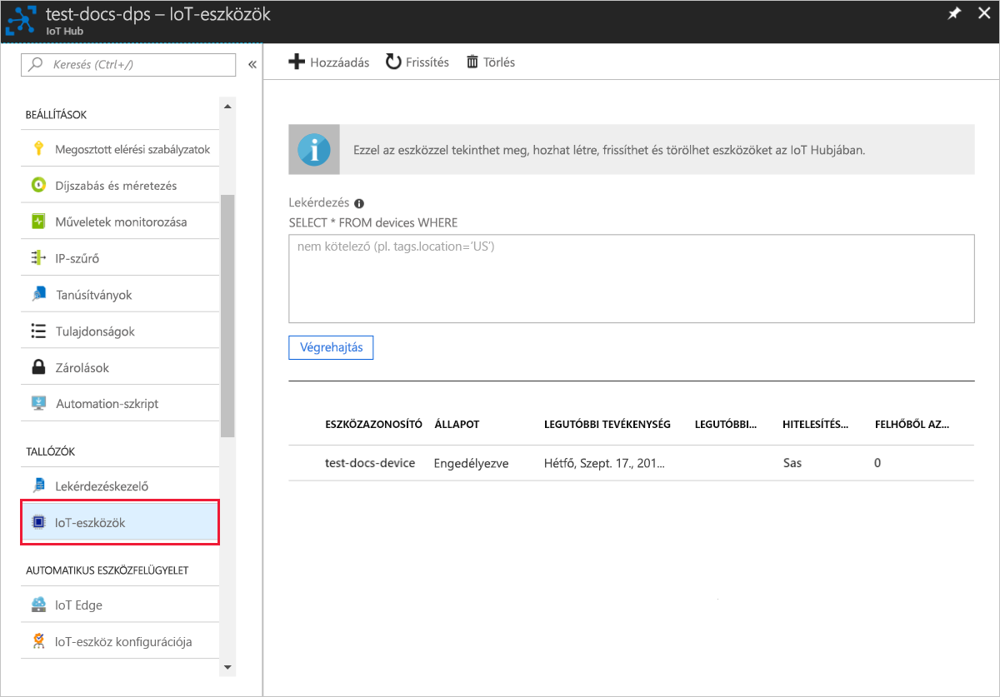

# <a name="quickstart-create-and-provision-an-x509-simulated-device-using-nodejs-device-sdk-for-iot-hub-device-provisioning-service"></a>Gyors útmutató: X. 509 szimulált eszköz létrehozása és kiépítése a IoT Hub Device Provisioning Service Node.js eszközoldali SDK-val

[!INCLUDE [iot-dps-selector-quick-create-simulated-device-x509](../../includes/iot-dps-selector-quick-create-simulated-device-x509.md)]

Ebben a rövid útmutatóban egy szimulált X. 509 eszközt hoz létre egy Windows rendszerű számítógépen. A szimulált eszköz és az IoT hub között az eszköz kiépítési szolgáltatásával (DPS) való egyéni regisztráció használatával csatlakoztathatja ezt a szimulált eszközt az eszközhöz Node.js kódot használva.

## <a name="prerequisites"></a>Előfeltételek

- Az [automatikus kiépítési fogalmak](concepts-auto-provisioning.md)áttekintése.
- [A IoT hub Device Provisioning Service beállításának befejezése a Azure Portal](./quick-setup-auto-provision.md).
- Aktív előfizetéssel rendelkező Azure-fiók. [Hozzon létre egyet ingyen](https://azure.microsoft.com/free/?ref=microsoft.com&utm_source=microsoft.com&utm_medium=docs&utm_campaign=visualstudio).
- [Node.js v 4.0 +](https://nodejs.org).
- [Git](https://git-scm.com/download/).
- [OpenSSL](https://www.openssl.org/).

[!INCLUDE [IoT Device Provisioning Service basic](../../includes/iot-dps-basic.md)]

## <a name="prepare-the-environment"></a>A környezet előkészítése 

1. A folytatás előtt végezze el az [IoT Hub Device Provisioning Service Azure Portallal való beállítását](./quick-setup-auto-provision.md) ismertető cikk lépéseit.

2. Győződjön meg arról, hogy a [Node.js 4.0-s vagy újabb verziója](https://nodejs.org) telepítve van a gépén.

3. Győződjön meg arról, hogy a [git](https://git-scm.com/download/) telepítve van a gépen, és hozzá van adva a parancsablakban elérhető környezeti változókhoz. 

4. Győződjön meg arról, hogy az [OpenSSL](https://www.openssl.org/) telepítve van a gépen, és a parancsablakból elérhető környezeti változókhoz van adva. Ez a kódtár létrehozható és telepíthető valamilyen forrásból, vagy letölthető és telepíthető [külső féltől](https://wiki.openssl.org/index.php/Binaries), például [innen](https://sourceforge.net/projects/openssl/). 

    > [!NOTE]
    > Ha már létrehozta az X.509 _fő-_, _köztes_, és/vagy _levéltanúsítványát_, kihagyhatja ezt a lépést és a tanúsítvány létrehozásával kapcsolatos további lépéseket.
    >

## <a name="create-a-self-signed-x509-device-certificate-and-individual-enrollment-entry"></a>Önaláírt X.509-eszköztanúsítvány és egyéni regisztrációs bejegyzés létrehozása

Ebben a szakaszban egy önaláírt X.509-tanúsítványt fogunk használni. Fontos szem előtt tartani a következőket:

* Az önaláírt tanúsítványok csak tesztelési célokra alkalmasak, és nem javasolt őket éles környezetben alkalmazni.
* Az önaláírt tanúsítványok alapértelmezett lejárati ideje 1 év.

Az [Azure IoT SDK for Node.js](https://github.com/Azure/azure-iot-sdk-node.git) mintakódját használja majd a szimulált eszköz egyéni regisztrációs bejegyzéséhez használandó tanúsítvány létrehozásához.

Az Azure IoT Device Provisioning Service kétféle típusú regisztrációt támogat:

- [Regisztrációs csoportok](concepts-service.md#enrollment-group): Több kapcsolódó eszköz regisztrálásához.
- [Egyéni regisztrációk](concepts-service.md#individual-enrollment): egyetlen eszköz regisztrálására szolgál.

Ez a cikk az egyéni regisztrációkat mutatja be.

1. Nyisson meg egy parancssort. Klónozza a GitHub-adattárat a kódmintákhoz:
    
    ```cmd/sh
    git clone https://github.com/Azure/azure-iot-sdk-node.git --recursive
    ```

2. Lépjen a tanúsítványt létrehozó szkripthez, és állítsa össze a projektet. 

    ```cmd/sh
    cd azure-iot-sdk-node/provisioning/tools
    npm install
    ```

3. A saját _tanúsítványnevét_ használva hozzon létre egy X.509 _levéltanúsítványt_ a szkript futtatásával. A levéltanúsítvány köznapi neve lesz a [regisztrációs azonosító](https://docs.microsoft.com/azure/iot-dps/concepts-device#registration-id), ezért csak kisbetűket, alfanumerikus karaktereket és kötőjeleket használjon.

    ```cmd/sh
    node create_test_cert.js device {certificate-name}
    ```

4. Jelentkezzen be a [Azure Portalba](https://portal.azure.com), válassza a bal oldali menüben az **összes erőforrás** gombot, és nyissa meg az eszköz kiépítési szolgáltatásának példányát.

5. Az eszközök kiépítési szolgáltatásának menüjében válassza a **regisztrációk kezelése**lehetőséget. Válassza az **Egyéni regisztrációk** fület, és válassza az **Egyéni regisztráció hozzáadása** gombot a felső részen. 

6. A **beléptetés hozzáadása** panelen adja meg a következő adatokat:
   - Válassza az **X.509** elemet az identitás igazolási *Mechanizmusaként*.
   - Az *elsődleges tanúsítvány. PEM vagy. cer fájlban*válassza a *fájl kiválasztása* elemet, hogy kiválassza a **{certificate-Name} _cert. PEM** fájlt, amelyet az előző lépésekben hozott létre.  
   - Ha kívánja, megadhatja az alábbi információkat is:
     - Válassza ki a kiépítési szolgáltatáshoz kapcsolódó egyik IoT hubot.
     - Adjon meg egy egyedi eszközazonosítót. Ne használjon bizalmas adatokat az eszköz elnevezésekor. 
     - Frissítse az **Eszköz kezdeti ikerállapotát** az eszköz kívánt kezdeti konfigurációjával.
     - Ha elkészült, kattintson a **Save (Mentés** ) gombra. 

     [](./media/quick-create-simulated-device-x509-node/device-enrollment.png#lightbox)

     Sikeres regisztráció esetén az X. 509 eszköz **{certificatename}** néven jelenik meg a *regisztrációs azonosító* oszlopban az *Egyéni regisztrációk* lapon. később jegyezze fel ezt az értéket.

## <a name="simulate-the-device"></a>Az eszköz szimulálása

Az [Azure IoT Hub Node.js eszközoldali SDK](https://github.com/Azure/azure-iot-sdk-node) segítségével könnyedén szimulálhatóak eszközök. További információkért tekintse meg az [eszközökkel kapcsolatos alapelveket ismertető](https://docs.microsoft.com/azure/iot-dps/concepts-device) témakört.

1. A Azure Portal válassza ki az eszköz kiépítési szolgáltatásának **Áttekintés** paneljét, és jegyezze fel a **_globális eszköz végpontját_** és az **_azonosító hatókörének_** értékeit.

     

2. Másolja a _tanúsítványt_ és a _kulcsot_ a mintamappába.

    ```cmd/sh
    copy .\{certificate-name}_cert.pem ..\device\samples\{certificate-name}_cert.pem
    copy .\{certificate-name}_key.pem ..\device\samples\{certificate-name}_key.pem
    ```

3. Keresse meg az eszköz tesztszkriptjét, és állítsa össze a projektet. 

    ```cmd/sh
    cd ..\device\samples
    npm install
    ```

4. Szerkessze a **register\_x509.js** fájlt. A következő módosítások elvégzése után mentse a fájlt.
    - A `provisioning host` elemet cserélje le a fenti **1. lépésben** feljegyzett**_globális eszközvégpontra_**.
    - Cserélje le `id scope` az azonosítót a fenti **1. lépésben** feljegyzett **_azonosító hatókörre_** . 
    - Cserélje le az értékét az `registration id` előző szakaszban feljegyzett **_regisztrációs azonosítóra_** .
    - A `cert filename` és a `key filename` elemet cserélje le a fenti **2. lépésben** másolt fájlokra. 

5. Futtassa a szkriptet, és ellenőrizze, hogy az eszköz sikeresen lett-e kiépítve.

    ```cmd/sh
    node register_x509.js
    ```   

6. A portálon navigáljon a kiépítési szolgáltatáshoz kapcsolódó IoT hubhoz, és nyissa meg a **IoT-eszközök** panelt. Ha a szimulált X. 509 eszközt sikeresen kiépíti a központba, az eszköz azonosítója megjelenik az **IoT-eszközök** panelen, és az *állapota* **engedélyezve**lesz. Előfordulhat, hogy a felső **frissítés** gombra kell kattintania, ha már megnyitotta a panelt a minta eszköz futtatása előtt. 

     

    Ha módosította az *Eszköz kezdeti ikerállapota* alapértelmezett értékét az eszköz beléptetési bejegyzésében, az lekérheti és felhasználhatja a kívánt ikerállapotot a központból. További információ: [Eszközök ikerállapotának megismerése és használata az IoT hubon](../iot-hub/iot-hub-devguide-device-twins.md).


## <a name="clean-up-resources"></a>Az erőforrások eltávolítása

Ha azt tervezi, hogy folytatja a munkát, és megkeresi az eszköz ügyféloldali mintáját, ne törölje az ebben a rövid útmutatóban létrehozott erőforrásokat. Ha nem folytatja a műveletet, a következő lépésekkel törölheti az ebben a rövid útmutatóban létrehozott összes erőforrást.

1. Zárja be az eszközügyfél minta kimeneti ablakát a gépen.
2. A Azure Portal bal oldali menüjében válassza a **minden erőforrás** lehetőséget, majd válassza ki az eszköz kiépítési szolgáltatását. Nyissa meg a szolgáltatás **regisztrációk kezelése** paneljét, majd válassza az **Egyéni regisztrációk** fület. jelölje be az ebben a rövid útmutatóban regisztrált eszköz *regisztrációs azonosítója* melletti jelölőnégyzetet, majd kattintson a panel tetején található **Törlés** gombra. 
3. A Azure Portal bal oldali menüjében válassza a **minden erőforrás** lehetőséget, majd válassza ki az IoT hubot. Nyissa meg a **IoT-eszközök** panelt, jelölje be az ebben a rövid útmutatóban regisztrált eszköz *azonosítója* melletti jelölőnégyzetet, majd kattintson a panel tetején található **Törlés** gombra.


## <a name="next-steps"></a>Következő lépések

Ebben a rövid útmutatóban létrehozta a szimulált X. 509 eszközt, és kiépíti azt az IoT hubhoz a portálon elérhető Azure IoT Hub Device Provisioning Service használatával. Az X. 509 eszköz programozott módon történő regisztrálásának megismeréséhez folytassa az X. 509 eszközök programozott regisztrálására szolgáló rövid útmutatóval. 

> [!div class="nextstepaction"]
> [Azure rövid útmutató – X. 509 eszközök regisztrálása az Azure-ba IoT Hub Device Provisioning Service](quick-enroll-device-x509-node.md)
