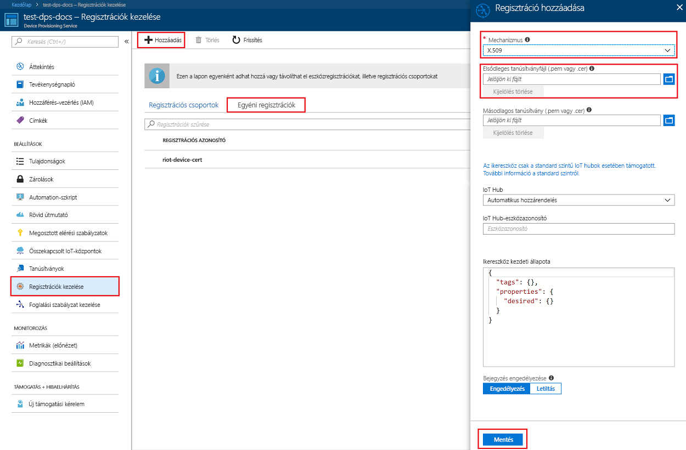
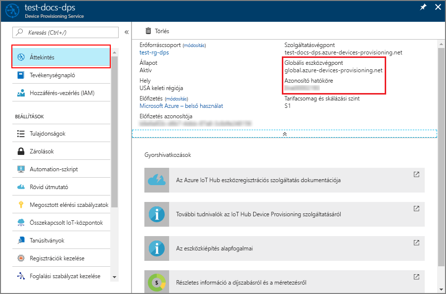
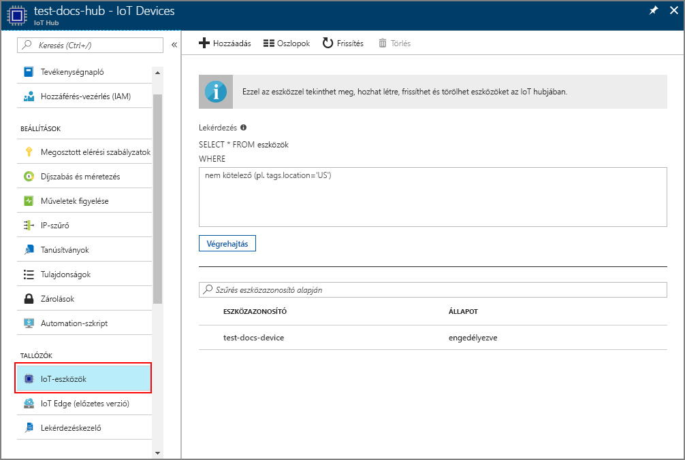

# <a name="create-and-provision-an-x509-simulated-device-using-nodejs-device-sdk-for-iot-hub-device-provisioning-service"></a>Szimulált X.509-eszköz létrehozása és kiépítése az IoT Hub Device Provisioning Service-hez készült Node.js eszközoldali SDK-val
[!INCLUDE [iot-dps-selector-quick-create-simulated-device-x509](../../includes/iot-dps-selector-quick-create-simulated-device-x509.md)]

Ezek a lépések bemutatják, hogyan hozhat létre regisztrációs bejegyzést a Device Provisioning Service-ben, hogyan szimulálhat egy X.509-eszközt a fejlesztői gépén, hogyan csatlakoztatja a szimulált eszközt a Device Provisioning Service-hez, és hogyan regisztrálhatja ezt az eszközt az IoT Hubon az [Azure IoT Hubhoz készült Node.js eszközoldali SDK segítségével](https://github.com/Azure/azure-iot-sdk-node).

Amennyiben nem ismeri az automatikus kiépítés folyamatát, olvassa el [az automatikus kiépítés alapfogalmait](concepts-auto-provisioning.md) ismertető cikket is. A folytatás előtt mindenképpen végezze el az [IoT Hub eszközkiépítési szolgáltatás beállítása az Azure Portallal](./quick-setup-auto-provision.md) szakasz lépéseit. 

[!INCLUDE [IoT DPS basic](../../includes/iot-dps-basic.md)]

## <a name="prepare-the-environment"></a>A környezet előkészítése 

1. A folytatás előtt végezze el az [IoT Hub Device Provisioning Service Azure Portallal való beállítását](./quick-setup-auto-provision.md) ismertető cikk lépéseit.

2. Győződjön meg arról, hogy a [Node.js 4.0-s vagy újabb verziója](https://nodejs.org) telepítve van a gépén.

3. Győződjön meg arról, hogy a [Git](https://git-scm.com/download/) telepítve van a gépen, és a parancsablakból elérhető környezeti változókhoz van adva. 

4. Győződjön meg arról, hogy az [OpenSSL](https://www.openssl.org/) telepítve van a gépen, és a parancsablakból elérhető környezeti változókhoz van adva. Ez a kódtár létrehozható és telepíthető valamilyen forrásból, vagy letölthető és telepíthető [külső féltől](https://wiki.openssl.org/index.php/Binaries), például [innen](https://sourceforge.net/projects/openssl/). 

    > [!NOTE]
    > Ha már létrehozta az X.509 _fő-_, _köztes_, és/vagy _levéltanúsítványát_, kihagyhatja ezt a lépést és a tanúsítvány létrehozásával kapcsolatos további lépéseket.
    >

## <a name="create-a-self-signed-x509-device-certificate-and-individual-enrollment-entry"></a>Önaláírt X.509-eszköztanúsítvány és egyéni regisztrációs bejegyzés létrehozása

1. Nyisson meg egy parancssort. Klónozza a GitHub-adattárat a kódmintákhoz:
    
    ```cmd/sh
    git clone https://github.com/Azure/azure-iot-sdk-node.git --recursive
    ```

2. Lépjen a tanúsítványt létrehozó szkripthez, és állítsa össze a projektet. 

    ```cmd/sh
    cd azure-iot-sdk-node/provisioning/tools
    npm install
    ```

3. A saját _tanúsítványnevét_ használva hozzon létre egy X.509 _levéltanúsítványt_ a szkript futtatásával. Vegye figyelembe, hogy a levéltanúsítvány köznapi neve lesz a [regisztrációs azonosító](https://docs.microsoft.com/azure/iot-dps/concepts-device#registration-id), ezért csak kisbetűket, alfanumerikus karaktereket és kötőjeleket használjon.

    ```cmd/sh
    node create_test_cert.js device {certificate-name}
    ```

4. Jelentkezzen be az [Azure Portalra](https://portal.azure.com), a bal oldali menüben kattintson a **Minden erőforrás** gombra, és nyissa meg a Device Provisioning Service-példányt.

5. Az eszközkiépítési szolgáltatás összefoglalás panelén válassza a **Beléptetések kezelése** lehetőséget. Válassza az **Egyéni beléptetések** fület, és kattintson a felül lévő **Hozzáadás** gombra. 

6. A **Regisztráció hozzáadása** panelen adja meg a következő információkat:
    - Válassza az **X.509** elemet az identitás igazolási *Mechanizmusaként*.
    - Az *Elsődleges tanúsítvány (.pem vagy .cer)* területen kattintson a *Fájl kiválasztása* elemre, hogy kijelölje az előző lépésekben létrehozott **{tanúsítványnév}_cert.pem** tanúsítványfájlt.  
    - Ha kívánja, megadhatja az alábbi információkat is:
      - Válassza ki a kiépítési szolgáltatáshoz kapcsolódó egyik IoT hubot.
      - Adjon meg egy egyedi eszközazonosítót. Ne használjon bizalmas adatokat az eszköz elnevezésekor. 
      - Frissítse az **Eszköz kezdeti ikerállapotát** az eszköz kívánt kezdeti konfigurációjával.
   - Ha végzett, kattintson a **Mentés** gombra. 

    [](./media/quick-create-simulated-device-x509-node/individual-enrollment.png#lightbox)

    Sikeres regisztráció esetén az X.509-eszköz **{tanúsítványnév}** azonosítóval megjelenik a *Regisztrációs azonosító* oszlopban, az *Egyéni regisztrációk* lapon. Jegyezze fel ezt az értéket későbbi használatra.

## <a name="simulate-the-device"></a>Az eszköz szimulálása

Az [Azure IoT Hub Node.js eszközoldali SDK](https://github.com/Azure/azure-iot-sdk-node) segítségével könnyedén szimulálhatóak eszközök. További információkért tekintse meg az [eszközökkel kapcsolatos alapelveket ismertető](https://docs.microsoft.com/azure/iot-dps/concepts-device) témakört.

1. Az Azure Portalon válassza ki a Device Provisioning Service **Áttekintés** panelét, és jegyezze fel a **_Globális eszközvégpont_** és az **_Azonosító hatóköre_** értékét.

     

2. Másolja a _tanúsítványt_ és a _kulcsot_ a mintamappába.

    ```cmd/sh
    copy .\{certificate-name}_cert.pem ..\device\samples\{certificate-name}_cert.pem
    copy .\{certificate-name}_key.pem ..\device\samples\{certificate-name}_key.pem
    ```

3. Keresse meg az eszköz tesztszkriptjét, és állítsa össze a projektet. 

    ```cmd/sh
    cd ..\device\samples
    npm install
    ```

4. Szerkessze a **register\_x509.js** fájlt. A következő módosítások elvégzése után mentse a fájlt.
    - A `provisioning host` elemet cserélje le a fenti **1. lépésben** feljegyzett**_globális eszközvégpontra_**.
    - Az `id scope` elemet cserélje le a fenti **1. lépésben** feljegyzett**_azonosító-hatókörre_**. 
    - A `registration id` elemet cserélje le az előző szakaszban feljegyzett **_regisztrációs azonosítóra_**.
    - A `cert filename` és a `key filename` elemet cserélje le a fenti **2. lépésben** másolt fájlokra. 

5. Futtassa a szkriptet, és ellenőrizze, hogy az eszköz sikeresen lett-e kiépítve.

    ```cmd/sh
    node register_x509.js
    ```   

6. A portálon lépjen a kiépítési szolgáltatáshoz csatolt IoT hubhoz, és nyissa meg az **IoT-eszközök** panelt. Ha sikeresen kiépíti a szimulált X.509-eszközt a hubon, az eszköz azonosítója megjelenik az **IoT-eszközök** panelen, a hozzá tartozó *ÁLLAPOT* pedig **engedélyezett** lesz. Ha már a minta eszközalkalmazás futtatása előtt megnyitotta a panelt, akkor lehet, hogy rá kell kattintania a fenti **Frissítés** gombra. 

     

    Ha módosította az *Eszköz kezdeti ikerállapota* alapértelmezett értékét az eszköz beléptetési bejegyzésében, az lekérheti és felhasználhatja a kívánt ikerállapotot a központból. További információ: [Eszközök ikerállapotának megismerése és használata az IoT hubon](../iot-hub/iot-hub-devguide-device-twins.md).


## <a name="clean-up-resources"></a>Az erőforrások eltávolítása

Ha azt tervezi, hogy folytatja az eszközügyfél minta használatát és megismerését, akkor ne törölje a rövid útmutatóban létrehozott erőforrásokat. Ha nem folytatja a munkát, akkor a következő lépésekkel törölheti a rövid útmutatóhoz létrehozott összes erőforrást.

1. Zárja be az eszközügyfél minta kimeneti ablakát a gépen.
2. Az Azure Portal bal oldali menüjében kattintson az **Összes erőforrás** lehetőségre, majd válassza ki az eszközkiépítési szolgáltatást. Nyissa meg a szolgáltatás **Regisztrációk kezelése** paneljét, majd kattintson az **Egyéni regisztrációk** lapra. Válassza ki a rövid útmutatóban regisztrált eszköz *REGISZTRÁCIÓS AZONOSÍTÓJÁT*, majd kattintson a felül található **Törlés** gombra. 
3. Az Azure Portal bal oldali menüjében kattintson az **Összes erőforrás** lehetőségre, majd válassza ki az IoT Hubot. Nyissa meg a hub **IoT-eszközök** paneljét, válassza ki a rövid útmutatóban regisztrált eszköz *ESZKÖZAZONOSÍTÓJÁT*, majd kattintson a felül található **Törlés** gombra.


## <a name="next-steps"></a>További lépések

Ebben a rövid útmutatóban egy szimulált X.509-eszközt hozott létre, amelyet aztán kiépített az IoT Hubon a portál Azure IoT Hub Device Provisioning Service szolgáltatásával. Ha szeretné megismerni az X.509-eszköz programozott regisztrációjának folyamatát, lépjen tovább az X.509-eszközök programozott regisztrációjának rövid útmutatójára. 

> [!div class="nextstepaction"]
> [Azure rövid útmutató – X.509-eszközök regisztrációja az Azure IoT Hub Device Provisioning Service-be](quick-enroll-device-x509-node.md)
