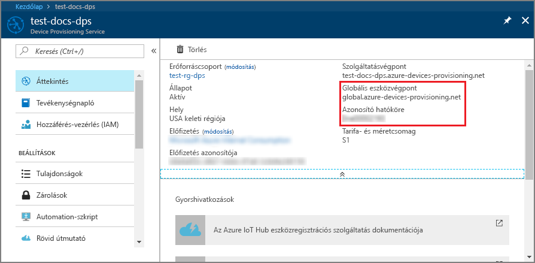
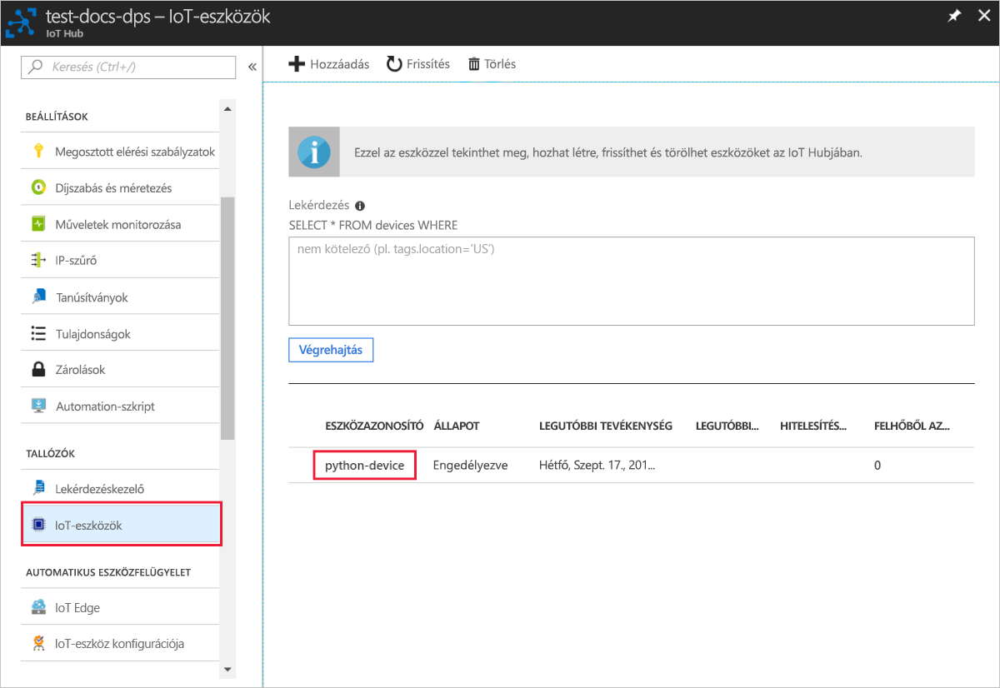

# <a name="create-and-provision-a-simulated-x509-device-using-python-device-sdk-for-iot-hub-device-provisioning-service"></a>Szimulált X.509-eszköz létrehozása és kiépítése az IoT Hub Device Provisioning Service-hez készült Python eszközoldali SDK-val
[!INCLUDE [iot-dps-selector-quick-create-simulated-device-x509](../../includes/iot-dps-selector-quick-create-simulated-device-x509.md)]

Ezek a lépések bemutatják, hogyan hozhat létre szimulált X.509-eszközt egy Windows operációs rendszert futtató fejlesztői gépen, és hogyan kötheti össze ezt a szimulált eszközt a Device Provisioning Service-szel és az IoT Hubbal egy Python kódminta segítségével. 

Amennyiben nem ismeri az automatikus kiépítés folyamatát, olvassa el [az automatikus kiépítés alapfogalmait](concepts-auto-provisioning.md) ismertető cikket is. A folytatás előtt mindenképpen végezze el az [IoT Hub eszközkiépítési szolgáltatás beállítása az Azure Portallal](./quick-setup-auto-provision.md) szakasz lépéseit. 

[!INCLUDE [IoT Device Provisioning Service basic](../../includes/iot-dps-basic.md)]

## <a name="prepare-the-environment"></a>A környezet előkészítése 

1. Győződjön meg arról, hogy a [Visual Studio 2015](https://www.visualstudio.com/vs/older-downloads/) vagy a [Visual Studio 2017](https://www.visualstudio.com/vs/) telepítve van a gépen. A Visual Studio telepítésekor engedélyezni kell az „Asztali fejlesztés C++ használatával” számítási feladatot.

2. Töltse le és telepítse a [CMake buildelési rendszert](https://cmake.org/download/).

3. Győződjön meg arról, hogy a(z) `git` telepítve van a gépen, és a parancsablakból elérhető környezeti változókhoz van adva. A [Software Freedom Conservancy's Git ügyfél eszközeiben](https://git-scm.com/download/) találja a telepíteni kívánt `git` eszközök legújabb verzióját, amely tartalmazza a **Git Bash** eszközt, azt a parancssori alkalmazást, amellyel kommunikálhat a helyi Git-adattárral. 

4. Nyisson meg egy parancssort vagy a Git Basht. Klónozza a GitHub-tárházat az eszközszimuláció kódmintájának beszerzéséhez.
    
    ```cmd/sh
    git clone https://github.com/Azure/azure-iot-sdk-python.git --recursive
    ```

5. Hozzon létre egy mappát a GitHub-adattár helyi másolatában a CMake buildelési folyamathoz. 

    ```cmd/sh
    cd azure-iot-sdk-python/c
    mkdir cmake
    cd cmake
    ```

6. Futtassa az alábbi parancsot az üzembe helyezési ügyfél Visual Studio-megoldásának létrehozásához.

    ```cmd/sh
    cmake -Duse_prov_client:BOOL=ON ..
    ```


## <a name="create-a-self-signed-x509-device-certificate-and-individual-enrollment-entry"></a>Önaláírt X.509-eszköztanúsítvány és egyéni regisztrációs bejegyzés létrehozása

Ebben a szakaszban egy önaláírt X.509-tanúsítványt fog használni. Fontos szem előtt tartani az alábbi szempontokat:

* Az önaláírt tanúsítványok csak tesztelési célokra alkalmasak, és nem javasolt őket éles környezetben alkalmazni.
* Az önaláírt tanúsítványok alapértelmezett lejárati ideje 1 év.

Az Azure IoT C SDK mintakódját használja majd a szimulált eszköz egyéni regisztrációs bejegyzéséhez használt tanúsítvány létrehozásához.

1. Nyissa meg a *cmake* mappában létrehozott `azure_iot_sdks.sln` nevű megoldást, és építse fel azt a Visual Studióban.

2. Kattintson a jobb gombbal a **dice\_device\_enrollment** projektre a **Provision\_Tools** mappában, és válassza a **Set as Startup Project** (Beállítás kezdőprojektként) lehetőséget. Futtassa a megoldást. 

3. A kimeneti ablakba írja be a következőt az egyéni beléptetéshez: `i`. A kimeneti ablakban megjelenik egy helyileg létrehozott X.509-tanúsítvány a szimulált eszközhöz. 
    
    Másolja az első tanúsítványt a vágólapra. Kezdje a következő első előfordulásával:
    
        -----BEGIN CERTIFICATE----- 
        
    Fejezze be a másolást a következő első előfordulása után:
    
        -----END CERTIFICATE-----
        
    Győződjön meg róla, hogy azt a két sort is belefoglalta. 

    
 
4. Hozzon létre egy **_X509testcertificate.pem_** nevű fájlt a Windows rendszerű gépén, nyissa meg egy tetszőleges szövegszerkesztővel, és másolja bele a vágólapra kimásolt szöveget. Mentse a fájlt. 

5. Jelentkezzen be az Azure Portalra, a bal oldali menüben kattintson az **Összes erőforrás** gombra, és nyissa meg az eszközkiépítési szolgáltatását.

6. Az eszközkiépítési szolgáltatás összefoglalás panelén válassza a **Beléptetések kezelése** lehetőséget. Válassza az **Egyéni regisztrációk** fület, és kattintson a felül lévő **Egyéni regisztráció hozzáadása** gombra. 

7. A **Regisztráció hozzáadása** panelen adja meg a következő információkat:
    - Válassza az **X.509** elemet az identitás igazolási *Mechanizmusaként*.
    - Az *Elsődleges tanúsítványfájl (.pem vagy .cer)* területen kattintson a *Fájl kiválasztása* lehetőségre, és válassza ki az előző lépésben létrehozott **X509testcertificate.pem** tanúsítványfájlt.
    - Ha kívánja, megadhatja az alábbi információkat is:
      - Válassza ki a kiépítési szolgáltatáshoz kapcsolódó egyik IoT hubot.
      - Adjon meg egy egyedi eszközazonosítót. Ne használjon bizalmas adatokat az eszköz elnevezésekor. 
      - Frissítse az **Eszköz kezdeti ikerállapotát** az eszköz kívánt kezdeti konfigurációjával.
    - Ha végzett, kattintson a **Mentés** gombra. 

    [](./media/python-quick-create-simulated-device-x509/device-enrollment.png#lightbox)

   Sikeres beléptetés esetén az X.509-eszköz **riot-device-cert** azonosítóval megjelenik a *Regisztrációs azonosító* oszlopban az *Egyéni beléptetések* lapon. 

## <a name="simulate-the-device"></a>Az eszköz szimulálása

1. A Device Provisioning Service összefoglalási paneljén válassza az **Áttekintés** lehetőséget. Jegyezze fel az _Azonosító hatóköre_ és a _Globális szolgáltatásvégpont_ értékeit.

    

2. Töltse le és telepítse a [Python 2.x-es vagy 3.x-es verzióját](https://www.python.org/downloads/). Mindenképp a rendszernek megfelelő, 32 vagy 64 bites telepítést használja. Amikor a rendszer erre kéri, mindenképp adja hozzá a Pythont a platformspecifikus környezeti változókhoz. Ha a Python 2.x verziót használja, előfordulhat, hogy [telepítenie vagy frissítenie kell a *pip*-et, a Python csomagkezelő rendszerét](https://pip.pypa.io/en/stable/installing/).
    
    > [!NOTE] 
    > Ha Windows rendszert használ, telepítse a [Visual Studio 2015 szoftverhez készült Microsoft Visual C++ terjeszthető változatát](http://www.microsoft.com/download/confirmation.aspx?id=48145). A PIP-csomagoknak szüksége van erre az összetevőre a C nyelvű DLL-ek betöltéséhez és végrehajtásához.

3. A Python-csomagok létrehozásához kövesse [ezeket az utasításokat](https://github.com/Azure/azure-iot-sdk-python/blob/master/doc/python-devbox-setup.md).

    > [!NOTE]
        > A `pip` használata esetén mindenképp telepítse az `azure-iot-provisioning-device-client` csomagot is.

4. Lépjen a mintákat tartalmazó mappára.

    ```cmd/sh
    cd azure-iot-sdk-python/provisioning_device_client/samples
    ```

5. A Python IDE használatával módosítsa a **provisioning\_device\_client\_sample.py** nevű Python-szkriptet. Módosítsa a _GLOBAL\_PROV\_URI_ és az _ID\_SCOPE_ változót a korábban feljegyzett értékekre.

    ```python
    GLOBAL_PROV_URI = "{globalServiceEndpoint}"
    ID_SCOPE = "{idScope}"
    SECURITY_DEVICE_TYPE = ProvisioningSecurityDeviceType.X509
    PROTOCOL = ProvisioningTransportProvider.HTTP
    ```

6. Futtassa a mintát. 

    ```cmd/sh
    python provisioning_device_client_sample.py
    ```

7. Az alkalmazás csatlakozik, regisztrálja az eszközt, és megjelenít egy üzenetet a sikeres regisztrációról.

    

8. A portálon lépjen a kiépítési szolgáltatáshoz csatolt IoT hubhoz, és nyissa meg a **Device Explorer** (Eszközkereső) panelt. Ha sikeresen kiépíti a szimulált X.509-eszközt a hubon, az eszköz azonosítója megjelenik a **Device Explorer** panelen, a hozzá tartozó *ÁLLAPOT* pedig **engedélyezett** lesz. Ha már a minta eszközalkalmazás futtatása előtt megnyitotta a panelt, akkor lehet, hogy rá kell kattintania a fenti **Frissítés** gombra. 

     

> [!NOTE]
> Ha módosította az *Eszköz kezdeti ikerállapota* alapértelmezett értékét az eszköz beléptetési bejegyzésében, az lekérheti és felhasználhatja a kívánt ikerállapotot a központból. További információ: [Eszközök ikerállapotának megismerése és használata az IoT hubon](../iot-hub/iot-hub-devguide-device-twins.md).
>

## <a name="clean-up-resources"></a>Az erőforrások eltávolítása

Ha azt tervezi, hogy folytatja az eszközügyfél minta használatát és megismerését, akkor ne törölje a rövid útmutatóban létrehozott erőforrásokat. Ha nem folytatja a munkát, akkor a következő lépésekkel törölheti a rövid útmutatóhoz létrehozott összes erőforrást.

1. Zárja be az eszközügyfél minta kimeneti ablakát a gépen.
2. Az Azure Portal bal oldali menüjében kattintson az **Összes erőforrás** lehetőségre, majd válassza ki az eszközkiépítési szolgáltatást. Nyissa meg a szolgáltatás **Regisztrációk kezelése** paneljét, majd kattintson az **Egyéni regisztrációk** lapra. Válassza ki a rövid útmutatóban regisztrált eszköz *REGISZTRÁCIÓS AZONOSÍTÓJÁT*, majd kattintson a felül található **Törlés** gombra. 
3. Az Azure Portal bal oldali menüjében kattintson az **Összes erőforrás** lehetőségre, majd válassza ki az IoT Hubot. Nyissa meg a hub **IoT-eszközök** paneljét, válassza ki a rövid útmutatóban regisztrált eszköz *ESZKÖZAZONOSÍTÓJÁT*, majd kattintson a felül található **Törlés** gombra.

## <a name="next-steps"></a>További lépések

Ebben a rövid útmutatóban egy szimulált X.509-eszközt hozott létre a Windows rendszerű gépén, amelyet aztán kiépített az IoT Hubon a portál Azure IoT Hub Device Provisioning Service szolgáltatásával. Ha szeretné megismerni az X.509-eszköz programozott regisztrációjának folyamatát, lépjen tovább az X.509-eszközök programozott regisztrációjának rövid útmutatójára. 

> [!div class="nextstepaction"]
> [Azure rövid útmutató – X.509-eszközök regisztrációja az Azure IoT Hub Device Provisioning Service-be](quick-enroll-device-x509-python.md)
