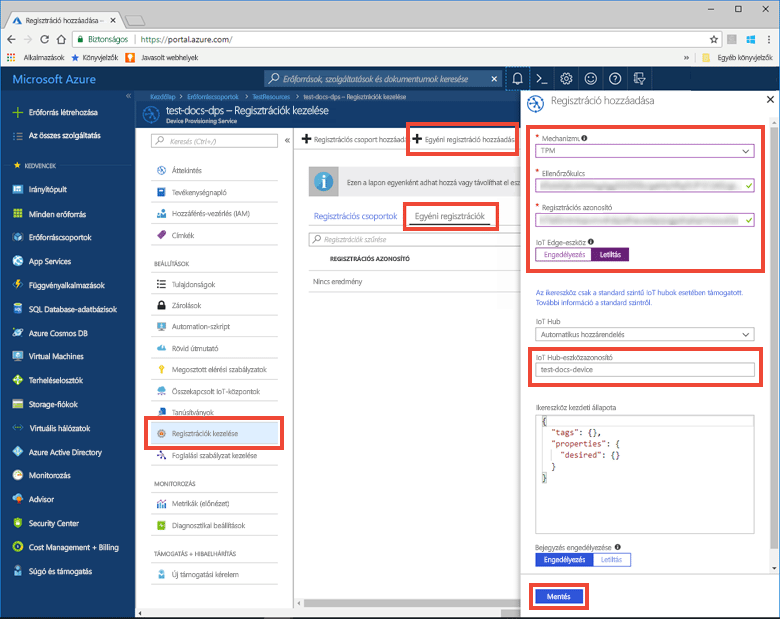
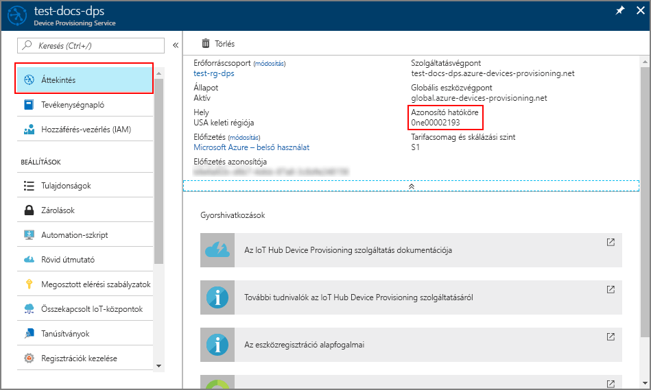

# <a name="quickstart-provision-a-simulated-tpm-device-using-the-azure-iot-c-sdk"></a>Gyors útmutató: Az Azure IoT C SDK használatával szimulált TPM-eszköz kiépítése

[!INCLUDE [iot-dps-selector-quick-create-simulated-device-tpm](../../includes/iot-dps-selector-quick-create-simulated-device-tpm.md)]

Ebből a rövid útmutatóból megtudhatja, hogyan hozhat létre és futtathat platformmegbízhatósági modul (TPM) alapú eszközszimulátort Windows rendszerű fejlesztői gépeken. A szimulált eszközt egy IoT Hubhoz csatlakoztatja egy Device Provisioning Service-példánnyal. Az eszköz egy Device Provisioning Service-példánnyal való regisztrálásához és az eszköz rendszerindításának szimulálásához az [Azure IoT C SDK](https://github.com/Azure/azure-iot-sdk-c) egy mintakódját használjuk majd.

Amennyiben nem ismeri az automatikus kiépítés folyamatát, olvassa el [az automatikus kiépítés alapfogalmait](concepts-auto-provisioning.md) ismertető cikket. A rövid útmutató folytatása előtt mindenképpen végezze el az [IoT Hub eszközkiépítési szolgáltatás beállítása az Azure Portallal](./quick-setup-auto-provision.md) szakasz lépéseit. 

Az Azure IoT Device Provisioning Service kétféle típusú regisztrációt támogat:
- [Regisztrációs csoportok](concepts-service.md#enrollment-group): Segítségével több kapcsolódó eszközöket regisztrálni.
- [Egyéni regisztrációk](concepts-service.md#individual-enrollment): Egy adott eszköz regisztrálásához használja.

Ez a cikk az egyéni regisztrációkat ismerteti.

[!INCLUDE [quickstarts-free-trial-note](../../includes/quickstarts-free-trial-note.md)]

## <a name="prerequisites"></a>Előfeltételek

* Visual Studio 2015 vagy [Visual Studio 2017](https://www.visualstudio.com/vs/), amelyben engedélyezve van az [„Asztali fejlesztés C++ használatával”](https://www.visualstudio.com/vs/support/selecting-workloads-visual-studio-2017/) számítási feladat.
* A [Git](https://git-scm.com/download/) legújabb verziójának telepített példánya.


<a id="setupdevbox"></a>

## <a name="prepare-a-development-environment-for-the-azure-iot-c-sdk"></a>Fejlesztői környezet előkészítése az Azure IoT C SDK-hoz

Ebben a szakaszban egy fejlesztői környezetet készítünk elő az [Azure IoT C SDK](https://github.com/Azure/azure-iot-sdk-c) és a [TPM](https://docs.microsoft.com/windows/device-security/tpm/trusted-platform-module-overview) eszközszimulátor mintájának létrehozásához.

1. Töltse le a [CMake buildelési rendszert](https://cmake.org/download/). Ellenőrizze a letöltött bináris fájlt, amely megfelel a verzió letöltése kriptográfiai kivonatokat értékének használatával. A kriptográfiai kivonatokat értékei is az adott CMake letöltési hivatkozás található.

    Az alábbi példa a kriptográfiai kivonatokat a x64 3.13.4 verziójának ellenőrzéséhez használja a Windows PowerShell MSI terjesztési:

    ```powershell
    PS C:\Downloads> $hash = get-filehash .\cmake-3.13.4-win64-x64.msi
    PS C:\Downloads> $hash.Hash -eq "64AC7DD5411B48C2717E15738B83EA0D4347CD51B940487DFF7F99A870656C09"
    True
    ```

    A következő kivonatértékeket verzió 3.13.4 írásának időpontjában a CMake webhelyen felsorolt:

    ```
    563a39e0a7c7368f81bfa1c3aff8b590a0617cdfe51177ddc808f66cc0866c76  cmake-3.13.4-Linux-x86_64.tar.gz
    7c37235ece6ce85aab2ce169106e0e729504ad64707d56e4dbfc982cb4263847  cmake-3.13.4-win32-x86.msi
    64ac7dd5411b48c2717e15738b83ea0d4347cd51b940487dff7f99a870656c09  cmake-3.13.4-win64-x64.msi
    ```

    Fontos, hogy a Visual Studio előfeltételei (Visual Studio és az „Asztali fejlesztés C++ használatával” számítási feladat) telepítve legyenek a gépen, **mielőtt** megkezdené a `CMake` telepítését. Ha az előfeltételek telepítve vannak, és ellenőrizte a letöltött fájlt, telepítse a CMake buildelési rendszert.

2. Nyisson meg egy parancssort vagy a Git Bash-felületet. A következő parancs végrehajtásával klónozza az [Azure IoT C SDK](https://github.com/Azure/azure-iot-sdk-c) GitHub-adattárat:
    
    ```cmd/sh
    git clone https://github.com/Azure/azure-iot-sdk-c.git --recursive
    ```
    Az adattár mérete jelenleg körülbelül 220 MB. Ez a művelet várhatóan több percig is eltarthat.


3. Hozzon létre egy `cmake` alkönyvtárat a Git-adattár gyökérkönyvtárában, és lépjen erre a mappára. 

    ```cmd/sh
    cd azure-iot-sdk-c
    mkdir cmake
    cd cmake
    ```

## <a name="build-the-sdk-and-run-the-tpm-device-simulator"></a>Az SDK létrehozása és a TPM-eszközszimulátor futtatása

Ebben a szakaszban létrehozzuk az Azure IoT SDK-t, amely tartalmazza a TPM-eszközszimulátor mintakódját. Ez a minta TPM [igazolási mechanizmust](concepts-security.md#attestation-mechanism) nyújt közös hozzáférésű jogosultságkód- (SAS-) jogkivonat hitelesítésével.

1. Az azure-iot-sdk-c Git-adattárban létrehozott `cmake` alkönyvtárból futtassa a következő parancsot a minta létrehozásához. Ez a buildelési parancs egy Visual Studio-megoldást is létrehoz a szimulált eszközhöz.

    ```cmd/sh
    cmake -Duse_prov_client:BOOL=ON -Duse_tpm_simulator:BOOL=ON ..
    ```

    Ha a `cmake` nem találja a C++ fordítóprogramot, a fenti parancs futtatása esetlegesen fordítási hibákat adhat vissza. Ilyen esetekben futtassa a parancsot a [Visual Studio parancssorából](https://docs.microsoft.com/dotnet/framework/tools/developer-command-prompt-for-vs). 

    A sikeres létrehozást követően a kimenet utolsó sorai a következőhöz hasonlóan néznek majd ki:

    ```cmd/sh
    $ cmake -Duse_prov_client:BOOL=ON -Duse_tpm_simulator:BOOL=ON ..
    -- Building for: Visual Studio 15 2017
    -- Selecting Windows SDK version 10.0.16299.0 to target Windows 10.0.17134.
    -- The C compiler identification is MSVC 19.12.25835.0
    -- The CXX compiler identification is MSVC 19.12.25835.0

    ...

    -- Configuring done
    -- Generating done
    -- Build files have been written to: E:/IoT Testing/azure-iot-sdk-c/cmake
    ```

2. Keresse meg a klónozott Git-adattár gyökérmappájához, és futtassa a [TPM](https://docs.microsoft.com/windows/device-security/tpm/trusted-platform-module-overview)-szimulátort az alább látható elérési úttal. Ez a szimulátor a 2321-es és a 2322-es portokon lévő szoftvercsatornán keresztül figyel. Ne zárja be ezt a parancsablakot; a rövid útmutató végéig futnia kell ennek a szimulátornak. 

   A *cmake* mappában futtassa a következő parancsokat:

    ```cmd/sh
    cd ..
    .\provisioning_client\deps\utpm\tools\tpm_simulator\Simulator.exe
    ```

    Nem jelenik meg kimenet a szimulátorból. Hagyja tovább futni a TPM-eszköz szimulálását.

<a id="simulatetpm"></a>

## <a name="read-cryptographic-keys-from-the-tpm-device"></a>Titkosítási kulcsok olvasása a TPM-eszközből

Ebben a szakaszban olyan mintát hoz létre és futtat, amely beolvassa a futó TPM-szimulátor ellenőrzőkulcsát és regisztrációs azonosítóját, továbbá a 2321-es és a 2322-es portokon figyel. A rendszer ezeket az értékeket használja az eszköz regisztrációjához a Device Provisioning Service-példány esetében.

1. Indítsa el a Visual Studiót, és nyissa meg az `azure_iot_sdks.sln` nevű új megoldásfájlt. A megoldásfájl az azure-iot-sdk-c Git-adattár gyökérkönyvtárában korábban létrehozott `cmake` mappában található.

2. A Visual Studio menüjében válassza a **Build** > **Build Solution** (Létrehozás > Megoldás létrehozása) menüpontot a megoldásban lévő összes projekt létrehozásához.

3. A Visual Studio *Solution Explorer* (Megoldáskezelő) ablakában lépjen a **Provision\_Tools** (Kiépítés > Eszközök) mappára. Kattintson a jobb gombbal a **tpm_device_provision** projektre, és válassza a **Set as Startup Project** (Beállítás kezdőprojektként) lehetőséget. 

4. A Visual Studio menüjében válassza a **Debug** > **Start without debugging** (Hibakeresés > Indítás hibakeresés nélkül) lehetőséget a megoldás futtatásához. Az alkalmazás egy **_Regisztrációs azonosítót_** és egy **_Ellenőrzőkulcsot_** olvas be és jelenít meg. Másolja ki ezeket az értékeket. Ezeket a következő szakaszban, az eszközregisztráció során fogjuk használni. 


<a id="portalenrollment"></a>

## <a name="create-a-device-enrollment-entry-in-the-portal"></a>Eszközregisztrációs bejegyzés létrehozása a portálon

1. Jelentkezzen be az Azure Portalra, a bal oldali menüben kattintson a **Minden erőforrás** gombra, és nyissa meg a Device Provisioning Service-t.

2. Válassza a **Regisztrációk kezelése** fület, és kattintson a felül lévő **Egyéni regisztráció hozzáadása** gombra. 

3. A **Regisztráció hozzáadása** lapon adja meg az alábbi adatokat, majd kattintson a **Mentés** gombra.

    - **Mechanizmus:** Válassza a **TPM** elemet az identitás igazolási *Mechanizmusaként*.
    - **Ellenőrzőkulcs:** Adja meg a *ellenőrzőkulcsot* futtassa a TPM-eszköz számára létrehozott a *tpm_device_provision* projekt.
    - **Regisztrációs azonosító:** Adja meg a *regisztrációs azonosító* futtassa a TPM-eszköz számára létrehozott a *tpm_device_provision* projekt.
    - **IoT Edge-eszköz:** Válassza ki **letiltása**.
    - **IoT Hub-Eszközazonosító:** Adja meg **test-docs-eszköz** biztosíthat az eszköz azonosítója.

        

      Sikeres beléptetés esetén az eszköz *Regisztrációs azonosítója* megjelenik az *Egyéni beléptetések* lapon lévő listában. 


<a id="firstbootsequence"></a>

## <a name="simulate-first-boot-sequence-for-the-device"></a>Első rendszerindítás szimulálása az eszközhöz

Ebben a szakaszban konfigurálja a mintakódot, hogy az [Advanced Message Queueing Protocol (AMQP)](https://wikipedia.org/wiki/Advanced_Message_Queuing_Protocol) használatával küldje el az eszköz rendszerindítási szekvenciáját a Device Provisioning Service-példánynak. A rendszerindítási szekvenciának köszönhetően a rendszer felismeri majd az eszközt, és hozzárendeli egy, a Device Provisioning Service-példányhoz társított IoT Hubhoz.

1. Az Azure Portalon válassza ki az eszközregisztrációs szolgáltatás **Áttekintés** lapját, és másolja ki az **_Azonosító hatóköre_** értéket.

     

2. A Visual Studio *Solution Explorer* (Megoldáskezelő) ablakában lépjen a **Provision\_Samples** (Kiépítés > Minták) mappára. Bontsa ki a **prov\_dev\_client\_sample** nevű mintaprojektet. Bontsa ki a **Source Files** (Forrásfájlok) elemet, és nyissa meg a **prov\_dev\_client\_sample.c** nevű forrásfájlt.

3. A fájl elején keresse meg az eszközprotokollok `#define` utasításait az alábbi módon. Győződjön meg arról, hogy csak a `SAMPLE_AMQP` ne legyen ellátva megjegyzéssel.

    Jelenleg az [MQTT protokoll nem támogatott az egyéni TPM-regisztrációhoz](https://github.com/Azure/azure-iot-sdk-c#provisioning-client-sdk).

    ```c
    //
    // The protocol you wish to use should be uncommented
    //
    //#define SAMPLE_MQTT
    //#define SAMPLE_MQTT_OVER_WEBSOCKETS
    #define SAMPLE_AMQP
    //#define SAMPLE_AMQP_OVER_WEBSOCKETS
    //#define SAMPLE_HTTP
    ```

4. Keresse meg az `id_scope` állandót, és cserélje le az értékét a korábban kimásolt **Azonosító hatóköre** értékre. 

    ```c
    static const char* id_scope = "0ne00002193";
    ```

5. Keresse meg a `main()` függvény definícióját ugyanebben a fájlban. Az alább látható módon győződjön meg róla, hogy az `hsm_type` változó értéke `SECURE_DEVICE_TYPE_TPM`, és nem `SECURE_DEVICE_TYPE_X509`.

    ```c
    SECURE_DEVICE_TYPE hsm_type;
    hsm_type = SECURE_DEVICE_TYPE_TPM;
    //hsm_type = SECURE_DEVICE_TYPE_X509;
    ```

6. Kattintson a jobb gombbal a **prov\_dev\_client\_sample** projektre, és válassza a **Beállítás kezdőprojektként** lehetőséget. 

7. A Visual Studio menüjében válassza a **Debug** > **Start without debugging** (Hibakeresés > Indítás hibakeresés nélkül) lehetőséget a megoldás futtatásához. A projekt újraépítésére vonatkozó parancsablakban kattintson az **Igen** gombra a projekt újraépítéséhez a futtatás előtt.

    Az alábbi példakimeneten az látható, hogy az eszközregisztrációs mintaügyfél sikeresen elindul, és csatalakozik a Device Provisioning Service példányához az IoT Hub adatainak lekérése és a regisztráció céljából:

    ```cmd
    Provisioning API Version: 1.2.7
    Provisioning Status: PROV_DEVICE_REG_STATUS_CONNECTED

    Registering... Press enter key to interrupt.

    Provisioning Status: PROV_DEVICE_REG_STATUS_CONNECTED
    Provisioning Status: PROV_DEVICE_REG_STATUS_ASSIGNING
    Provisioning Status: PROV_DEVICE_REG_STATUS_ASSIGNING

    Registration Information received from service:
    test-docs-hub.azure-devices.net, deviceId: test-docs-device
    ```

8. Miután sikeresen kiépítette a szimulált eszközt a kiépítési szolgáltatáshoz csatolt IoT Hubon, az eszköz azonosítója megjelenik a hub **IoT-eszközök** panelén. 

     


## <a name="clean-up-resources"></a>Az erőforrások eltávolítása

Ha azt tervezi, hogy folytatja az eszközügyfél minta használatát és megismerését, akkor ne törölje a rövid útmutatóban létrehozott erőforrásokat. Ha nem folytatja a munkát, akkor a következő lépésekkel törölheti a rövid útmutatóhoz létrehozott összes erőforrást.

1. Zárja be az eszközügyfél minta kimeneti ablakát a gépen.
2. Zárja be a TPM szimulátor ablakát a gépen.
3. Az Azure Portal bal oldali menüjében kattintson az **Összes erőforrás** lehetőségre, majd válassza ki az eszközkiépítési szolgáltatást. Nyissa meg a szolgáltatás **Regisztrációk kezelése** lapját, majd kattintson az **Egyéni regisztrációk** lapra. Válassza ki a rövid útmutatóban regisztrált eszköz *REGISZTRÁCIÓS AZONOSÍTÓJÁT*, majd kattintson a felül található **Törlés** gombra. 
4. Az Azure Portal bal oldali menüjében kattintson az **Összes erőforrás** lehetőségre, majd válassza ki az IoT Hubot. Nyissa meg a hub **IoT-eszközök** lapját, válassza ki a rövid útmutatóban regisztrált eszköz *ESZKÖZAZONOSÍTÓJÁT*, majd kattintson a felül található **Törlés** gombra.

## <a name="next-steps"></a>További lépések

Ebben a rövid útmutatóban egy szimulált TPM-eszközt hozott létre a gépen, majd kiépítette azt az IoT Hubon az IoT Hub Device Provisioning Service használatával. Ha szeretné megismerni a TPM-eszköz programozott regisztrációjának folyamatát, lépjen tovább a TPM-eszközök programozott regisztrációjának rövid útmutatójára. 

> [!div class="nextstepaction"]
> [Azure rövid útmutató – TPM-eszköz regisztrációja az Azure IoT Hub Device Provisioning Service-be](quick-enroll-device-tpm-java.md)

