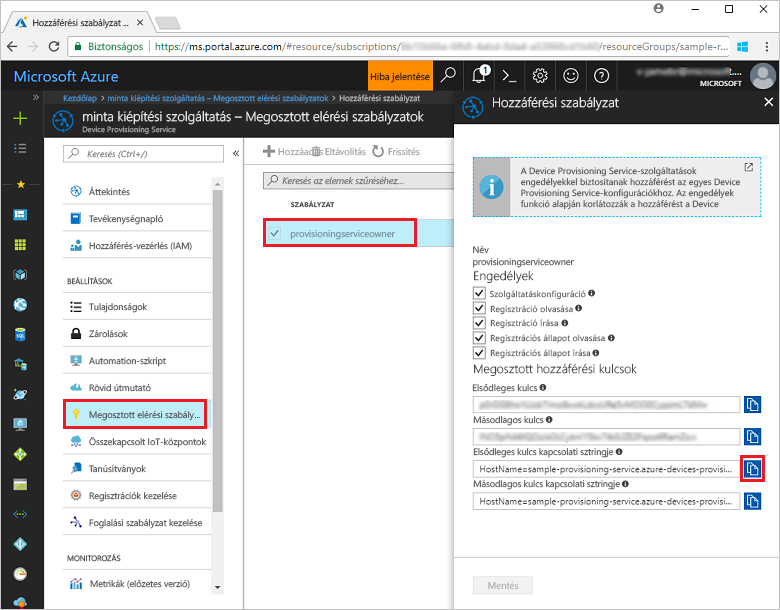
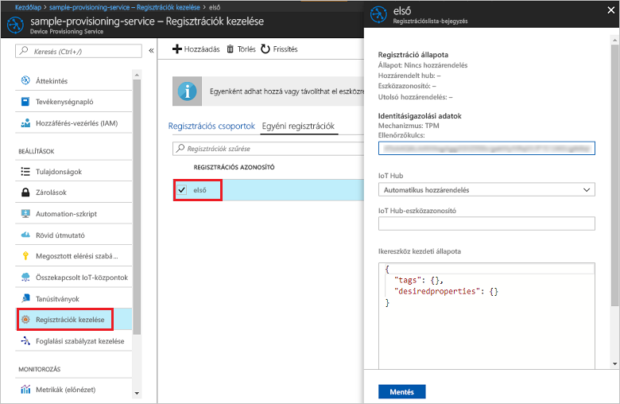

# <a name="enroll-tpm-device-to-iot-hub-device-provisioning-service-using-nodejs-service-sdk"></a>TPM-eszköz regisztrációja az IoT Hub Device Provisioning Service-be a Node.js szolgáltatásoldali SDK-val
> [!div class="op_single_selector"]
> * [Java](quick-enroll-device-tpm-java.md)
> * [Node.js](quick-enroll-device-tpm-node.md)

Ezek a lépések bemutatják, hogyan hozhat létre egyéni regisztrációt TPM-eszközhöz programozott módon az Azure IoT Hub Device Provisioning Service-be a [Node.js szolgáltatási SDK](https://github.com/Azure/azure-iot-sdk-node), valamint egy Node.js-mintaalkalmazás használatával. Emellett egy szimulált TPM-eszközt is regisztrálhat a kiépítési szolgáltatásba ezzel az egyéni regisztrációs bejegyzéssel. Bár ezek a lépések Windows és Linux rendszerű gépeken is használhatóak, ehhez a cikkhez egy Windows rendszerű fejlesztői gépet fogunk használni.

## <a name="prerequisites"></a>Előfeltételek

- A folytatás előtt végezze el az [IoT Hub Device Provisioning Service az Azure Portallal való beállítását ismertető](./quick-setup-auto-provision.md) szakasz lépéseit. 
-  Győződjön meg arról, hogy a [Node.js 4.0-s vagy újabb verziója](https://nodejs.org) telepítve van a gépén.
- Ha a rövid útmutató végén szeretne regisztrálni egy szimulált eszközt, kövesse a [szimulált eszköz létrehozásával és kiépítésével](quick-create-simulated-device.md) kapcsolatos rész lépéseit addig a pontig, ahol megkapja az ellenőrzőkulcsot az eszközhöz. Jegyezze fel az ellenőrzőkulcsot, mert az útmutató későbbi részében használni fogja. **Ne kövesse az egyéni regisztráció Azure Portallal való létrehozásának lépéseit.**
 
## <a name="create-the-individual-enrollment-sample"></a>Az egyéni regisztrációs minta létrehozása 

 
1. A munkamappában egy parancsablakból futtassa a következőt:
  
    ```cmd\sh
    npm install azure-iot-provisioning-service
    ```  

2. Egy szövegszerkesztővel hozzon létre egy **create_individual_enrollment.js** fájlt a munkamappában. Adja hozzá a következő kódot a fájlhoz, és mentse:

    ```
    'use strict';

    var provisioningServiceClient = require('azure-iot-provisioning-service').ProvisioningServiceClient;

    var serviceClient = provisioningServiceClient.fromConnectionString(process.argv[2]);
    var endorsementKey = process.argv[3];

    var enrollment = {
      registrationId: 'first',
      attestation: {
        type: 'tpm',
        tpm: {
          endorsementKey: endorsementKey
        }
      }
    };

    serviceClient.createOrUpdateIndividualEnrollment(enrollment, function(err, enrollmentResponse) {
      if (err) {
        console.log('error creating the individual enrollment: ' + err);
      } else {
        console.log("enrollment record returned: " + JSON.stringify(enrollmentResponse, null, 2));
      }
    });
    ````

## <a name="run-the-individual-enrollment-sample"></a>Az egyéni regisztrációs minta futtatása
  
1. A minta futtatásához szüksége lesz a kiépítési szolgáltatás kapcsolati karakterláncára. 
    1. Jelentkezzen be az Azure Portalra, a bal oldali menüben kattintson az **Összes erőforrás** gombra, és nyissa meg az eszközkiépítési szolgáltatást. 
    2. Kattintson a **Megosztott elérési szabályzatok** elemre, majd a használni kívánt hozzáférési szabályzatra a tulajdonságainak megnyitásához. A **Hozzáférési szabályzat** ablakban másolja és jegyezze fel az elsődleges kulcs kapcsolati karakterláncát. 

     


2. Emellett az eszköz ellenőrzőkulcsára is szüksége lesz. Ha a [szimulált eszköz létrehozásával és kiépítésével](quick-create-simulated-device.md) kapcsolatos rövid útmutató lépéseit követte a szimulált TPM-eszköz létrehozásához, használja az adott eszközhöz létrehozott kulcsot. Egyéb esetben egyéni regisztrációs minta létrehozásához használhatja a következő, az SDK-hoz mellékelt ellenőrzőkulcsot:

    ```
    AToAAQALAAMAsgAgg3GXZ0SEs/gakMyNRqXXJP1S124GUgtk8qHaGzMUaaoABgCAAEMAEAgAAAAAAAEAxsj2gUScTk1UjuioeTlfGYZrrimExB+bScH75adUMRIi2UOMxG1kw4y+9RW/IVoMl4e620VxZad0ARX2gUqVjYO7KPVt3dyKhZS3dkcvfBisBhP1XH9B33VqHG9SHnbnQXdBUaCgKAfxome8UmBKfe+naTsE5fkvjb/do3/dD6l4sGBwFCnKRdln4XpM03zLpoHFao8zOwt8l/uP3qUIxmCYv9A7m69Ms+5/pCkTu/rK4mRDsfhZ0QLfbzVI6zQFOKF/rwsfBtFeWlWtcuJMKlXdD8TXWElTzgh7JS4qhFzreL0c1mI0GCj+Aws0usZh7dLIVPnlgZcBhgy1SSDQMQ==
    ```

3. A TPM-eszköz egyéni regisztrációjának létrehozásához futtassa a következő parancsot (ne hagyja ki a parancs argumentumai körüli idézőjeleket sem):
 
     ```cmd\sh
     node create_individual_enrollment.js "<the connection string for your provisioning service>" "<endorsement key>"
     ```
 
3. Sikeres létrehozás esetén a parancsablak az új egyéni regisztráció tulajdonságait jeleníti meg.

     

4. Ellenőrizze, hogy létrejött-e az egyéni regisztráció. Az Azure Portal Device Provisioning Service összefoglalási panelén válassza a **Regisztrációk kezelése** lehetőséget. Kattintson az **Egyéni regisztrációk** lapra, majd az új regisztrációs bejegyzésre (*az elsőre*) az ellenőrzőkulcs és a bejegyzés többi tulajdonságának megtekintéséhez.

     
 
Most, hogy létrehozta egy TPM-eszköz egyéni regisztrációját, ha szeretné elvégezni egy szimulált eszköz regisztrációját, folytathatja a [szimulált eszköz létrehozásával és kiépítésével](quick-create-simulated-device.md) kapcsolatos rövid útmutató fennmaradó lépéseivel. Hagyja ki a rövid útmutató azon lépéseit, amelyek egyéni regisztráció az Azure Portallal való létrehozásával kapcsolatosak.

## <a name="clean-up-resources"></a>Az erőforrások eltávolítása
Ha azt tervezi, hogy részletesebben is áttekinti a Node.js-szolgáltatásmintákat, akkor ne törölje az ebben a rövid útmutatóban létrehozott erőforrásokat. Ha nem folytatja a munkát, akkor a következő lépésekkel törölheti a rövid útmutatóhoz létrehozott összes erőforrást.

1. Zárja be a Node.js-minta kimeneti ablakát a gépen.
1. Ha létrehozott egy szimulált TPM-eszközt, zárja be a TPM-szimulátor ablakát.
2. Lépjen az eszközkiépítési szolgáltatásra az Azure Portalon, kattintson a **Regisztrációk kezelése** lehetőségre, majd válassza az **Egyéni regisztrációk** lapot. Válassza ki a rövid útmutató segítségével létrehozott regisztrációs bejegyzés *Regisztrációs azonosítóját*, majd kattintson a panel tetején lévő **Törlés** gombra. 
 
## <a name="next-steps"></a>További lépések
Ebben a rövid útmutatóban egyéni regisztrációs bejegyzést hozott létre programozott módon egy TPM-eszközhöz, és igény szerint létrehozott egy szimulált TPM-eszközt a gépén, majd kiépítette azt az IoT Hubon az Azure IoT Hub Device Provisioning Service-szel. Ha mélyebben szeretné megismerni az eszközkiépítést, folytassa az Azure Portalon az eszközkiépítési szolgáltatás beállításának oktatóanyagával. 
 
> [!div class="nextstepaction"]
> [Azure IoT Hub eszközkiépítési szolgáltatás oktatóanyagai](./tutorial-set-up-cloud.md)