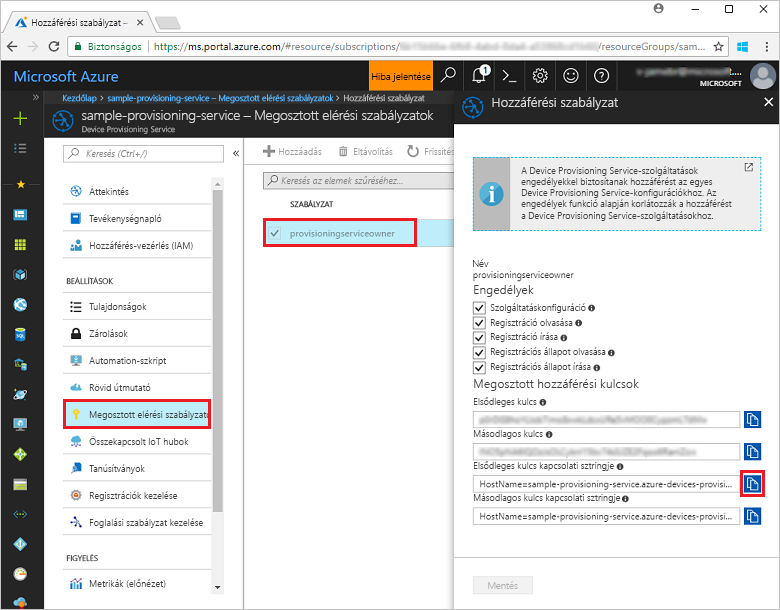
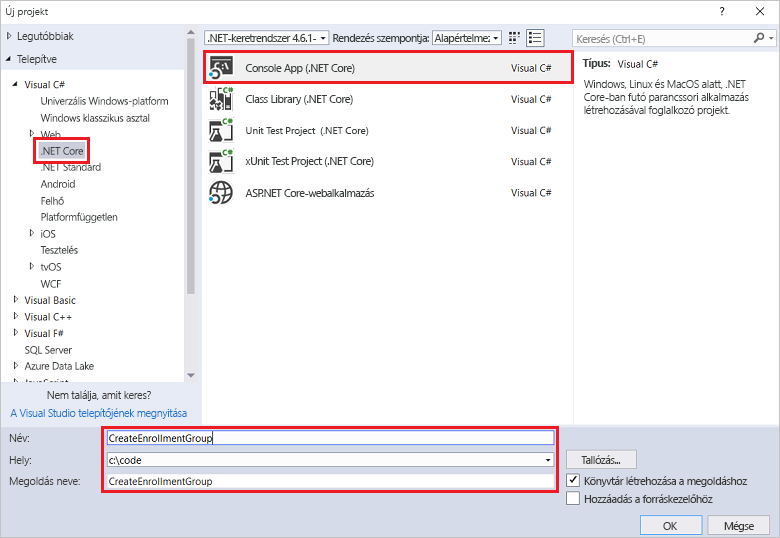
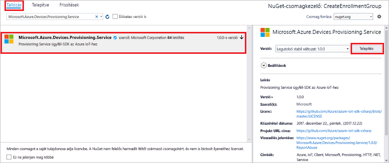
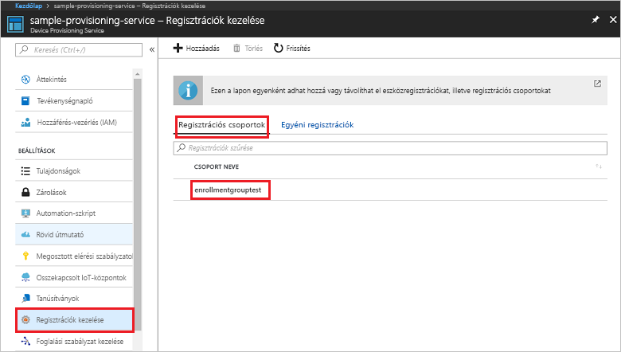

# <a name="quickstart-enroll-x509-devices-to-the-device-provisioning-service-using-c"></a>Gyors útmutató: A Device Provisioning Service használatával X.509-eszközök regisztrálásaC#

[!INCLUDE [iot-dps-selector-quick-enroll-device-x509](../../includes/iot-dps-selector-quick-enroll-device-x509.md)]


Ez a rövid útmutató bemutatja, hogyan hozhat létre a C# segítségével programozott módon egy [regisztrációs csoportot](concepts-service.md#enrollment-group), amely köztes vagy legfelső szintű hitelesítésszolgáltatói X.509-tanúsítványokat használ. A regisztrációs csoport létrehozásához a [.NET-hez készült Microsoft Azure IoT SDK](https://github.com/Azure/azure-iot-sdk-csharp)-t és egy C# .NET Core-mintaalkalmazást használunk. Egy regisztrációs csoport a tanúsítványláncukban ugyanazon aláíró tanúsítvánnyal rendelkező eszközök kiépítési szolgáltatáshoz való hozzáférését szabályozza. További tudnivalókért lásd: [Eszközök kiépítési szolgáltatáshoz való hozzáférésének szabályozása X.509-tanúsítványokkal](./concepts-security.md#controlling-device-access-to-the-provisioning-service-with-x509-certificates). További információ az X.509-tanúsítványon alapuló nyilvánoskulcs-infrastruktúra (PKI) az Azure IoT Hubbal és a Device Provisioning Service-szel való használatáról: [X.509 hitelesítésszolgáltatói tanúsítványok biztonsági áttekintése](https://docs.microsoft.com/azure/iot-hub/iot-hub-x509ca-overview). 

A rövid útmutató feltételezi, hogy már létrehozott egy IoT hubot és egy Device Provisioning Service-példányt. Ha ezeket az erőforrásokat még nem hozta létre, végezze el az [IoT Hub eszközkiépítési szolgáltatás beállítása az Azure Portallal](./quick-setup-auto-provision.md) rövid útmutatót, mielőtt továbbhaladna ebben a cikkben.

Bár a cikkben ismertetett lépések Windows és Linux rendszerű gépeken egyaránt alkalmazhatók, ez a cikk egy Windows rendszerű fejlesztési számítógépet használ.

[!INCLUDE [quickstarts-free-trial-note](../../includes/quickstarts-free-trial-note.md)]


## <a name="prerequisites"></a>Előfeltételek

* Telepítse a [Visual Studio 2017](https://www.visualstudio.com/vs/)-et.
* Telepítse a [.NET Core SDK](https://www.microsoft.com/net/download/windows)-t.
* Telepítse a [Git](https://git-scm.com/download/) szoftvert.


## <a name="prepare-test-certificates"></a>Teszttanúsítványok előkészítése

A rövid útmutatóhoz szükség van egy .pem vagy .cer fájlra, amely tartalmazza egy köztes vagy legfelső szintű hitelesítésszolgáltatói X.509-tanúsítvány nyilvános részét. A tanúsítványnak a kiépítési szolgáltatásba feltöltöttnek és a szolgáltatás által ellenőrzöttnek kell lennie. 

Az [Azure IoT C SDK](https://github.com/Azure/azure-iot-sdk-c) tartalmazza azokat a teszteszközöket, amelyek segítségével létrehozhat egy X.509-tanúsítványláncot, feltölthet egy legfelsőbb szintű vagy köztes tanúsítványt a láncból, valamint végrehajthat egy tulajdonlástanúsítási eljárást a szolgáltatással a tanúsítvány hitelesítéséhez. Az SDK-eszközkészlettel létrehozott tanúsítványokat csak **fejlesztési és tesztelési célokra** tervezték. Ezeket a tanúsítványokat **nem lehet termelési környezetben használni**. Nem módosítható jelszavakat tartalmaznak („1234”), amelyek 30 nap után lejárnak. A termelési használathoz megfelelő tanúsítványok beszerzésével kapcsolatos további információt az Azure IoT Hub dokumentációjának [X.509 hitelesítésszolgáltatói tanúsítvány beszerzése](https://docs.microsoft.com/azure/iot-hub/iot-hub-x509ca-overview#how-to-get-an-x509-ca-certificate) című részében talál.

A teszteszköz segítségével a következő lépésekkel állíthat elő tanúsítványokat: 
 
1. Nyisson meg egy parancssort vagy a Git Bash-felületet, és lépjen egy, a gépen található munkamappába. A következő parancs végrehajtásával klónozza az [Azure IoT C SDK](https://github.com/Azure/azure-iot-sdk-c) GitHub-adattárat:
    
   ```cmd/sh
   git clone https://github.com/Azure/azure-iot-sdk-c.git --recursive
   ```

   Az adattár mérete jelenleg körülbelül 220 MB. Ez a művelet várhatóan több percig is eltarthat.

   A teszteszköz a klónozott adattár *azure-iot-sdk-c/tools/CACertificates* mappájában található.    

2. Kövesse a [mintákhoz és oktatóanyagokhoz készült hitelesítésszolgáltatói tanúsítványok kezeléséről](https://github.com/Azure/azure-iot-sdk-c/blob/master/tools/CACertificates/CACertificateOverview.md) szóló cikk lépéseit. 

A C SDK-ban található eszközkészleten kívül a *.NET-hez készült Microsoft Azure IoT SDK-ban* található [Csoporttanúsítvány-hitelesítési minta](https://github.com/Azure/azure-iot-sdk-csharp/tree/master/provisioning/service/samples/GroupCertificateVerificationSample) azt is bemutatja, hogyan végezhető el egy tulajdonostanúsítási eljárás a C# és egy meglévő köztes vagy legfelső szintű hitelesítésszolgáltatói X.509-tanúsítvány használatával. 


## <a name="get-the-connection-string-for-your-provisioning-service"></a>A kiépítési szolgáltatás kapcsolati sztringjének lekérése

A rövid útmutatóban lévő mintához szüksége lesz a kiépítési szolgáltatás kapcsolati sztringjére.
1. Jelentkezzen be az Azure Portalra, a bal oldali menüben kattintson a **Minden erőforrás** gombra, és nyissa meg a Device Provisioning Service-t. 
2. Kattintson a **Megosztott elérési szabályzatok** elemre, majd a használni kívánt hozzáférési szabályzatra a tulajdonságainak megnyitásához. A **Hozzáférési szabályzat** ablakban másolja és jegyezze fel az elsődleges kulcs kapcsolati sztringjét. 

    

## <a name="create-the-enrollment-group-sample"></a>A regisztrációs csoport mintájának létrehozása 

A jelen szakaszban szereplő lépések bemutatják, hogyan lehet létrehozni egy .NET Core-konzolalkalmazást, amely hozzáad egy regisztrációs csoportot a kiépítési szolgáltatáshoz. Néhány módosítással ezeket a lépéseket követve létrehozhat egy [Windows IoT Core](https://developer.microsoft.com/en-us/windows/iot)-konzolalkalmazást is a regisztrációs csoport hozzáadásához. További információk az IoT Core használatával való fejlesztésről: [Windows IoT Core – fejlesztői dokumentáció](https://docs.microsoft.com/windows/iot-core/).
1. A Visual Studióban adjon hozzá egy Visual C# .NET Core konzolalkalmazás-projektet az új megoldáshoz a **Console App (.NET Core)** (Konzolalkalmazás (.NET Core)) projektsablonnal. A Microsoft .NET-keretrendszer 4.5.1-es vagy újabb verzióját használja. Adja a projektnek a **CreateEnrollmentGroup** nevet.

    

2. A Solution Explorerben (Megoldáskezelőben) kattintson a jobb gombbal a **CreateEnrollmentGroup** projektre, majd kattintson a **Manage NuGet Packages** (NuGet-csomagok kezelése) parancsra.
3. A **NuGet Package Manager** (NuGet-csomagkezelő) ablakban válassza a **Browse** (Tallózás) lehetőséget, keresse meg a **Microsoft.Azure.Devices.Client** csomagot, válassza az **Install** (Telepítés) lehetőséget a **Microsoft.Azure.Devices.Provisioning.Service** csomag telepítéséhez, és fogadja el a használati feltételeket. Ez az eljárás letölti és telepíti az [Azure IoT Provisioning Service Client SDK](https://www.nuget.org/packages/Microsoft.Azure.Devices.Provisioning.Service/) (Azure IoT kiépítési szolgáltatás ügyféloldali SDK-ja) NuGet-csomagot és annak függőségeit, valamint hozzáad egy rá mutató hivatkozást is.

    

4. Adja hozzá a következő `using` utasításokat a többi `using` utasítás után a **Program.cs** fájl elejéhez:
   
   ```csharp
   using System.Security.Cryptography.X509Certificates;
   using System.Threading.Tasks;
   using Microsoft.Azure.Devices.Provisioning.Service;
   ```
    
5. Adja hozzá a **Program** osztályhoz a következő mezőket:  
   - A **ProvisioningConnectionString** helyőrző értéket cserélje le annak a kiépítési szolgáltatásnak a kapcsolati sztringjére, amelyhez létre szeretné hozni a regisztrációt.
   - Az **X509RootCertPath** helyőrző értéket cserélje le a .pem vagy .cer fájl elérési útjára, amely egy olyan köztes vagy fő hitelesítésszolgáltatói X.509-tanúsítvány nyilvános részét jelöli, amely korábban fel lett töltve és hitelesítve lett a kiépítési szolgáltatás által.
   - Igény szerint módosíthatja az **EnrollmentGroupId** értékét. A sztring csak kisbetűs karaktereket és kötőjelet tartalmazhat. 

   > [!IMPORTANT]
   > Az éles kódban vegye figyelembe a következő biztonsági szempontokat:
   >
   > - A kapcsolati sztring fix kódolása a kiépítési szolgáltatás rendszergazdája esetében nem felel meg az ajánlott biztonsági eljárásoknak. Ehelyett biztonságosan kell tárolni a sztringet, például egy biztonságos konfigurációs fájlban vagy a beállításjegyzékben.
   > - Ügyeljen arra, hogy az aláíró tanúsítványnak csak a nyilvános részét töltse fel. Soha ne töltse fel a kiépítési szolgáltatás titkos kulcsait tartalmazó .pfx (PKCS12) vagy .pem fájlt.
        
   ```csharp
   private static string ProvisioningConnectionString = "{Your provisioning service connection string}";
   private static string EnrollmentGroupId = "enrollmentgrouptest";
   private static string X509RootCertPath = @"{Path to a .cer or .pem file for a verified root CA or intermediate CA X.509 certificate}";
   ```
    
6. Adja hozzá a **Program** osztályhoz a következő metódust. Ez a kód létrehoz egy regisztrációscsoport-bejegyzést, majd meghívja a **CreateOrUpdateEnrollmentGroupAsync** metódust a **ProvisioningServiceClient** objektumon a regisztrációs csoport kiépítési szolgáltatáshoz való hozzáadása érdekében.
   
   ```csharp
   public static async Task RunSample()
   {
       Console.WriteLine("Starting sample...");
 
       using (ProvisioningServiceClient provisioningServiceClient =
               ProvisioningServiceClient.CreateFromConnectionString(ProvisioningConnectionString))
       {
           #region Create a new enrollmentGroup config
           Console.WriteLine("\nCreating a new enrollmentGroup...");
           var certificate = new X509Certificate2(X509RootCertPath);
           Attestation attestation = X509Attestation.CreateFromRootCertificates(certificate);
           EnrollmentGroup enrollmentGroup =
                   new EnrollmentGroup(
                           EnrollmentGroupId,
                           attestation)
                   {
                       ProvisioningStatus = ProvisioningStatus.Enabled
                   };
           Console.WriteLine(enrollmentGroup);
           #endregion
 
           #region Create the enrollmentGroup
           Console.WriteLine("\nAdding new enrollmentGroup...");
           EnrollmentGroup enrollmentGroupResult =
               await provisioningServiceClient.CreateOrUpdateEnrollmentGroupAsync(enrollmentGroup).ConfigureAwait(false);
           Console.WriteLine("\nEnrollmentGroup created with success.");
           Console.WriteLine(enrollmentGroupResult);
           #endregion
 
       }
   }
   ```

7. Végül cserélje le a **Main** metódus törzsét az alábbi sorokra:
   
   ```csharp
   RunSample().GetAwaiter().GetResult();
   Console.WriteLine("\nHit <Enter> to exit ...");
   Console.ReadLine();
   ```
        
8. Hozza létre a megoldást.

## <a name="run-the-enrollment-group-sample"></a>A regisztrációs mintacsoport futtatása
  
1. Futtassa a mintát a Visual Studióban a regisztrációs csoport létrehozásához.
 
2. Sikeres létrehozás esetén a parancsablakban az új regisztrációs csoport tulajdonságai jelennek meg.

    

3. A regisztrációs csoport létrejöttének ellenőrzéséhez válassza a **Regisztrációk kezelése** lehetőséget az Azure Portal Device Provisioning Service összefoglalási panelén, majd válassza a **Regisztrációs csoportok** lapot. Meg kell jelennie egy új regisztrációs bejegyzésnek, amely megfelel a mintában használt regisztrációs azonosítónak is. Kattintson a bejegyzésre a tanúsítvány ujjlenyomatának és a bejegyzés többi tulajdonságának ellenőrzéséhez.

    
 
## <a name="clean-up-resources"></a>Az erőforrások eltávolítása
Ha azt tervezi, hogy részletesebben is áttekinti a C#-szolgáltatásmintát, akkor ne törölje az ebben a rövid útmutatóban létrehozott erőforrásokat. Ha nem folytatja a munkát, akkor a következő lépésekkel törölheti a rövid útmutatóhoz létrehozott összes erőforrást.

1. Zárja be a C#-minta kimeneti ablakát a gépen.
2. Lépjen az eszközkiépítési szolgáltatásra az Azure Portalon, kattintson a **Regisztrációk kezelése** elemre, majd válassza a **Regisztrációs csoportok** lapot. Válassza ki a rövid útmutató segítségével létrehozott regisztrációs bejegyzés *Regisztrációs azonosítóját*, majd kattintson a panel tetején lévő **Törlés** gombra.  
3. Az Azure Portalon az eszközkiépítési szolgáltatásban kattintson a **Tanúsítványok** lehetőségre, majd a rövid útmutató céljaira feltöltött tanúsítványra, és végül a **Törlés** gombra a **Tanúsítvány részletei** ablak tetején.  
 
## <a name="next-steps"></a>További lépések
Ebben a rövid útmutatóban egy regisztrációs csoportot hozott létre egy köztes vagy fő hitelesítésszolgáltatói X.509-tanúsítvány számára az Azure IoT Hub Device Provisioning Service használatával. Ha mélyebben szeretné megismerni az eszközkiépítést, folytassa az Azure Portalon az eszközkiépítési szolgáltatás beállításának oktatóanyagával. 
 
> [!div class="nextstepaction"]
> [Azure IoT Hub eszközkiépítési szolgáltatás oktatóanyagai](./tutorial-set-up-cloud.md)
