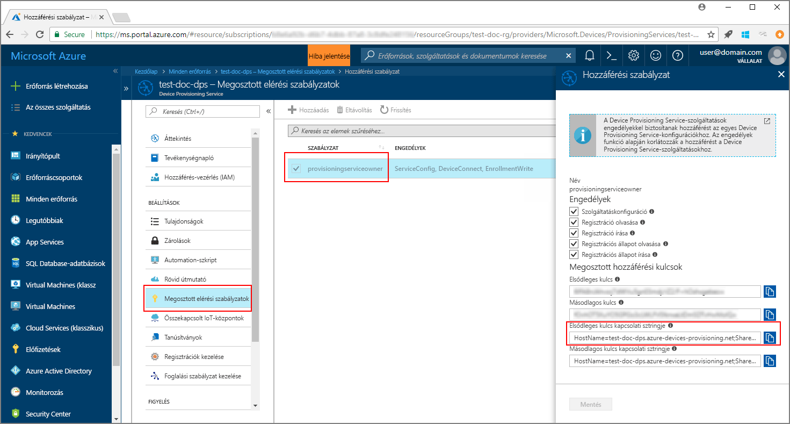
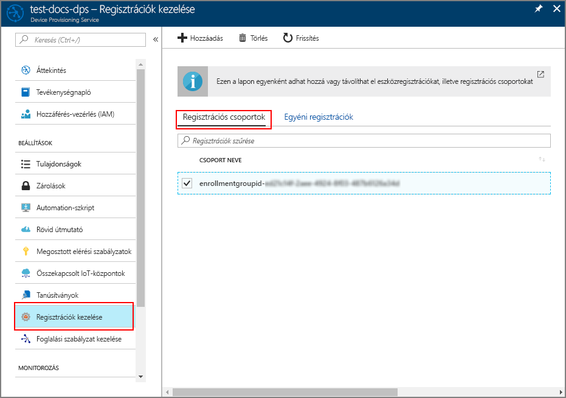

# <a name="enroll-x509-devices-to-iot-hub-device-provisioning-service-using-java-service-sdk"></a>X.509-eszközök regisztrációja az IoT Hub Device Provisioning Service-be a Java szolgáltatásoldali SDK-val

[!INCLUDE [iot-dps-selector-quick-enroll-device-x509](../../includes/iot-dps-selector-quick-enroll-device-x509.md)]

Ezek a lépések egy Java-mintaalkalmazáson keresztül bemutatják, hogyan regisztrálhatja szimulált X.509-eszközök egy csoportját programozott módon az Azure IoT Hub Device Provisioning Service-be a [Java szolgáltatásoldali SDK](https://azure.github.io/azure-iot-sdk-java/service/) használatával. Bár a Java szolgáltatásoldali SDK Windows és Linux rendszerű gépeken is működik, ez a cikk egy Windows rendszerű fejlesztési számítógépet használ a regisztrációs folyamat bemutatására.

A folytatás előtt [végezze el az IoT Hub Device Provisioning Service beállítási lépéseit az Azure Portalon](./quick-setup-auto-provision.md).

<a id="setupdevbox"></a>

## <a name="prepare-the-development-environment"></a>A fejlesztési környezet előkészítése 

1. Győződjön meg arról, hogy a [Java SE Development Kit 8](http://www.oracle.com/technetwork/java/javase/downloads/jdk8-downloads-2133151.html) telepítve van a gépén. 

2. Állítson be környezeti változókat a Java-telepítéshez. A `PATH` változónak tartalmaznia kell a *jdk1.8.x\bin* könyvtár teljes elérési útját. Ha ez az első Java-telepítés a számítógépen, hozzon létre egy új, `JAVA_HOME` nevű környezeti változót, amely a *jdk1.8.x* könyvtár teljes elérési útjára mutat. Windows rendszerű gépeken ez a könyvtár általában a *C:\\Program Files\\Java\\* mappában található. Környezeti változók létrehozásához és szerkesztéséhez keressen rá a **Rendszerkörnyezeti változók szerkesztése** kifejezésre a Windows rendszerű gép **Vezérlőpultján**. 

  Az alábbi parancs parancsablakban való futtatásával ellenőrizheti, hogy sikerült-e beállítani a Javát a számítógépen:

    ```cmd\sh
    java -version
    ```

3. Töltse le a [Maven 3](https://maven.apache.org/download.cgi)-at a számítógépre, és bontsa ki. 

4. Szerkessze a `PATH` környezeti változót, hogy az *apache-maven-3.x.x\\bin* mappára mutasson abban a mappában, amelybe a Mavent kibontotta. Az alábbi parancs parancsablakban való futtatásával ellenőrizheti, hogy sikeres volt-e a Maven telepítése:

    ```cmd\sh
    mvn --version
    ```

5. Győződjön meg arról, hogy a [git](https://git-scm.com/download/) telepítve van a gépen, és hozzá van adva a `PATH` környezeti változóhoz. 


<a id="javasample"></a>

## <a name="download-and-modify-the-java-sample-code"></a>A Java-mintakód letöltése és módosítása

Ez a szakasz bemutatja, hogyan adhatja hozzá az X.509-eszköz kiépítési adatait a mintakódhoz. 

1. Nyisson meg egy parancssort. Klónozza a GitHub-adattárat az eszközregisztráció kódmintájához a Java szolgáltatásoldali SDK használatával:
    
    ```cmd\sh
    git clone https://github.com/Azure/azure-iot-sdk-java.git --recursive
    ```

2. A letöltött forráskódban keresse meg az **_azure-iot-sdk-java/provisioning/provisioning-samples/service-enrollment-group-sample_** mintamappát. Nyissa meg az **_/src/main/java/samples/com/microsoft/azure/sdk/iot/ServiceEnrollmentGroupSample.java_** fájlt egy tetszőleges szövegszerkesztővel, és adja hozzá az alábbi részeket:

    1. Adja hozzá a `[Provisioning Connection String]` karakterláncot a kiépítési szolgáltatáshoz a portálról:
        1. Az [Azure Portalon](https://portal.azure.com) lépjen a kiépítési szolgáltatásra. 
        2. Nyissa meg a **Megosztott elérési szabályzatok** panelt, és válasszon ki egy szabályzatot, amely rendelkezik az *EnrollmentWrite* engedéllyel.
        3. Másolja ki az **elsődleges kulcs kapcsolati karakterláncát**. 

              

        4. A **_ServiceEnrollmentGroupSample.java_** mintakódfájlban cserélje le a `[Provisioning Connection String]` karakterláncot az **elsődleges kulcs kapcsolati karakterláncára**.

            ```Java
            private static final String PROVISIONING_CONNECTION_STRING = "[Provisioning Connection String]";
            ```

    2. Adja hozzá az eszközcsoport főtanúsítványát. Ha szüksége van egy minta-főtanúsítványra, használja az _X.509-tanúsítványkészítő_ eszközt az alábbiak szerint:
        1. Egy parancsablakban lépjen az **_azure-iot-sdk-java/provisioning/provisioning-tools/provisioning-x509-cert-generator_** mappára.
        2. Építse fel az eszközt a következő parancs futtatásával:

                ```cmd\sh
                mvn clean install
                ```

        4. Futtassa az eszközt az alábbi parancsokkal:

                ```cmd\sh
                cd target
                java -jar ./provisioning-x509-cert-generator-{version}-with-deps.jar
                ```

        5. Amikor a rendszer erre kéri, opcionálisan megadhat egy _köznapi nevet_ a tanúsítvány számára.
        6. Az eszköz létrehoz egy helyi **ügyféltanúsítványt**, az **ügyféltanúsítvány titkos kulcsát**, valamint a **főtanúsítványt**.
        7. Másolja a **főtanúsítványt** a vágólapra a **_-----BEGIN CERTIFICATE-----_** és **_-----END CERTIFICATE-----_** sort is beleértve. 
        8. Rendelje a **főtanúsítvány** értékét a **PUBLIC_KEY_CERTIFICATE_STRING** paraméterhez az alábbiak szerint:

                ```Java
                private static final String PUBLIC_KEY_CERTIFICATE_STRING =
                        "-----BEGIN CERTIFICATE-----\n" +
                        "XXXXXXXXXXXXXXXXXXXXXXXXXXXXXXXXXXXXXXXXXXXXXXXXXXXXXXXXXXXXXXXX\n" +
                        "XXXXXXXXXXXXXXXXXXXXXXXXXXXXXXXXXXXXXXXXXXXXXXXXXXXXXXXXXXXXXXXX\n" +
                        "XXXXXXXXXXXXXXXXXXXXXXXXXXXXXXXXXXXXXXXXXXXXXXXXXXXXXXXXXXXXXXXX\n" +
                        "XXXXXXXXXXXXXXXXXXXXXXXXXXXXXXXXXXXXXXXXXXXXXXXXXXXXXXXXXXXXXXXX\n" +
                        "XXXXXXXXXXXXXXXXXXXXXXXXXXXXXXXXXXXXXXXXXXXXXXXXXXXXXXXXXXXXXXXX\n" +
                        "XXXXXXXXXXXXXXXXXXXXXXXXXXXXXXXXXXXXXXXXXXXXXXXXXXXXXXXXXXXXXXXX\n" +
                        "XXXXXXXXXXXXXXXXXXXXXXXXXXXXXXXXXXXXXXXXXXXXXXXXXXXXXXXXXXXXXXXX\n" +
                        "XXXXXXXXXXXXXXXXXXXXXXXXXXXXXXXXXXXXXXXXXXXXXXXXXXXXXXXXXXXXXXXX\n" +
                        "XXXXXXXXXXXXXXXXXXXXXXXXXXXXXXXXXXXXXXXXXXXXXXXXXXXXXXXXXXXXXXXX\n" +
                        "XXXXXXXXXXXXXXXXXXXXXXXXXXXXXXXXXXXXXXXXXXXXXXXXXXXXXXXXXXXXXXXX\n" +
                        "-----END CERTIFICATE-----\n";
                ```

        9. Zárja be a parancsablakot, vagy írja be az **n** karaktert, amikor a rendszer az *ellenőrző kódot* kéri. 
 
    3. Ha szeretné, a kiépítési szolgáltatást a mintakódon keresztül is konfigurálhatja:
        - A konfiguráció mintához való hozzáadásához kövesse az alábbi lépéseket:
            1. Az [Azure Portalon](https://portal.azure.com) lépjen a kiépítési szolgáltatáshoz csatolt IoT Hubra. Nyissa meg a hubhoz tartozó **Áttekintés** lapot, és másolja ki az **Eszköznév** értékét. Rendelje hozzá ezt az **Eszköznév** értéket az *IOTHUB_HOST_NAME* paraméterhez.

                ```Java
                private static final String IOTHUB_HOST_NAME = "[Host name].azure-devices.net";
                ```
            2. Rendeljen egy könnyen megjegyezhető nevet a *DEVICE_ID* paraméterhez, és a *PROVISIONING_STATUS* paraméternél tartsa meg az alapértelmezett *ENABLED* értéket. 

        - VAGY, ha úgy dönt, hogy nem konfigurálja a kiépítési szolgáltatást, tegye megjegyzésbe vagy törölje a következő utasításokat a _ServiceEnrollmentGroupSample.java_ fájlban:

            ```Java
            enrollmentGroup.setIotHubHostName(IOTHUB_HOST_NAME);                // Optional parameter.
            enrollmentGroup.setProvisioningStatus(ProvisioningStatus.ENABLED);  // Optional parameter.
            ```

    4. Tanulmányozza a mintakódot. A segítségével létrehozhat, frissíthet, lekérdezhet és törölhet egy csoportos X.509-eszközregisztrációt. Ha ellenőrizni szeretné a regisztráció sikerességét a portálon, ideiglenesen tegye megjegyzésbe a következő kódsorokat a _ServiceEnrollmentGroupSample.java_ fájl végén:

        ```Java
        // ************************************** Delete info of enrollmentGroup ***************************************
        System.out.println("\nDelete the enrollmentGroup...");
        provisioningServiceClient.deleteEnrollmentGroup(enrollmentGroupId);
        ```

    5. Mentse a _ServiceEnrollmentGroupSample.java_ fájlt. 
 

<a id="runjavasample"></a>

## <a name="build-and-run-sample-group-enrollment"></a>Csoportregisztrációs minta létrehozása és futtatása

1. Nyisson meg egy parancsablakot, és lépjen az **_azure-iot-sdk-java/provisioning/provisioning-samples/service-enrollment-group-sample_** mappára.

2. Hozza létre a mintakódot a következő paranccsal:

    ```cmd\sh
    mvn install -DskipTests
    ```

   Ez a parancs letölti a [`com.microsoft.azure.sdk.iot.provisioning.service`](https://www.mvnrepository.com/artifact/com.microsoft.azure.sdk.iot.provisioning/provisioning-service-client) Maven-csomagot a számítógépre. A csomag tartalmazza a Java szolgáltatásoldali SDK bináris fájljait, amelyeket a mintakódnak létre kell hoznia. Ha az előző szakaszban futtatta az _X.509-tanúsítványkészítőt_, a csomag már le van töltve a gépre. 

3. Futtassa a mintát a következő parancsokkal a parancsablakban:

    ```cmd\sh
    cd target
    java -jar ./service-enrollment-group-sample-{version}-with-deps.jar
    ```

4. A sikeres regisztráció érdekében kísérje figyelemmel a kimeneti ablakot.

5. Az Azure Portalon lépjen a kiépítési szolgáltatásra. Kattintson a **Regisztrációk kezelése** elemre. Az X.509-eszközök csoportjának a **Regisztrációs csoportok** lapon kell megjelennie egy automatikusan létrehozott *CSOPORTNÉV* alatt. 

      

## <a name="modifications-to-enroll-a-single-x509-device"></a>Egyetlen X.509-eszköz regisztrációja esetén elvégzendő változtatások

Egyetlen X.509-eszköz regisztrációja esetén módosítsa a [TPM-eszköz regisztrációja az IoT Hub Device Provisioning Service-be a Java szolgáltatásoldali SDK-val](quick-enroll-device-tpm-java.md#javasample) című részben található *egyéni regisztráció* mintakódját az alábbiak szerint:

1. Másolja az X.509-ügyféltanúsítvány *köznapi nevét* a vágólapra. Ha az [előző mintakód szakaszában](#javasample) leírtak szerint alkalmazni szeretné az _X.509-tanúsítványkészítőt_, adjon meg egy _köznapi nevet_ a tanúsítvány számára, vagy használja az alapértelmezett **microsoftriotcore** nevet. Használja ezt a **köznapi nevet** a *REGISTRATION_ID* változó értékeként. 

    ```Java
    // Use common name of your X.509 client certificate
    private static final String REGISTRATION_ID = "[RegistrationId]";
    ```

2. Nevezze át a *TPM_ENDORSEMENT_KEY* változót *PUBLIC_KEY_CERTIFICATE_STRING* névre. Másolja be az ügyféltanúsítványt vagy az _X.509-tanúsítványkészítő_ kimenetében szereplő **ügyféltanúsítvány** értékét a *PUBLIC_KEY_CERTIFICATE_STRING* változó értékének helyére. 

    ```Java
    // Rename the variable *TPM_ENDORSEMENT_KEY* as *PUBLIC_KEY_CERTIFICATE_STRING*
    private static final String PUBLIC_KEY_CERTIFICATE_STRING =
            "-----BEGIN CERTIFICATE-----\n" +
            "XXXXXXXXXXXXXXXXXXXXXXXXXXXXXXXXXXXXXXXXXXXXXXXXXXXXXXXXXXXXXXXX\n" +
            "XXXXXXXXXXXXXXXXXXXXXXXXXXXXXXXXXXXXXXXXXXXXXXXXXXXXXXXXXXXXXXXX\n" +
            "XXXXXXXXXXXXXXXXXXXXXXXXXXXXXXXXXXXXXXXXXXXXXXXXXXXXXXXXXXXXXXXX\n" +
            "XXXXXXXXXXXXXXXXXXXXXXXXXXXXXXXXXXXXXXXXXXXXXXXXXXXXXXXXXXXXXXXX\n" +
            "XXXXXXXXXXXXXXXXXXXXXXXXXXXXXXXXXXXXXXXXXXXXXXXXXXXXXXXXXXXXXXXX\n" +
            "XXXXXXXXXXXXXXXXXXXXXXXXXXXXXXXXXXXXXXXXXXXXXXXXXXXXXXXXXXXXXXXX\n" +
            "XXXXXXXXXXXXXXXXXXXXXXXXXXXXXXXXXXXXXXXXXXXXXXXXXXXXXXXXXXXXXXXX\n" +
            "XXXXXXXXXXXXXXXXXXXXXXXXXXXXXXXXXXXXXXXXXXXXXXXXXXXXXXXXXXXXXXXX\n" +
            "XXXXXXXXXXXXXXXXXXXXXXXXXXXXXXXXXXXXXXXXXXXXXXXXXXXXXXXXXXXXXXXX\n" +
            "XXXXXXXXXXXXXXXXXXXXXXXXXXXXXXXXXXXXXXXXXXXXXXXXXXXXXXXXXXXXXXXX\n" +
            "-----END CERTIFICATE-----\n";
    ```
3. Az X.509-ügyféltanúsítvány használatához a **fő** függvényben cserélje le az `Attestation attestation = new TpmAttestation(TPM_ENDORSEMENT_KEY);` sort a következőre:
    ```Java
    Attestation attestation = X509Attestation.createFromClientCertificates(PUBLIC_KEY_CERTIFICATE_STRING);
    ```

4. Mentse, állítsa össze és futtassa az *egyéni regisztrációs* mintafájlt [a mintakód egyéni regisztráció esetén történő összeállítását és futtatását](quick-enroll-device-tpm-java.md#runjavasample) ismertető szakasz lépései alapján.


## <a name="clean-up-resources"></a>Az erőforrások eltávolítása
Ha azt tervezi, hogy részletesebben is áttekinti a Java-szolgáltatásmintát, akkor ne törölje az ebben a rövid útmutatóban létrehozott erőforrásokat. Ha nem folytatja a munkát, akkor a következő lépésekkel törölheti a rövid útmutatóhoz létrehozott összes erőforrást.

1. Zárja be a Java-minta kimeneti ablakát a gépen.
1. Zárja be az _X509-tanúsítványkészítő_ ablakát a gépen.
1. Lépjen az eszközkiépítési szolgáltatásra az Azure Portalon, kattintson a **Regisztrációk kezelése** elemre, majd válassza a **Regisztrációs csoportok** lapot. Válassza ki a rövid útmutató segítségével beléptetett X.509-eszközök *CSOPORTNEVÉT*, és kattintson a panel tetején lévő **Törlés** gombra.  

## <a name="next-steps"></a>További lépések
Ebben a rövid útmutatóban X.509-eszközök egy szimulált csoportját regisztrálta az eszközkiépítési szolgáltatásba. Ha mélyebben szeretné megismerni az eszközkiépítést, folytassa az Azure Portalon az eszközkiépítési szolgáltatás beállításának oktatóanyagával. 

> [!div class="nextstepaction"]
> [Azure IoT Hub eszközkiépítési szolgáltatás oktatóanyagai](./tutorial-set-up-cloud.md)
