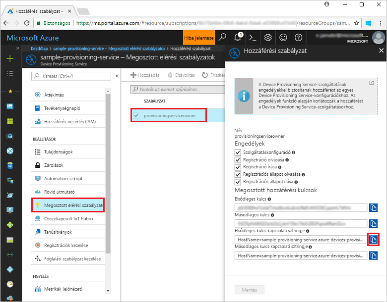
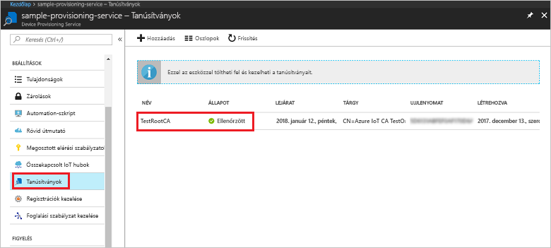
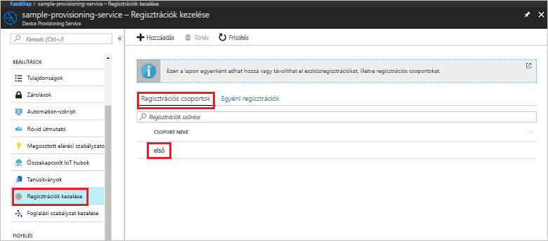

# <a name="quickstart-enroll-x509-devices-to-the-device-provisioning-service-using-nodejs"></a>Rövid útmutató: X.509-eszközök regisztrációja a Device Provisioning Service-be a Node.js használatával

[!INCLUDE [iot-dps-selector-quick-enroll-device-x509](../../includes/iot-dps-selector-quick-enroll-device-x509.md)]

Ez a rövid útmutató bemutatja, hogyan hozhat létre a Node.js segítségével programozott módon egy [regisztrációs csoportot](concepts-service.md#enrollment-group), amely köztes vagy legfelső szintű hitelesítésszolgáltatói X.509-tanúsítványokat használ. A regisztrációs csoport létrehozásához a [Node.js-hez készült IoT SDK](https://github.com/Azure/azure-iot-sdk-node)-t és egy Node.js-mintaalkalmazást használunk. Egy regisztrációs csoport a tanúsítványláncukban ugyanazon aláíró tanúsítvánnyal rendelkező eszközök kiépítési szolgáltatáshoz való hozzáférését szabályozza. További tudnivalókért lásd: [Eszközök kiépítési szolgáltatáshoz való hozzáférésének szabályozása X.509-tanúsítványokkal](./concepts-security.md#controlling-device-access-to-the-provisioning-service-with-x509-certificates). További információ az X.509-tanúsítványon alapuló nyilvánoskulcs-infrastruktúra (PKI) az Azure IoT Hubbal és a Device Provisioning Service-szel való használatáról: [X.509 hitelesítésszolgáltatói tanúsítványok biztonsági áttekintése](https://docs.microsoft.com/azure/iot-hub/iot-hub-x509ca-overview). 

A rövid útmutató feltételezi, hogy már létrehozott egy IoT hubot és egy Device Provisioning Service-példányt. Ha ezeket az erőforrásokat még nem hozta létre, végezze el az [IoT Hub eszközkiépítési szolgáltatás beállítása az Azure Portallal](./quick-setup-auto-provision.md) rövid útmutatót, mielőtt továbbhaladna ebben a cikkben.

Bár a cikkben ismertetett lépések Windows és Linux rendszerű gépeken egyaránt alkalmazhatók, ez a cikk egy Windows rendszerű fejlesztési számítógépet használ.

[!INCLUDE [quickstarts-free-trial-note](../../includes/quickstarts-free-trial-note.md)]


## <a name="prerequisites"></a>Előfeltételek

- Telepítse a [Node.js 4.0-s vagy újabb verzióját](https://nodejs.org).
- Telepítse a [Git](https://git-scm.com/download/) szoftvert.


## <a name="prepare-test-certificates"></a>Teszttanúsítványok előkészítése

A rövid útmutatóhoz szükség van egy .pem vagy .cer fájlra, amely tartalmazza egy köztes vagy legfelső szintű hitelesítésszolgáltatói X.509-tanúsítvány nyilvános részét. A tanúsítványnak a kiépítési szolgáltatásba feltöltöttnek és a szolgáltatás által ellenőrzöttnek kell lennie. 

Az [Azure IoT C SDK](https://github.com/Azure/azure-iot-sdk-c) tartalmazza azokat a teszteszközöket, amelyek segítségével létrehozhat egy X.509-tanúsítványláncot, feltölthet egy legfelsőbb szintű vagy köztes tanúsítványt a láncból, valamint végrehajthat egy tulajdonlástanúsítási eljárást a szolgáltatással a tanúsítvány hitelesítéséhez. Az SDK-eszközkészlettel létrehozott tanúsítványokat csak **fejlesztési és tesztelési célokra** tervezték. Ezeket a tanúsítványokat **nem lehet termelési környezetben használni**. Nem módosítható jelszavakat tartalmaznak („1234”), amelyek 30 nap után lejárnak. A termelési használathoz megfelelő tanúsítványok beszerzésével kapcsolatos további információt az Azure IoT Hub dokumentációjának [X.509 hitelesítésszolgáltatói tanúsítvány beszerzése](https://docs.microsoft.com/azure/iot-hub/iot-hub-x509ca-overview#how-to-get-an-x509-ca-certificate) című részében talál.

A teszteszköz segítségével a következő lépésekkel állíthat elő tanúsítványokat: 
 
1. Nyisson meg egy parancssort vagy a Git Bash-felületet, és lépjen egy, a gépen található munkamappába. A következő parancs végrehajtásával klónozza az [Azure IoT C SDK](https://github.com/Azure/azure-iot-sdk-c) GitHub-adattárat:
    
  ```cmd/sh
  git clone https://github.com/Azure/azure-iot-sdk-c.git --recursive
  ```

  Az adattár mérete jelenleg körülbelül 220 MB. Ez a művelet várhatóan több percig is eltarthat.

  A teszteszköz a klónozott adattár *azure-iot-sdk-c/tools/CACertificates* mappájában található.    

2. Kövesse a [mintákhoz és oktatóanyagokhoz készült hitelesítésszolgáltatói tanúsítványok kezeléséről](https://github.com/Azure/azure-iot-sdk-c/blob/master/tools/CACertificates/CACertificateOverview.md) szóló cikk lépéseit. 


## <a name="create-the-enrollment-group-sample"></a>A regisztrációs csoport mintájának létrehozása 

 
1. A munkamappában egy parancsablakból futtassa a következőt:
  
     ```cmd\sh
     npm install azure-iot-provisioning-service
     ```  

2. Egy szövegszerkesztővel hozzon létre egy **create_enrollment_group.js** fájlt a munkamappában. Adja hozzá a következő kódot a fájlhoz, és mentse:

    ```
    'use strict';
    var fs = require('fs');

    var provisioningServiceClient = require('azure-iot-provisioning-service').ProvisioningServiceClient;

    var serviceClient = provisioningServiceClient.fromConnectionString(process.argv[2]);

    var enrollment = {
      enrollmentGroupId: 'first',
      attestation: {
        type: 'x509',
        x509: {
          signingCertificates: {
            primary: {
              certificate: fs.readFileSync(process.argv[3], 'utf-8').toString()
            }
          }
        }
      },
      provisioningStatus: 'disabled'
    };

    serviceClient.createOrUpdateEnrollmentGroup(enrollment, function(err, enrollmentResponse) {
      if (err) {
        console.log('error creating the group enrollment: ' + err);
      } else {
        console.log("enrollment record returned: " + JSON.stringify(enrollmentResponse, null, 2));
        enrollmentResponse.provisioningStatus = 'enabled';
        serviceClient.createOrUpdateEnrollmentGroup(enrollmentResponse, function(err, enrollmentResponse) {
          if (err) {
            console.log('error updating the group enrollment: ' + err);
          } else {
            console.log("updated enrollment record returned: " + JSON.stringify(enrollmentResponse, null, 2));
          }
        });
      }
    });
    ````

## <a name="run-the-enrollment-group-sample"></a>A regisztrációs mintacsoport futtatása
 
1. A minta futtatásához szüksége lesz a kiépítési szolgáltatás kapcsolati sztringjére. 
    1. Jelentkezzen be az Azure Portalra, a bal oldali menüben kattintson a **Minden erőforrás** gombra, és nyissa meg a Device Provisioning Service-t. 
    2. Kattintson a **Megosztott elérési szabályzatok** elemre, majd a használni kívánt hozzáférési szabályzatra a tulajdonságainak megnyitásához. A **Hozzáférési szabályzat** ablakban másolja és jegyezze fel az elsődleges kulcs kapcsolati sztringjét. 

     


3. Amint azt a [Teszttanúsítványok előkészítése](quick-enroll-device-x509-node.md#prepare-test-certificates) részben már említettük, egy .pem fájlra is szüksége lesz, amely egy köztes vagy legfelső szintű hitelesítésszolgáltatói X.509-tanúsítványt tartalmaz, amely már fel lett töltve és hitelesítve lett az eszközkiépítési szolgáltatás által. Annak ellenőrzéséhez, hogy a tanúsítvány már fel lett töltve és hitelesítve lett, az Azure Portalon a Device Provisioning Service összefoglaló panelén kattintson a **Tanúsítványok** gombra. Keresse meg a csoportos regisztrációhoz használni kívánt tanúsítványt, és győződjön meg arról, hogy az állapotának értéke *Hitelesítve*.

     

1. Egy regisztrációs csoport a tanúsítványhoz való létrehozásához futtassa az alábbi parancsot (a parancs argumentumai körül lévő idézőjeleket is írja be):
 
     ```cmd\sh
     node create_enrollment_group.js "<the connection string for your provisioning service>" "<your certificate's .pem file>"
     ```
 
3. Sikeres létrehozás esetén a parancsablakban az új regisztrációs csoport tulajdonságai jelennek meg.

     

4. Ellenőrizze, hogy a regisztrációs csoport létrejött-e. Az Azure Portal Device Provisioning Service összefoglalási panelén válassza a **Regisztrációk kezelése** lehetőséget. Válassza a **Regisztrációs csoportok** lapot, és ellenőrizze, hogy az új regisztrációs bejegyzés (*első*) megjelenik-e.

     
 
## <a name="clean-up-resources"></a>Az erőforrások eltávolítása
Ha azt tervezi, hogy részletesebben is áttekinti a Node.js-szolgáltatásmintákat, akkor ne törölje az ebben a rövid útmutatóban létrehozott erőforrásokat. Ha nem folytatja a munkát, akkor a következő lépésekkel törölheti a rövid útmutatóhoz létrehozott összes Azure-erőforrást.
 
1. Zárja be a Node.js-minta kimeneti ablakát a gépen.
2. Lépjen az eszközkiépítési szolgáltatásra az Azure Portalon, kattintson a **Regisztrációk kezelése** elemre, majd válassza a **Regisztrációs csoportok** lapot. Válassza ki a rövid útmutató segítségével létrehozott regisztrációs bejegyzés *Regisztrációs azonosítóját*, majd kattintson a panel tetején lévő **Törlés** gombra.  
3. Az Azure Portalon az eszközkiépítési szolgáltatásban kattintson a **Tanúsítványok** lehetőségre, majd a rövid útmutató céljaira feltöltött tanúsítványra, és végül a **Törlés** gombra a **Tanúsítvány részletei** ablak tetején.  
 
## <a name="next-steps"></a>További lépések
Ebben a rövid útmutatóban egy csoportos regisztrációt hozott létre egy köztes vagy fő hitelesítésszolgáltatói X.509-tanúsítvány számára az Azure IoT Hub Device Provisioning Service használatával. Ha mélyebben szeretné megismerni az eszközkiépítést, folytassa az Azure Portalon az eszközkiépítési szolgáltatás beállításának oktatóanyagával. 
 
> [!div class="nextstepaction"]
> [Azure IoT Hub eszközkiépítési szolgáltatás oktatóanyagai](./tutorial-set-up-cloud.md)