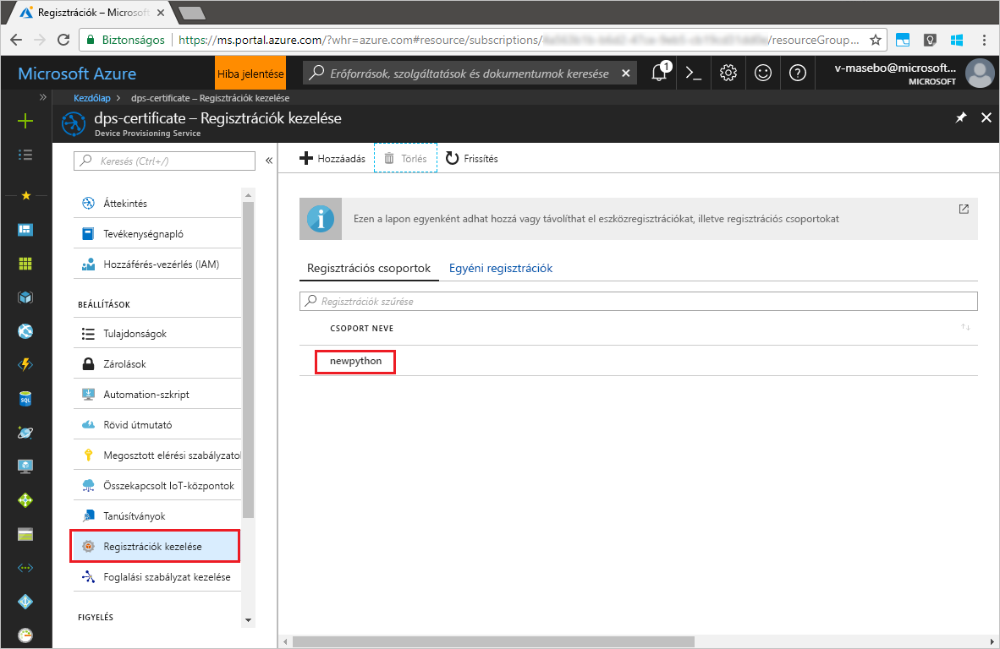

# <a name="quickstart-enroll-x509-devices-to-the-device-provisioning-service-using-python"></a>Rövid útmutató: X.509-eszközök regisztrációja a Device Provisioning Service-be a Python használatával

[!INCLUDE [iot-dps-selector-quick-enroll-device-x509](../../includes/iot-dps-selector-quick-enroll-device-x509.md)]

Az eszközöket a kiépítésiszolgáltatás-példányokban egy [regisztrációs csoport](concepts-service.md#enrollment-group) létrehozásával vagy [egyéni regisztrációval](concepts-service.md#individual-enrollment) lehet regisztrálni. Ez a rövid útmutató bemutatja, hogyan hozhat létre a Python segítségével programozott módon egy [regisztrációs csoportot](concepts-service.md#enrollment-group), amely köztes vagy legfelső szintű hitelesítésszolgáltatói X.509-tanúsítványokat használ. Egy regisztrációs csoport a tanúsítványláncukban ugyanazon aláíró tanúsítvánnyal rendelkező eszközök kiépítési szolgáltatáshoz való hozzáférését szabályozza. A regisztrációs csoport létrehozásához a [Python kiépítési szolgáltatási SDK](https://github.com/Azure/azure-iot-sdk-python/tree/master/provisioning_service_client)-t és egy Python-mintaalkalmazást használunk. A *Python regisztrációs szolgáltatási SDK*-val végzett egyéni regisztráció egyelőre kidolgozás alatt áll. További tudnivalókért lásd: [Eszközök kiépítési szolgáltatáshoz való hozzáférésének szabályozása X.509-tanúsítványokkal](./concepts-security.md#controlling-device-access-to-the-provisioning-service-with-x509-certificates). További információ az X.509-tanúsítványon alapuló nyilvánoskulcs-infrastruktúra (PKI) az Azure IoT Hubbal és a Device Provisioning Service-szel való használatáról: [X.509 hitelesítésszolgáltatói tanúsítványok biztonsági áttekintése](https://docs.microsoft.com/azure/iot-hub/iot-hub-x509ca-overview). 

A rövid útmutató feltételezi, hogy már létrehozott egy IoT hubot és egy Device Provisioning Service-példányt. Ha ezeket az erőforrásokat még nem hozta létre, végezze el az [IoT Hub eszközkiépítési szolgáltatás beállítása az Azure Portallal](./quick-setup-auto-provision.md) rövid útmutatót, mielőtt továbbhaladna ebben a cikkben.

Bár a cikkben ismertetett lépések Windows és Linux rendszerű gépeken egyaránt alkalmazhatók, ez a cikk egy Windows rendszerű fejlesztési számítógépet használ.

[!INCLUDE [quickstarts-free-trial-note](../../includes/quickstarts-free-trial-note.md)]


## <a name="prerequisites"></a>Előfeltételek

- Telepítse a [Python 2.x vagy 3.x verzióját](https://www.python.org/downloads/). Mindenképp a rendszernek megfelelő, 32 vagy 64 bites telepítést használja. Amikor a rendszer erre kéri, mindenképp adja hozzá a Pythont a platformspecifikus környezeti változókhoz.
- [Telepítse vagy frissítse a *pip*-et, a Python csomagkezelő rendszerét](https://pip.pypa.io/en/stable/installing/).
- Telepítse a [Git](https://git-scm.com/download/) szoftvert.


## <a name="prepare-test-certificates"></a>Teszttanúsítványok előkészítése

A rövid útmutatóhoz szükség van egy .pem vagy .cer fájlra, amely tartalmazza egy köztes vagy legfelső szintű hitelesítésszolgáltatói X.509-tanúsítvány nyilvános részét. A tanúsítványnak a kiépítési szolgáltatásba feltöltöttnek és a szolgáltatás által ellenőrzöttnek kell lennie. 

Az [Azure IoT C SDK](https://github.com/Azure/azure-iot-sdk-c) tartalmazza azokat a teszteszközöket, amelyek segítségével létrehozhat egy X.509-tanúsítványláncot, feltölthet egy legfelsőbb szintű vagy köztes tanúsítványt a láncból, valamint végrehajthat egy tulajdonlástanúsítási eljárást a szolgáltatással a tanúsítvány hitelesítéséhez. Az SDK-eszközkészlettel létrehozott tanúsítványokat csak **fejlesztési és tesztelési célokra** tervezték. Ezeket a tanúsítványokat **nem lehet termelési környezetben használni**. Nem módosítható jelszavakat tartalmaznak („1234”), amelyek 30 nap után lejárnak. A termelési használathoz megfelelő tanúsítványok beszerzésével kapcsolatos további információt az Azure IoT Hub dokumentációjának [X.509 hitelesítésszolgáltatói tanúsítvány beszerzése](https://docs.microsoft.com/azure/iot-hub/iot-hub-x509ca-overview#how-to-get-an-x509-ca-certificate) című részében talál.

A teszteszköz segítségével a következő lépésekkel állíthat elő tanúsítványokat: 
 
1. Nyisson meg egy parancssort vagy a Git Bash-felületet, és lépjen egy, a gépen található munkamappába. A következő parancs végrehajtásával klónozza az [Azure IoT C SDK](https://github.com/Azure/azure-iot-sdk-c) GitHub-adattárat:
    
  ```cmd/sh
  git clone https://github.com/Azure/azure-iot-sdk-c.git --recursive
  ```

  Az adattár mérete jelenleg körülbelül 220 MB. Ez a művelet várhatóan több percig is eltarthat.

  A teszteszköz a klónozott adattár *azure-iot-sdk-c/tools/CACertificates* mappájában található.    

2. Kövesse a [mintákhoz és oktatóanyagokhoz készült hitelesítésszolgáltatói tanúsítványok kezeléséről](https://github.com/Azure/azure-iot-sdk-c/blob/master/tools/CACertificates/CACertificateOverview.md) szóló cikk lépéseit. 


## <a name="modify-the-python-sample-code"></a>A Python-mintakód módosítása

Ez a szakasz bemutatja, hogyan adhatja hozzá az X.509-eszköz kiépítési adatait a mintakódhoz. 

1. Egy szövegszerkesztővel hozzon létre egy új **EnrollmentGroup.py** fájlt.

1. Adja hozzá a következő `import` utasításokat és változókat az **EnrollmentGroup.py** fájl elejéhez. Ezután cserélje le a `dpsConnectionString` elemet a kapcsolati sztringre, amely az **Azure Portal****Device Provisioning Service** panelén, a **Megosztott elérési szabályzatok** alatt található. A tanúsítvány helyőrzőjét cserélje le a [Teszttanúsítványok előkészítése](quick-enroll-device-x509-python.md#prepare-test-certificates) szakaszban korábban létrehozott tanúsítványra. Végezetül hozzon létre egy egyedi `registrationid` azonosítót, de ne feledje, hogy az kizárólag kisbetűs alfanumerikus karaktereket és kötőjeleket tartalmazhat.  
   
    ```python
    from provisioningserviceclient import ProvisioningServiceClient
    from provisioningserviceclient.models import EnrollmentGroup, AttestationMechanism

    CONNECTION_STRING = "{dpsConnectionString}"

    SIGNING_CERT = """-----BEGIN CERTIFICATE-----
    XXXXXXXXXXXXXXXXXXXXXXXXXXXXXXXXXXXXXXXXXXXXXXXXXXXXXXXXXXXXXXXX
    XXXXXXXXXXXXXXXXXXXXXXXXXXXXXXXXXXXXXXXXXXXXXXXXXXXXXXXXXXXXXXXX
    XXXXXXXXXXXXXXXXXXXXXXXXXXXXXXXXXXXXXXXXXXXXXXXXXXXXXXXXXXXXXXXX
    XXXXXXXXXXXXXXXXXXXXXXXXXXXXXXXXXXXXXXXXXXXXXXXXXXXXXXXXXXXXXXXX
    XXXXXXXXXXXXXXXXXXXXXXXXXXXXXXXXXXXXXXXXXXXXXXXXXXXXXXXXXXXXXXXX
    XXXXXXXXXXXXXXXXXXXXXXXXXXXXXXXXXXXXXXXXXXXXXXXXXXXXXXXXXXXXXXXX
    XXXXXXXXXXXXXXXXXXXXXXXXXXXXXXXXXXXXXXXXXXXXXXXXXXXXXXXXXXXXXXXX
    XXXXXXXXXXXXXXXXXXXXXXXXXXXXXXXXXXXXXXXXXXXXXXXXXXXXXXXXXXXXXXXX
    XXXXXXXXXXXXXXXXXXXXXXXXXXXXXXXXXXXXXXXXXXXXXXXXXXXXXXXXXXXXXXXX
    XXXXXXXXXXXXXXXXXXXXXXXXXXXXXXXXXXXXXXXXXXXXXXXXXXXXXXXXXXXXXXXX
    XXXXXXXXXXXXXXXXXXXXXXXXXXXXXXXXXXXXXXXXXXXXXXXXXXXXXXXXXXXXXXXX
    XXXXXXXXXXXXXXXXXXXXXXXXXXXXXXXXXXXXXXXXXXXXXXXXXXXXXXXXXXXXXXXX
    XXXXXXXXXXXXXXXXXXXXXXXXXXXXXXXXXXXXXXXXXXXXXXXXXXXXXXXXXXXXXXXX
    XXXXXXXXXXXXXXXXXXXXXXXXXXXXXXXXXXXXXXXXXXXXXXXXXXXXXXXXXXXXXXXX
    XXXXXXXXXXXXXXXXXXXXXXXXXXXXXXXXXXXXXXXXXXXXXXXXXXXXXXXX
    -----END CERTIFICATE-----"""

    GROUP_ID = "{registrationid}"
    ```

1. Adja hozzá az alábbi függvényt és függvényhívást a csoportos regisztráció létrehozásának megvalósításához:
   
    ```python
    def main():
        print ( "Initiating enrollment group creation..." )

        psc = ProvisioningServiceClient.create_from_connection_string(CONNECTION_STRING)
        att = AttestationMechanism.create_with_x509_signing_certs(SIGNING_CERT)
        eg = EnrollmentGroup.create(GROUP_ID, att)

        eg = psc.create_or_update(eg)
    
        print ( "Enrollment group created." )

    if __name__ == '__main__':
        main()
    ```

1. Mentse és zárja be az **EnrollmentGroup.py** fájlt.
 

## <a name="run-the-sample-group-enrollment"></a>A mintául szolgáló csoportos regisztráció futtatása

1. Nyisson meg egy parancssort, és futtassa a következő parancsot az [azure-iot-provisioning-device-client](https://pypi.org/project/azure-iot-provisioning-device-client.) telepítéséhez.

    ```cmd/sh
    pip install azure-iothub-provisioningserviceclient    
    ```

2. A parancssorban futtassa a szkriptet.

    ```cmd/sh
    python EnrollmentGroup.py
    ```

3. Tekintse át a sikeres regisztráció kimenetét.

4. Az Azure Portalon lépjen a kiépítési szolgáltatásra. Kattintson a **Regisztrációk kezelése** elemre. Az X.509-eszközök csoportjának a **Regisztrációs csoportok** lapon kell megjelennie a korábban létrehozott `registrationid` név alatt. 

      


## <a name="clean-up-resources"></a>Az erőforrások eltávolítása
Ha azt tervezi, hogy részletesebben is áttekinti a Java-szolgáltatásmintát, akkor ne törölje az ebben a rövid útmutatóban létrehozott erőforrásokat. Ha nem folytatja a munkát, akkor a következő lépésekkel törölheti a rövid útmutatóhoz létrehozott összes erőforrást.

1. Zárja be a Java-minta kimeneti ablakát a gépen.
1. Zárja be az _X509-tanúsítványkészítő_ ablakát a gépen.
1. Lépjen az eszközkiépítési szolgáltatásra az Azure Portalon, kattintson a **Regisztrációk kezelése** elemre, majd válassza a **Regisztrációs csoportok** lapot. Válassza ki a rövid útmutató segítségével beléptetett X.509-eszközök *CSOPORTNEVÉT*, és kattintson a panel tetején lévő **Törlés** gombra.  


## <a name="next-steps"></a>További lépések
Ebben a rövid útmutatóban X.509-eszközök egy szimulált csoportját regisztrálta az eszközkiépítési szolgáltatásba. Ha mélyebben szeretné megismerni az eszközkiépítést, folytassa az Azure Portalon az eszközkiépítési szolgáltatás beállításának oktatóanyagával. 

> [!div class="nextstepaction"]
> [Azure IoT Hub eszközkiépítési szolgáltatás oktatóanyagai](./tutorial-set-up-cloud.md)
