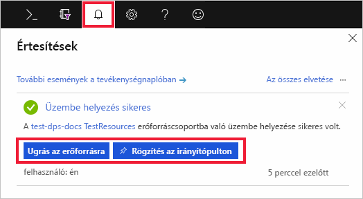

# IoT Hub eszközkiépítési szolgáltatás beállítása az Azure Portallal

Ezek a lépések azt mutatják be, hogyan történik az Azure felhőbeli erőforrások üzembe helyezése a portálon az eszközkiépítéshez. A cikkben ismertetett lépésekkel a következők hajthatók végre: az IoT Hub és egy új IoT Hub Device Provisioning szolgáltatás létrehozása, valamint a két szolgáltatás összekapcsolása. 

Ha nem rendelkezik Azure-előfizetéssel, mindössze néhány perc alatt létrehozhat egy [ingyenes fiókot](https://azure.microsoft.com/free/?WT.mc_id=A261C142F) a virtuális gép létrehozásának megkezdése előtt.

## IoT Hub létrehozása

[!INCLUDE [iot-hub-include-create-hub](../../includes/iot-hub-include-create-hub.md)]

## Új példány létrehozása az IoT Hub eszközkiépítési szolgáltatáshoz

1. Kattintson az Azure Portal bal felső sarkában található **Erőforrás létrehozása** gombra.

2. *Keresse meg a Marketplace piactéren* az **eszközkiépítési szolgáltatást**. Válassza az **IoT Hub Device Provisioning Service** elemet, és kattintson a **Létrehozás** gombra. 

3. Adja meg az alábbi információkat az új Device Provisioning Service-példányra vonatkozóan, és kattintson a **Létrehozás** gombra.

    * **név:** Adjon meg egy egyedi nevet az új Device Provisioning szolgáltatás példányát. Ha a megadott név elérhető, egy zöld pipa jelenik meg.
    * **Előfizetés:** Válassza ki a Device Provisioning service-példány létrehozásához használni kívánt előfizetést.
    * **Erőforráscsoport:** Ebben a mezőben lehetővé teszi, hogy hozzon létre egy új erőforráscsoportot, vagy válasszon egy meglévőt, hogy az új példányt tartalmaz. Válassza ugyanazt az erőforráscsoportot, amely a fent létrehozott IoT Hubot tartalmazza, például: **TestResources**. Ha az összes kapcsolódó erőforrást egy csoportban helyezi el, akkor mindet együtt kezelheti. Az erőforráscsoport törlése például az adott csoportban található összes erőforrást is törli. További információkat az [Azure-erőforrások erőforráscsoportokkal való kezeléséről](../azure-resource-manager/resource-group-portal.md) szóló cikkben olvashat.
    * **Hely:** Válassza ki az Önhöz legközelebbi helyet az eszközökön.

        

4. Kattintson az értesítés gombra az erőforráspéldány létrehozásának monitorozásához. A szolgáltatás sikeres üzembe helyezése után kattintson a **Rögzítés az irányítópulton** elemre, majd az **Erőforrás megnyitása** gombra.

    

## Az IoT Hub és az eszközkiépítési szolgáltatás csatolása

Ebben a szakaszban egy konfigurációt fog hozzáadni az irányítópulton a Device Provisioning Service-példányhoz. A konfiguráció állítja be azt az IoT Hubot, amelyen az eszközök létesítése megtörténik.

1. Kattintson az Azure Portal bal oldali menüjében lévő **Minden erőforrás** gombra. Válassza ki a Device Provisioning Service az előző szakaszban létrehozott példányát.  

2. Az eszközkiépítési szolgáltatás összefoglalás panelén válassza a **Csatolt IoT Hubok** lehetőséget. Kattintson a felül látható **+ Hozzáadás** gombra. 

3. A **Hivatkozás hozzáadása IoT Hubhoz** lapon adja meg az alábbi adatokat, hogy az új Device Provisioning Service-példányt egy IoT Hubhoz kapcsolja. Ezután kattintson a **Mentés** gombra. 

    * **Előfizetés:** Válassza ki az előfizetést, amely tartalmazza az IoT hub, az új Device Provisioning service-példánnyal csatolni kívánt.
    * **Az IOT hub:** Válassza ki az IoT hub csatolása az új Device Provisioning service-példánnyal.
    * **Hozzáférési szabályzat:** Válassza ki **iothubowner** a hivatkozásra, és az IoT hub létrehozásához szükséges hitelesítő adatként.  

        

3. Most látnia kell a kiválasztott hubot a **Csatolt IoT Hubok** panelen. Lehetséges, hogy a **Frissítés** gombra kell kattintania az **Összekapcsolt IoT-központok** megjelenítéséhez.

## Az erőforrások eltávolítása

Az ebben a gyűjteményben lévő többi rövid útmutató erre a rövid útmutatóra épül. Ha azt tervezi, hogy az ezt követő rövid útmutatókkal vagy az oktatóanyagokkal dolgozik tovább, akkor ne törölje az ebben a rövid útmutatóban létrehozott erőforrásokat. Ha nem folytatja a munkát, akkor a következő lépésekkel törölheti az Azure Portalon a rövid útmutatóhoz létrehozott összes erőforrást.

1. Az Azure Portal bal oldali menüjében kattintson az **Összes erőforrás** lehetőségre, majd válassza ki az eszközkiépítési szolgáltatást. Az **Összes erőforrás** panel felső részén kattintson a **Törlés** elemre.  
2. Az Azure Portal bal oldali menüjében kattintson az **Összes erőforrás** lehetőségre, majd válassza ki az IoT Hubot. Az **Összes erőforrás** panel felső részén kattintson a **Törlés** elemre.  

## További lépések

Ebben a rövid útmutatóban egy IoT Hubot és egy Device Provisioning Service-példányt helyezett üzembe, és összekapcsolta a két erőforrást. Ha szimulált eszköz kiépítéséhez szeretné használni ezt a beállítást, folytassa a szimulált eszköz létrehozásának rövid útmutatójával.

> [!div class="nextstepaction"]
> [Szimulált eszköz létrehozásának rövid útmutatója](./quick-create-simulated-device.md)
