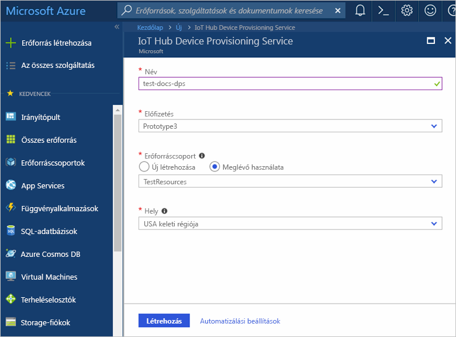
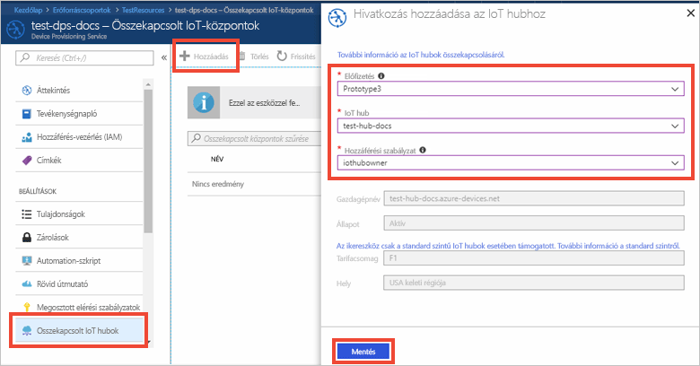

# IoT Hub eszközkiépítési szolgáltatás beállítása az Azure Portallal

Ezek a lépések azt mutatják be, hogyan történik az Azure felhőbeli erőforrások üzembe helyezése a portálon az eszközkiépítéshez. Ennek során megtörténik az IoT Hub és egy új IoT Hub eszközkiépítési szolgáltatás létrehozása, illetve e két szolgáltatás összekapcsolása. 

Ha nem rendelkezik Azure-előfizetéssel, mindössze néhány perc alatt létrehozhat egy [ingyenes fiókot](https://azure.microsoft.com/free/?WT.mc_id=A261C142F) a virtuális gép létrehozásának megkezdése előtt.

## Bejelentkezés az Azure Portalra

Jelentkezzen be az [Azure portálra](https://portal.azure.com/).

## IoT Hub létrehozása

1. Kattintson az Azure Portal bal felső sarkában található **Erőforrás létrehozása** gombra.

2. Válassza az **Eszközök internetes hálózata**, majd az **IoT Hub** elemeket, végül pedig kattintson a **Létrehozás** gombra. 

3. Adjon meg egy **nevet** az IoT Hub számára. Válasszon a rendelkezésre álló díjszabási lehetőségek közül, adja meg az [IoT Hub-egységek](https://azure.microsoft.com/pricing/details/iot-hub/) értékét, válassza ki az eszközről a felhőbe irányuló üzenetek partícióinak számát, illetve az erőforráshoz használni kívánt előfizetést. Adja meg egy új vagy egy meglévő erőforráscsoport nevét, és válassza ki annak helyét. Amikor végzett, kattintson a **Létrehozás** gombra.

      

4. Az IoT Hub sikeres üzembe helyezése után automatikusan megnyílik a hub összefoglalás panelje.

## Új példány létrehozása az IoT Hub eszközkiépítési szolgáltatáshoz

1. Kattintson az Azure Portal bal felső sarkában található **Erőforrás létrehozása** gombra.

2. *Keresse meg a Marketplace piactéren* az **eszközkiépítési szolgáltatást**. Válassza az **IoT Hub Device Provisioning Service** elemet, és kattintson a **Létrehozás** gombra. 

3. **Nevezze el** az eszközkiépítési szolgáltatás példányát. Válassza ki az ehhez a példányhoz használni kívánt előfizetést, és nevezzen meg egy új vagy létező erőforráscsoportot. Válassza ki a helyet. Amikor végzett, kattintson a **Létrehozás** gombra.

      

4. A szolgáltatás sikeres üzembe helyezése után automatikusan megnyílik annak összefoglalás panelje.

## Az IoT Hub és az eszközkiépítési szolgáltatás csatolása

1. Kattintson az Azure Portal bal oldali menüjében lévő **Minden erőforrás** gombra. Válassza ki az eszközkiépítési szolgáltatás előző szakaszban létrehozott példányát.  

2. Az eszközkiépítési szolgáltatás összefoglalás panelén válassza a **Csatolt IoT Hubok** lehetőséget. Kattintson a felül látható **+ Hozzáadás** gombra. 

3. A **Hivatkozás hozzáadása IoT Hubhoz** portálpanelen válassza ki az aktuális előfizetést, vagy írja be egy másik előfizetés nevét és kapcsolati karakterláncát. Válassza ki a hub nevét a legördülő listából. Amikor végzett, kattintson a **Mentés** gombra. 

      

3. Most látnia kell a kiválasztott hubot a **Csatolt IoT Hubok** panelen. Lehetséges, hogy a **Frissítés** gombra kell kattintania az **Összekapcsolt IoT-központok** megjelenítéséhez.

## Az erőforrások eltávolítása

Az ebben a gyűjteményben lévő többi rövid útmutató erre a rövid útmutatóra épül. Ha azt tervezi, hogy az ezt követő rövid útmutatókkal vagy az oktatóanyagokkal dolgozik tovább, akkor ne törölje az ebben a rövid útmutatóban létrehozott erőforrásokat. Ha nem folytatja a munkát, akkor a következő lépésekkel törölheti az Azure Portalon a rövid útmutatóhoz létrehozott összes erőforrást.

1. Az Azure Portal bal oldali menüjében kattintson az **Összes erőforrás** lehetőségre, majd válassza ki az eszközkiépítési szolgáltatást. Az **Összes erőforrás** panel felső részén kattintson a **Törlés** elemre.  
2. Az Azure Portal bal oldali menüjében kattintson az **Összes erőforrás** lehetőségre, majd válassza ki az IoT Hubot. Az **Összes erőforrás** panel felső részén kattintson a **Törlés** elemre.  

## További lépések

Ebben a rövid útmutatóban IoT Hubot és eszközkiépítési szolgáltatás példányt helyezett üzembe, és csatolta a két erőforrást. Ha szimulált eszköz kiépítéséhez szeretné használni ezt a beállítást, folytassa a szimulált eszköz létrehozásának rövid útmutatójával.

> [!div class="nextstepaction"]
> [Szimulált eszköz létrehozásának rövid útmutatója](./quick-create-simulated-device.md)
