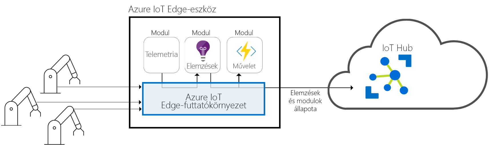
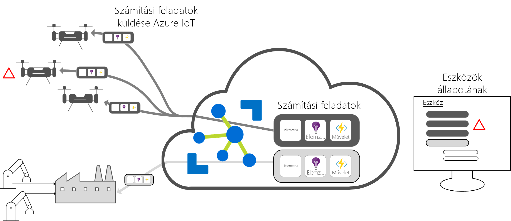

# Az Azure IoT Edge bemutatása

Az Azure IoT Edge szolgáltatás a felhőbeli elemzéseket és egyéni üzleti logikákat eszközökre helyezi át, hogy a szervezet az üzleti elemzésekre tudjon koncentrálni az adatkezelés helyett. Horizontális felskálázás az IoT-megoldások az üzleti logikára csomagolás standard szintű tárolókba, akkor ezeket a tárolók üzembe helyezése bármely eszközön, és megfigyeli azt minden a felhőben. 

Az elemzések jelentős üzleti értékeket teremthetnek az IoT-megoldásokban, de nem szükséges minden elemzést a felhőben végezni. Ha szeretne minél gyorsabban válaszolni tudjon a vészhelyzetekre, a rendellenességek észlelése számítási feladatokat a peremhálózaton is futtathatja. Ha sávszélesség-költségek csökkentése, és elkerülheti a terabájtnyi nyers adat, tiszta és összesíti az adatokat a helyileg, majd csak elküldheti az elemzéseket a felhőbe elemzéshez. 

Az Azure IoT Edge három összetevőből áll:
* **IoT Edge-modulok** olyan tároló, amely az Azure-szolgáltatások, harmadik féltől származó szolgáltatásokkal vagy saját kód futtatásához. Modulok IoT Edge-eszközök vannak telepítve, és a végrehajtásuk is helyileg, az eszközökön. 
* A **IoT Edge-futtatókörnyezet** minden IoT Edge-eszközön fut, és kezeli az adott eszközön üzembe helyezett modulokat. 
* A **felhőalapú interfész** lehetővé teszi, hogy a távoli monitorozását és kezelését az IoT Edge-eszközökön.

>[!NOTE]
>Az Azure IoT Edge az IoT Hub ingyenes és standard szintű csomagjaiban érhető el. Az ingyenes szintű csomag csak tesztelési és értékelési célokra használható. Az alapszintű és standard csomagokról további információt [a megfelelő IoT Hub-csomag kiválasztását](../iot-hub/iot-hub-scaling.md) ismertető cikkben talál.

## IoT Edge-modulok

IoT Edge-modulok megvalósítva, Docker-kompatibilis tárolókként, az üzleti logikát a peremhálózaton futtató végrehajtási egységek. Több modul is konfigurálható az egymás közötti kommunikációra, így a modulok egy adatfeldolgozó folyamatot alkothatnak. Kifejleszthet egyedi modulokat, vagy egy modulba csomagolhat bizonyos Azure-szolgáltatásokat is, amelyek elemzéseket nyújtanak offline és a peremhálózaton is. 

### Mesterséges intelligencia a peremhálózaton

Az Azure IoT Edge lehetővé teszi összetett eseményfeldolgozások, gépi tanulás, képfelismerés és egyéb értékes mesterséges Intelligenciák üzembe helyezését a házon belül írása nélkül. Azure-szolgáltatás az Azure Functions, az Azure Stream Analytics és Azure Machine Learning például az összes futtatható a helyszíni Azure IoT Edge segítségével. Ön nem Azure-szolgáltatásokra korlátozott, ha. Bárki létrehozhat Mesterségesintelligencia-modulokat, és elérhetővé teheti azokat a Közösség számára az Azure piactéren viszont. 

### Saját kód használata

Ha a saját kódját szeretné üzembe helyezni az eszközein, az Azure IoT Edge ezt is támogatja. Az IoT Edge ugyanazt a programozási modellt használja, mint a többi Azure IoT-szolgáltatás. Egy adott kód futtatható egy eszközön vagy a felhőben is. Az Azure IoT Edge a Linux és Windows rendszereket is támogatja, így szabadon kiválasztható a kódolás platformja. A Java, .NET Core 2.0, Node.js, C és Python támogatja, így a fejlesztők már jól ismert, és használja a meglévő üzleti logikát nyelven is programozhat.

## IoT Edge-futtatókörnyezet

Az Azure IoT Edge-futtatókörnyezet egyéni és felhőbeli logikák is használatát is lehetővé teszi az IoT Edge-eszközökön. A futtatókörnyezet az IoT Edge-eszközökön fut, ahol felügyeleti és kommunikációs műveleteket hajt végre. A futtatókörnyezet számos funkciót lát el:

* Telepítése és frissítése a számítási feladatokat az eszközön.
* Az Azure IoT Edge biztonsági szabványait az eszközön karbantartása.
* Győződjön meg arról, hogy az IoT Edge-modulok folyamatos futását.
* Modulok állapotát a felhőnek a távoli monitorozáshoz jelentéseket.
* Alárendelt levéleszközök és az IoT Edge-eszköz között, az IoT Edge-eszköz moduljai közötti és IoT Edge-eszköz és a felhő közötti kommunikáció kezelése.

Azure IoT Edge-eszköz használata esetén meg. A futtatókörnyezetet gyakran használják AI eszközökre telepíteni kívánt átjárót, amely aggregált és a többi dolgozza fel az adatokat a helyszíni eszközök, de az üzembe helyezési modell csak egy felhasználási lehetőség. 

Az Azure IoT Edge-futtatókörnyezet nagy mennyiségű IoT-eszközön fut, hogy a futtatókörnyezetet minél többféle módon lehessen használni. Ez a Linux és a Windows operációs rendszereket támogatja, és kivonatolja a hardveradatokat. Használjon egy a Raspberry Pi 3-nál kisebb eszközt, ha nem mennyi adatot dolgoz, vagy egy ipari server erőforrás-igényes számítási feladatok futtatásához.

## Az IoT Edge felhőalapú interfésze

Több millió IoT-eszközök, amelyek gyakran különböző megkönnyíti és -modellek szoftveres életciklusainak felügyelete bonyolult vagy földrajzilag szórt. Számítási feladatok létrehozott és konfigurált egy adott típusú eszközök, minden eszközön telepített, és figyelve és a tényleges rosszul eszközök. Ezeket a tevékenységeket nem lehet eszközönként végrehajtani, ezért nagy léptékben kell elvégezni őket.

Az Azure IoT Edge zökkenőmentesen integrálható az Azure IoT-megoldásgyorsítókkal, hogy a megoldás igényeit egyetlen felületről lehessen kezelni. A cloud services teszik lehetővé:

* Számítási feladatok létrehozása és konfigurálása egy adott típusú eszközön való futtatáshoz.
* Számítási feladatok küldése több eszközre.
* A használatban lévő eszközökön futó számítási feladatok monitorozása.

## További lépések

A fogalmak gyakorlati alkalmazását is kipróbálhatja, ha [üzembe helyezi az IoT Edge szolgáltatást egy szimulált eszközön](quickstart.md).