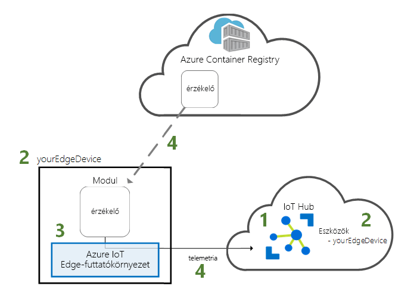
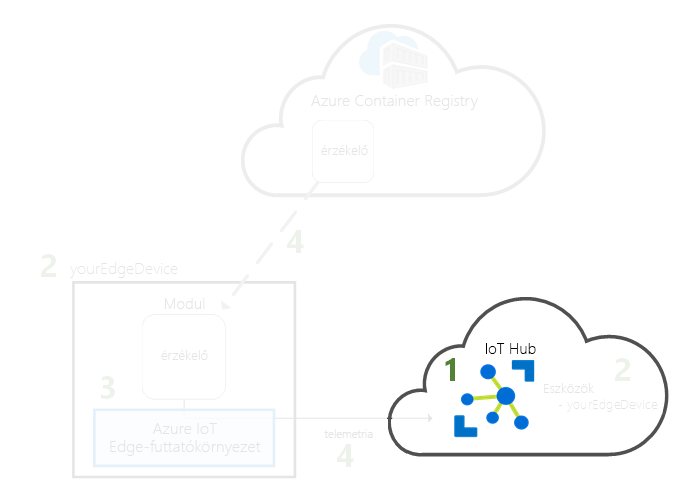
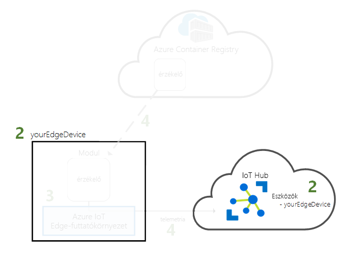
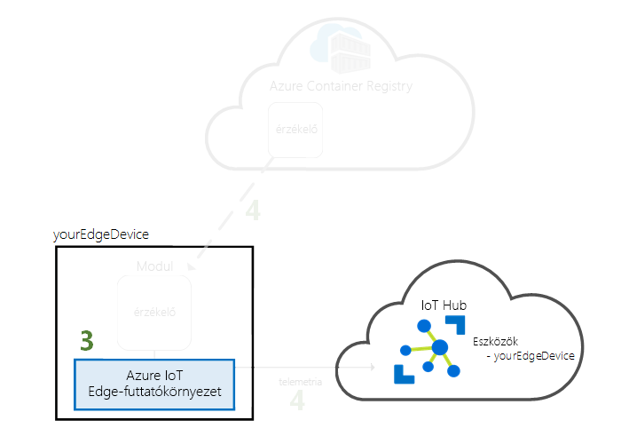

# <a name="quickstart-deploy-your-first-iot-edge-module-to-a-linux-x64-device"></a>Gyors útmutató: Az első IoT Edge-modul x64 Linux rendszerű eszközre telepítéséhez

Az Azure IoT Edge kiterjeszti a felhő képességeit IoT-eszközeire. Ebben a rövid útmutatóban megismerheti, hogyan helyezhet üzembe előre összeállított kódot távolról egy IoT Edge-eszközön a felhőalapú felület használatával.

Ennek a rövid útmutatónak a segítségével megtanulhatja az alábbiakat:

1. IoT Hub létrehozása
2. IoT Edge-eszköz regisztrálása az IoT Hubon
3. Az IoT Edge-futtatókörnyezet telepítése és elindítása az eszközén.
4. Modul távoli üzembe helyezése IoT Edge-eszközön.



Ebben a rövid útmutatóban Linux rendszerű számítógépét vagy virtuális gépét IoT Edge-eszközzé alakíthatja. Ezután egy modult helyezhet üzembe az eszközén az Azure Portalról. A jelen rövid útmutatóban üzembe helyezett modul egy szimulált érzékelő, amely hőmérséklet-, páratartalom- és nyomásadatokat állít elő. A további Azure IoT Edge-oktatóanyagok az itt elvégzett munkára építkeznek olyan modulok üzembe helyezésével, amelyek a szimulált adatok elemzésével üzleti megállapításokat hoznak létre.

Ha nem rendelkezik aktív Azure-előfizetéssel, kezdetnek hozzon létre egy [ingyenes fiókot](https://azure.microsoft.com/free).

[!INCLUDE [cloud-shell-try-it.md](../../includes/cloud-shell-try-it.md)]

A rövid útmutató számos lépésében az Azure CLI használatára van szükség, és az Azure IoT egyik bővítményével további funkciókhoz férhet hozzá. 

Adja hozzá az Azure IoT bővítményt a Cloud Shell-példányhoz.

   ```azurecli-interactive
   az extension add --name azure-cli-iot-ext
   ```

## <a name="prerequisites"></a>Előfeltételek

Felhőerőforrások: 

* Egy erőforráscsoport a rövid útmutató során létrehozott összes erőforrás kezelésére. 

   ```azurecli-interactive
   az group create --name IoTEdgeResources --location westus2
   ```

IoT Edge-eszköz:

* Egy Linux rendszerű eszköz vagy virtuális gép, amely IoT Edge-eszközként szolgál majd. Ha egy Azure-beli virtuális gépet szeretne létrehozni, az alábbi paranccsal kezdjen:

   ```azurecli-interactive
   az vm create --resource-group IoTEdgeResources --name EdgeVM --image Canonical:UbuntuServer:16.04-LTS:latest --admin-username azureuser --generate-ssh-keys --size Standard_DS1_v2
   ```

   Hozzon létre, és az új virtuális gép elindítása néhány percig is eltarthat. 

   Amikor létrehoz egy új virtuális gépet, jegyezze fel a a **publicIpAddress**, amely a create parancs kimenete részeként van megadva. A nyilvános IP-cím segítségével csatlakozzon a virtuális géphez az útmutató későbbi részében.

## <a name="create-an-iot-hub"></a>IoT Hub létrehozása

Először a rövid útmutató egy IoT hub létrehozása az Azure CLI használatával.



Ehhez a rövid útmutatóhoz az IoT Hub ingyenes csomagja is elegendő. Ha korábban már használta az IoT Hubot, és már létrehozott egy ingyenes központot, használhatja azt is. Mindegyik előfizetés csak egy ingyenes IoT-központtal rendelkezhet. 

A következő kód egy ingyenes **F1** központot hoz létre az **IoTEdgeResources** erőforráscsoportban. A *{hub_name}* elemet cserélje le az IoT Hub központ egyedi nevére.

   ```azurecli-interactive
   az iot hub create --resource-group IoTEdgeResources --name {hub_name} --sku F1 
   ```

   Ha hibaüzenetet kap, mert az előfizetése már tartalmaz egy ingyenes központot, akkor módosítsa az SKU-t **S1**-re. Ha a hiba, hogy az IoT Hub-név nem érhető el, az azt jelenti, hogy valaki más már van ilyen nevű hub. Adjon meg új nevet. 

## <a name="register-an-iot-edge-device"></a>IoT Edge-eszköz regisztrálása

Regisztráljon egy IoT Edge-eszközt az újonnan létrehozott IoT Hubon.


Hozzon létre egy eszközidentitást a szimulált eszközhöz, hogy az kommunikálhasson az IoT Hubbal. Az eszközidentitás a felhőben található, és egy egyedi eszközkapcsolati sztringgel társíthat fizikai eszközt az eszközidentitáshoz. 

IoT Edge-eszközök viselkednek, és működnek, mint a tipikus IoT-eszközök felügyelhetők, mivel ezt az identitást, az IoT Edge-eszköz, a deklarálja a `--edge-enabled` jelzőt. 

1. Az Azure Cloud Shellben a következő paranccsal hozza létre a **myEdgeDevice** nevű eszközt a központjában.

   ```azurecli-interactive
   az iot hub device-identity create --hub-name {hub_name} --device-id myEdgeDevice --edge-enabled
   ```

   Ha hibaüzenetet kap kapcsolatos iothubowner szabályzatbejegyzések, győződjön meg arról, hogy a cloud shell fut-e az azure-cli-iot-ext bővítmény legújabb verziója. 

2. Kérje le az eszköze kapcsolati sztringjét, amely összeköti a fizikai eszközt az IoT Hubban tárolt identitással. 

   ```azurecli-interactive
   az iot hub device-identity show-connection-string --device-id myEdgeDevice --hub-name {hub_name}
   ```

3. Másolja az értéket, a `cs` a JSON-kimeneteket a kulcsát, és mentse azt. Ezt az értéket az eszköz kapcsolati karakterláncának. Ez a kapcsolati karakterlánc használatával fog az IoT Edge-futtatókörnyezet konfigurálása a következő szakaszban.

   

## <a name="install-and-start-the-iot-edge-runtime"></a>Az IoT Edge-futtatókörnyezet telepítése és elindítása

Telepítse és indítsa el IoT Edge-eszközén az Azure IoT Edge-futtatókörnyezetet. 


Az IoT Edge-futtatókörnyezet minden IoT Edge-eszközön üzembe van helyezve. Három összetevőből áll. Az **IoT Edge biztonsági démon** az Edge-eszközök indulásakor lép működésbe, és az IoT Edge-ügynök elindításával elvégzi az eszköz rendszerindítását. Az **IoT Edge-ügynök** a modulok üzembe helyezését és monitorozását segíti az IoT Edge-eszközön, beleértve az IoT Edge-központot is. Az **IoT Edge-központ** az IoT Edge-eszközön lévő modulok, valamint az eszköz és az IoT Hub közötti kommunikációt kezeli. 

A futtatókörnyezet konfigurálása során meg kell adnia egy eszközkapcsolati sztringet. Ez esetben az Azure CLI-ről lekért sztringet használja. Ez a sztring társítja a fizikai eszközt az IoT Edge-eszköz identitásához az Azure-ban. 

### <a name="connect-to-your-iot-edge-device"></a>Csatlakozás az IoT Edge-eszköz

A lépéseket ebben a szakaszban az összes kerül sor az IoT Edge-eszközön. A saját gép, az IoT Edge-eszköz használata, folytathatja a következő szakaszra. Ha egy virtuális gép vagy a másodlagos hardver használ, most, hogy a gép kapcsolódni szeretné. 

Ha egy Azure virtuális gépet ebben a rövid útmutatóban létrehozott, beolvasni a nyilvános IP-cím volt a létrehozási parancs kimenetét. A nyilvános IP-címet a virtuális gép – Áttekintés lapon az Azure Portalon is található. Az alábbi parancs segítségével csatlakozhat a virtuális géphez. Cserélje le **{publicIpAddress}** számítógépe címmel. 

```azurecli-interactive
ssh azureuser@{publicIpAddress}
```

### <a name="register-your-device-to-use-the-software-repository"></a>Eszköz regisztrálása a szoftveradattár használatához

Az IoT Edge-futtatókörnyezet futtatásához szükséges csomagok kezelése egy szoftveradattárban történik. Az IoT Edge-eszközt az adattárhoz való hozzáférésre konfigurálhatja. 

A jelen szakasz lépései az **Ubuntu 16.04** rendszerű x64-eszközökre vonatkoznak. A Linux- vagy eszköz architektúrák más verziói a szoftverfrissítési tárház eléréséről, lásd a [(x64) linuxon az Azure IoT Edge-futtatókörnyezet telepítéséhez](how-to-install-iot-edge-linux.md) vagy [Linux (ARM32v7/armhf)](how-to-install-iot-edge-linux-arm.md).

1. Telepítse az adattár konfigurációját az IoT Edge-eszközként használt számítógépen.

   ```bash
   curl https://packages.microsoft.com/config/ubuntu/16.04/prod.list > ./microsoft-prod.list
   sudo cp ./microsoft-prod.list /etc/apt/sources.list.d/
   ```

2. Telepítsen egy nyilvános kulcsot az adattárhoz való hozzáféréshez.

   ```bash
   curl https://packages.microsoft.com/keys/microsoft.asc | gpg --dearmor > microsoft.gpg
   sudo cp ./microsoft.gpg /etc/apt/trusted.gpg.d/
   ```

### <a name="install-a-container-runtime"></a>Tároló-futtatókörnyezet telepítése

Az IoT Edge-futtatókörnyezet egy tárolókészlet, és az IoT Edge-eszközön üzembe helyezett logika tárolókként van csomagolva. Készítse elő eszközét ezekhez az összetevőkhöz egy tároló-futtatókörnyezet telepítésével.

1. Frissítse az **apt-get** parancsot.

   ```bash
   sudo apt-get update
   ```

2. Telepítse a **Moby** tároló-futtatókörnyezetet.

   ```bash
   sudo apt-get install moby-engine
   ```

3. Telepítse a Moby CLI-parancsait. 

   ```bash
   sudo apt-get install moby-cli
   ```

### <a name="install-and-configure-the-iot-edge-security-daemon"></a>Az IoT Edge biztonsági démon telepítése és konfigurálása

A biztonsági démon rendszerszolgáltatásként lesz telepítve, így az IoT Edge-futtatókörnyezet minden alkalommal elindul az eszköz indításakor. A telepítés egy **hsmlib** verziót is magában foglal, amely lehetővé teszi, hogy a biztonsági démon kommunikáljon az eszköz hardveres biztonsági rendszerével. 

1. Töltse le és telepítse az IoT Edge biztonsági démont. 

   ```bash
   sudo apt-get update
   sudo apt-get install iotedge
   ```

2. Nyissa meg az IoT Edge konfigurációs fájlját. Így előfordulhat, hogy emelt szintű jogosultságok használatához hozzá kell legyen egy védett fájlt.
   
   ```bash
   sudo nano /etc/iotedge/config.yaml
   ```

3. Adja hozzá az IoT Edge-eszköz kapcsolati sztringjét. Keresse meg a **device_connection_string** értéket, és frissítse arra a sztringre, amelyet az eszköz regisztrálása után másolt ki. Ez a kapcsolati sztring társítja a fizikai eszközt az eszköz Azure-ban létrehozott identitásához.

4. Mentse és zárja be a fájlt. 

   `CTRL + X`, `Y`, `Enter`

5. A módosítások életbe léptetéséhez indítsa újra az IoT Edge biztonsági démont.

   ```bash
   sudo systemctl restart iotedge
   ```

### <a name="view-the-iot-edge-runtime-status"></a>Az IoT Edge-futtatókörnyezet állapotának megtekintése

Ellenőrizze, hogy a futtatókörnyezet megfelelően lett-e telepítve és konfigurálva.

>[!TIP]
>Az `iotedge` parancsok futtatásához megemelt jogosultsági szint szükséges. Amikor az IoT Edge-futtatókörnyezet telepítése után kijelentkezik, majd először újra bejelentkezik a gépre, az engedélyei automatikusan frissülnek. Addig alkalmazza a **sudo** kifejezést a parancsok előtt. 

1. Ellenőrizze, hogy az Edge biztonsági démon rendszerszolgáltatásként fut-e.

   ```bash
   sudo systemctl status iotedge
   ```

   

2. Ha hibaelhárításra van szükség, kérje le a szolgáltatás naplóit. 

   ```bash
   journalctl -u iotedge
   ```

3. Tekintse meg az eszközön futó modulokat. 

   ```bash
   sudo iotedge list
   ```

   

Ezzel konfigurálta az IoT Edge-eszközt. Az eszköz készen áll a felhőben üzembe helyezett modulok futtatására. 

## <a name="deploy-a-module"></a>Modul üzembe helyezése

Azure IoT Edge-eszközeit kezelheti a felhőből, és üzembe helyezhet egy olyan modult, amely telemetriaadatokat küld az IoT Hubra.


[!INCLUDE [iot-edge-deploy-module](../../includes/iot-edge-deploy-module.md)]

## <a name="view-generated-data"></a>A létrejött adatok megtekintése

Ebben a rövid útmutatóban létrehozott egy új IoT Edge-eszközt, és telepítette rajta az IoT Edge-futtatókörnyezetet. Az Azure Portalon, majd az eszköz maga az eszköz módosításához nélkül futtathat egy IoT Edge-modul telepítéséhez használt. 

Ebben az esetben a modul, amely a leküldött teszteléshez használható mintaadatokat hoz létre. A szimulált hőmérsékleti érzékelő modul újabb teszteléséhez használható környezeti adatok állít elő. A szimulált érzékelő által figyelt, a gép körül a környezet és a egy gép. Az érzékelő Előfordulhat például, egy kiszolgáló szobában, egy gyárban, vagy egy szélturbina sürgősségi. Az üzenet tartalmazza a környezeti hőmérséklet és páratartalom, gép hőmérséklet és nyomás és a egy időbélyegző. Az IoT Edge-oktatóanyagok a Tesztadatok elemzéshez, a modul által létrehozott adatokat használja.

Nyissa meg újra a parancssort az IoT Edge-eszközön. Győződjön meg arról, hogy a felhőből üzembe helyezett modul fut az IoT Edge-eszközön:

   ```bash
   sudo iotedge list
   ```

   

A hőmérséklet-érzékelő modul küldött üzenetek megjelenítése:

   ```bash
   sudo iotedge logs SimulatedTemperatureSensor -f
   ```

   >[!TIP]
   >IoT Edge-parancsok modulneveket kontextusban való megnevezésekor nagybetűk között.

   

Az üzeneteket az IoT hub kiszolgálófarmban használatával is megtekintheti a [Azure IoT Hub-eszközkészlet bővítmény a Visual Studio Code](https://marketplace.visualstudio.com/items?itemName=vsciot-vscode.azure-iot-toolkit) (korábbi nevén Azure IoT-eszközkészlet bővítmény). 

## <a name="clean-up-resources"></a>Az erőforrások eltávolítása

Ha tovább szeretne dolgozni az IoT Edge-oktatóanyagokkal, használhatja az ebben a rövid útmutatóban regisztrált és létrehozott eszközt. Ha nem, törölheti a létrehozott Azure-erőforrásokat, és eltávolíthatja az IoT Edge-futtatókörnyezetet az eszközről.

### <a name="delete-azure-resources"></a>Azure-erőforrások törlése

Ha a virtuális gépet és az IoT Hubot egy új erőforráscsoportban hozta létre, törölheti azt a csoportot és az összes társított erőforrást. Ellenőrizze a győződjön meg arról, hogy ott az erőforráscsoportot, amelybe a tartalmát a semmi meg szeretné tartani. A teljes csoport törlése nem szeretné, ha ehelyett törölheti az egyes erőforrásokat.

Távolítsa el az **IoTEdgeResources** csoportot.

   ```azurecli-interactive
   az group delete --name IoTEdgeResources 
   ```

### <a name="remove-the-iot-edge-runtime"></a>Az IoT Edge-futtatókörnyezet eltávolítása

Ha el szeretné távolítani a telepítéseket az eszközéről, azt a következő parancsokkal teheti meg.  

Távolítsa el az IoT Edge-futtatókörnyezetet.

   ```bash
   sudo apt-get remove --purge iotedge
   ```

Távolítsa el a tároló-futtatókörnyezetet.

   ```bash
   sudo apt-get remove --purge moby-cli
   sudo apt-get remove --purge moby-engine
   ```

## <a name="next-steps"></a>További lépések

Ez a rövid útmutató minden IoT Edge-oktatóanyag előfeltétele. Továbbléphet bármely másik oktatóanyagra, és megtudhatja, hogyan alakíthatja üzleti megállapításokká ezeket az adatokat a peremhálózaton az Azure IoT Edge segítségével.

> [!div class="nextstepaction"]
> [Érzékelők adatainak szűrése Azure Functions-függvényekkel](tutorial-deploy-function.md)
