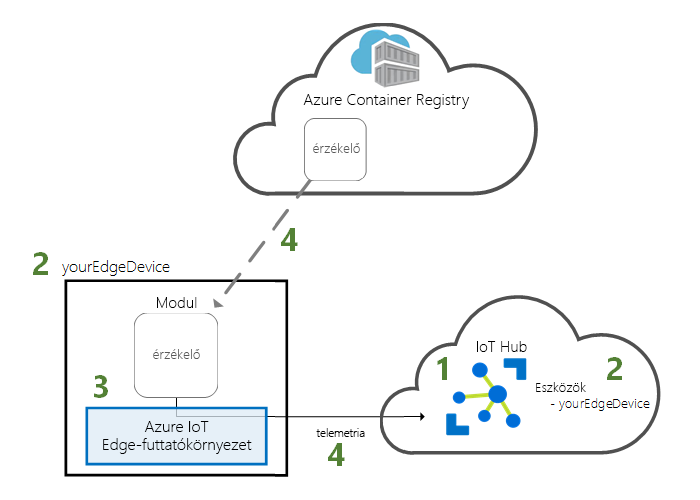
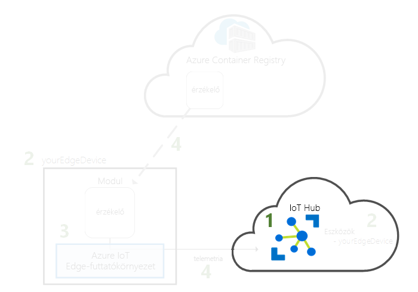
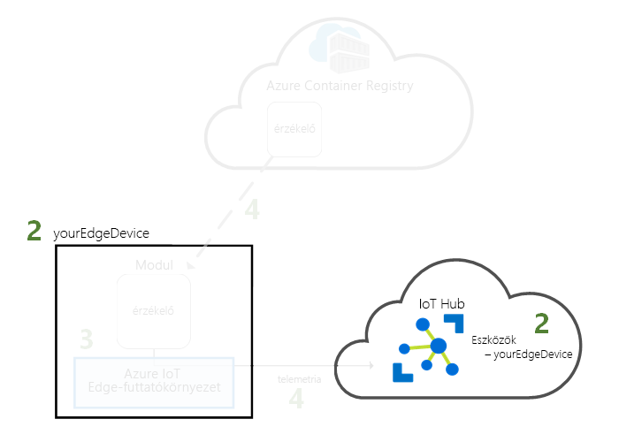
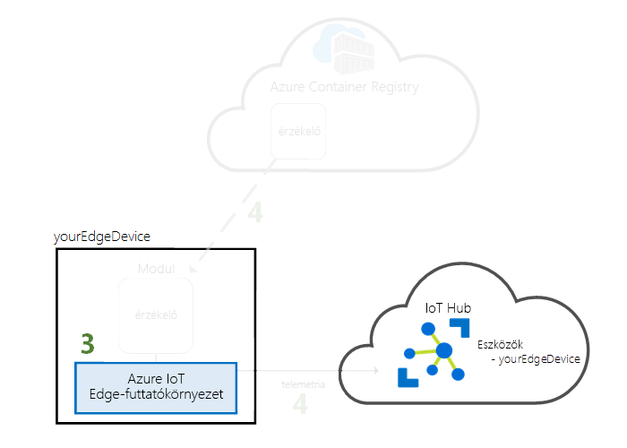
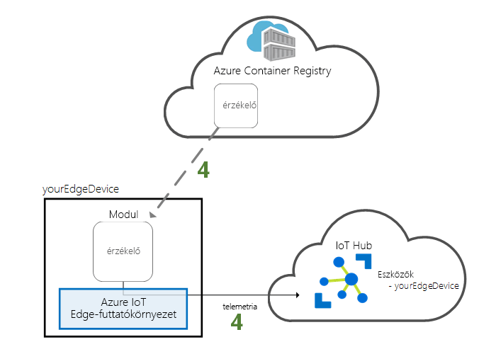

# <a name="quickstart-deploy-your-first-iot-edge-module-from-the-azure-portal-to-a-windows-device---preview"></a>Gyors útmutató: Az első IoT Edge-modul az Azure Portalon, egy Windows-eszköz üzembe helyezése – előzetes verzió

Ebben a rövid útmutatóban előre összeállított kódokat fog távolról üzembe helyezni egy IoT Edge-eszközön az Azure IoT Edge felhőalapú interfészével. A feladat teljesítése érdekében először a Windows-eszközzel szimulálni fogja az IoT Edge-eszközt, amelyen aztán üzembe fog helyezni egy modult.

Ennek a rövid útmutatónak a segítségével megtanulhatja az alábbiakat:

1. IoT Hub létrehozása
2. IoT Edge-eszköz regisztrálása az IoT Hubon
3. Az IoT Edge-futtatókörnyezet telepítése és elindítása az eszközén.
4. Modul távoli üzembe helyezése IoT Edge-eszközön és Telemetria küldése az IoT Hubnak



A jelen rövid útmutatóban üzembe helyezett modul egy szimulált érzékelő, amely hőmérséklet-, páratartalom- és nyomásadatokat állít elő. A további Azure IoT Edge-oktatóanyagok az itt elvégzett munkára építkeznek olyan modulok üzembe helyezésével, amelyek a szimulált adatok elemzésével üzleti megállapításokat hoznak létre.

>[!NOTE]
>Windows rendszeren az IoT Edge-futtatókörnyezet [nyilvános előzetes verzióban](https://azure.microsoft.com/support/legal/preview-supplemental-terms/) érhető el.

Ha nem rendelkezik aktív Azure-előfizetéssel, kezdetnek hozzon létre egy [ingyenes fiókot](https://azure.microsoft.com/free).

[!INCLUDE [cloud-shell-try-it.md](../../includes/cloud-shell-try-it.md)]

A rövid útmutató számos lépésében az Azure CLI használatára van szükség, és az Azure IoT egyik bővítményével további funkciókhoz férhet hozzá.

Adja hozzá az Azure IoT bővítményt a Cloud Shell-példányhoz.

   ```azurecli-interactive
   az extension add --name azure-cli-iot-ext
   ```

## <a name="prerequisites"></a>Előfeltételek

Felhőerőforrások:

* Egy erőforráscsoport a rövid útmutató során létrehozott összes erőforrás kezelésére.

   ```azurecli-interactive
   az group create --name IoTEdgeResources --location westus
   ```

IoT Edge-eszköz:

* Egy Windows rendszerű számítógép vagy virtuális gép, amely IoT Edge-eszközként szolgál majd. Használjon támogatott Windows-verziót:
  * Windows 10-es vagy IoT Core-2018. október (build 17763) frissítése
  * A Windows Server 2019
* Virtualizálás engedélyezése, hogy az eszköz tárolók is üzemeltethet.
   * Ha egy Windows-számítógép, a tárolók funkció engedélyezéséhez. Lépjen a kezdő sávon **kapcsolja be Windows-szolgáltatások be- és kikapcsolása** melletti jelölőnégyzetet, és **tárolók**.
   * Ha egy virtuális gépet, engedélyezze [beágyazott virtualizálás](https://docs.microsoft.com/virtualization/hyper-v-on-windows/user-guide/nested-virtualization) és legalább 2 GB memóriát lefoglalni.

## <a name="create-an-iot-hub"></a>IoT Hub létrehozása

Először a rövid útmutató egy IoT hub létrehozása az Azure CLI használatával.



Ehhez a rövid útmutatóhoz az IoT Hub ingyenes csomagja is elegendő. Ha korábban már használta az IoT Hubot, és már létrehozott egy ingyenes központot, használhatja azt is. Mindegyik előfizetés csak egy ingyenes IoT-központtal rendelkezhet.

A következő kód egy ingyenes **F1** központot hoz létre az **IoTEdgeResources** erőforráscsoportban. A *{hub_name}* elemet cserélje le az IoT Hub központ egyedi nevére.

   ```azurecli-interactive
   az iot hub create --resource-group IoTEdgeResources --name {hub_name} --sku F1
   ```

   Ha hibaüzenetet kap, mert az előfizetése már tartalmaz egy ingyenes központot, akkor módosítsa az SKU-t **S1**-re. Ha a hiba, hogy az IoT Hub-név nem érhető el, az azt jelenti, hogy valaki más már van ilyen nevű hub. Adjon meg új nevet. 

## <a name="register-an-iot-edge-device"></a>IoT Edge-eszköz regisztrálása

Regisztráljon egy IoT Edge-eszközt az újonnan létrehozott IoT Hubon.


Hozzon létre egy eszközidentitást a szimulált eszközhöz, hogy az kommunikálhasson az IoT Hubbal. Az eszközidentitás a felhőben található, és egy egyedi eszközkapcsolati sztringgel társíthat fizikai eszközt az eszközidentitáshoz.

IoT Edge-eszközök viselkednek, és működnek, mint a tipikus IoT-eszközök felügyelhetők, mivel ezt az identitást, az IoT Edge-eszköz, a deklarálja a `--edge-enabled` jelzőt. 

1. Az Azure Cloud Shellben a következő paranccsal hozza létre a **myEdgeDevice** nevű eszközt a központjában.

   ```azurecli-interactive
   az iot hub device-identity create --device-id myEdgeDevice --hub-name {hub_name} --edge-enabled
   ```

   Ha hibaüzenetet kap kapcsolatos iothubowner szabályzatbejegyzések, győződjön meg arról, hogy a cloud shell fut-e az azure-cli-iot-ext bővítmény legújabb verziója. 

2. Kérje le az eszköze kapcsolati sztringjét, amely összeköti a fizikai eszközt az IoT Hubban tárolt identitással.

   ```azurecli-interactive
   az iot hub device-identity show-connection-string --device-id myEdgeDevice --hub-name {hub_name}
   ```

3. Másolja a kapcsolati karakterláncot a JSON-kimenetet, és mentse. Erre az értékre a következő szakaszban, az IoT Edge-futtatókörnyezet konfigurálásához lesz szükség.

   

## <a name="install-and-start-the-iot-edge-runtime"></a>Az IoT Edge-futtatókörnyezet telepítése és elindítása

Telepítse az Azure IoT Edge-futtatókörnyezetet az IoT Edge-eszközön, és a konfigurálást eszközkapcsolati sztring használatával végezze el.


Az IoT Edge-futtatókörnyezet minden IoT Edge-eszközön üzembe van helyezve. Három összetevőből áll. A **IoT Edge biztonsági démon** minden alkalommal, amikor egy IoT Edge-eszköz indul el, és csatlakoztatja az eszközt az IoT Edge-ügynök elindításával kezdődik. A **IoT Edge-ügynök** kezeli a központi telepítési és a modulok IoT Edge-eszközön, beleértve az IoT Edge hubot a figyelését. A **IoT Edge hubot** modulok az IoT Edge-eszköz között, és az eszköz és az IoT Hub közötti kommunikációt kezeli.

A telepítési parancsfájlt is tartalmaz, amely kezeli a tárolórendszerképeket az IoT Edge-eszközön Moby nevű container-motor. 

A futtatókörnyezet telepítése során a rendszer rá fog kérdezni az eszközkapcsolati sztringre. Ez esetben az Azure CLI-ről lekért sztringet használja. Ez a sztring társítja a fizikai eszközt az IoT Edge-eszköz identitásához az Azure-ban.

A jelen szakaszban található útmutatásokat az IoT Edge-futtatókörnyezet konfigurálása a Windows-tárolókkal. Ha azt szeretné, Linux-tárolók használatára, lásd: [telepítse az Azure IoT Edge-modul a Windows](how-to-install-iot-edge-windows-with-linux.md) ezen Előfeltételek és a telepítési lépéseket.

### <a name="connect-to-your-iot-edge-device"></a>Csatlakozás az IoT Edge-eszköz

A lépéseket ebben a szakaszban az összes kerül sor az IoT Edge-eszközön. Egy virtuális gép vagy a másodlagos hardver használja, ha azt szeretné, hogy a gép most már SSH vagy a távoli asztal használatával csatlakozhat. A saját gép, az IoT Edge-eszköz használata, folytathatja a következő szakaszra. 

### <a name="download-and-install-the-iot-edge-service"></a>Az IoT Edge-szolgáltatás letöltése és telepítése

Az IoT Edge-futtatókörnyezet letöltése és telepítése a PowerShell használatával történik. Az eszköz konfigurálásához az IoT Hubról lekért eszközkapcsolati sztringet használja.

1. IoT Edge-eszközén futtassa a PowerShellt rendszergazdaként.

2. Töltse le és telepítse az IoT Edge-szolgáltatást az eszközre.

   ```powershell
   . {Invoke-WebRequest -useb aka.ms/iotedge-win} | Invoke-Expression; `
   Install-SecurityDaemon -Manual -ContainerOs Windows
   ```

3. Ha a rendszer a **DeviceConnectionString** megadására kéri, akkor illessze be az előző szakaszból átmásolt sztringet. A kapcsolati sztring elé és után ne írjon idézőjeleket.

### <a name="view-the-iot-edge-runtime-status"></a>Az IoT Edge-futtatókörnyezet állapotának megtekintése

Ellenőrizze, hogy a futtatókörnyezet megfelelően lett-e telepítve és konfigurálva.

1. Ellenőrizze az IoT Edge-szolgáltatás állapotát.

   ```powershell
   Get-Service iotedge
   ```

2. Ha hibaelhárításra van szükség, kérje le a szolgáltatás naplóit.

   ```powershell
   # Displays logs from today, newest at the bottom.

   Get-WinEvent -ea SilentlyContinue `
    -FilterHashtable @{ProviderName= "iotedged";
      LogName = "application"; StartTime = [datetime]::Today} |
    select TimeCreated, Message |
    sort-object @{Expression="TimeCreated";Descending=$false} |
    format-table -autosize -wrap
   ```

3. Tekintse meg az IoT Edge-eszközön futó összes modult. Mivel első alkalommal indította el ezt a szolgáltatást, csak az **edgeAgent** modulnak szabad futnia. Az edgeAgent alapértelmezés szerint fut, és segíti az eszközön esetlegesen üzembe helyezett további modulok telepítését és indítását.

   ```powershell
   iotedge list
   ```

   

Ezzel konfigurálta az IoT Edge-eszközt. Az eszköz készen áll a felhőben üzembe helyezett modulok futtatására.

## <a name="deploy-a-module"></a>Modul üzembe helyezése

Az Azure IoT Edge-eszköz felügyelete a felhőből, üzembe helyezéséhez a modul, amely telemetriai adatokat küld az IoT hubnak.


[!INCLUDE [iot-edge-deploy-module](../../includes/iot-edge-deploy-module.md)]

## <a name="view-generated-data"></a>A létrejött adatok megtekintése

Ebben a rövid útmutatóban IoT Edge-eszköz regisztrálása, és az IoT Edge-futtatókörnyezet telepíthető. Az Azure Portalon, majd az eszköz maga az eszköz módosításához nélkül futtathat egy IoT Edge-modul telepítéséhez használt. 

Ebben az esetben a modul, amely a leküldött teszteléshez használható mintaadatokat hoz létre. A szimulált hőmérsékleti érzékelő modul újabb teszteléséhez használható környezeti adatok állít elő. A szimulált érzékelő által figyelt, a gép körül a környezet és a egy gép. Az érzékelő Előfordulhat például, egy kiszolgáló szobában, egy gyárban, vagy egy szélturbina sürgősségi. Az üzenet tartalmazza a környezeti hőmérséklet és páratartalom, gép hőmérséklet és nyomás és a egy időbélyegző. Az IoT Edge-oktatóanyagok a Tesztadatok elemzéshez, a modul által létrehozott adatokat használja.

Győződjön meg arról, hogy a felhőből üzembe helyezett modul fut az IoT Edge-eszközön.

```powershell
iotedge list
```

   

A hőmérséklet-érzékelő modulból a felhőbe küldött üzenetek megjelenítése.

```powershell
iotedge logs SimulatedTemperatureSensor -f
```

   >[!TIP]
   >IoT Edge-parancsok modulneveket kontextusban való megnevezésekor nagybetűk között.

   

Az üzeneteket az IoT hub kiszolgálófarmban használatával is megtekintheti a [Azure IoT Hub-eszközkészlet bővítmény a Visual Studio Code](https://marketplace.visualstudio.com/items?itemName=vsciot-vscode.azure-iot-toolkit) (korábbi nevén Azure IoT-eszközkészlet bővítmény). 


## <a name="clean-up-resources"></a>Az erőforrások eltávolítása

Ha tovább szeretne dolgozni az IoT Edge-oktatóanyagokkal, használhatja az ebben a rövid útmutatóban regisztrált és létrehozott eszközt. Ha nem, törölheti a létrehozott Azure-erőforrásokat, és eltávolíthatja az IoT Edge-futtatókörnyezetet az eszközről.

### <a name="delete-azure-resources"></a>Azure-erőforrások törlése

Ha a virtuális gépet és az IoT Hubot egy új erőforráscsoportban hozta létre, törölheti azt a csoportot és az összes társított erőforrást. Ellenőrizze a győződjön meg arról, hogy ott az erőforráscsoportot, amelybe a tartalmát a semmi meg szeretné tartani. A teljes csoport törlése nem szeretné, ha ehelyett törölheti az egyes erőforrásokat.

Távolítsa el az **IoTEdgeResources** csoportot.

   ```azurecli-interactive
   az group delete --name IoTEdgeResources
   ```

### <a name="remove-the-iot-edge-runtime"></a>Az IoT Edge-futtatókörnyezet eltávolítása

Ha el szeretné távolítani a telepítéseket az eszközéről, azt a következő parancsokkal teheti meg.  

Távolítsa el az IoT Edge-futtatókörnyezetet. Ha az IoT Edge újratelepítését tervezi, hagyja ki a `-DeleteConfig` és `-DeleteMobyDataRoot` paramétereket, hogy ugyanazzal a konfigurációval, amely az imént beállított telepítse újra.

   ```powershell
   . {Invoke-WebRequest -useb aka.ms/iotedge-win} | Invoke-Expression; `
   Uninstall-SecurityDaemon -DeleteConfig -DeleteMobyDataRoot
   ```

## <a name="next-steps"></a>További lépések

Ebben a rövid útmutatóban létrehozott egy IoT Edge-eszközön, és az eszközre kód üzembe helyezése az Azure IoT Edge felhőalapú interfésze használt. Most már van egy teszteszköze, amely nyers adatokat állít elő a környezetéről.

Továbbléphet bármely másik oktatóanyagra, és megtudhatja, hogyan alakíthatja üzleti megállapításokká ezeket az adatokat a peremhálózaton az Azure IoT Edge segítségével.

> [!div class="nextstepaction"]
> [Érzékelők adatainak szűrése Azure Functions-függvényekkel](tutorial-deploy-function.md)
