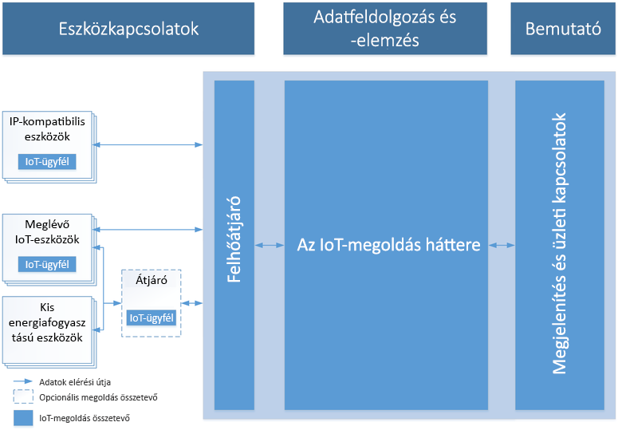

# Az Azure és az eszközök internetes hálózatának bemutatása

Az Azure IoT technológiák és megoldások három területét foglalja magában – a megoldásokat, a platformszolgáltatásokat és a peremhálózatot, amelyek mind azzal a céllal lettek kifejlesztve, hogy megkönnyítsék az IoT-alkalmazások teljes körű fejlesztését. Ez a cikk a felhőalapú IoT-megoldások gyakori jellemzőinek ismertetésével indul, majd áttekintést nyújt arról, hogy az Azure IoT milyen válaszokkal szolgál az IoT-projektek kihívásaira, és miért érdemes fontolóra venni az Azure IoT bevezetését.

## Az IoT-megoldásarchitektúra

Az IoT-megoldásokhoz biztonságos, kétirányú kommunikációra van szükség olyan eszközök között, amelyek száma akár a több milliót is elérheti, valamint egy olyan háttérrendszerre, amely például automatizált, prediktív elemzések elvégzésével nyújt betekintést az eszköz-felhő eseménystreambe. 

Az alábbi ábrán egy tipikus IoT-megoldásarchitektúra fő elemei láthatók. Az ábra nem tartalmaz olyan megvalósítási részleteket, mint a használt Azure-szolgáltatások vagy az eszközök operációs rendszerei. Ebben az architektúrában az IoT-eszközök begyűjtik az adatokat, majd továbbítják azokat egy felhőátjáróhoz. A felhőátjáró elérhetővé teszi az adatokat más háttérszolgáltatások számára a feldolgozáshoz. Ezek a háttérszolgáltatások a következőknek továbbíthatnak adatokat:

* Más üzletági alkalmazásoknak.
* Felhasználóknak, egy irányítópulton vagy más megjelenítő eszközön keresztül.

> [!NOTE]
> Az IoT-architektúra részletes ismertetéséhez tekintse át a következő dokumentumot: [Microsoft Azure IoT Reference Architecture](https://aka.ms/iotrefarchitecture) (Microsoft Azure IoT-referenciaarchitektúra).

### Eszközkapcsolatok

Az IoT-megoldásarchitektúrákban az eszközök általában telemetriát küldenek a felhőbe tárolás és feldolgozás céljából. Egy prediktív karbantartási forgatókönyvben például a megoldás háttérrendszere az érzékelők adatstreamének felhasználásával megállapíthatja, hogy egy adott szivattyú mikor igényel karbantartást. Az eszközök emellett a felhővégpontokból érkező üzenetek olvasásával fogadhatnak a felhőből az eszközre érkező üzeneteket, és válaszolhatnak is azokra. Ugyanebben a példában a megoldás háttérrendszere üzeneteket küldhet a szivattyútelep többi szivattyújának, hogy azok elkezdjék az áramlás átirányítását a karbantartás megkezdése előtt. Ez az eljárás biztosítja, hogy a karbantartó mérnök megérkezésekor azonnal munkához láthasson.

Az IoT-megoldások esetében gyakran az eszközök biztonságos és megbízható csatlakoztatása jelenti a legnagyobb kihívást. Ez azért van, mert az IoT-eszközök más jellemzőkkel rendelkeznek, mint a korábban megszokott ügyfelek, például a böngészők vagy a mobilalkalmazások. Pontosabban, az IoT-eszközök:

* Általában beágyazott, emberi beavatkozást nem igénylő rendszerek (a telefonokkal ellentétben).
* Távoli helyeken is üzembe helyezhetők, ahol a fizikai hozzáférés drága lenne.
* Előfordulhat, hogy csak a megoldás háttérrendszerén keresztül érhetők el. Az eszközzel más módon nem lehet kapcsolatba lépni.
* Áramellátásuk és feldolgozási erőforrásaik korlátozottak lehetnek.
* A hálózati kapcsolat időszakos, lassú vagy drága lehet.
* Saját fejlesztésű, egyedi vagy iparág-specifikus alkalmazás-protokollokra lehet szükség.
* Számos népszerű hardver- és szoftverplatform használatával létrehozhatók.

Az előző korlátozások mellett minden egyes IoT-megoldásnak méretezhetőnek, biztonságosnak és megbízhatónak kell lennie.

A kommunikációs protokolltól és a hálózati rendelkezésre állástól függően egy eszköz közvetlenül vagy egy köztes átjárón keresztül kommunikálhat a felhővel. Az IoT-architektúrák gyakran mindkét kommunikációs mintát használják.

### Adatfeldolgozás és -elemzés

A modern IoT-megoldásokban az adatfeldolgozás a felhőben vagy az eszközoldalon is történhet. Az eszközoldali feldolgozást *peremhálózati számítástechnikának* nevezik. Az adatfeldolgozás helye például a következő tényezőktől függ:

* Hálózati korlátozások. Ha az eszközök és a felhő közötti sávszélesség korlátozott, érdemes megnövelni a peremhálózati feldolgozás mennyiségét.
* Válaszidő. Ha egy eszközön közel valós időben kell műveleteket végezni, érdemes lehet magán az eszközön feldolgozni a választ. Például, ha vészhelyzet esetén le kell állítani egy robotkart.
* Szabályozási környezet. Bizonyos adatokat nem lehet elküldeni a felhőbe.

Az adatfeldolgozás általában a peremhálózaton és a felhőben is az alábbi képességek kombinációjából áll:

* Az eszközöktől érkező telemetriák fogadása nagy mennyiségben, valamint az adatfeldolgozás és -tárolás módjának meghatározása.
* A telemetria elemzése annak megállapításához, hogy az adatok valós idejűek-e vagy utólagosak.
* Parancsok küldése egy adott eszköznek a felhőből vagy egy átjáróeszközről.

Egy IoT-felhő háttérrendszerének emellett a következőket kell biztosítania:

* Eszközregisztrációs képességeket, amelyek a következőket teszik lehetővé:
    * Eszközök üzembe helyezése.
    * Annak szabályozása, hogy melyik eszköz csatlakozhat az infrastruktúrához.
* Eszközfelügyeletet az eszközök állapotának szabályozásához és a tevékenységeik megfigyeléséhez.

Egy prediktív karbantartási forgatókönyvben például a felhő háttérrendszere eltárolja a korábbi telemetriai adatokat. A megoldás ezeket az adatokat használja a lehetséges rendellenes viselkedés azonosításához az adott szivattyúknál, mielőtt az komoly problémát okozna. Az adatelemzés segítségével azonosítani tudja, hogy megelőző megoldásként vissza kell küldeni egy parancsot az eszköznek, hogy az hajtson végre egy korrekciós műveletet. A folyamat létrehoz egy automatizált visszajelzési hurkot az eszköz és a felhő között, amely jelentősen növeli a megoldás hatékonyságát.

### Megjelenítés és üzleti kapcsolatok

A megjelenítési és üzleti kapcsolati réteg lehetővé teszi a végfelhasználók számára, hogy kapcsolatba lépjenek az IoT-megoldással és az eszközökkel. Segítségével a felhasználók megtekinthetik és elemezhetik az eszközeikről összegyűjtött adatokat. Ezek irányítópultokon vagy BI-jelentések formájában is megtekinthetők, amelyek az előzmény- és a közel valós idejű adatokat egyaránt megjelenítik. A kezelő például ellenőrizheti egy adott szivattyútelep állapotát, és megtekintheti a rendszer által kiadott riasztásokat. Ez a réteg emellett lehetővé teszi az IoT-megoldás háttérrendszerének integrációját egy létező üzleti alkalmazással, hogy be lehessen vonni az üzleti vagy munkafolyamatokba. A prediktív karbantartási megoldás például integrálható egy ütemezési rendszerbe, amely kihív egy mérnököt a szivattyútelephez, ha megállapítja, hogy valamelyik szivattyú karbantartásra szorul.

## Milyen előnyöket kínál az Azure IoT?

Az Azure IoT csökkenti az IoT-projektek összetettségét, továbbá megoldásokat kínál a különféle kihívásokra, például a biztonság, az infrastruktúra-kompatibilitás vagy az IoT-megoldás méretezése terén. Ezt az alábbiak révén éri el:

### Rugalmas

Haladjon gyorsabban az IoT világa felé.

* Méretezés: Kezdje kicsiben, majd növekedjen tetszőleges méretre bárhol és mindenhol – eszközök milliói és több terabájt adat a világ legtöbb régiójában.

* Nyílt: Használja, amije van, vagy készüljön fel korszerűbb rendszerekkel a jövőre bármilyen eszköz, szoftver vagy szolgáltatás csatlakoztatásával.

* Hibrid: IoT-megoldását a peremhálózaton, a felhőben vagy a kettő között bárhol üzembe helyezheti, így igényeinek megfelelően építkezhet.

* Ütemezés: Gyorsabban végezheti az üzembe helyezést és gyorsabban juttathatja piacra a termékeit, megőrizve ezáltal versenyelőnyét a megoldásgyorsítók és az innováció tempója terén piacvezető IoT-szolgáltatóval.

### Átfogó

Biztosítsa vállalkozása lendületét.

* Teljes: A Microsoft az egyetlen IoT-megoldásszolgáltató, amely egy olyan teljes platformmal rendelkezik, amelynek szolgáltatásai a különféle eszközöktől a felhőn keresztül a big datáig, a fejlett adatelemzésig és a felügyelt szolgáltatásokig terjednek.

* Partner a sikerhez: Aknázza ki a világ legnagyobb partner-ökoszisztémája nyújtotta lehetőségeket, és keltse új életre üzleti és informatikai folyamatait a legkülönfélébb iparágakban és a világ bármely táján.

* Adatalapú: Az IoT az adatokról szól, ezért a legjobb IoT-megoldások egyesítik magukban az összes szükséges eszközt az adatok tárolásához, értelmezéséhez, átalakításához, elemzéséhez és a megfelelő felhasználóknak a megfelelő helyen és a megfelelő időben való megjelenítéséhez.

* Eszközközpontú: A Microsoft IoT segítségével bármit csatlakoztathat, a régi berendezésektől kezdve egészen a hitelesített hardvereszközök széles választékáig, sőt, akár saját eszközöket is készíthet a peremhálózati, mobil és beágyazott rendszerekben.

### Biztonságos

Megoldás az IoT legnagyobb kihívására – a biztonságra.

* Hatékonyság: A Microsoft IoT segítségével elképzeléseit a technológiával, a bevált gyakorlatokkal és a képességekkel összehangolva találhat megoldást az IoT legnehezebb kihívására – a biztonságra.

* Cselekvés: Védje meg IoT-adatait és kezelje a kockázatokat identitás- és hozzáférés-felügyeleti, a kockázatok elleni védelmi és információbiztonsági, valamint biztonságkezelési megoldásokkal.

* Nyugalom: Biztosítsa a bizalmas adatok védelmét a különböző eszközökön, szoftverekben, alkalmazásokban, felhőalapú szolgáltatásokban és a helyszíni környezetekben.

* Megfelelőség: A Microsoft mindig is piacvezető volt az olyan biztonsági követelmények kialakításában, amelyek az IoT-eszközökre, -adatokra és -szolgáltatásokra vonatkozó nemzetközi és iparági szabványok széles körének megfelelnek.

## További lépések

Fedezze fel a technológiák és megoldások alábbi területeit.

**Megoldások**

* [IoT-megoldásgyorsítók](/azure/iot-suite)
* [IoT-központ](/azure/iot-central)

**Platformszolgáltatások**

* [IoT Hub](/azure/iot-hub)
* [IoT Hub eszközregisztrációs szolgáltatás](/azure/iot-dps)
* [Azure Maps](/azure/azure-maps/)
* [Time Series Insights](/azure/time-series-insights)

**Edge**

* [IoT Edge – áttekintés](/azure/iot-edge)
* [Mi az az IoT Edge?](/azure/how-iot-edge-works)
