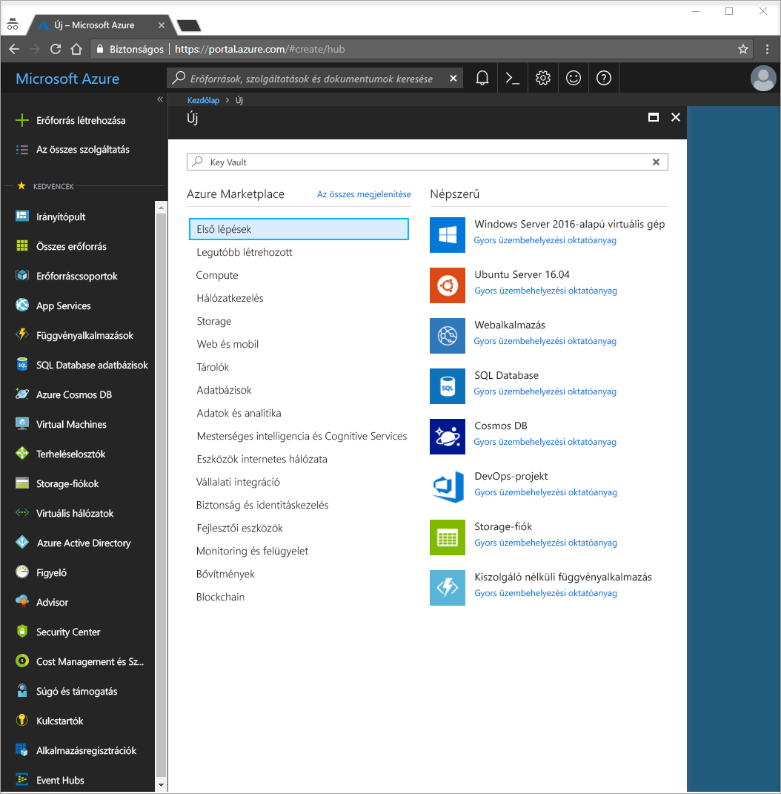
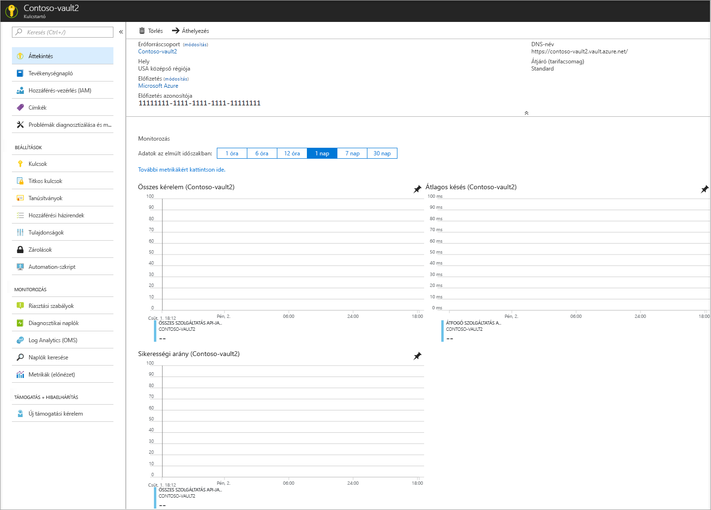
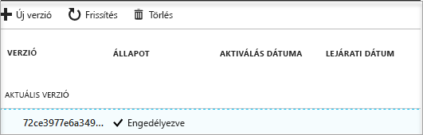

# Rövid útmutató: Kulcstartó létrehozása az Azure Portal használatával

Az Azure Key Vault egy felhőszolgáltatás, amely biztonságos titkoskulcs-tárolóként működik. Biztonságosan tárolhatja kulcsait, jelszavait, tanúsítványait és egyéb titkos adatait. A Key Vaulttal kapcsolatos további információt az [Áttekintés](key-vault-overview.md) szakaszban talál. Az Azure-kulcstartók létrehozhatók és kezelhetők az Azure Portal segítségével is. Ebben a rövid útmutatóban egy kulcstartót hoz létre. Miután végzett ezzel, titkos kulcsot fog tárolni.

Ha nem rendelkezik Azure-előfizetéssel, mindössze néhány perc alatt létrehozhat egy [ingyenes fiókot](https://azure.microsoft.com/free/?WT.mc_id=A261C142F) a virtuális gép létrehozásának megkezdése előtt.

## Jelentkezzen be az Azure-ba

Jelentkezzen be az Azure Portalra a http://portal.azure.com címen.

## Tároló létrehozása

1. Kattintson az Azure Portal bal felső sarkában található **Erőforrás létrehozása** gombra

    
2. A keresőmezőbe írja be a **Key Vault** kifejezést.
3. Az eredmények listájában válassza a **Key Vault** lehetőséget.
4. A Key Vault szakaszban kattintson a **Létrehozás** gombra.
5. A **Kulcstartó létrehozása** szakaszban adja meg a következő információkat:
    - **Név**: Ebben a rövid útmutatóban a **Contoso-vault2** nevet használjuk. A tesztelésnél egyedi nevet adjon meg.
    - **Előfizetés**: Válassza ki az útmutatóhoz használt előfizetést.
    - Az **Erőforráscsoport** területen válassza az **Új létrehozása** lehetőséget, és írja be az erőforráscsoport nevét.
    - A **Hely** legördülő menüből válassza ki a helyet.
    - Jelölje be a **Rögzítés az irányítópulton** jelölőnégyzetet.
    - A többi beállítást hagyja az alapértelmezett értéken.
6. A fenti adatok megadása után válassza a **Létrehozás** elemet.

Jegyezze fel az alábbi két tulajdonságot:

* **Tároló neve**: A példában ez a **Contoso-Vault2**. Ezt a nevet fogja majd más lépésekben is használni.
* **Tároló URI-ja**: A példában ez a https://contoso-vault2.vault.azure.net/. A tárolót a REST API-ján keresztül használó alkalmazásoknak ezt az URI-t kell használniuk.

Az Azure-fiókja jelenleg az egyetlen, amelyik jogosult arra, hogy műveleteket végezzen ezen az új tárolón.

## Titkos kulcs hozzáadása a Key Vaulthoz

Titkos kód a tárolóhoz való hozzáadásához csak néhány további lépést kell végrehajtania. Ebben az esetben egy alkalmazás által használható jelszót fogunk megadni. A jelszó neve **ExamplePassword** lesz, és a **Pa$$w0rd** értéket tároljuk benne.

1. A Key Vault tulajdonságok oldalán válassza a **Titkos kulcsok** lehetőséget.
2. Kattintson a **Létrehozás/Importálás** gombra.
3. A **Titkos kulcs létrehozása** képernyőn válassza az alábbiakat:
    - **Feltöltési beállítások**: Manuális.
    - **Név**: ExamplePassword.
    - **Érték**: Pa$$w0rd.
    - A többi értéket hagyja az alapértelmezett értéken. Kattintson a **Create** (Létrehozás) gombra.

Miután megérkezett az üzenet arról, hogy a titkos kulcs sikeresen létrejött, kattintson rá a listában. Ezután megjelenik néhány tulajdonság. Ha a jelenlegi verzióra kattint, láthatja az előző lépésben megadott értéket.

## Az erőforrások eltávolítása

Erre a rövid útmutatóra egyéb Key Vault-útmutatók és oktatóanyagok is épülnek. Ha azt tervezi, hogy az ezt követő rövid útmutatókkal és oktatóanyagokkal dolgozik tovább, ne törölje ezeket az erőforrásokat.
Ha már nincs rá szükség törölje az erőforráscsoportot. Ezzel törli a kulcstartót és a kapcsolódó erőforrásokat is. Az erőforráscsoport törlése a Portalon keresztül:

1. Írja be az erőforráscsoport nevét a Portal tetején található keresőmezőbe. Amikor az eredmények listájában megjelenik az ebben a rövid útmutatóban használt erőforráscsoport, jelölje ki.
2. Válassza az **Erőforráscsoport törlése** elemet.
3. Az **ÍRJA BE AZ ERŐFORRÁSCSOPORT NEVÉT:** mezőbe írja be az erőforráscsoport nevét, és válassza a **Törlés** lehetőséget.

## További lépések

Ebben a rövid útmutatóban létrehozott egy kulcstartót, és elhelyezett benne egy titkos kulcsot. Ha bővebb információra van szüksége a Key Vaultról és arról, hogyan használhatja az alkalmazásaival, lépjen tovább a Key Vaulttal használható webalkalmazásokat bemutató oktatóanyagra.

> [!div class="nextstepaction"]
> Ha meg szeretné tudni, hogyan olvashatja be a Key Vault titkos kulcsait egy felügyeltszolgáltatás-identitást használó webalkalmazással, lépjen tovább a következő oktatóanyagra: [Azure-webalkalmazások konfigurálása a Key Vault titkos kulcsainak olvasásához](tutorial-web-application-keyvault.md).
