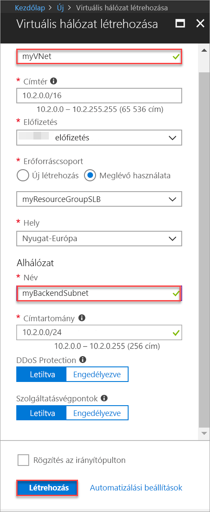
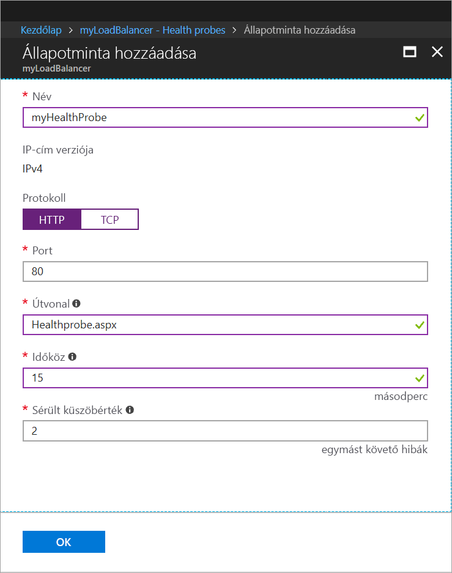
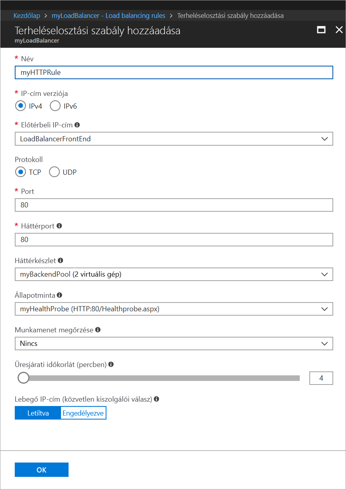
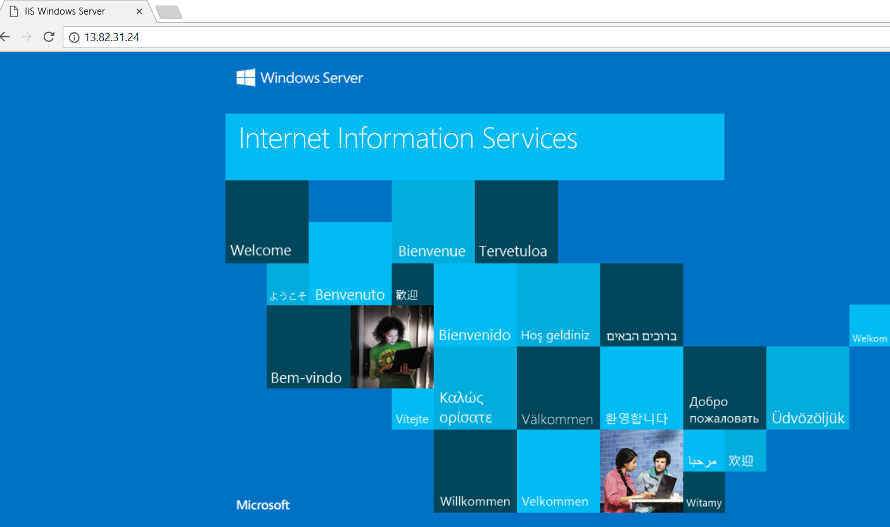

# Gyors útmutató: Standard Load Balancer létrehozása a virtuális gépek terhelésének elosztásához az Azure Portal használatával.

A terheléselosztás magasabb szintű rendelkezésre állást és méretezést biztosít, mivel a bejövő kérelmeket több virtuális gép között osztja szét. Az Azure Portal használatával létrehozhat egy terheléselosztót a virtuális gépek (VM-ek) terhelésének elosztása érdekében. Ez a rövid útmutató bemutatja, hogyan végezheti el a virtuális gépek terheléselosztását egy Standard Load Balancer használatával.

Ha nem rendelkezik Azure-előfizetéssel, mindössze néhány perc alatt létrehozhat egy [ingyenes fiókot](https://azure.microsoft.com/free/?WT.mc_id=A261C142F) a virtuális gép létrehozásának megkezdése előtt. 

## Bejelentkezés az Azure-ba

Jelentkezzen be az Azure Portalra a [http://portal.azure.com](http://portal.azure.com) webhelyen.

## Nyilvános Load Balancer létrehozása

Ebben a szakaszban egy nyilvános Load Balancert fog létrehozni, amely segít a virtuális gépek terhelésének elosztásában. A Standard Load Balancer csak a standard nyilvános IP-címeket támogatja. Amikor létrehoz egy Standard Load Balancert, létre kell hoznia egy új standard nyilvános IP-címet is, amely a Standard Load Balancer előtereként van konfigurálva (alapértelmezés szerint *LoadBalancerFrontend* néven). 

1. A képernyő bal felső részén kattintson az **Erőforrás létrehozása** > **Hálózatkezelés** > **Terheléselosztó** elemre.
2. A **Terheléselosztó létrehozása** lapon adja meg vagy válassza ki az alábbi adatokat, a többi beállítás esetében fogadja el az alapértelmezett értéket, majd válassza a **Létrehozás** elemet:

    | Beállítás                 | Érték                                              |
    | ---                     | ---                                                |
    | Name (Név)                   | *myLoadBalancer*                                   |
    | Típus          | Nyilvános                                        |
    | SKU           | Standard                          |
    | Nyilvános IP-cím | Válassza az **Új létrehozása** lehetőséget, és adja meg a *myPublicIP* nevet a szövegmezőben. A nyilvános IP-címnél a rendszer alapértelmezés szerint a standard termékváltozatot választja ki. A **Rendelkezésre állási zóna** kiválasztásánál válassza a **Zónaredundáns** lehetőséget. |
    | Előfizetés               | Válassza ki előfizetését.    |
    |Erőforráscsoport | Válassza az **Új létrehozása** lehetőséget, majd írja be a *myResourceGroupSLB* nevet.    |
    | Hely           | Válassza a **Nyugat-Európa** régiót.                          |
    

## Háttérkiszolgálók létrehozása

Eben a szakaszban egy virtuális hálózatot fog létrehozni, valamint két virtuális gépet a terheléselosztó háttérkészlete számára, majd telepíteni fogja az IIS-t a virtuális gépeken a terheléselosztó tesztelése érdekében.

### Virtuális hálózat létrehozása
1. A képernyő bal felső részén kattintson az **Új** > **Hálózatkezelés** > **Virtuális hálózat** elemre, és adja meg az alábbi értékeket:
    - A virtuális hálózat neve: *myVnet*.
    - A meglévő erőforráscsoport neve: *myResourceGroupLB*
    - Az alhálózat neve: *myBackendSubnet*.
2. A virtuális hálózat létrehozásához kattintson a **Létrehozás** gombra.

    

### Virtuális gépek létrehozása

1. A képernyő bal felső részén kattintson az **Új** > **Számítás** > **Windows Server 2016 Datacenter** elemre, és adja meg az alábbi értékeket a virtuális gép számára:
    - A virtuális gép neve: *myVM1*.        
    - *myResourceGroupSLB*: az **Erőforráscsoport** mezőben válassza a **Meglévő használata** lehetőséget, majd válassza ki a *myResourceGroupSLB* erőforráscsoportot.
2. Kattintson az **OK** gombra.
3. A virtuális gép méreténél válassza a **DS1_V2** lehetőséget, majd kattintson a **Kiválasztás** gombra.
4. Adja meg az alábbi értékeket a virtuális gép beállításainál:
    1. Győződjön meg arról, hogy virtuális hálózatként a *myVNet*, alhálózatként pedig a *myBackendSubnet* van kiválasztva.
    2. A **Nyilvános IP-cím létrehozása** panel **Nyilvános IP-cím** mezőjében válassza a **Standard** lehetőséget, majd kattintson az **OK** gombra.
    3. A **Hálózati biztonsági csoport** mezőben válassza a **Speciális** lehetőséget, majd tegye a következőket:
        1. Válassza a *Hálózati biztonsági csoport (tűzfal) lehetőséget, majd a **Hálózati biztonsági csoport kiválasztása** lapon az **Új létrehozása** lehetőséget. 
        2. A **Hálózati biztonsági csoport létrehozása** lapon a **Név** mezőben adja meg a *myNetworkSecurityGroup* nevet, majd kattintson az **OK** gombra.
5. A rendszerindítási diagnosztika letiltásához kattintson a **Letiltva** elemre.
6. Kattintson az **OK** gombra, majd az összefoglaló lapon ellenőrizze a beállításokat, és kattintson a **Létrehozás** gombra.
7. Az 1–6. lépésekkel hozzon létre egy második virtuális gépet *VM2* néven a *myAvailibilityset* rendelkezésre állási csoporttal, a *myVnet* virtuális hálózattal, a *myBackendSubnet* alhálózattal és a **myNetworkSecurityGroup* hálózati biztonsági csoporttal. 

### NSG-szabály létrehozása

Ebben a szakaszban egy NSG-szabályt fogunk létrehozni a HTTP-t használó bejövő kapcsolatok engedélyezéséhez.

1. Kattintson az **Összes erőforrás** elemre a bal oldali menüben, majd az erőforrások listájában kattintson a **myResourceGroupSLB** erőforráscsoportban található **myNetworkSecurityGroup** elemre.
2. A **Beállítások** területen kattintson a **Bejövő biztonsági szabályok** lehetőségre, majd a **Hozzáadás** gombra.
3. Adja meg az alábbi értékeket a *myHTTPRule* nevű bejövő biztonsági szabály számára a 80-as portot használó, bejövő HTTP-kapcsolatok engedélyezése érdekében:
    - **Forrás**: *Szolgáltatáscímke*.
    - **Forrás szolgáltatáscímkéje**: *Internet*
    - **Célporttartomány**: *80*
    - **Protokoll**: *TCP*
    - **Művelet**: *Engedélyezés*
    - **Prioritás**: *100*
    - Név: *myHTTPRule*
    - Leírás: *HTTP engedélyezése*
4. Kattintson az **OK** gombra.
 
### Az IIS telepítése

1. Kattintson az **Összes erőforrás** elemre a bal oldali menüben, majd az erőforrások listájában kattintson a *myResourceGroupLB* erőforráscsoportban található **myVM1** elemre.
2. Az **Áttekintés** oldalon a **Csatlakozás** gombra kattintva hozzon létre RDP-kapcsolatot a virtuális géppel.
3. Jelentkezzen be a virtuális gépbe az *azureuser* felhasználónévvel.
4. A kiszolgáló asztalán lépjen a **Windows felügyeleti eszközök**>**Kiszolgálókezelő** elemre.
5. A Kiszolgálókezelőben kattintson a **Szerepkörök és szolgáltatások hozzáadása** lehetőségre.
6. A **Szerepkörök és szolgáltatások hozzáadása varázslóban** használja az alábbi értékeket:
    - A **Telepítés típusának kiválasztása** lapon kattintson a **Szerepköralapú vagy szolgáltatásalapú telepítés** elemre.
    - A **Célkiszolgáló kijelölése** oldalon kattintson a **myVM1** lehetőségre
    - A **Kiszolgáló-szerepkör kiválasztása** lapon kattintson a **Webkiszolgáló (IIS)** lehetőségre
    - Kövesse az utasításokat és végezze el a varázsló további lépéseit 
7. Ismételje meg az 1–6. lépéseket a *myVM2* nevű virtuális gép esetében.

## Terheléselosztó erőforrásainak létrehozása

Ebben a szakaszban a terheléselosztó beállításait fogja konfigurálni egy háttércímkészlet és egy állapotminta számára, illetve egy terheléselosztási szabályt fog megadni.

### Hátércímkészlet létrehozása

Annak érdekében, hogy a forgalmat el lehessen osztani a virtuális gépek között, egy háttércímkészlet tartalmazza a terheléselosztóhoz csatlakoztatott virtuális hálózati adapterek IP-címét. Hozza létre a háttércímkészletet *myBackendPool* néven, amely magában foglalja a *VM1* és *VM2* virtuális gépeket.

1. Kattintson az **Összes erőforrás** elemre a bal oldali menüben, majd kattintson a **myLoadBalancer** lehetőségre az erőforráslistában.
2. A **Beállítások** területen kattintson a **Háttérkészletek** lehetőségre, majd a **Hozzáadás** gombra.
3. A **Háttérkészlet hozzáadása** oldalon tegye a következőket:
   - Adja a következő nevet a háttérkészletnek: *myBackendPool*.
   - A **Virtuális hálózat** mezőben válassza a *myVNet* lehetőséget.
   - Adja hozzá a *myVM1* és a *myVM2* virtuális gépeket a megfelelő IP-címekkel a **Virtuális gép** területen, majd kattintson a **Hozzáadás** gombra.
    - Kattintson az **OK** gombra.

3. Ellenőrizze, hogy a terheléselosztó háttérkészlet beállítása mindkét virtuális gépet megjeleníti-e (**VM1** és **VM2**).

### Állapotminta létrehozása

Ahhoz, hogy a terheléselosztó monitorozhassa az alkalmazás állapotát, állapotmintát kell használni. Az állapotminta dinamikusan hozzáadja a virtuális gépeket a terheléselosztó rotációjához vagy eltávolítja belőle azokat, az állapotellenőrzésekre adott válaszuk alapján. Hozzon létre egy *myHealthProbe* nevű állapotmintát a virtuális gépek állapotának felügyeletéhez.

1. Kattintson az **Összes erőforrás** elemre a bal oldali menüben, majd kattintson a **myLoadBalancer** lehetőségre az erőforráslistában.
2. A **Beállítások** területen kattintson az **Állapotminták** elemre, majd a **Hozzáadás** gombra.
3. Használja az alábbi értékeket az állapotminta létrehozásához:
    - Az állapotminta neve: *myHealthProbe*.
    - Protokoll típusa: **HTTP**.
    - Portszám: *80*.
    - *Healthprobe.aspx* - URI elérési úthoz. Cserélje le ezt az értéket bármely más URI vagy tartsa meg az alapértelmezett elérési útja értéket **"\\"** beolvasni az alapértelmezett URI-t.
    - A mintavételi kísérletek közötti **Időköz** másodpercben megadva: *15*.
    - A **Nem kifogástalan állapot küszöbértéke**, vagyis hány egymást követő meghibásodásnak kell történnie, hogy a rendszer sérültnek minősítsen egy virtuális gépet: *2*.
4. Kattintson az **OK** gombra.

   

### Terheléselosztási szabály létrehozása

A terheléselosztási szabállyal azt lehet megadni, hogy a rendszer hogyan ossza el a forgalmat a virtuális gépek között. Meg kell határoznia az előtérbeli IP-konfigurációt a bejövő forgalomhoz és a háttérbeli IP-készletet a forgalom fogadásához, valamint a szükséges forrás- és célportot. Hozzon létre egy *myLoadBalancerRuleWeb* nevű terheléselosztási szabályt, amely felügyeli a *FrontendLoadBalancer* előtér 80-as portját, és terhelés szempontjából elosztott forgalmat továbbít a szintén a 80-as portot használó, *myBackEndPool* nevű háttércímkészlethez. 

1. Kattintson az **Összes erőforrás** elemre a bal oldali menüben, majd kattintson a **myLoadBalancer** lehetőségre az erőforráslistában.
2. A **Beállítások** területen kattintson a **Terheléselosztási szabályok** elemre, majd a **Hozzáadás** gombra.
3. Konfigurálja a terheléselosztási szabályt az alábbi értékekkel:
    - A terheléselosztási szabály neve: *myHTTPRule*.
    - Protokoll típusa: **TCP**.
    - Portszám: *80*.
    - Háttérport: *80*.
    - A háttérkészlet neve: *myBackendPool*.
    - Az állapotminta neve: *myHealthProbe*.
4. Kattintson az **OK** gombra.
    
    

## A terheléselosztó tesztelése
1. Keresse meg a Load Balancer nyilvános IP-címét az **Áttekintés** képernyőn. Kattintson a **Minden erőforrás**, majd a **myPublicIP** elemre.

2. Másolja a nyilvános IP-címet, majd illessze be a böngésző címsorába. Az IIS-webkiszolgáló alapértelmezett oldala jelenik meg a böngészőben.

      

## Az erőforrások eltávolítása

Ha már nincs rá szükség, törölje az erőforráscsoportot, a terheléselosztót és az összes kapcsolódó erőforrást. Ehhez válassza ki a terheléselosztót tartalmazó erőforráscsoportot, és kattintson a **Törlés** elemre.

## További lépések

Ebben a rövid útmutatóban létrehozott egy standard terheléselosztót, virtuális gépeket csatolt hozzá, konfigurálta a terheléselosztó forgalmi szabályát és az állapot-mintavételt, majd tesztelte a terheléselosztót. Ha bővebb információra van szüksége az Azure Load Balancerrel kapcsolatban, folytassa az Azure Load Balancerről szóló oktatóanyagokkal.

> [!div class="nextstepaction"]
> [Azure Load Balancer-oktatóanyagok](tutorial-load-balancer-standard-public-zone-redundant-portal.md)
