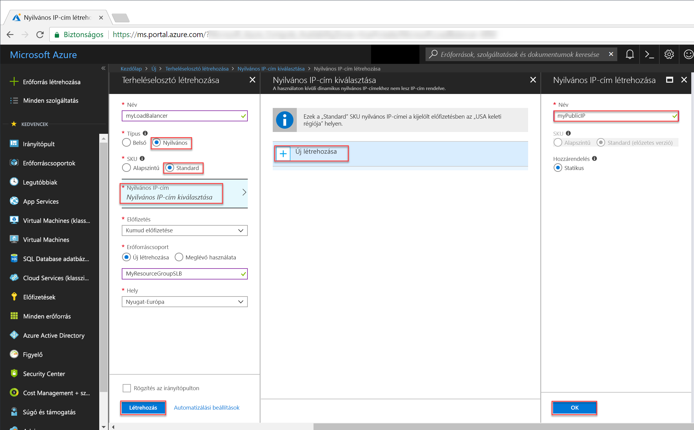

# <a name="tutorial-configure-port-fowarding-in-load-balancer-using-the-azure-portal"></a>Oktatóanyag: Porttovábbítás konfigurálása Load Balancerben az Azure Portal használatával

Az Azure Load Balancerrel való porttovábbítás révén távolról csatlakozhat virtuális gépekhez az Azure virtuális hálózatban a Load Balancer nyilvános IP-címét használva a portszámon. Ebből az oktatóanyagból megtudhatja, hogyan konfigurálható a porttovábbítás az Azure Load Balancerben, és megtanulhatja az alábbi feladatok elvégzését:


> [!div class="checklist"]
> * Azure-terheléselosztó létrehozása
> * Terheléselosztó állapotmintájának létrehozása
> * Terheléselosztó forgalmára vonatkozó szabályok létrehozása
> * Virtuális gépek létrehozása és IIS-kiszolgáló telepítése
> * Virtuális gépek terheléselosztóhoz csatolása
> * Terheléselosztó bejövő NAT-szabályainak létrehozása
> * Porttovábbítás megtekintése működés közben


Ha nem rendelkezik Azure-előfizetéssel, mindössze néhány perc alatt létrehozhat egy [ingyenes fiókot](https://azure.microsoft.com/free/?WT.mc_id=A261C142F) a virtuális gép létrehozásának megkezdése előtt. 

## <a name="log-in-to-azure"></a>Jelentkezzen be az Azure-ba

Jelentkezzen be az Azure Portalra a [http://portal.azure.com](http://portal.azure.com) címen.

## <a name="create-a-standard-load-balancer"></a>Standard Load Balancer létrehozása

Ebben a szakaszban egy nyilvános Load Balancert fog létrehozni, amely segít a virtuális gépek terhelésének elosztásában. A Standard Load Balancer csak a standard nyilvános IP-címeket támogatja. Amikor létrehoz egy Standard Load Balancert, létre kell hoznia egy új standard nyilvános IP-címet is, amely a Standard Load Balancer előtereként van konfigurálva (alapértelmezés szerint *LoadBalancerFrontend* néven). 

1. A képernyő bal felső részén kattintson az **Erőforrás létrehozása** > **Hálózatkezelés** > **Terheléselosztó** elemre.
2. A **Terheléselosztó létrehozása** lapon adja meg az alábbi értékeket a terheléselosztó számára:
    - A terheléselosztó neve: *myLoadBalancer*.
    - A terheléselosztó SKU-verziója: **Standard**.
    - A terheléselosztó típusa: **Nyilvános**.
    - A létrehozandó **új** nyilvános IP-cím: *myPublicIP*.
    - A létrehozáshoz kiválasztott **Új** erőforráscsoport neve: *myResourceGroupSLB*.
    - A hely: **westeurope**.
3. A terheléselosztó létrehozásához kattintson a **Létrehozás** elemre.


   
## <a name="create-load-balancer-resources"></a>Terheléselosztó erőforrásainak létrehozása

Ebben a szakaszban a terheléselosztó beállításait fogja konfigurálni egy háttércímkészlet és egy állapotminta számára, illetve terheléselosztási szabályokat fog megadni.

### <a name="create-a-backend-address-pool"></a>Háttércímkészlet létrehozása

Annak érdekében, hogy a forgalmat el lehessen osztani a virtuális gépek között, egy háttércímkészlet tartalmazza a terheléselosztóhoz csatlakoztatott virtuális hálózati adapterek IP-címét. Hozza létre a háttércímkészletet *myBackendPool* néven, amely magában foglalja a *VM1* és *VM2* virtuális gépeket.

1. Kattintson az **Összes erőforrás** elemre a bal oldali menüben, majd kattintson a **myLoadBalancer** lehetőségre az erőforráslistában.
2. A **Beállítások** területen kattintson a **Háttérkészletek** lehetőségre, majd a **Hozzáadás** gombra.
3. A **Háttérkészlet hozzáadása** oldalon a háttérkészletnek adja a *myBackEndPool* nevet, majd kattintson az **OK** gombra.

### <a name="create-a-health-probe"></a>Állapotminta létrehozása

Ahhoz, hogy a terheléselosztó monitorozhassa az alkalmazás állapotát, állapotmintát kell használni. Az állapotminta dinamikusan hozzáadja a virtuális gépeket a terheléselosztó rotációjához vagy eltávolítja belőle azokat, az állapotellenőrzésekre adott válaszuk alapján. Hozzon létre egy *myHealthProbe* nevű állapotmintát a virtuális gépek állapotának felügyeletéhez.

1. Kattintson az **Összes erőforrás** elemre a bal oldali menüben, majd kattintson a **myLoadBalancer** lehetőségre az erőforráslistában.
2. A **Beállítások** területen kattintson az **Állapotminták** elemre, majd a **Hozzáadás** gombra.
3. Használja az alábbi értékeket az állapotminta létrehozásához:
    - Az állapotminta neve: *myHealthProbe*.
    - Protokoll típusa: **HTTP**.
    - Portszám: *80*.
    - A mintavételi kísérletek közötti **Időköz** másodpercben megadva: *15*.
    - A **Nem kifogástalan állapot küszöbértéke**, vagyis hány egymást követő meghibásodásnak kell történnie, hogy a rendszer sérültnek minősítsen egy virtuális gépet: *2*.
4. Kattintson az **OK** gombra.

   

### <a name="create-a-load-balancer-rule"></a>Terheléselosztási szabály létrehozása

A terheléselosztási szabállyal azt lehet megadni, hogy a rendszer hogyan ossza el a forgalmat a virtuális gépek között. Meg kell határoznia az előtérbeli IP-konfigurációt a bejövő forgalomhoz és a háttérbeli IP-készletet a forgalom fogadásához, valamint a szükséges forrás- és célportot. Hozzon létre egy *myLoadBalancerRuleWeb* nevű terheléselosztási szabályt, amely felügyeli a *FrontendLoadBalancer* előtér 80-as portját, és terhelés szempontjából elosztott forgalmat továbbít a szintén a 80-as portot használó, *myBackEndPool* nevű háttércímkészlethez. 

1. Kattintson az **Összes erőforrás** elemre a bal oldali menüben, majd kattintson a **myLoadBalancer** lehetőségre az erőforráslistában.
2. A **Beállítások** területen kattintson a **Terheléselosztási szabályok** elemre, majd a **Hozzáadás** gombra.
3. Konfigurálja a terheléselosztási szabályt az alábbi értékekkel:
    - A terheléselosztási szabály neve: *myHTTPRule*.
    - Protokoll típusa: **TCP**.
    - Portszám: *80*.
    - Háttérport: *80*.
    - A háttérkészlet neve: *myBackendPool*.
    - Az állapotminta neve: *myHealthProbe*.
4. Kattintson az **OK** gombra.
    
## <a name="create-backend-servers"></a>Háttérkiszolgálók létrehozása

Eben a szakaszban egy virtuális hálózatot fog létrehozni, valamint két virtuális gépet a terheléselosztó háttérkészlete számára, majd telepíteni fogja az IIS-t a virtuális gépeken a porttovábbítás terheléselosztóval való tesztelése érdekében.

### <a name="create-a-virtual-network"></a>Virtuális hálózat létrehozása
1. A képernyő bal felső részén kattintson az **Új** > **Hálózatkezelés** > **Virtuális hálózat** elemre, és adja meg az alábbi értékeket:
    - A virtuális hálózat neve: *myVnet*.
    - A meglévő erőforráscsoport neve: *myResourceGroupLB*
    - Az alhálózat neve: *myBackendSubnet*.
2. A virtuális hálózat létrehozásához kattintson a **Létrehozás** gombra.

    

### <a name="create-virtual-machines"></a>Virtuális gépek létrehozása

1. A képernyő bal felső részén kattintson az **Új** > **Számítás** > **Windows Server 2016 Datacenter** elemre, és adja meg az alábbi értékeket a virtuális gép számára:
    - A virtuális gép neve: *myVM1*.        
    - A rendszergazda felhasználóneve: *azureuser*.    
    - *myResourceGroupSLB*: az **Erőforráscsoport** mezőben válassza a **Meglévő használata** lehetőséget, majd válassza ki a *myResourceGroupSLB* erőforráscsoportot.
2. Kattintson az **OK** gombra.
3. A virtuális gép méreténél válassza a **DS1_V2** lehetőséget, majd kattintson a **Kiválasztás** gombra.
4. Adja meg az alábbi értékeket a virtuális gép beállításainál:
    -  Győződjön meg róla, hogy a következő virtuális hálózat van kiválasztva: *myVNet*.
    - Győződjön meg róla, hogy a következő alhálózat van kiválasztva: *myBackendSubnet*.
    - A kötelezően létrehozandó új hálózati biztonsági csoport (tűzfal) neve: *myNetworkSecurityGroup*.
5. A rendszerindítási diagnosztika letiltásához kattintson a **Letiltva** elemre.
6. Kattintson az **OK** gombra, majd az összefoglaló lapon ellenőrizze a beállításokat, és kattintson a **Létrehozás** gombra.
7. Az 1–6. lépések használatával hozzon létre egy másik virtuális gépet *VM2* néven a *myVnet* virtuális hálózattal, a *myBackendSubnet* alhálózattal és a *myNetworkSecurityGroup* hálózati biztonsági csoporttal. 

### <a name="create-nsg-rules"></a>NSG-szabályok létrehozása

Ebben a szakaszban NSG-szabályokat fog létrehozni a HTTP-t és RDP-t használó bejövő kapcsolatok engedélyezése érdekében.

1. Kattintson az **Összes erőforrás** elemre a bal oldali menüben, majd az erőforrások listájában kattintson a **myResourceGroupSLB** erőforráscsoportban található **myNetworkSecurityGroup** elemre.
2. A **Beállítások** területen kattintson a **Bejövő biztonsági szabályok** lehetőségre, majd a **Hozzáadás** gombra.
3. Adja meg az alábbi értékeket a *myHTTPRule* nevű bejövő biztonsági szabály számára a 80-as portot használó, bejövő HTTP-kapcsolatok engedélyezése érdekében:
    - **Forrás**: *Szolgáltatáscímke*.
    - **Forrás szolgáltatáscímkéje**: *Internet*
    - **Célporttartomány**: *80*
    - **Protokoll**: *TCP*
    - **Művelet**: *Engedélyezés*
    - **Prioritás**: *100*
    - Név: *myHTTPRule*
    - Leírás: *HTTP engedélyezése*
4. Kattintson az **OK** gombra.
 
 
5. Ismételje meg a 2–4. lépéseket egy másik, *myRDPRule* nevű szabály létrehozásához, amely engedélyezi a 3389-es portot használó, bejövő RDP-kapcsolatokat. Ehhez adja meg az alábbi értékeket:
    - **Forrás**: *Szolgáltatáscímke*.
    - **Forrás szolgáltatáscímkéje**: *Internet*
    - **Célporttartomány**: *3389*
    - **Protokoll**: *TCP*
    - **Művelet**: *Engedélyezés*
    - **Prioritás**: *200*
    - Név: *myRDPRule*
    - Leírás: *RDP engedélyezése*

### <a name="install-iis-on-vms"></a>Az IIS telepítése virtuális gépekre

1. Kattintson az **Összes erőforrás** elemre a bal oldali menüben, majd az erőforrások listájában kattintson a *myResourceGroupSLB* erőforráscsoportban található **myVM1** elemre.
2. Az **Áttekintés** oldalon a **Csatlakozás** gombra kattintva hozzon létre RDP-kapcsolatot a virtuális géppel.
3. Jelentkezzen be a virtuális gépbe az *azureuser* felhasználónévvel.
4. A kiszolgáló asztalán lépjen a **Windows felügyeleti eszközök**>**Windows PowerShell** elemre.
5. A PowerShell-ablakban futtassa az alábbi parancsokat az IIS-kiszolgáló telepítéséhez, távolítsa el az alapértelmezett iisstart.htm fájlt, majd adjon hozzá egy új iisstart.htm fájt, amely megjeleníti a virtuális gép nevét:

   ```azurepowershell-interactive
    
    # install IIS server role
    Install-WindowsFeature -name Web-Server -IncludeManagementTools
    
    # remove default htm file
     remove-item  C:\inetpub\wwwroot\iisstart.htm
    
    # Add a new htm file that displays server name
     Add-Content -Path "C:\inetpub\wwwroot\iisstart.htm" -Value $("Hello World from" + $env:computername)
   ```
6. Szüntesse meg a távoli asztali munkamenetet a *myVM1*-gyel.
7. Az 1–6. lépés megismétlésével telepítse az IIS-t és a frissített iisstart.htm fájlt a *myVM2* gépen.

## <a name="add-vms-to-the-backend-address-pool"></a>Virtuális gépek hozzáadása a háttércímkészlethez

Annak érdekében, hogy a forgalmat el lehessen osztani a virtuális gépek között, adja hozzá a korábban létrehozott *VM1* és *VM2* virtuális gépet a *myBackendPool* háttércímkészlethez. A háttérkészlet tartalmazza a terheléselosztóhoz csatlakoztatott virtuális hálózati adapterek IP-címét.

1. Kattintson az **Összes erőforrás** elemre a bal oldali menüben, majd kattintson a **myLoadBalancer** lehetőségre az erőforráslistában.
2. A **Beállítások** területen kattintson a **Háttérkészletek** lehetőségre, majd a háttérkészlet listájában kattintson a **myBackendPool** elemre.
3. A **myBackendPool** oldalon tegye a következőt:
    - Kattintson a **Célhálózati IP-konfiguráció hozzáadása** elemre az összes létrehozott virtuális gép (*myVM1* és *myVM2*) hozzáadásához a háttérkészlethez.
    - Kattintson az **OK** gombra.
4. Ellenőrizze, hogy a terheléselosztó háttérkészlet-beállítása minden virtuális gépet megjeleníti-e (**VM1** és **VM2**).

## <a name="create-inbound-nat-rules"></a>Bejövő NAT-szabályok létrehozása
A Load Balancerrel létrehozhat egy bejövő NAT-szabályt egy előtérbeli IP-cím adott portjáról érkező forgalomnak egy, a virtuális hálózaton belüli háttérpéldány egy adott portjára való porttovábbításához.

Hozzon létre egy bejövő NAT-szabályt a terheléselosztó előtérbeli portjairól érkező forgalomnak a háttér virtuális gép 3389-es portjára való porttovábbításához.

1. Kattintson az **Összes erőforrás** elemre a bal oldali menüben, majd kattintson a **myLoadBalancer** lehetőségre az erőforráslistában.
2. A **Beállítások** területen kattintson a **Bejövő NAT-szabályok** elemre, majd a háttérkészlet listáján kattintson a **myBackendPool** elemre.
3. A **Bejövő NAT-szabály hozzáadása** oldalon az alábbi értékeket adja meg:
    - A NAT-szabálynak adja a *myNATRuleRDPVM1* nevet.
    - A porthoz adja meg a *4221* értéket.
    - A **Célként használandó virtuális gép** elemnél válassza a *myVM1* lehetőséget a legördülő menüből.
    - A **Porthozzárendelés** elemnél kattintson az egyéni lehetőségre, majd a **Célport** mezőbe írja be a **3389** értéket.
    - Kattintson az **OK** gombra.
4. A 2. és 3. lépést megismételve hozzon létre *myNATRuleRDPVM2* nevű bejövő NAT-szabályt a *myVM2* virtuális géphez a *4222* számú előtérbeli port használatával.

## <a name="test-the-load-balancer"></a>A terheléselosztó tesztelése
1. Keresse meg a Load Balancer nyilvános IP-címét az **Áttekintés** képernyőn. Kattintson a **Minden erőforrás**, majd a **myPublicIP** elemre.

2. Másolja a nyilvános IP-címet, majd illessze be a böngésző címsorába. Az IIS-webkiszolgáló alapértelmezett oldala jelenik meg a böngészőben.

      

Annak megtekintéséhez, hogyan osztja el a terheléselosztó az alkalmazást futtató három virtuális gép között a forgalmat, kényszerítheti a webböngésző frissítését.

## <a name="test-port-forwarding"></a>A porttovábbítás tesztelése
A porttovábbítás révén létrehozhat egy távoli asztali kapcsolatot a háttércímkészletben lévő virtuális gépekkel a terheléselosztó IP-címének és az előző lépésben meghatározott előtérbeli portértéknek a használatával.

1. Keresse meg a Load Balancer nyilvános IP-címét az **Áttekintés** képernyőn. Kattintson a **Minden erőforrás**, majd a **myPublicIP** elemre.
2. Az alábbi parancs használatával hozzon létre egy távoli asztali munkamenetet a *myVM2* virtuális géppel a helyi számítógépéről. Cserélje ki a `<publicIpAddress>` kifejezést az előző lépésben kapott nyilvános IP-címre.

    ```
    mstsc /v:<publicIpAddress>:4222
    ```
  
3. Nyissa meg a letöltött RDP-fájlt. Ha a rendszer kéri, válassza a **Csatlakozás** lehetőséget.

4. Adja meg a virtuális gép létrehozásakor megadott felhasználónevet és jelszót (előfordulhat, hogy a virtuális gép létrehozásakor beírt hitelesítő adatok megadásához ki kell választania a **További lehetőségek**, majd a **Másik fiók használata** elemet), majd válassza az **OK** gombot. A bejelentkezés során egy figyelmeztetés jelenhet meg a tanúsítvánnyal kapcsolatban. Válassza az **Igen** lehetőséget a csatlakozás folytatásához.
 
   Az RDP-csatlakozás sikeres, a *myNATRuleRDPVM2* bejövő NAT-szabály szerint a terheléselosztó **4222** számú előtérbeli portjáról érkező forgalmat a rendszer a konfigurálásnak megfelelően átirányítja a *myVM2* virtuális gép 3389-es portjára.

## <a name="clean-up-resources"></a>Az erőforrások eltávolítása

Ha már nincs rá szükség, törölje az erőforráscsoportot, a terheléselosztót és az összes kapcsolódó erőforrást. Ehhez válassza ki a terheléselosztót tartalmazó erőforráscsoportot, és kattintson a **Törlés** elemre.

## <a name="next-steps"></a>További lépések

Ebben az oktatóanyagban létrehozott egy standard terheléselosztót, virtuális gépeket csatolt hozzá, konfigurálta a terheléselosztó forgalmi szabályát és az állapot-mintavételt, majd tesztelte a terheléselosztót. Emellett eltávolított egy virtuális gépet az elosztott terhelésű készletből, és hozzáadta a virtuális gépet a háttércímkészlethez. Ha bővebb információra van szüksége az Azure Load Balancerrel kapcsolatban, folytassa az Azure Load Balancerről szóló oktatóanyagokkal.

> [!div class="nextstepaction"]
> [Azure Load Balancer-oktatóanyagok](tutorial-load-balancer-standard-public-zone-redundant-portal.md)
