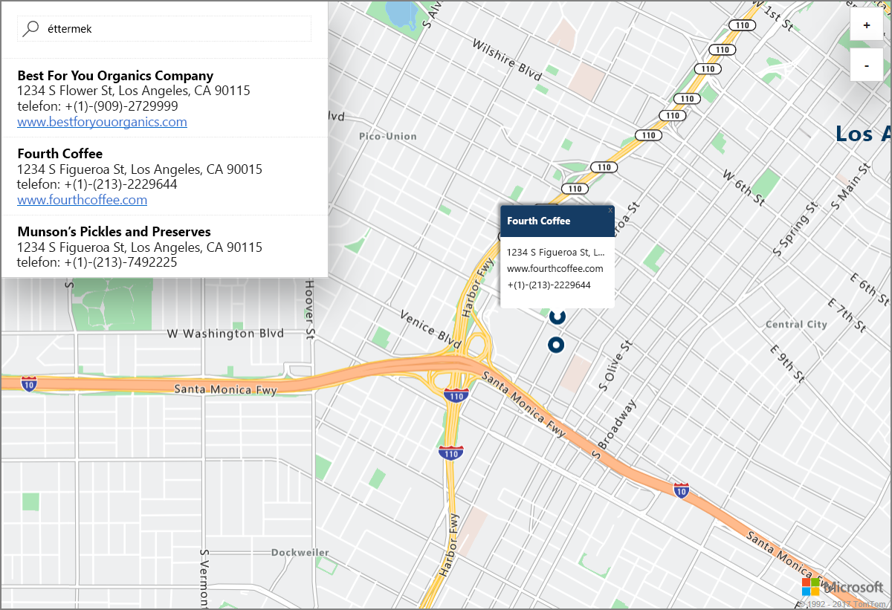

# Bemutató interaktív térképes keresés indítása az Azure Location Based Services (előzetes verzió) használatával

Ez a cikk bemutatja az Azure Location Based Services (LBS) képességeit egy interaktív keresésen keresztül az Azure Maps szolgáltatásban. Azt is ismerteti, hogyan hozhat létre saját LBS-fiókot, szerezheti be a fiók kulcsát, és használhatja azt a bemutató webalkalmazásban. 

Ha nem rendelkezik Azure-előfizetéssel, mindössze néhány perc alatt létrehozhat egy [ingyenes fiókot](https://azure.microsoft.com/free/?WT.mc_id=A261C142F) a virtuális gép létrehozásának megkezdése előtt.

## Bejelentkezés az Azure Portalra

Jelentkezzen be az [Azure portálra](https://portal.azure.com/).

## Location Based Services-fiók létrehozása és fiókkulcs lekérése

1. Kattintson az [Azure Portal](https://portal.azure.com) bal felső sarkában az **Erőforrás létrehozása** gombra.
2. A *Keresés a piactéren* mezőbe írja be: **location based services**.
3. Az *Eredmények* közül válassza az **Azure Location Based Services (előzetes verzió)** elemet. Kattintson a térkép alatt megjelenő **Létrehozás** gombra. 
4. A **Location Based Services-fiók létrehozása** lapon adja meg az új fiók *nevét*, válassza ki a használni kívánt *előfizetést*, és adja meg egy új vagy egy meglévő *erőforráscsoport* nevét. Válassza ki az erőforráscsoport helyét, fogadja el az *Előzetes verzió feltételeit*, majd kattintson a **Létrehozás** gombra.

    

5. Miután sikeresen létrehozta a fiókot, nyissa meg, és lépjen a fiók **BEÁLLÍTÁSAIHOZ**. Kattintson a **Kulcsok** elemre az Azure Location Based Services-fiók elsődleges és másodlagos kulcsainak lekéréséhez. Másolja az **Elsődleges kulcs** értékét a vágólapra, mert a következő szakaszban használnia kell majd. 

## Az Azure Maps bemutató alkalmazás letöltése

1. Töltse le vagy másolja ki az [interactiveSearch.html](https://github.com/Azure-Samples/location-based-services-samples/blob/master/src/interactiveSearch.html) fájl tartalmát.
2. Mentse a fájl tartalmát helyileg **AzureMapDemo.html** néven, és nyissa meg egy szövegszerkesztőben.
3. Keresse meg benne az `<insert-key>` karakterláncot, és cserélje le az előző szakaszban kimásolt **Elsődleges kulcs** értékére. 

## Az Azure Maps bemutató alkalmazás indítása

1. Nyissa meg az **AzureMapDemo.html** fájlt egy tetszőleges böngészőben.
2. Vegye szemügyre a megjelenő térképen Los Angeles városát. A várost az *AzureMapDemo.html* fájlban a **center** nevű JavaScript-változóhoz megadott `[longitude, latitude]` pár értéke határozza meg. Ezeket a koordinátákat megváltoztathatja bármilyen más tetszőleges városéra. Például New York City koordinátái: *[-74,0060, 40,7128]*.
3. A bemutató webalkalmazás bal felső sarkában a keresőmezőben adjon meg bármilyen helytípust vagy címet, amelyet ki szeretne keresni. 
4. Húzza az egérkurzort a keresőmező alatt megjelenő listában egy cím vagy hely fölé, és figyelje meg, hogy a térképen az adott helyhez tartozó jelölő a helyre vonatkozó információkat jelenít meg. Például ha elindítja a webalkalmazást és rákeres a *restaurants* (éttermek) kifejezésre, annak a következő lesz az eredménye. Vegye figyelembe, hogy a magánvállalkozások adatainak védelme érdekében az itt látható nevek és címek nem felelnek meg a valóságnak. 

    

## Az erőforrások eltávolítása

Az oktatóanyagok részletesen leírják, hogyan használhatja és konfigurálhatja a fiókjával az Azure Location Based Services beállításait. Ha azt tervezi, hogy az oktatóanyagokkal dolgozik tovább, akkor ne törölje az ebben a rövid útmutatóban létrehozott erőforrásokat. Ha nem folytatja a munkát, akkor a következő lépésekkel törölheti a rövid útmutatóhoz létrehozott összes erőforrást.

1. Zárja be a böngészőt, amelyben az **AzureMapDemo.html** webalkalmazást megnyitotta.
2. Az Azure Portal bal oldali menüjében kattintson az **Összes erőforrás** lehetőségre, majd válassza ki a saját LBS-fiókját. Az **Összes erőforrás** panel felső részén kattintson a **Törlés** elemre.

## További lépések

Ebben a rövid útmutatóban létrehozta a saját Azure LBS-fiókját, melynek használatával elindított egy bemutató alkalmazást. Ha szeretné megtudni, hogyan hozhatja létre a saját alkalmazását az Azure Location Based Services API-k használatával, lépjen tovább a következő oktatóanyagra.

> [!div class="nextstepaction"]
> [Oktatóanyag a felhasználói Azure-térképekhez és keresésekhez](./tutorial-search-location.md)
