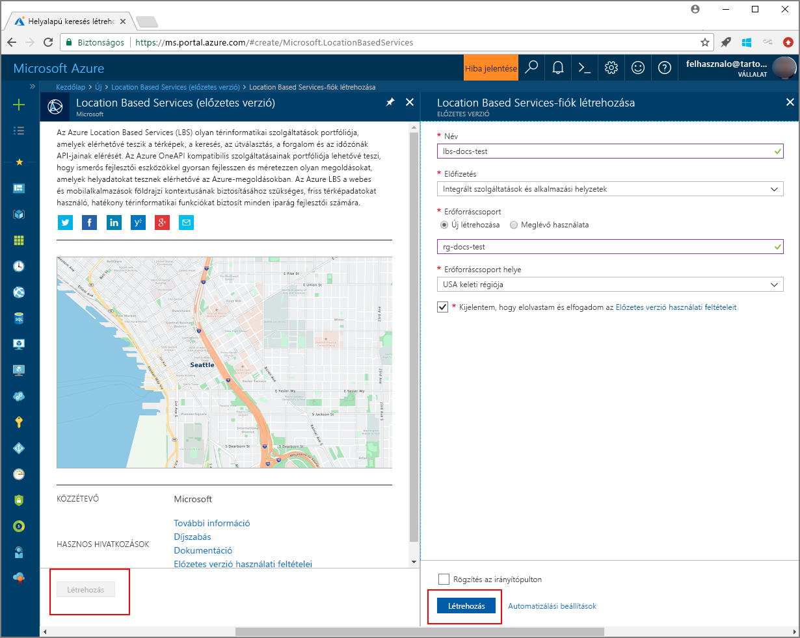

# <a name="search-nearby-point-of-interest-using-azure-location-based-services"></a>Pont használatával, Azure-alapú helyszolgáltatás közelben keresése

Ez az oktatóanyag bemutatja, hogyan az Azure-alapú helyszolgáltatás fiókot, és a megadott API-k segítségével keressen rá az érdeklődési pont. Eben az oktatóanyagban az alábbiakkal fog megismerkedni:

> [!div class="checklist"]
> * Az Azure hely alapú Services-fiók létrehozása
> * A fiók előfizetés kulcs lekérése
> * Hozzon létre a térkép vezérlőelem API-jával új weblap
> * Keresési szolgáltatását használja az egyik fontos pont közelben található

Ha nem rendelkezik Azure-előfizetéssel, mindössze néhány perc alatt létrehozhat egy [ingyenes fiókot](https://azure.microsoft.com/free/) a virtuális gép létrehozásának megkezdése előtt.

# <a name="log-in-to-the-azure-portal"></a>Jelentkezzen be az Azure portálra.
Jelentkezzen be az [Azure portálra](https://portal.azure.com).

<a id="createaccount"></a>

## <a name="create-an-account-with-azure-location-based-services"></a>Az Azure hely alapú Services-fiók létrehozása

Kövesse az alábbi lépéseket egy új helyre alapú Services-fiók létrehozásához.

1. A bal felső sarkában található a [Azure-portálon](https://portal.azure.com), kattintson a **hozzon létre egy erőforrást**.
2. Az a *keresése a piactéren* mezőbe írja be **hely alapú szolgáltatások**.
3. Az a *eredmények*, kattintson a **hely alapú szolgáltatások (előzetes verzió)**. Kattintson a **létrehozása** a térkép alatt megjelenő gombra. 
4. Az a **hely alapú szolgáltatások fiók létrehozása** lapján adja meg a következő értékeket:
    - A *neve* az új fiók. 
    - A *előfizetés* ehhez a fiókhoz használni kívánt.
    - A *erőforráscsoport* neve ehhez a fiókhoz. Előfordulhat, hogy *hozzon létre új* vagy *meglévő* erőforráscsoportot.
    - Válassza ki a *erőforráscsoport helye*.
    - Olvassa el a *Preview feltételek* és bejelöli a jelölőnégyzetet, fogadja el a feltételeket. 
    - Végül kattintson a **létrehozása** gombra.
   
    


<a id="getkey"></a>

## <a name="get-the-subscription-key-for-your-account"></a>A fiók előfizetés kulcs lekérése

A hely alapú Services-fiók sikeres létrehozását követően a csatolható a térkép keresési API-k a lépések végrehajtásával:

1. Nyissa meg a hely alapú Services-fiókját a portálon.
2. Keresse meg a fiók **beállítások**, majd válassza ki **kulcsok**.
3. Másolás a **elsődleges kulcs** a vágólapra. Mentse helyileg használandó eljárás lépéseit. 

    


<a id="createmap"></a>

## <a name="create-new-web-page-using-azure-map-control-api"></a>Hozzon létre új weblap Azure térkép vezérlőelem API használatával
Az Azure térkép vezérlőelem API egy kényelmes ügyféloldali kódtár, amely lehetővé teszi az Azure-alapú helyszolgáltatás könnyen integrálható a webes alkalmazás. Az operációs rendszer REST-hívások összetettsége elrejti, és a termelékenység styleable és testre szabható összetevőkkel boosts. A következő lépések bemutatják egy statikus HTML-lapot a hely alapú szolgáltatások térkép vezérlő API a beágyazott létrehozása. 

1. A helyi gépén, hozzon létre egy új fájlt, és adjon neki nevet **MapSearch.html**. 
2. Az alábbi HTML-összetevők hozzáadása a fájlhoz:

    ```HTML
    <!DOCTYPE html>
    <html lang="en">

    <head>
        <meta charset="utf-8" />
        <meta name="viewport" content="width=device-width, user-scalable=no" />
        <title>Map Search</title>

        <link rel="stylesheet" href="https://atlas.microsoft.com/sdk/css/atlas.min.css?api-version=1.0" type="text/css" />
        <script src="https://atlas.microsoft.com/sdk/js/atlas.min.js?api-version=1.0"></script>

        <style>
            html,
            body {
                width: 100%;
                height: 100%;
                padding: 0;
                margin: 0;
            }

            #map {
                width: 100%;
                height: 100%;
            }
        </style>
    </head>
    <body>
        <div id="map"></div>
        <script>
        // Embed Map Control JavaScript code here
        </script>

    </body>

    </html>
    ``` 
    Figyelje meg, hogy a HTML-fejléc tartalmazza-e a térkép vezérlőelem Azure könyvtár üzemelteti a CSS- és JavaScript erőforrás fájlok. Megjegyzés: a *parancsfájl* szegmens hozzáadni a *törzs* a HTML-fájl. Ezt a szegmenst a beágyazott JavaScript-kód az Azure hely alapú szolgáltatás API-k elérésére fogja tartalmazni.
 
3.  Adja hozzá a következő JavaScript-kódot a *parancsfájl* blokk a HTML-fájl. Cserélje le a helyőrző *< insert-kulcs >* a hely alapú Services-fiók elsődleges kulccsal. 

    ```HTML/JavaScript
            // Instantiate map to the div with id "map"
            var subscriptionKey = "<insert-key>";
            var map = new atlas.Map("map", {
                "subscription-key": subscriptionKey
            });

    ```
    Ezt a szegmenst a térkép vezérlőelem API tartozó előfizetés kezdeményezi. **Atlas** névtér, amely az Azure térkép vezérlőelem API és a kapcsolódó vizuális összetevőket tartalmazza. **Atlas. Térkép** a felügyeletét biztosítja a vizuális és interaktív webes a térképen. Azt is láthatja, hogyan nyissa meg a HTML-lapot a böngészőben tűnik a térkép. 

4. Adja hozzá a következő JavaScript-kódot a *parancsfájl* blokkot, a keresési PIN-kódok réteg hozzáadása a térkép vezérlőelem:

    ```HTML/JavaScript
            // Initialize the pin layer for search results to the map
            var searchLayerName = "search-results";
            map.addPins([], {
                name: searchLayerName,
                cluster: false,
                icon: "pin-round-darkblue"
            });
    ```

5. Mentse a fájlt a számítógépre. 


<a id="usesearch"></a>

## <a name="use-search-service-to-find-nearby-point-of-interest"></a>Keresési szolgáltatását használja az egyik fontos pont közelben található

Ez a szakasz bemutatja, hogyan használható az Azure-alapú helyszolgáltatás Search szolgáltatás API érdeklő pont megtalálásához a térképen. Egy RESTful API, címek, bizonyos elemek kikeresése és más földrajzi információk keresése fejlesztők számára készült. A keresési szolgáltatás rendel a megadott cím a szélességi és hosszúsági információkat. 

1. Nyissa meg a **MapSearch.html** fájl az előző szakaszban létrehozott, és adja hozzá a következő JavaScript-kódot a *parancsfájl* letiltása, hogy bemutassa a keresési szolgáltatás. 
    ```HTML/JavaScript
            // Perform a request to the search service and create a pin on the map for each result
            var xhttp = new XMLHttpRequest();
            xhttp.onreadystatechange = function () {
                var searchPins = [];

                if (this.readyState === 4 && this.status === 200) {
                    var response = JSON.parse(this.responseText);

                    var poiResults = response.results.filter((result) => { return result.type === "POI" }) || [];

                    searchPins = poiResults.map((poiResult) => {
                        var poiPosition = [poiResult.position.lon, poiResult.position.lat];
                        return new atlas.data.Feature(new atlas.data.Point(poiPosition), {
                            name: poiResult.poi.name,
                            address: poiResult.address.freeformAddress,
                            position: poiResult.position.lat + ", " + poiResult.position.lon
                        });
                    });

                    map.addPins(searchPins, {
                        name: searchLayerName
                    });

                    var lons = searchPins.map((pin) => { return pin.geometry.coordinates[0] });
                    var lats = searchPins.map((pin) => { return pin.geometry.coordinates[1] });

                    var swLon = Math.min.apply(null, lons);
                    var swLat = Math.min.apply(null, lats);
                    var neLon = Math.max.apply(null, lons);
                    var neLat = Math.max.apply(null, lats);

                    map.setCameraBounds({
                        bounds: [swLon, swLat, neLon, neLat],
                        padding: 50
                    });
                }
            };
    ```
    A kódrészletet létrehoz egy [XMLHttpRequest](https://xhr.spec.whatwg.org/), és hozzáadja a bejövő válasz elemzése eseménykezelő. Sikeres választ, a címeket, neveket, mindegyik helyen adja vissza, a szélességi és logitude információkat összegyűjti a `searchPins` változó. Végül, ez a témakörgyűjtemény a hely hozzáadása a `map` vezérlőelemet jelöli meg PIN-kód. 

2. Adja hozzá a következő kódot a *parancsfájl* blokkot, a XMLHttpRequest küldeni az Azure-alapú helyszolgáltatás keresési szolgáltatást:

    ```HTML/JavaScript
            var url = "https://atlas.microsoft.com/search/fuzzy/json?";
            url += "&api-version=1.0";
            url += "&query=gasoline%20station";
            url += "&subscription-key=" + subscriptionKey;
            url += "&lat=47.6292";
            url += "&lon=-122.2337";
            url += "&radius=100000"

            xhttp.open("GET", url, true);
            xhttp.send();
    ``` 
    Ezt a kódrészletet használja az egyszerű keresés API hívása a keresési szolgáltatás a **intelligens egyeztetésű keresési**. A legtöbb intelligens cím bármilyen kombinációját kezelése bemenetek kezelési vagy *POI* jogkivonatokat. Keres a közeli **üzemanyag állomás**, a megadott cím a szélességi és hosszúsági, és a megadott radius belül. A fiók előfizetés kulcs korábban a minta fájlban megadott használja a hely alapú szolgáltatásokhoz a hívást. Azt az eredményt ad vissza, szélesség/hosszúsági párok található helyeket. Nyissa meg a HTML-lapot a böngészőben a keresési PIN-kódok jelenhet meg. 

3. Adja hozzá a következő sorokat a *parancsfájl* blokkot, a keresési szolgáltatás által visszaadott egyik fontos pontok előugró ablakok létrehozásához:

    ```HTML/JavaScript
            // Add a popup to the map which will display some basic information about a search result on hover over a pin
            var popup = new atlas.Popup();
            map.addEventListener("mouseover", searchLayerName, (e) => {
                var popupContentElement = document.createElement("div");
                popupContentElement.style.padding = "5px";

                var popupNameElement = document.createElement("div");
                popupNameElement.innerText = e.features[0].properties.name;
                popupContentElement.appendChild(popupNameElement);

                var popupAddressElement = document.createElement("div");
                popupAddressElement.innerText = e.features[0].properties.address;
                popupContentElement.appendChild(popupAddressElement);

                var popupPositionElement = document.createElement("div");
                popupPositionElement.innerText = e.features[0].properties.position;
                popupContentElement.appendChild(popupPositionElement);

                popup.setPopupOptions({
                    position: e.features[0].geometry.coordinates,
                    content: popupContentElement
                });

                popup.open(map);
            });
    ```
    Az API-t **atlas. Előugró** olyan információkat nyújt a megfelelő helyre a térképen rögzített ablak. A kódrészletet beállítja a tartalom megjelenítése és elhelyezése az előugró, valamint egy esemény figyelőt, hogy hozzáadja a `map` vezérlő, Várakozás a _egér_ való váltása a helyi menü. 

4. Mentse a fájlt, és nyissa meg a **MapSearch.html** egy webböngészőben az Ön által választott fájlt, és vizsgálja meg az eredményt. Ezen a ponton a böngészőben a térkép látható információk előugró ablakok, ha bármely, a keresési PIN-kódok is látható, az alábbihoz hasonló mutat. 

    


## <a name="next-steps"></a>Következő lépések
Ez az oktatóanyag bemutatta, hogyan végezheti el az alábbi műveleteket:

> [!div class="checklist"]
> * Az Azure hely alapú Services-fiók létrehozása
> * A fiók előfizetés kulcs lekérése
> * Hozzon létre a térkép vezérlőelem API-jával új weblap
> * Keresési szolgáltatását használja az egyik fontos pont közelben található

Az oktatóanyag folytassa [használatával, Azure-alapú helyszolgáltatás pontra útvonal](./tutorial-route-location.md) való használata az Azure-alapú helyszolgáltatás érdeklő pontjának továbbításához. 
