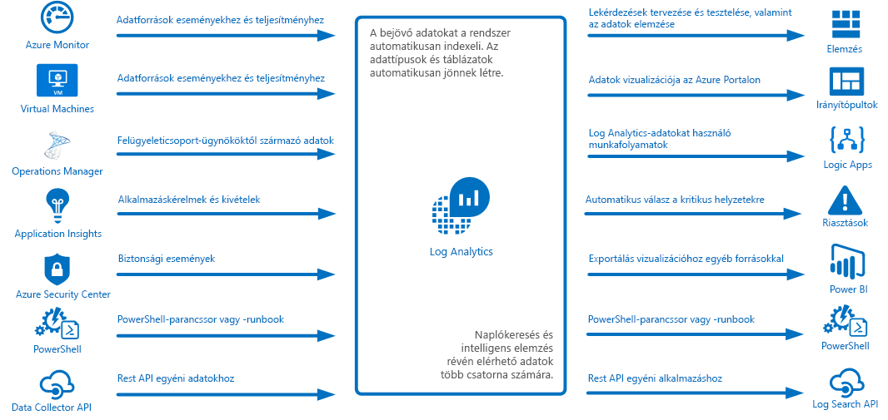
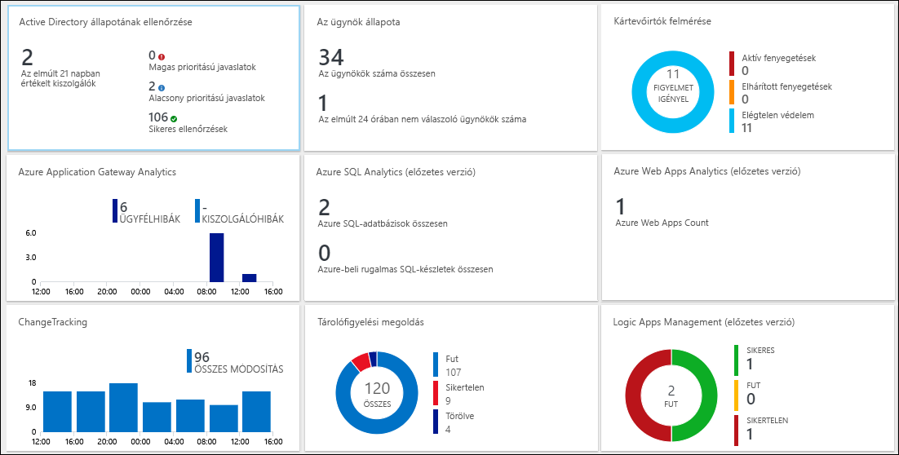
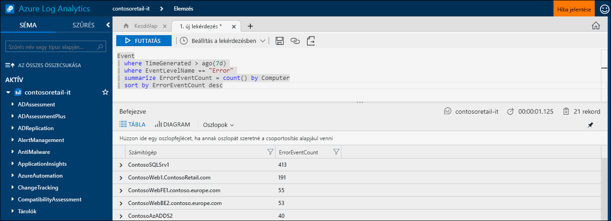
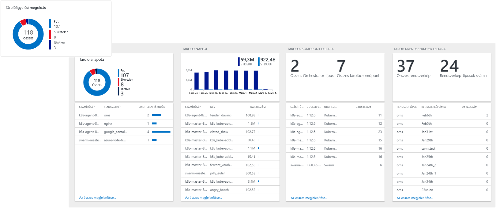
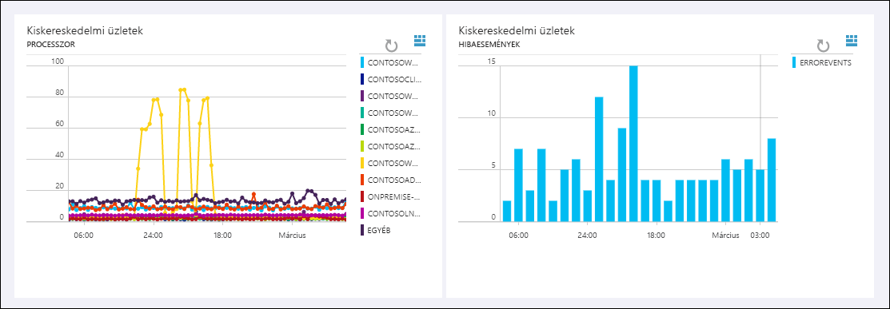
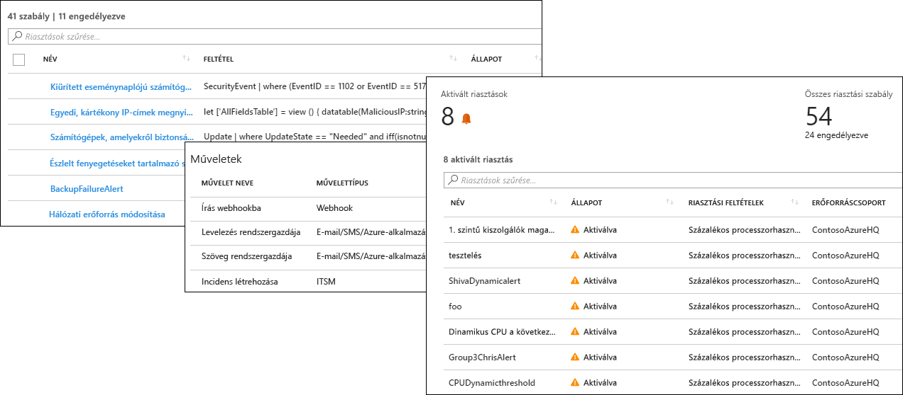
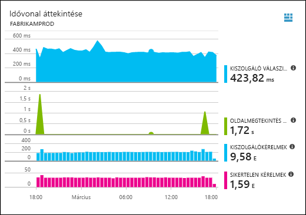
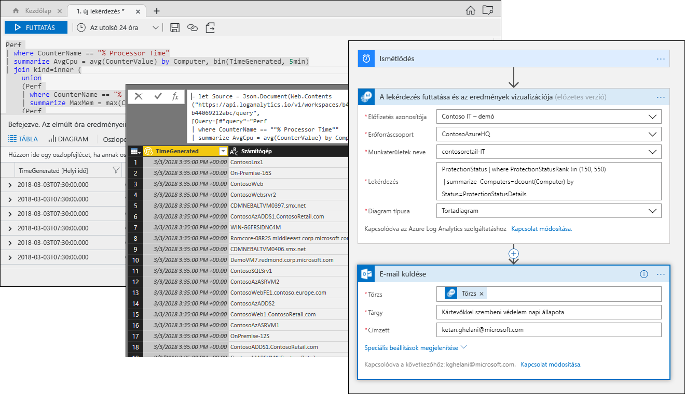

# Mi az Azure Log Analytics?
A Log Analytics központi szerepet tölt be az Azure felügyeletében: telemetriai és egyéb adatokat gyűjt különböző forrásokból, valamint lekérdezési nyelvet és elemzési motort biztosít, amellyel betekintést nyerhet az alkalmazások és erőforrások működésébe.  A Log Analytics adataival közvetlenül is dolgozhat a naplókereséseken és nézeteken keresztül, vagy használhatja olyan Azure-szolgáltatások elemzőeszközeit, amelyek az adataikat a Log Analyticsben tárolják (például: Application Insights vagy Azure Security Center).  

A Log Analytics minimális konfigurálást igényel, és már integrálva van egyéb Azure-szolgáltatásokkal.  Csak létre kell hoznia egy munkaterületet a gyűjtés engedélyezéséhez.  Ezután ügynököket telepíthet a virtuális gépekre, és belefoglalhatja őket a munkaterületbe, valamint engedélyezheti a logikát tartalmazó felügyeleti megoldásokat különböző alkalmazások további háttérismereteinek megismeréséhez.  A háttérben az adattípusok előre meghatározottak, vagy automatikusan létrejönnek az adatok gyűjtése során.

## A monitorozásban betöltött szerep

Az Azure különböző monitorozási szolgáltatásait az [Azure-alkalmazások és erőforrások monitorozását](../monitoring-and-diagnostics/monitoring-overview.md) ismertető rész foglalkozik.  A Log Analytics központi szerepet játszik a különböző forrásokból származó monitorozási adatok konszolidálásában, és hatékony lekérdezési nyelvet biztosít a konszolidáláshoz és elemzéshez.  

A Log Analytics nem csak az Azure-erőforrások monitorozására használható.  Adatokat gyűjthet a helyszínen vagy más felhőkben lévő erőforrásokról egy hibrid monitorozási környezet létrehozásához, és közvetlenül csatlakozhat a System Center Operations Managerhez meglévő ügynököktől származó telemetria gyűjtéséhez.  A Log Analytics elemzőeszközei (például a naplókeresés, a nézetek és a felügyeleti megoldások) az összes begyűjtött adattal működnek, így lehetővé teszik a teljes környezet központosított elemzését.

## Adatgyűjtés
A Log Analytics különféle forrásokból gyűjt adatokat.  Az adatgyűjtés után a rendszer adattípusonként külön táblába rendezi az adatokat, ez az eredeti forrástól függetlenül lehetővé teszi az adatok együttes elemzését.

Az adatok a Log Analyticsbe történő gyűjtése a következőket is magában foglalja:

- Konfigurálhatja az Azure Monitort az Azure-erőforrásokból gyűjtött metrikák és naplók másolására.
- A [Windows](log-analytics-windows-agent.md) és [Linux](log-analytics-linux-agents.md) rendszerű virtuális gépek a konfigurált [Adatforrások](log-analytics-data-sources.md) alapján a vendég operációs rendszerről és alkalmazásokról származó telemetriát küldhetnek a Log Analyticsnek.  
- Csatlakoztathat egy [System Center Operations Manage-beli felügyeleti csoportot](log-analytics-om-agents.md) a Log Analyticshez a csoport ügynökeitől származó adatok gyűjtéséhez.
- Az Azure-szolgáltatások (például az [Application Insights](https://docs.microsoft.com/azure/application-insights/) és az [Azure Security Center](https://docs.microsoft.com/azure/security-center/)) közvetlenül a Log Analyticsben tárolhatják az adataikat, bármilyen konfigurálás igénye nélkül.
- Adatokat írhat a PowerShell-parancssorból vagy az [Azure Automation-runbookból](../automation/automation-runbook-types.md) Log Analytics-parancsmagok használatával.
- Egyéni követelmények érvényesülése esetén a [HTTP-adatgyűjtő API](log-analytics-data-collector-api.md) használatával írhat adatokat a Log Analyticsbe bármely REST API-ügyfélből.

## Funkciók hozzáadása felügyeleti megoldásokkal
A [felügyeleti megoldások](log-analytics-add-solutions.md) előre összeállított logikát biztosítanak egy adott termékhez vagy forgatókönyvhöz.  További adatokat gyűjthetnek a Log Analyticsbe, vagy feldolgozhatják a már összegyűjtött adatokat.  Ezek általában egy nézetet is tartalmaznak, amely segít a további adatok elemzésében.  A megoldások változatos funkciókkal érhetők el, valamint a további hozzáadott megoldások listája is folyamatosan bővül.  Az Azure Marketplace-en keresztül könnyűszerrel böngészhet az elérhető megoldások között, majd [hozzáadhatja őket a munkaterülethez](log-analytics-add-solutions.md).  

## Lekérdezés nyelve

A Log Analyticsben található [részletes lekérdezési nyelv](http://docs.loganalytics.io) segítségével gyorsan lekérheti, konszolidálhatja és elemezheti az összegyűjtött adatokat.  Lekérdezéseket hozhat létre és tesztelhet a [Naplókeresés vagy a Bővített analitika portál](log-analytics-log-search-portals.md) segítségével, majd közvetlenül elemezheti az adatokat az eszközök használatával, vagy mentheti a lekérdezéseket a vizualizációkkal vagy riasztásokkal való használathoz, vagy egyéb eszközökbe (például: Power BI vagy Excel) exportálhatja őket.

A Log Analytics lekérdezési nyelve megfelelő az egyszerű naplókeresésekhez, de olyan fejlett funkciókkal is rendelkezik, mint az összesítés, illesztés és intelligens elemzés. A [számos elérhető oktatóanyag](https://docs.loganalytics.io/docs/Learn/Tutorials) segítségével gyorsan megismerkedhet a lekérdezési nyelvvel.  Azon felhasználók számára, akik már ismerik az [SQL](https://docs.loganalytics.io/docs/Learn/References/SQL-to-Azure-Log-Analytics) és [Splunk](https://docs.loganalytics.io/docs/Learn/References/Splunk-to-Azure-Log-Analytics) használatát, külön útmutató áll rendelkezésére.

## Log Analytics-adatok vizualizációja

A [Log Analytics nézetei](log-analytics-view-designer.md) vizuálisan jelenítik meg a naplókeresések adatait.  Minden egyes nézet a kritikus adatok listáján kívül vizualizációk kombinációját is tartalmazza, például sáv- és vonaldiagramokat.  A [felügyeleti megoldások](#add-functionality-with-management-solutions) egy adott alkalmazás adatait összegző nézetet is tartalmaznak, és létrehozhatja saját nézeteit is egy Log Analytics-naplókeresés adatainak megjelenítéséhez.

A Log Analytics-lekérdezés eredményeit egy [Azure-irányítópulton](../azure-portal/azure-portal-dashboards.md) is rögzítheti. Ez lehetővé teszi különböző Azure-szolgáltatások csempéinek kombinálását.  Az irányítópulton egy Log Analytics-nézetet is rögzíthet.

## Riasztások létrehozása Log Analytics-adatokból

Az [Azure-riasztások](../monitoring-and-diagnostics/monitoring-overview-unified-alerts.md) segítségével proaktívan kaphat értesítést a fontos Log Analytics-adatokban található feltételekről.  A lekérdezés ütemezett időközönként automatikusan fut, és a rendszer riasztást küld, ha a lekérdezés eredménye megfelel az adott feltételeknek.  Ez lehetővé teszi a Log Analyticsből származó riasztások egyéb forrásokkal (például: [Azure Monitor](../monitoring-and-diagnostics/monitoring-near-real-time-metric-alerts.md) majdnem valós idejű riasztásai és az [Application Insights](../application-insights/app-insights-alerts.md) alkalmazáskivételei) való egyesítését, és [Műveletcsoportok](../monitoring-and-diagnostics/monitoring-action-groups.md) megosztását a riasztási feltételekre adott válaszhoz.

## Log Analytics-adatok használata más szolgáltatásokban
Az olyan szolgáltatások, mint az Application Insights és az Azure Security Center, a Log Analyticsben tárolják az adataikat.  Általában a szolgáltatások elemzőeszközeinek széles választékával dolgozhat, de használhatja a Log Analytics-lekérdezéseket is az adataik eléréséhez, és esetleg kombinálhatja is az adatokat más szolgáltatásokból származó adatokkal.  

Például az alábbi nézet az Application Insightsból származik.  Ha a jobb felső sarokban lévő ikonra kattint, elindul a Log Analytics elemzési konzolja a gráf által használt lekérdezésekkel.

## Log Analytics-adatok exportálása

A Log Analytics az Azure-on kívül is elérhetővé teszi adatait.  A [Power BI](log-analytics-powerbi.md) úgy is beállítható, hogy egy lekérdezés eredményeit ütemezett időközönként importálja, ezzel lehetővé téve, hogy kihasználhassa a funkciói által nyújtott előnyöket (például: különböző forrásokból származó adatok egyesítése, vagy jelentések megosztása az interneten vagy mobileszközökön).  Használhatja a [Naplókeresési API](log-analytics-log-search-api.md)-t is, ha a Log Analytics adatait felhasználó egyéni megoldásokat szeretne kiépíteni, illetve ha más rendszerekkel szeretne integrációt létrehozni.

Az Azure-beli [Logic Apps](../logic-apps/logic-apps-overview.md) használatával Log Analytics-adatokon alapuló egyéni munkafolyamatokat hozhat létre.  A PowerShellen alapuló összetettebb logika esetén használhatja az [Azure Automation runbookjait](../automation/automation-runbook-types.md).

## További lépések
- Első lépésként [gyűjtsön adatokat az Azure-beli virtuális gépekről](log-analytics-quick-collect-azurevm.md).
- Tekintse át a [Log Analytics-adatok egyszerű lekérdezéssel végzett elemzésének útmutatóját](log-analytics-tutorial-viewdata.md).
* [Böngésszen az elérhető megoldások között](log-analytics-add-solutions.md), ha funkciókkal szeretné bővíteni a Log Analytics-szolgáltatást.

