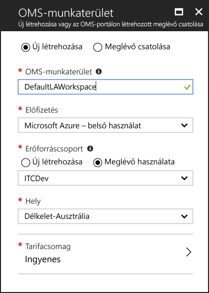

# Azure virtuális gépek kapcsolatos adatok gyűjtése
[Az Azure Naplóelemzés](log-analytics-overview.md) tud adatokat gyűjteni közvetlenül az Azure virtuális gépek és egyéb erőforrásoknak a környezetben egy részletes elemzését és a korrelációs tárházba.  A gyors üzembe helyezés bemutatja, hogyan konfigurálja, és adatokat gyűjteni a Azure Linux vagy a Windows virtuális gépek néhány egyszerű lépésben.  
 
A gyors üzembe helyezés feltételezi, hogy rendelkezik-e egy meglévő Azure virtuális géphez. Ha az nem [Windows virtuális gép létrehozása](../virtual-machines/windows/quick-create-portal.md) vagy [hozzon létre egy Linux virtuális Gépet](../virtual-machines/linux/quick-create-cli.md) követően a virtuális gép quickstarts.

## Jelentkezzen be Azure-portálon
Jelentkezzen be az Azure portálon, a [https://portal.azure.com](https://portal.azure.com). 

## Munkaterületek létrehozása
1. Az Azure portálon kattintson **további szolgáltatások** bal alsó sarokban található. Az erőforrások listájába írja be a **Log Analytics** kifejezést. Ahogy elkezd gépelni, a lista a beírtak alapján szűri a lehetőségeket. Válassza ki **Analytics jelentkezzen**.     
2. Kattintson a **létrehozása**, majd válassza ki a következő elemeket kell:

  * Adjon meg egy nevet az új **OMS-munkaterület**, például a *DefaultLAWorkspace*. 
  * A legördülő listából válassza ki azt az **előfizetést**, amelyikhez kapcsolódni szeretne, ha az alapértelmezett kiválasztás nem megfelelő.
  * A **erőforráscsoport**, válasszon ki egy meglévő erőforráscsoportot, amely tartalmaz egy vagy több Azure virtuális gépeken.  
  * Válassza ki a **hely** a virtuális gépek vannak telepítve.  További információkért lásd: amely [Naplóelemzési is elérhető régiók](https://azure.microsoft.com/regions/services/).
  * Három különböző választhat **tarifacsomagok** Naplóelemzési, de a gyors üzembe helyezés, válassza ki kívánja a **szabad** réteg.  Az adott szintek kapcsolatos további információkért lásd: [napló Analytics díjszabás](https://azure.microsoft.com/pricing/details/log-analytics/).

           
3. Miután megadta a szükséges adatokat a a **OMS-munkaterület** ablaktáblán kattintson a **OK**.  

Az **Értesítések** menüpontot kiválasztva nyomon követheti, hogyan ellenőrzi a rendszer az adatokat, és hogyan hozza létre a munkaterületet. 

## A napló Analytics Virtuálisgép-bővítmény engedélyezése
Windows és Linux virtuális gépekhez már telepítették az Azure-ban az Naplóelemzési ügynök a napló Analytics Virtuálisgép-bővítmény telepítése.  A bővítmény használatával egyszerűbbé teszi a telepítési folyamat, és automatikusan konfigurálja az adatokat küldeni a Naplóelemzési munkaterület, melyet a az ügynök. Az ügynök is frissítése automatikusan történik, győződjön meg arról, hogy rendelkezik-e a legújabb funkcióit és javításokat.

Azt tapasztalhatja, hogy a szalagcím a Log Analyticshez erőforrás oldal felkéri, hogy frissítse a portálon keresztül.  A frissítés nincs szükség a gyors üzembe helyezés céljából. 

.    
1. Az Azure portálon kattintson **további szolgáltatások** bal alsó sarokban található. Az erőforrások listájába írja be a **Log Analytics** kifejezést. Ahogy elkezd gépelni, a lista a beírtak alapján szűri a lehetőségeket. Válassza ki **Analytics jelentkezzen**.
2. A Naplóelemzési munkaterület listában válassza ki a *DefaultLAWorkspace* korábban létrehozott.
3. Kattintson a bal oldali menü alatti munkaterület adatforrások, **virtuális gépek**.  
4. A közül **virtuális gépek**, válasszon ki egy szeretné telepíteni az ügynököt a virtuális gépet. Figyelje meg, hogy a **OMS kapcsolat állapota** a virtuális gép azt mutatja, hogy a **nincs csatlakoztatva**.
5. Válassza ki a virtuális gép részleteit, **Connect**. Az ügynök automatikusan telepítve és beállítva a Naplóelemzési munkaterület. Ez a folyamat néhány percet vesz igénybe, amely idő alatt a **állapot** van **csatlakozás**.
6. Csatlakoztassa az ügynököt, és telepítése után a **OMS kapcsolat állapota** frissíti a rendszer **a munkaterület**.

## Esemény-és teljesítményadatokat gyűjt
A Naplóelemzési események gyűjtése a Windows eseménynaplóiban keresse meg vagy a Linux rendszernaplójába bejegyzett és a teljesítményszámlálók, amennyit megadott a hosszabb távú elemzési és jelentéskészítési, és hajtsa végre a műveletet egy adott esemény észlelése esetén.  Kövesse az alábbi lépéseket a naplózásra a Windows rendszer és a Linux rendszernaplójába bejegyzett, néhány általános teljesítményszámlálói eseményeinek gyűjtése kezdődnie konfigurálásához.  

### Windows virtuális gép adatok gyűjtése
1. Válassza ki **speciális beállítások**.    
3. Válassza ki **adatok**, majd válassza ki **Windows-Eseménynapló**.  
4. Az Eseménynapló nevében a napló beírásával vegye fel.  Típus **rendszer** és kattintson a plusz jelre  **+** .  
5. A tábla, ellenőrizze a nyomkövetés alapjául szolgáló **hiba** és **figyelmeztetés**.   
6. Kattintson a **mentése** a konfiguráció mentéséhez, a lap tetején.
7. Válassza ki **Windows-teljesítményadatok** a Windows rendszerű számítógépeken a teljesítményszámlálók gyűjtésének engedélyezése. 
8. Amikor először konfigurálja a Windows egy új Naplóelemzési munkaterület számlálókat, lehetősége van gyorsan létrehozhat több általános jellegű számlálót. Az egyes jelölőnégyzetét szerepelnek.  .  Kattintson a **adja hozzá a kijelölt teljesítményszámlálók**.  Ezek felvétele, illetve egy második tíz gyűjtemény mintavételi időköznek az adott néven beállítás.  
9. Kattintson a **mentése** a konfiguráció mentéséhez, a lap tetején.

### Linux virtuális gép adatok gyűjtése

1. Válassza ki **Syslog**.  
2. Az Eseménynapló nevében a napló beírásával vegye fel.  Típus **Syslog** és kattintson a plusz jelre  **+** .  
3. A tábla, törölje a jelet a nyomkövetés alapjául szolgáló **Info**, **értesítés** és **Debug**. 
4. Kattintson a **mentése** a konfiguráció mentéséhez, a lap tetején.
5. Válassza ki **Linux teljesítményadatokat** a Windows rendszerű számítógépeken a teljesítményszámlálók gyűjtésének engedélyezése. 
6. Új Naplóelemzési munkaterület Linux teljesítményszámlálói először konfigurálásakor lehetősége van gyorsan létrehozhat több általános jellegű számlálót. Az egyes jelölőnégyzetét szerepelnek.  .  Kattintson a **adja hozzá a kijelölt teljesítményszámlálók**.  Ezek felvétele, illetve egy második tíz gyűjtemény mintavételi időköznek az adott néven beállítás.  
7. Kattintson a **mentése** a konfiguráció mentéséhez, a lap tetején.

## Összegyűjtött adatok megtekintése
Most, hogy engedélyezte az adatok gyűjtését, lehetővé teszi, hogy egy egyszerű napló keresési például a cél virtuális gépek bizonyos adatok megtekintéséhez futtassa.  

1. Az Azure-portálon Naplóelemzési keresse meg és jelölje ki a korábban létrehozott munkaterületen.
2. Kattintson a **naplófájl-keresési** csempe és a napló Keresés ablaktábla a lekérdezés mezőtípus `Type=Perf` , és adja meg, vagy kattintson a Keresés gombra a lekérdezés mező jobb majd nyomja le.    A lekérdezés az alábbi ábrán például 78,000 teljesítmény rögzíti adott vissza.  Az eredményeket fogja lényegesen kevesebb lesz.  

## Az erőforrások eltávolítása
Ha már nincs szükség, a Naplóelemzési munkaterület törlése. Ehhez az szükséges, válassza ki a korábban és az erőforrások lapon kattintson a létrehozott Naplóelemzési munkaterület **törlése**.  

## Következő lépések
Most, hogy gyűjti a működési és a Windows vagy Linux rendszerű virtuális gépek teljesítményadatait, könnyedén megkezdéséhez fel, elemzése és a begyűjtött adatok intézkedést *szabad*.  

Megtudhatja, hogyan tekintheti meg és elemezheti az adatokat, hogy továbbra is az oktatóanyag.   

> [!div class="nextstepaction"]
> [Megtekintése vagy Naplóelemzési adatok elemzése](log-analytics-tutorial-viewdata.md)
