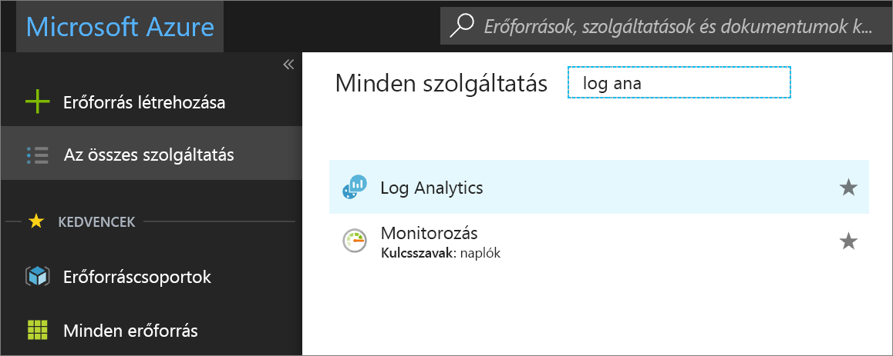
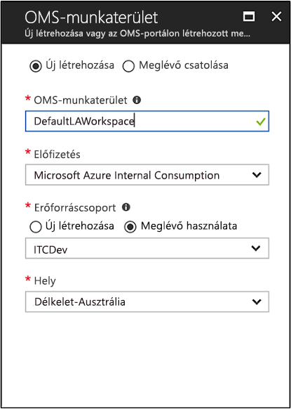
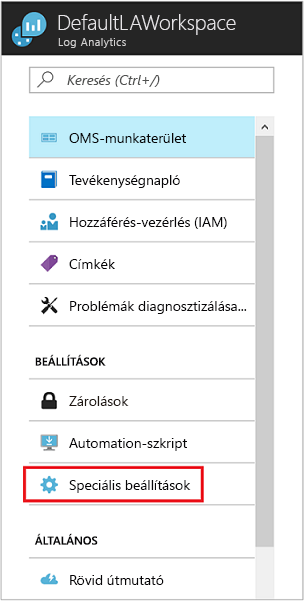
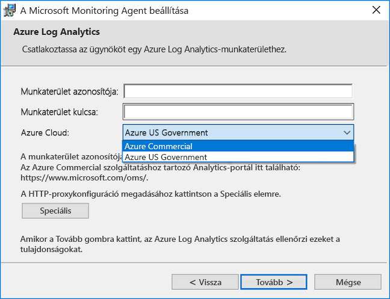
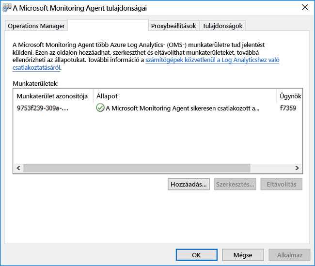
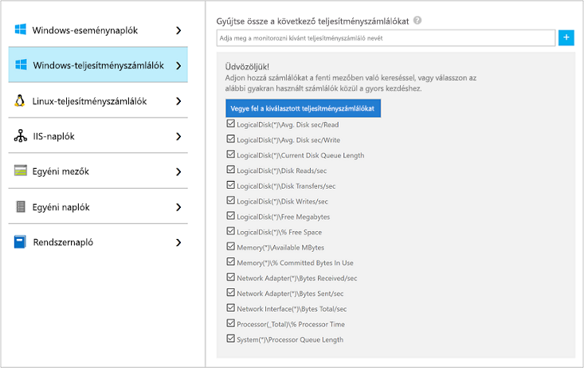
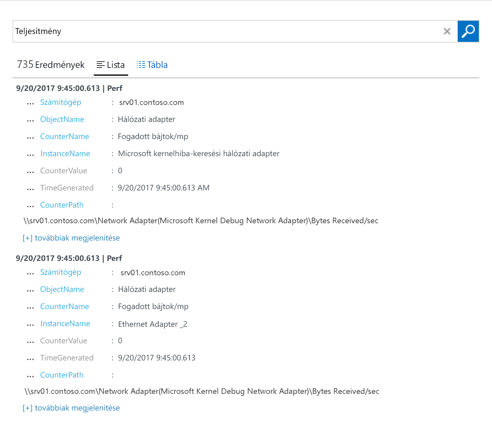
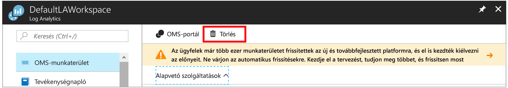

# Adatok gyűjtése saját környezetben futtatott windowsos számítógépekről
Az [Azure Log Analytics](log-analytics-overview.md) közvetlenül tud adatokat gyűjteni az Ön környezetében található fizikai vagy virtuális Windows-gépekről és egyéb erőforrásokról egy adattárba, részletes elemzés és összehasonlítás céljából.  Ez a rövid útmutató bemutatja, hogyan konfigurálhatja a windowsos számítógépekről történő adatgyűjtést néhány egyszerű lépésben.  Azure-beli windowsos virtuális gépek esetén lásd [az Azure-beli virtuális gépekről történő adatgyűjtést](log-analytics-quick-collect-azurevm.md) ismertető cikket.  

A Windows-ügynök telepítésének hálózati és rendszerkövetelményeivel kapcsolatban tekintse át [a Windows operációs rendszer használatának előfeltételeit](log-analytics-concept-hybrid.md#prerequisites).
 
Ha nem rendelkezik Azure-előfizetéssel, mindössze néhány perc alatt létrehozhat egy [ingyenes fiókot](https://azure.microsoft.com/free/?WT.mc_id=A261C142F) a virtuális gép létrehozásának megkezdése előtt.

## Bejelentkezés az Azure Portalra
Jelentkezzen be az Azure Portalra a [https://portal.azure.com](https://portal.azure.com) címen. 

## Munkaterület létrehozása
1. Az Azure Portalon kattintson a **Minden szolgáltatás** lehetőségre. Az erőforrások listájába írja be a **Log Analytics** kifejezést. Ahogy elkezd gépelni, a lista a beírtak alapján szűri a lehetőségeket. Válassza a **Log Analytics** elemet.       
2. Kattintson a **Létrehozás** parancsra, majd válassza ki a következő elemek beállításait:

  * Adja meg az új **OMS-munkaterület** nevét, például: *DefaultLAWorkspace*. 
  * A legördülő listából válassza ki azt az **előfizetést**, amelyikhez kapcsolódni szeretne, ha az alapértelmezett kiválasztás nem megfelelő.
  * Az **Erőforráscsoport** beállításnál válasszon ki egy meglévő erőforráscsoportot, amely egy vagy több Azure-beli virtuális gépet tartalmaz.  
  * Válassza ki a **Helyet** a virtuális gépek üzembehelyezési céljaként.  További információkért tekintse meg [a Log Analytics által támogatott régiókat](https://azure.microsoft.com/regions/services/).  
  * Ha 2018. április 2. után létrehozott új előfizetésben hoz létre munkaterületet, az automatikusan a *GB-alapú* díjcsomagot használja, és a tarifacsomag kiválasztásának lehetősége nem érhető el.  Ha az április 2. előtt létrehozott meglévő előfizetéshez hoz létre munkaterületet, vagy pedig egy meglévő EA-regisztrációhoz kötött előfizetéshez, válassza ki a kívánt tarifacsomagot.  További információt az elérhető csomagokról [a Log Analytics részletes díjszabásában](https://azure.microsoft.com/pricing/details/log-analytics/) találhat.

           

3. Miután az **OMS-munkaterület** panelen megadta a szükséges adatokat, kattintson az **OK** gombra.  

Az **Értesítések** menüpontot kiválasztva nyomon követheti, hogyan ellenőrzi a rendszer az adatokat, és hogyan hozza létre a munkaterületet. 

## A munkaterület-azonosító és -kulcs lekérése
A Windowshoz készült Microsoft Monitoring Agent telepítése előtt szüksége lesz a Log Analytics-munkaterület azonosítójára és kulcsára.  Ezekre az adatokra a telepítővarázslónak lesz szüksége az ügynök konfigurálásához és a Log Analyticsszel való sikeres kommunikációjának biztosításához.  

1. Az Azure Portal bal felső sarkában kattintson a **Minden szolgáltatás** lehetőségre. Az erőforrások listájába írja be a **Log Analytics** kifejezést. Ahogy elkezd gépelni, a lista a beírtak alapján szűri a lehetőségeket. Válassza a **Log Analytics** elemet.
2. A Log Analytics-munkaterületek listájában válassza ki a korábban létrehozott *DefaultLAWorkspace* elemet.
3. Válassza ki a **Speciális beállítások** elemet.       
4. Válassza ki a **Csatlakoztatott források**, majd a **Windowsos kiszolgálók** elemet.   
5. A **Munkaterület-azonosító** és az **Elsődleges kulcs** jobb oldalán lévő érték. Másolja ki és illessze be mindkettőt a kedvenc szerkesztőjébe.   

## A Windowshoz készült ügynök telepítése
Az alábbi lépésekkel telepíthető és konfigurálható az ügynök a Log Analytics használatához az Azure és az Azure Government-felhőben a Microsoft Monitoring Agent telepítőjének használatával a számítógépén.  

1. A **Windowsos kiszolgálók** lapon válassza ki a Windows operációs rendszer processzorarchitektúrájának megfelelő verziójú **Windows-ügynök letöltése** lehetőséget.
2. Futtassa a telepítőt, és telepítse az ügynököt a számítógépre.
2. Az **Üdvözöljük** lapon kattintson a **Tovább** gombra.
3. A **Licencfeltételek** oldalon olvassa el és fogadja el a licencet, majd kattintson az **Elfogadom** gombra.
4. A **Célmappa** lapon fogadja el az alapértelmezett telepítési mappát, vagy adjon meg egy másikat, majd kattintson a **Tovább** gombra.
5. **Az ügynök telepítésének beállításai** lapon csatlakoztassa az ügynököt az Azure Log Analyticshez (OMS), majd kattintson a **Tovább** gombra.   
6. Az **Azure Log Analytics** lapon végezze el a következőket:
   1. Illessze be az előzőleg kimásolt **Munkaterület-azonosítót** és **Munkaterületkulcsot (Elsődleges kulcs)**.  Ha a gépnek egy Azure Government-felhőbeli Log Analytics-munkaterületnek kell jelentenie, válassza az **Azure US Government** lehetőséget az **Azure Cloud** legördülő listából.  
   2. Ha a számítógépnek egy proxykiszolgálón keresztül kell kommunikálnia a Log Analytics szolgáltatással, kattintson a **Speciális** gombra, majd adja meg a proxykiszolgáló URL-címét és portszámát.  Ha a proxykiszolgáló hitelesítést igényel, írja be a felhasználónevet és jelszót a proxykiszolgálóval való hitelesítéshez, majd kattintson a **Tovább** gombra.  
7. A szükséges konfigurációs beállítások megadása után kattintson a **Tovább** gombra.     
8. A **Telepítésre kész** oldalon ellenőrizze a beállításokat, majd kattintson a **Telepítés** elemre.
9. **A konfigurálás sikeresen befejeződött** lapon kattintson a **Befejezés** gombra.

Ennek végeztével a **Microsoft Monitoring Agent** megjelenik a **Vezérlőpulton**. Áttekintheti a konfigurációt, és ellenőrizheti, hogy az ügynök csatlakozik-e a Log Analyticshez. Ha csatlakozik, az **Azure Log Analytics (OMS)** lapon az ügynök megjeleníti a következő üzenetet: **A Microsoft Monitoring Agent sikeresen csatlakozott a Microsoft Operations Management Suite szolgáltatáshoz**.   

## Esemény- és teljesítményadatok gyűjtése
A Log Analytics képes események gyűjtésére a Windows eseménynaplóból, illetve a hosszabb távú elemzésekhez és jelentéskészítéshez megadott teljesítményszámlálókból, és valamilyen művelettel reagálni arra, ha észleli egy adott feltétel meglétét.  A következő lépésekkel konfigurálhatja az események gyűjtését a Windows eseménynaplóból, illetve (kezdetnek) egyes gyakran használt teljesítményszámlálókból.  

1. Az Azure Portalon kattintson a bal alsó sarokban található **További szolgáltatások** elemre. Az erőforrások listájába írja be a **Log Analytics** kifejezést. Ahogy elkezd gépelni, a lista a beírtak alapján szűri a lehetőségeket. Válassza a **Log Analytics** elemet.
2. Válassza ki a **Speciális beállítások** elemet.      
3. Válassza az **Adatok**, majd a **Windows Eseménynaplók** lehetőséget.  
4. Eseménynaplókat a nevük begépelésével adhat hozzá.  Írja be a **Rendszer** szót, majd kattintson a plusz jelre **+**.  
5. A táblázatban jelölje be a **Hiba** és **Figyelmeztetés** súlyossági szintet.   
6. A konfiguráció mentéséhez kattintson az oldal tetején található **Mentés** parancsra.
7. Válassza a **Windowsos teljesítményadatok** lehetőséget a teljesítményszámláló-adatok egy windowsos gépen történő gyűjtésének engedélyezéséhez. 
8. Amikor először konfigurálja egy új Log Analytics-munkaterület Windows-teljesítményszámlálóit, akkor gyorsan létrehozhat több gyakran használt számlálót. Ezek mindegyike mellett egy jelölőnégyzet található.  .  Kattintson **A kijelölt teljesítményszámlálók felvétele** elemre.  A rendszer hozzáadja a kiválasztott számlálókat, és mindegyikhez beállít egy tíz másodperces mintagyűjtési időszakot.  
9. A konfiguráció mentéséhez kattintson az oldal tetején található **Mentés** parancsra.

## Összegyűjtött adatok megtekintése
Most, hogy engedélyezte az adatgyűjtést, futtasson le egy egyszerű naplóbeli keresést, hogy megtekinthessen néhány, a célszámtógépekről származó adatot.  

1. Az Azure Portalon a kijelölt munkaterület alatt kattintson a **Naplók keresése** csempére.  
2. A Naplók keresése panel lekérdezési mezőjében adja meg a `Perf` típust, majd nyomja le az Enter billentyűt, vagy kattintson a lekérdezési mezőtől jobbra található Keresés gombra.      A következő képen látható lekérdezés 735 teljesítményrekordot adott vissza.   

## Az erőforrások eltávolítása
Ha már nincs rá szükség, eltávolíthatja az ügynököt a windowsos számítógépről, és törölheti a Log Analytics-munkaterületet.  

Az ügynök eltávolításához hajtsa végre az alábbi lépéseket.

1. Nyissa meg **Vezérlőpultot**.
2. Nyissa meg a **Programok és szolgáltatások** részt.
3. A **Programok és szolgáltatások** alatt válassza ki a **Microsoft Monitoring Agent** elemet, és kattintson az **Eltávolítás** parancsra.

A munkaterület törléséhez válassza ki a korábban létrehozott Log Analytics-munkaterületet, és az erőforrás oldalán kattintson a **Törlés** parancsra.   

## További lépések
Most, hogy már gyűjti a működési és teljesítményadatokat a linuxos számítógépéről, könnyen nekiláthat az *ingyenesen* gyűjtött adatok felfedezésének és elemzésének, és reagálhat a kapott eredményekre.  

Az adatok megtekintésének és elemzésének ismertetéséhez lépjen tovább az útmutatóhoz.   

> [!div class="nextstepaction"]
> [Adatok megtekintése és elemzése a Log Analyticsben](log-analytics-tutorial-viewdata.md)
