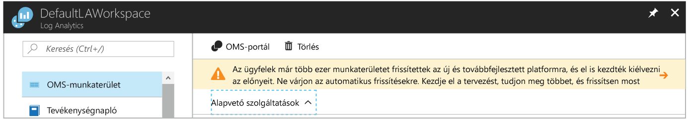

# <a name="view-or-analyze-data-collected-with-log-analytics-log-search"></a>Megtekintése vagy Naplóelemzési napló keresési gyűjtött adatok elemzése

A Naplóelemzési kihasználhatja napló keresések hozhat létre, a a gyűjtött adatok elemzése használja a már meglévő irányítópultok, amely testre szabható a legértékesebb keresések grafikus nézetei a lekérdezések.  Most, hogy a beállított működési adatgyűjtést az Azure virtuális gépek és tevékenységi naplóit, ebben az oktatóanyagban elsajátíthatja, hogyan:

> [!div class="checklist"]
> * Az Azure Naplóelemzés erőforrás frissítsen az új lekérdezési nyelv 
> * Az eseményadatok egyszerű keresés végrehajtása és a szolgáltatások segítségével módosíthatja, és az eredmények szűréséhez 
> * Útmutató: teljesítményadatokat használata

A példa az oktatóanyag elvégzéséhez rendelkeznie kell egy meglévő virtuális gép [csatlakozik a Naplóelemzési munkaterület](log-analytics-quick-collect-azurevm.md).  

Létrehozása és szerkesztése a visszaadott adatok interaktív használata mellett a lekérdezések befejezett egy kétféleképpen lehet.  Alapvető lekérdezések a napló lapon használja az Azure portálon, vagy speciális kérdez le, használhatja a speciális elemzés portal. A funkció a két portál közötti különbség kapcsolatos további információkért lásd: [portálok a létrehozása és módosítása az Azure Naplóelemzés napló lekérdezések](log-analytics-log-search-portals.md)

Ebben az oktatóanyagban azt fogja dolgozunk a naplófájl-keresési az Azure-portálon. 

## <a name="log-in-to-azure-portal"></a>Jelentkezzen be Azure-portálon
Jelentkezzen be az Azure portálon, a [https://portal.azure.com](https://portal.azure.com). 

## <a name="open-the-log-search-portal"></a>Nyissa meg a keresési napló portált 
Indítsa el a napló keresési portál megnyitásával.   

1. Az Azure portálon kattintson **további szolgáltatások** bal alsó sarokban található. Az erőforrások listájába írja be a **Log Analytics** kifejezést. Ahogy elkezd gépelni, a lista a beírtak alapján szűri a lehetőségeket. Válassza ki **Analytics jelentkezzen**.
2. A Naplóelemzési előfizetések ablaktáblán válassza ki a munkaterület, és válassza ki a **naplófájl-keresési** csempére.<br> 

Talán észrevette a szalagcím a Log Analyticshez erőforrás oldal felkéri, hogy frissítse a portálon keresztül.<br> 

Naplóelemzési új egy új lekérdezési nyelv összeállításához könnyebben lekéri elérhetővé válnak, összefüggésbe adatokat a különböző forrásokból, és gyorsan azonosíthatja a trendeket vagy problémák elemzéséhez.

Egyszerű frissítés.  A folyamat megkezdéséhez kattintson a szalagcím, amely szerint a **további és frissítési**.  Olvassa végig a további információt a frissítés a frissítési adatok lapon, és kattintson a **frissítés most**.

A folyamat eltarthat néhány percig, és ebben az időszakban, nyomon követheti a folyamat állapotát **értesítések** a menüből. További információ a [előnyeit az új lekérdezési nyelv](log-analytics-log-search-upgrade.md#why-the-new-language).

## <a name="create-a-simple-search"></a>Hozzon létre egy egyszerű keresés
A leggyorsabban beolvasása néhány adatokra egy egyszerű lekérdezést, amely visszaadja az összes rekord tábla.  Ha olyan Windows vagy Linux rendszerű ügyfelek csatlakoztatva a munkaterület, majd konfigurálnia kell az esemény (Windows) vagy a Syslog (Linux) tábla adatait.

Írjon be egyet az alábbi lekérdezéseket a keresési mezőbe, és kattintson a Keresés gombra.  

```
Event
```
```
Syslog
```

Az alapértelmezett listanézetben adat, és láthatja, hogy hány teljes rekord lett visszaadva.


Csak az első néhány tulajdonságok mindegyik rekorddal jelennek meg.  Kattintson a **megjelenítése további** egy adott bejegyzés minden tulajdonságok megjelenítése.

## <a name="filter-results-of-the-query"></a>A lekérdezés eredményeit szűrni
A képernyő bal oldalán van a keresőablak, amely lehetővé teszi a lekérdezésbe felvenni kívánt szűrése a közvetlenül a módosítása nélkül.  Több rekord tulajdonságai jelennek meg a bejegyzést, és kijelölhet egy vagy több tulajdonság értékével a keresési eredmények szűkítéséhez.

Ha dolgozunk **esemény**, jelölje be a jelölőnégyzetet a **hiba** alatt **EVENTLEVELNAME**.   Ha dolgozunk **Syslog**, jelölje be a jelölőnégyzetet a **err** alatt **súlyossági szint**.  A lekérdezés egy, a következő szeretné szűkíteni a hibaesemények értékre változik.

```
Event | where (EventLevelName == "Error")
```
```
Syslog | where (SeverityLevel == "err")
```


A keresőablak kiválasztásával tulajdonságok hozzáadása **szűrők hozzáadása** egyik rekord tulajdonság menüjéből.


Az azonos szűrő kiválasztásával állíthatja be **szűrő** egy rekord, a szűrni kívánt érték tulajdonság menüjéből.  

Csak a **szűrő** kék, ha azok fölött a nevükkel tulajdonságok beállítása.  Ezek a *kereshető* mezők, amely az indexelt keresési feltételeket.  A szürke színnel mezők *szabad kereshető szöveg* mezők, amelyek csak a **hivatkozások megjelenítése** lehetőséget.  Ez a beállítás azt jelzi, hogy az egyik tulajdonságnak sem lehet ezt az értéket adja vissza.

Az eredmények egyetlen tulajdonság alapján csoportosíthatja kiválasztásával a **szerint kell csoportosítani a** beállítást a rekord menüből.  Ez hozzáadja egy [összefoglalója](https://docs.loganalytics.io/docs/Language-Reference/Tabular-operators/summarize-operator) operátor a lekérdezéshez, amely megjeleníti az eredményeket a diagramon.  Egynél több tulajdonság a csoportosíthatja, de a lekérdezés szerkesztéséhez közvetlenül kell.  Ezután válassza ki a rekord menüt a a **számítógép** tulajdonság, és válassza **"Számítógép" csoport**.  


## <a name="work-with-results"></a>Eredmények használata
A naplófájl-keresési portál számos a lekérdezés eredményeinek való munkához funkcióval rendelkezik.  Rendezheti, szűrő és az eredmények az adatok elemzése a tényleges lekérdezés módosítása nélkül.  A lekérdezés nem alapértelmezés szerint vannak rendezve.

Az adatok táblázatos formában, amely további lehetőségeket nyújt a szűrési és rendezési megtekintéséhez kattintson **tábla**.  


Kattintson a nyílra által egy rekordot a rekord a részletek megtekintéséhez.


Az oszlop fejlécére kattintva a mező rendezése.


A szűrő gombra kattint, és egy szűrési feltételt megadásával az oszlopot a megadott értéket az eredmények szűréséhez.


Egy oszlop csoportosítás oszlop fejlécére húzva az eredmények tetején.  Több oszlop húzva felső csoportosíthatja több mező.


## <a name="work-with-performance-data"></a>Teljesítményadatok használata
Windows- és Linux-ügynökök teljesítményadatait tárolva van a Naplóelemzési munkaterület a **telj** tábla.  Teljesítmény rekordok csakúgy, mint bármilyen más rekordéval. Keresse meg, és egy egyszerű lekérdezést, amely visszaadja az összes teljesítmény rekord ugyanúgy, mint az események írása fogjuk.

```
Perf
```


Ad vissza, ha több millió rekordot a teljesítményobjektumok és a teljesítményszámlálók nem nagyon hasznosak.  A használt fent szűrje az adatokat, vagy csak írjon be a következő lekérdezés közvetlenül a napló keresőmezőbe ugyanazokat a módszereket is használhatja.  Ez adja vissza csak a processzor kihasználtsága rögzíti a Windows és Linux számítógépek.

```
Perf | where (ObjectName == "Processor")  | where (CounterName == "% Processor Time")
```


Ez korlátozza, hogy a számláló az adatokat, de az még nem elhelyezi egy űrlapon, amelyek különösen hasznosak.  Az adatok megjelenítése egy vonaldiagramot, de először kell csoportosítás számítógép és a TimeGenerated.  Csoport több mező, kell közvetlenül módosítsa a lekérdezést, így módosíthatja a lekérdezés a következő.  Használja a [avg](https://docs.loganalytics.io/docs/Language-Reference/Aggregation-functions/avg()) működnek a **ellenértéknek** tulajdonság keresztül minden órában az átlagos érték kiszámításához.

```
Perf  | where (ObjectName == "Processor")  | where (CounterName == "% Processor Time") | summarize avg(CounterValue) by Computer, TimeGenerated
```


Most, hogy az adatok megfelelően vannak csoportosítva, meg lehet jeleníteni visual diagram hozzáadásával a [leképezési](https://docs.loganalytics.io/docs/Language-Reference/Tabular-operators/render-operator) operátor.  

```
Perf  | where (ObjectName == "Processor")  | where (CounterName == "% Processor Time") | summarize avg(CounterValue) by Computer, TimeGenerated | render timechart
```


## <a name="next-steps"></a>Következő lépések
Ebben az oktatóanyagban megtanulta, esemény- és teljesítményadatokat adatelemzéshez alapvető napló keresések létrehozása.  A következő oktatóanyag áttekintésével megismerheti, hogyan adatok megjelenítéséhez létrehoz egy irányítópultot továbblépés.

> [!div class="nextstepaction"]
> [Hozzon létre és osszon Naplóelemzési irányítópultok](log-analytics-tutorial-dashboards.md)