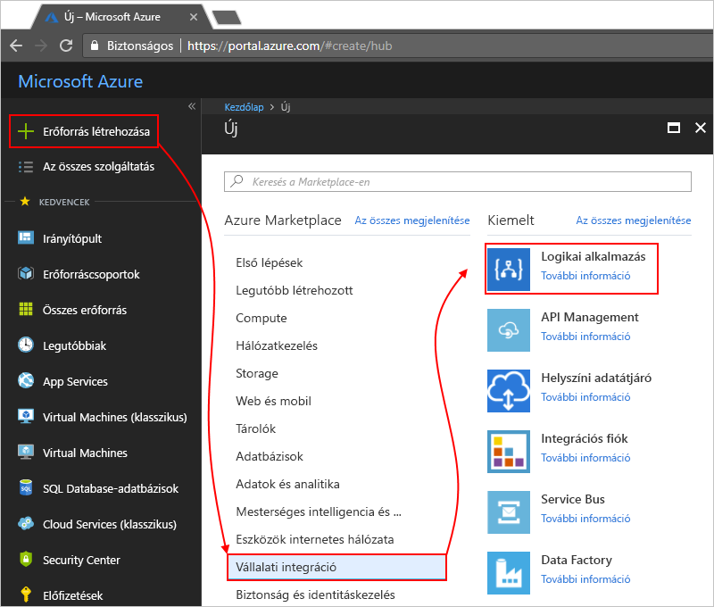

# Logikai alkalmazás figyelése és a get észrevételeket Naplóelemzési fut

Figyelési és gazdagabb hibakeresési információ bekapcsolása Naplóelemzési logikai alkalmazás létrehozásakor egy időben. A Naplóelemzési biztosít naplózásának és figyelésének a logikai alkalmazásnak diagnosztika futtatása az Azure portálon keresztül. A Logic Apps-kezelési megoldás hozzáadásakor összesített állapotának beolvasása a logic app futtatása és a kívánt részletes adatok, például állapot, a végrehajtási idő, a ismételt továbbítása során állapot és a korrelációs azonosító.

Ez a cikk bemutatja, hogyan bekapcsolása Naplóelemzési futásidejű események és a logikai alkalmazásnak adatok futtassa.

 > [!TIP]
 > A meglévő logic Apps alkalmazások figyeléséhez, az alábbi lépéseket követve [diagnosztikai naplózás bekapcsolásához és a logic app futásidejű adatokat küldeni a Naplóelemzési](../logic-apps/logic-apps-monitor-your-logic-apps.md#azure-diagnostics).

## Követelmények

Mielőtt elkezdené, szükség van a Naplóelemzési munkaterület. Ismerje meg, [a Naplóelemzési munkaterület létrehozása](../log-analytics/log-analytics-quick-create-workspace.md). 

## A logic apps létrehozásakor diagnosztikai naplózás bekapcsolása

1. A [Azure-portálon](https://portal.azure.com), logikai alkalmazás létrehozása. Válasszon **hozzon létre egy erőforrást** > **vállalati integrációs** > **logikai alkalmazás**.

   

2. Az a **hozzon létre logikai alkalmazás** lapján látható ezen feladatok végrehajtásával:

   1. Adjon meg egy nevet a Logic Apps alkalmazást, és válassza ki az Azure-előfizetéshez. 
   2. Hozzon létre vagy válasszon ki egy Azure-erőforráscsoportot.
   3. Állítsa be **Analytics jelentkezzen** való **a**. 
   Válassza ki a Naplóelemzési munkaterület, ahol szeretné elküldeni a adatait a Logic Apps alkalmazást futtat. 
   4. Ha elkészült, válassza ki a **rögzítés az irányítópulton** > **létrehozása**.

      

      Ez a lépés befejezése után az Azure létrehoz a logikai alkalmazás, amely mostantól a Naplóelemzési munkaterület társított. 
      Is, ez a lépés is automatikusan telepíti a Logic Apps-kezelési megoldás a munkaterületen.

3. Megtekintheti a Logic Apps alkalmazást futtat, [folytassa a következő lépéseket](#view-logic-app-runs-oms).

## A Logic Apps-kezelési megoldás telepítése

Ha Ön már engedélyezve van a Naplóelemzési a logikai alkalmazás létrehozása után, kihagyhatja ezt a lépést. Már van a Logic Apps felügyeleti megoldás, telepítve.

1. Az a [Azure-portálon](https://portal.azure.com), válassza a **több szolgáltatások**. Keresse meg a "naplóelemzési" szűrőként, és válassza a **Naplóelemzési** látható módon:

   

2. A **Naplóelemzési**, található, és válassza ki a Naplóelemzési munkaterület. 

   

3. A **felügyeleti**, válassza a **áttekintése**.

   

4. – Áttekintés lapon válassza a **Hozzáadás** a megoldások csempe megnyitásához. 

   

5. Görgessen végig a listáját **megoldások**, válassza ki **Logic Apps felügyeleti** megoldás, és válassza a **létrehozása** telepíti a – áttekintés oldalra.

   

## A Logic Apps alkalmazást futtat a Naplóelemzési munkaterület megjelenítése

1. A szám és a logic app kísérletekhez állapotának megtekintéséhez nyissa meg a Naplóelemzési munkaterület áttekintő lapja. Tekintse át a részleteket a a **Logic Apps felügyeleti** csempére.

   

2. További információt a logic app futtatása az összefoglaló megtekintéséhez válassza a **Logic Apps felügyeleti** csempére.

   A logic app fut itt, név, illetve végrehajtási állapot szerint vannak csoportosítva. A műveleteket vagy a logic app kísérletekhez Eseményindítók hibáinak adatait is megtekintheti.

   
   
3. Az összes fut, egy adott logikai alkalmazást vagy az állapot megtekintéséhez jelölje ki a logikai alkalmazás vagy egy állapotát.

   Íme egy példa, amely megjeleníti az adott logikai alkalmazás a fut:

   

   Ezen a lapon két speciális lehetőség áll rendelkezésre:
   * **Nyomon követheti a tulajdonságok:** ebben az oszlopban látható a nyomon követett tulajdonságok, műveletek, a logikai alkalmazás szerint vannak csoportosítva. A nyomon követett tulajdonságainak megtekintéséhez válassza **nézet**. Az oszlop szűrő segítségével kereshet a nyomon követett tulajdonságok.
   
     

     Minden újonnan hozzáadott nyomon követett tulajdonság csak akkor jelennek meg, hogy első alkalommal 10 – 15 percet vehet igénybe. Ismerje meg, [nyomon követett tulajdonságok hozzáadása a logikai alkalmazás](logic-apps-monitor-your-logic-apps.md#azure-diagnostics-event-settings-and-details).

   * **Küldje el újból:** is küldje el újra egy vagy több logikai alkalmazás futtatása sikertelen, a sikeres volt, vagy futó. Jelölje be a jelölőnégyzeteket a kísérletekhez küldje el újra, és válassza a kívánt **küldje el újra**. 

     

4. Az eredmények szűréséhez végezheti el az ügyféloldali és a kiszolgálóoldali szűrés.

   * Ügyféloldali szűrő: az oszlopok, válassza ki a kívánt szűrőket. 
   Néhány példa:

     

   * Kiszolgálóoldali szűrés: Válasszon egy olyan adott időkeretet, vagy fut, amely megjelenik a számát, a hatókör vezérlőt használja az oldal tetején. 
   Alapértelmezés szerint csak 1000 rekordok jelennek meg egyszerre. 
   
     
 
5. Minden művelet és az adatait a megadott futtató megtekintéséhez válasszon ki egy logikai alkalmazást futtatni egy sort.

   Íme egy példa, amely egy adott logikai alkalmazás futtatása az összes műveletet jeleníti meg:

   
   
6. Bármely eredmények lapon, a lekérdezés mögött az eredmények megtekintéséhez vagy az összes eredmény megjelenítéséhez válasszon **tekintse meg az összes**, a keresési napló lapon nyílik meg, amely.
   
   
   
   A napló lapon,
   * Egy tábla a lekérdezés eredményeinek megtekintéséhez válassza **tábla**.
   * Ha módosítani szeretné a lekérdezést, szerkesztheti a lekérdezési karakterláncot a keresési sávon. 
   A jobb teljesítmény érdekében válasszon **Advanced Analytics**.

     
     
     Itt az Azure Naplóelemzés oldalon frissítheti lekérdezések és az eredmények megtekintése a táblából. 
     Ez a lekérdezés használ [Kusto lekérdezési nyelv](https://docs.loganalytics.io/docs/Language-Reference), amelyen szerkesztheti, ha meg szeretné tekinteni, eltérő eredményeket. 

     

## További lépések

* [B2B üzenetek megfigyelése](../logic-apps/logic-apps-monitor-b2b-message.md)

