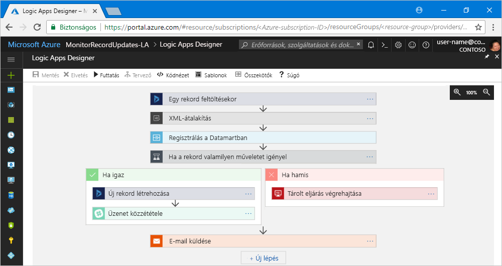

# Mi az Azure Logic Apps?

Az [Azure Logic Apps](https://azure.microsoft.com/services/logic-apps) egy olyan felhőszolgáltatás, amely segít a feladatok, üzleti folyamatok és [munkafolyamatok](#logic-app-concepts) automatizálásában és összehangolásában, amikor integrálja az alkalmazásokat, adatokat, rendszereket és szolgáltatásokat a vállalatokkal és szervezetekkel. A Logic Apps egyszerűvé, hogyan tervezhet és alkalmazás méretezhető megoldásokat hozhat létre [integrációs](https://azure.microsoft.com/product-categories/integration/), Adatintegráció, rendszerintegráció, Vállalati alkalmazásintegráció (EAI) és vállalatközi (B2B) kommunikáció, hogy található-e a felhőben, a helyszínen egyaránt.

A logikai alkalmazásokkal többek között a következő munkafolyamatok automatizálhatók:

* Rendelések feldolgozása és irányítása a helyszíni rendszerek és a felhőszolgáltatások között.
* E-mail-értesítések küldése az Office 365-tel, ha valamilyen esemény következik be különböző rendszerekben, alkalmazásokban és szolgáltatásokban.
* Feltöltött fájlok áthelyezése egy SFTP- vagy FTP-kiszolgálóról az Azure Storage-ba. 
* Egy adott témához tartozó tweetek monitorozása, vélemények elemzése, valamint riasztások és feladatok létrehozása az ellenőrzést igénylő elemekhez.

Ha az Azure Logic Apps segítségével szeretne vállalati integrációs megoldásokat létrehozni, egy egyre bővülő, [200-nál több összekötőt](../connectors/apis-list.md) kínáló választékból választhat. Ez többek között olyan szolgáltatásokat is tartalmaz, mint az Azure Service Bus, a Functions és a Storage; az SQL, az Office 365, a Dynamics, a Salesforce, a BizTalk, az SAP, az Oracle DB és a fájlmegosztások. Az [összekötők](#logic-app-concepts) [triggereket](#logic-app-concepts) és [műveleteket](#logic-app-concepts) biztosítanak az olyan logikai alkalmazások létrehozásához, amelyek valós időben, biztonságosan érik el és dolgozzák fel az adatokat.

> [!VIDEO https://channel9.msdn.com/Blogs/Azure/Introducing-Azure-Logic-Apps/player]

## A Logic Apps működése 

Minden logikai alkalmazás munkafolyamata egy eseményindítóval indul, amely akkor aktiválódik, ha egy adott esemény bekövetkezik, vagy egy adott feltételnek megfelelő új adatok válnak elérhetővé. Számos eseményindító tartalmaz alapszintű ütemezési funkciókat is, amelyekkel megadható, hogy a számítási feladatok milyen gyakran fussanak. További egyéni ütemezési forgatókönyvekért indítsa munkafolyamatait az Ütemezés eseményindítóval. További információk az [ütemezésalapú munkafolyamatok létrehozásáról](../logic-apps/tutorial-build-schedule-recurring-logic-app-workflow.md).

A Logic Apps-motor a trigger minden elindulásakor létrehoz egy logikaialkalmazás-példányt, amely futtatja a munkafolyamatban található műveleteket. Ezek a műveletek tartalmazhatnak még adatátalakítókat és folyamatvezérlőket is, például feltételes utasításokat, switch utasításokat, hurkokat és elágaztatásokat. Például a következő logikai alkalmazást egy Dynamics 365-eseményindító aktiválja, amely a beépített „Amikor egy rekord frissül” feltételt tartalmazza. Ha az eseményindító egy olyan eseményt észlel, amely megfelel ennek a feltételnek, akkor aktiválódik, majd elindítja a munkafolyamat műveleteit. Esetünkben e műveletek közé tartoznak az XML-átalakítások, az adatfrissítések, a döntések elágaztatása és ez e-mailes értesítések.

Logikai alkalmazásait vizuálisan hozhatja létre a Logic Apps Designer segítségével, amely a böngészőn keresztül az Azure Portalon, illetve a Visual Studióban érhető el. További egyéni logikai alkalmazásokért létrehozhat vagy szerkeszthet JavaScript Object Notation (JSON) logikaialkalmazás-definíciókat a „kódnézet” szerkesztő alkalmazásával. Bizonyos feladatokat Azure PowerShell-parancsokkal és az Azure Resource Manager-sablonokkal is elvégezhet. A logikai alkalmazások az Azure felhőjében üzemelnek és futnak. Egy részletesebb bevezetésért tekintse meg ezt a videót: [Azure vállalati integrációs szolgáltatások használata felhőalkalmazások futtatásához ipari méretekben](https://channel9.msdn.com/Events/Connect/2017/T119/)

## Miért érdemes a Logic Apps-et használni?

A legtöbb vállalat a digitalizáció felé halad, a Logic Apps pedig segít egyszerűbben és gyorsabban kapcsolatot teremteni a régebbi és a modern rendszerek között a Microsoft által felügyelt összekötőkként biztosított beépített API-k segítségével. Így Ön az alkalmazások üzleti logikáira és funkcióira koncentrálhat. Nem kell az alkalmazások létrehozásával, üzemeltetésével, méretezésével, felügyeletével, karbantartásával és monitorozásával foglalkoznia. Ezeket a Logic Apps elvégzi Ön helyett. Emellett a használatalapú [díjszabás](../logic-apps/logic-apps-pricing.md) keretében csak a valóban használt funkciókért kell fizetni. 

A legtöbb esetben kódot írni sem kell. De ha mégis, akkor a kódrészleteket létrehozhatja az [Azure Functions](../azure-functions/functions-overview.md) segítségével, majd igény szerint futtathatja azokat a logikai alkalmazásokból. Ha a logikai alkalmazásoknak az Azure-szolgáltatásokból, egyéni alkalmazásokból vagy más gyártóktól származó megoldásokból származó eseményekkel kell interakcióba lépniük, akkor használhatja az [Azure Event Grid](../event-grid/overview.md) szolgáltatást az események monitorozásához, útválasztásához és közzétételéhez.

A Logic Apps, a Functions és az Event Grid szolgáltatásokat teljes mértékben a Microsoft Azure felügyeli, így Önnek nem kell foglalkoznia a megoldásai létrehozásával, üzemeltetésével, méretezésével, felügyeletével és monitorozásával. A [„kiszolgáló nélküli” alkalmazások és megoldások](../logic-apps/logic-apps-serverless-overview.md) létrehozásának képessége lehetővé teszi, hogy Ön csak az üzleti logikával foglalkozzon. A szolgáltatások az igényekhez igazodva automatikusan elvégzik a méretezést, felgyorsítják az integrációkat és lehetővé teszik robusztus felhőalkalmazások létrehozását úgy, hogy közben csak minimális kódírásra van szükség. Emellett a használatalapú [díjszabás](../logic-apps/logic-apps-pricing.md) keretében csak a valóban használt funkciókért kell fizetni. 

Az [ügyféltörténetekből](https://aka.ms/logic-apps-customer-stories) többet is megtudhat arról, hogy az egyes vállalatok hogyan tudtak nagyobb rugalmasságot elérni és jobban a fő üzleti tevékenységeikre koncentrálni, amikor a Logic Apps-alkalmazásokat egyéb Azure-szolgáltatásokkal és Microsoft-termékekkel kombinálták.

További információk a Logic Apps által kínált képességekről és előnyökről:

### Munkafolyamatok vizuális létrehozása könnyen használható eszközökkel

A vizuális tervezőeszközökkel időt takaríthat meg és egyszerűsítheti az összetett folyamatokat. A logikai alkalmazások létrehozásának minden lépését elvégezheti a Logic Apps Designer segítségével, amely a böngészőből az Azure Portalon, illetve a Visual Studióban is elérhető. Indítsa el a munkafolyamatot egy eseményindítóval, majd adjon hozzá bármennyi műveletet az [összekötő-katalógusból](../connectors/apis-list.md).

### Gyorsabban láthat munkához a logikai alkalmazások sablonjaival

A gyakran használt megoldásokat gyorsabban létrehozhatja, ha a [sablonkatalógus](../logic-apps/logic-apps-create-logic-apps-from-templates.md) előre megadott munkafolyamatai közül választ. A sablonok az egyszerű SaaS-kapcsolatokat biztosító alkalmazásoktól a speciális B2B-megoldásokig terjednek, de van néhány olyan is, amely csak kedvtelésből készült. További információk: [Logikai alkalmazások létrehozása előre megadott sablonból](../logic-apps/logic-apps-create-logic-apps-from-templates.md).

### Különböző környezetek különálló rendszereinek csatlakoztatása

Bizonyos mintákat és munkafolyamatokat könnyű leírni, de annál nehezebb a programkódban implementálni. A logikai alkalmazások segítenek zökkenőmentes kapcsolatot teremteni a helyszíni és a felhőkörnyezetekben található különálló rendszerek között. Például összekapcsolhat egy felhőbeli marketingmegoldását a helyszíni számlázórendszerrel, vagy központosíthatja az API-k és rendszerek közötti üzenetküldést egy Enterprise Service Bus segítségével. A logikai alkalmazásokkal gyors, megbízható és konzisztens módon hozhatók létre újrahasznosítható és újrakonfigurálható megoldások ezekhez a forgatókönyvekhez.

### Vállalati integrációk és B2B-forgatókönyvek első osztályú támogatása

A vállalatok és az intézmények az iparági szabványoknak megfelelő, de különböző üzenetküldési protokollok és formátumok (pl. EDIFACT, AS2 és X12) használatával kommunikálnak egymással elektronikus formában. Az [Enterprise Integration Pack (EIP)](../logic-apps/logic-apps-enterprise-integration-overview.md) segítségével olyan logikai alkalmazásokat hozhat létre, amelyek átalakítják a partnerek által használt formátumban lévő üzeneteket saját intézménye rendszerei által felismerhető és feldolgozható formátumokba. A logikai alkalmazások ezeket az átalakításokat zökkenőmentesen és biztonságosan intézik, titkosítás és digitális aláírások használatával.

Kezdjen kicsiben a jelenlegi rendszereivel és szolgáltatásaival, majd érjen el folyamatos növekedést a saját tempójában. Ha készen áll, a Logic Apps és az EIP segítségével megvalósíthat és vertikálisan felskálázhat olyan fejlettebb integrációs forgatókönyveket, amelyek többek között a következő funkciókat biztosítják:

* Használja a következő termékeket és szolgáltatásokat:

  * [Microsoft BizTalk Server](https://docs.microsoft.com/biztalk/core/introducing-biztalk-server)
  * [Azure Service Bus](../service-bus-messaging/service-bus-messaging-overview.md)
  * [Azure Functions](../azure-functions/functions-overview.md)
  * [Azure API Management](../api-management/api-management-key-concepts.md)

* [XML-üzenetek](../logic-apps/logic-apps-enterprise-integration-xml.md) feldolgozása
* [Egybesimított fájlok](../logic-apps/logic-apps-enterprise-integration-flatfile.md) feldolgozása
* Üzenetváltás az [EDIFACT](../logic-apps/logic-apps-enterprise-integration-edifact.md), [AS2](../logic-apps/logic-apps-enterprise-integration-as2.md), és [X12](../logic-apps/logic-apps-enterprise-integration-x12.md) protokollokkal
* A B2B összetevők és egyéb elemek tárolása és kezelése egy helyen az [integrációs fiókok](../logic-apps/logic-apps-enterprise-integration-accounts.md) segítségével:

  * [Partnerek](../logic-apps/logic-apps-enterprise-integration-partners.md)
  * [Egyezmények](../logic-apps/logic-apps-enterprise-integration-agreements.md) 
  * [XML-átalakítási leképezések](../logic-apps/logic-apps-enterprise-integration-maps.md)
  * [XML-érvényesítési sémák](../logic-apps/logic-apps-enterprise-integration-schemas.md)
   
Ha például a Microsoft BizTalk Servert használja, a logikai alkalmazások a [BizTalk Server-összekötő](../connectors/apis-list.md#on-premises-connectors) segítségével kommunikálhatnak a BizTalk Serverrel. Ezután BizTalk-szerű műveleteket végezhet és terjeszthet ki a logikai alkalmazásokban [integrációs fiókösszekötők](../connectors/apis-list.md#integration-account-connectors) hozzáadásával, amelyek az Enterprise Integration Packban érhetők el. 

Ez fordítva is működik, a BizTalk Server csatlakozhat a logikai alkalmazásokhoz és kommunikálhat velük a [Logic Appshez való Microsoft BizTalk Server-adapter](https://www.microsoft.com/download/details.aspx?id=54287) segítségével. Ismerje meg, hogyan [állítható be és használható a BizTalk Server-adapter](https://docs.microsoft.com/biztalk/core/logic-app-adapter) a BizTalk Serverben.

### Írja meg egyszer, használja újra bármikor

Hozza létre logikai alkalmazásait sablonként, hogy több környezetben és régióban is [üzembe helyezhesse és újrakonfigurálhassa az alkalmazásait](../logic-apps/logic-apps-create-deploy-template.md).

### Beépített bővíthetőség

Ha nem találja az egyéni kódok futtatásához kívánt vagy szükséges összekötőt, akkor kibővítheti a logikai alkalmazásokat saját kódrészletei igény szerinti meghívásával az [Azure Functions](../azure-functions/functions-overview.md) szolgáltatáson keresztül. Létrehozhatja a saját [API-jait](../logic-apps/logic-apps-create-api-app.md) és [egyéni összekötőit](../logic-apps/custom-connector-overview.md), amelyeket meghívhat a logikai alkalmazásokból.

### Csak a valóban használt funkciókért kell fizetni
  
A Logic Apps használatalapú [díjszabást és méréseket](../logic-apps/logic-apps-pricing.md) használ, hacsak nincsenek korábbi, az App Service-csomagok segítségével létrehozott logikai alkalmazásai is.

Többet tudhat meg a Logic Apps szolgáltatásról az alábbi bevezető videókból:

* [Integráció a Logic Apps szolgáltatással – A nulláról a teljességig](https://channel9.msdn.com/Events/Build/2017/C9R17)
* [Vállalati integráció a Microsoft Azure Logic Apps használatával](https://channel9.msdn.com/Events/Ignite/Microsoft-Ignite-Orlando-2017/BRK2188)
* [Speciális üzleti folyamatok létrehozása a Logic Apps segítségével](https://channel9.msdn.com/Events/Ignite/Microsoft-Ignite-Orlando-2017/BRK3179)

## Fontos kifejezések:

* **A munkafolyamat**: Megjelenítheti, tervezését, létrehozását, automatizálása és üzembe helyezése az üzleti folyamatok lépésenként.

* **Felügyelt összekötők**: A logic apps adatokat, szolgáltatásokat és rendszereket hozzá kell férniük. Használhatja a Microsoft által felügyelt, előre létrehozott összekötőket, amelyek az adatok eléréséhez, hozzáféréséhez és használatához készültek. Lásd: [Az Azure Logic Apps összekötői](../connectors/apis-list.md)

* **Eseményindítók**: Számos, a Microsoft által felügyelt összekötők eseményindítókat biztosítanak, amelyek értesíti, ha az eseményeket, illetve új adat megfelel egy bizonyos feltételnek. Például ilyen esemény lehet egy e-mail érkezése vagy változtatások észlelése az Ön Azure Storage-tárfiókjában. A Logic Apps-motor az eseményindító minden elindulásakor létrehoz egy új logikaialkalmazás-példányt, amely futtatja a munkafolyamatot.

* **Műveletek**: A műveletek olyan fordulhat elő, az eseményindító aktiválása után minden lépést. Általában minden művelet egy másik művelethez vezet, amelyet egy felügyelt összekötő, egy egyéni API vagy egy egyéni összekötő határoz meg.

* **Enterprise Integration Pack**: További speciális integrálási forgatókönyvek, a Logic Apps BizTalk Server-képességeket is tartalmaz. Az Enterprise Integration Pack csomag olyan összekötőket tartalmaz, amelyek megkönnyítik a logikai alkalmazások számára az érvényesítés, az átalakítás és egyéb műveletek végrehajtását.

## Miben más a Logic Apps, mint a Functions, a WebJobs vagy a Flow?

Ezen szolgáltatások mindegyike a különböző rendszerek csatlakoztatásában és „összeragasztásában” segít. Mindegyiknek megvannak a maga előnyei, épp ezért a képességeik egyesítése a legjobb módja egy méretezhető, teljes körű képességekkel rendelkező integrációs rendszer létrehozásának. További információkért lásd: [Választás a következők közül: Flow, Logic Apps, Functions és WebJobs](../azure-functions/functions-compare-logic-apps-ms-flow-webjobs.md).

## Bevezetés 

A Logic Apps a Microsoft Azure-ban üzemeltetett számos szolgáltatás egyike. Éppen ezért a használatához rendelkeznie kell Azure-előfizetéssel. Ha még nincs előfizetése, <a href="https://azure.microsoft.com/free/" target="_blank">regisztráljon egy ingyenes Azure-fiókra</a>. 

Ha már van Azure-előfizetése, próbálja ki ezt a rövid útmutatót [az első logikai alkalmazása létrehozásához](../logic-apps/quickstart-create-first-logic-app-workflow.md), amely egy RSS-hírfolyamon keresztül monitoroz egy adott weboldalt, és az új tartalmak megjelenésekor e-mailes értesítést küld.

## Támogatás és visszajelzés

* A kérdéseivel látogasson el az [Azure Logic Apps fórumára](https://social.msdn.microsoft.com/Forums/en-US/home?forum=azurelogicapps).
* A funkciókkal kapcsolatos ötletek elküldéséhez vagy megszavazásához látogasson el a [Logic Apps felhasználói visszajelzéseinek oldalára](https://aka.ms/logicapps-wish).

## További lépések

* [Forgalom ellenőrzése ütemezésalapú logikai alkalmazás használatával](../logic-apps/tutorial-build-schedule-recurring-logic-app-workflow.md)
* További információk [az Azure kiszolgáló nélküli megoldásairól](../logic-apps/logic-apps-serverless-overview.md)
* További információk [az Enterprise Integration Pack segítségével végzett B2B-integrációról](../logic-apps/logic-apps-enterprise-integration-overview.md).
