# <a name="quickstart-create-your-first-automated-workflow-with-azure-logic-apps---azure-portal"></a>Rövid útmutató: Az első automatizált munkafolyamat létrehozása az Azure Logic Apps használatával – Azure Portal

Ez a rövid útmutató bemutatja, hogyan állíthatja össze első automatizált munkafolyamatát az [Azure Logic Apps](../logic-apps/logic-apps-overview.md) segítségével. Ebben a cikkben egy olyan logikai alkalmazást fog létrehozni, amely rendszeresen ellenőrzi egy webhely RSS-hírcsatornájában lévő új elemeket. Ha új elemeket talál, a logikai alkalmazás mindegyikről e-mailt küld. Az elkészült logikai alkalmazás nagyjából a következő munkafolyamathoz hasonlít:


A jelen rövid útmutató követéséhez a Logic Apps által támogatott szolgáltató (például Office 365 Outlook, Outlook.com vagy Gmail) által üzemeltetett e-mail-fiókra van szüksége. Más szolgáltatók esetén [tekintse át az itt felsorolt összekötőket](https://docs.microsoft.com/connectors/). Ez a logikai alkalmazás Office 365 Outlook-fiókot használ. Ha más e-mail-fiókot használ, a lépések ugyanazok, de a felhasználói felület kissé eltérhet. 

Ha nem rendelkezik Azure-előfizetéssel, <a href="https://azure.microsoft.com/free/" target="_blank">regisztrálhat egy ingyenes Azure-fiókra</a>.

## <a name="sign-in-to-the-azure-portal"></a>Jelentkezzen be az Azure Portalra

Jelentkezzen be az <a href="https://portal.azure.com" target="_blank">Azure Portalra</a> az Azure-fiókja hitelesítő adataival.

## <a name="create-your-logic-app"></a>A logikai alkalmazás létrehozása 

1. Az Azure fő menüjéből válassza az **Erőforrás létrehozása** > **Integráció** > **Logic App** elemet.

   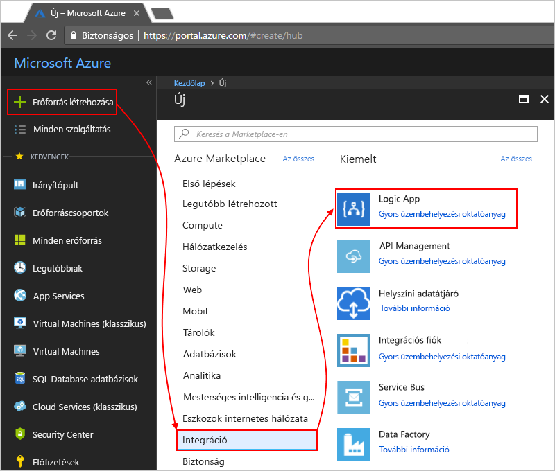

3. A **Logikai alkalmazás létrehozása** területen adja meg a logikai alkalmazás részleteit az itt látható módon. Ha elkészült, válassza a **Rögzítés az irányítópulton** > **Létrehozás** lehetőséget.

   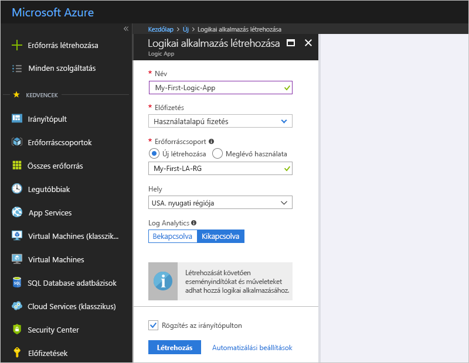

   | Tulajdonság | Érték | Leírás | 
   |----------|-------|-------------| 
   | **Name (Név)** | MyFirstLogicApp | A logikai alkalmazás neve | 
   | **Előfizetés** | <*your-Azure-subscription-name*> | Az Azure-előfizetés neve | 
   | **Erőforráscsoport** | My-First-LA-RG | A kapcsolódó erőforrások rendezéséhez használt [Azure-erőforráscsoport](../azure-resource-manager/resource-group-overview.md) neve | 
   | **Hely** | USA nyugati régiója | A logikai alkalmazás információinak tárolására szolgáló régió | 
   | **Log Analytics** | Ki | A diagnosztikai naplózáshoz maradjon a **Ki** beállításnál. | 
   |||| 

3. Miután az Azure üzembe helyezte az alkalmazást, megnyílik a Logic Apps Designer, és egy bemutató videót és a gyakran használt eseményindítókat tartalmazó oldalt jelenít meg. A **Sablonok** területen válassza az **Üres logikai alkalmazás** elemet.

   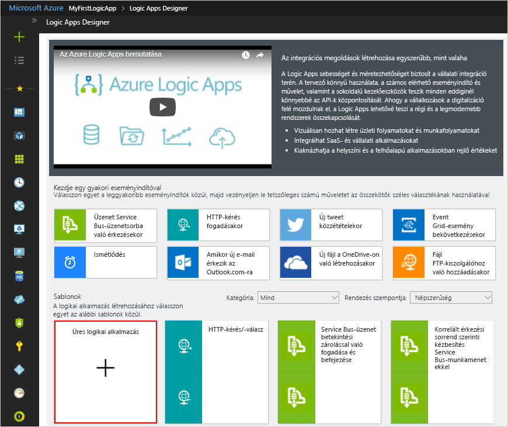

Ezután adjon hozzá egy [eseményindítót](../logic-apps/logic-apps-overview.md#logic-app-concepts), amely egy új RSS-hírcsatornaelem megjelenésekor aktiválódik. Mindegyik logikai alkalmazásnak egy eseményindítóval kell indulnia, amelyet egy adott esemény vagy adott feltételek teljesülése aktivál. A Logic Apps-motor az eseményindító minden elindulásakor létrehoz egy logikaialkalmazás-példányt, amely elindítja és futtatja a munkafolyamatot.

<a name="add-rss-trigger"></a>

## <a name="check-rss-feed-with-a-trigger"></a>RSS-hírcsatorna ellenőrzése eseményindítóval

1. A tervezőben írja be az „rss” kifejezést a keresőmezőbe. Válassza ki a következő eseményindítót: **RSS – Művelet hírcsatornaelem közzétételekor**.

   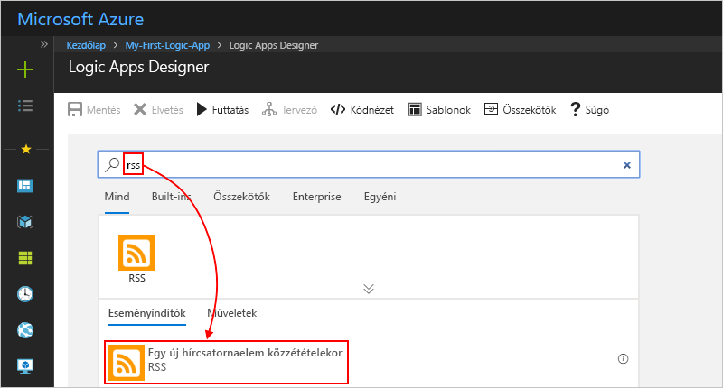

2. Adja meg az eseményindító információit az itt ismertetett módon: 

   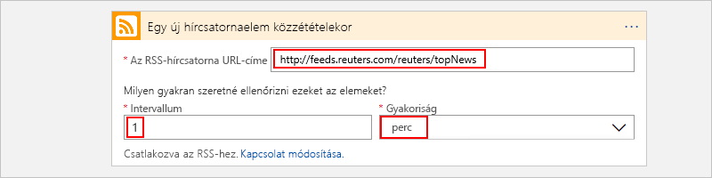

   | Tulajdonság | Érték | Leírás | 
   |----------|-------|-------------| 
   | **Az RSS-hírcsatorna URL-címe** | ```http://feeds.reuters.com/reuters/topNews``` | A monitorozni kívánt RSS-hírcsatornára mutató hivatkozás | 
   | **Intervallum** | 1 | Az ellenőrzések között kivárt intervallumok száma | 
   | **Gyakoriság** | Perc | Az ellenőrzések közötti intervallumok időegysége  | 
   |||| 

   Az intervallum és a gyakoriság együtt határozza meg a logikai alkalmazás eseményindítójának ütemezését. 
   Ez a logikai alkalmazás percenként ellenőrzi a hírcsatornát.

3. Ha egyelőre el szeretné rejteni az eseményindító részleteit, kattintson az eseményindító címsorába.

   

4. Mentse a logikai alkalmazást. A tervező eszköztárán válassza a **Mentés** parancsot. 

A logikai alkalmazás most már működőképes, de mindössze annyit csinál, hogy új elemeket keres az RSS-hírcsatornában. Most adjunk hozzá egy műveletet, amely az eseményindítóra válaszol.

## <a name="send-email-with-an-action"></a>E-mail küldése művelettel

Adjunk meg egy olyan [műveletet](../logic-apps/logic-apps-overview.md#logic-app-concepts), amely e-mailt küld, ha új elem jelenik meg az RSS-hírcsatornában. 

1. A **Művelet hírcsatornaelem közzétételekor** eseményindítónál válassza az **+ Új lépés** > **Művelet hozzáadása** lehetőséget.

   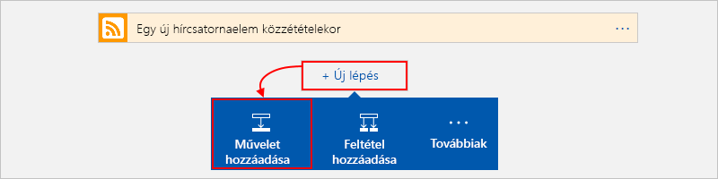

2. A **Válasszon műveletet** területen szűrőként írja be az „send an email” (e-mail küldése) szöveget. A műveletek listájáról válassza a „send an email” (e-mail küldése) műveletet a kívánt levelezési szolgáltatóhoz. 

   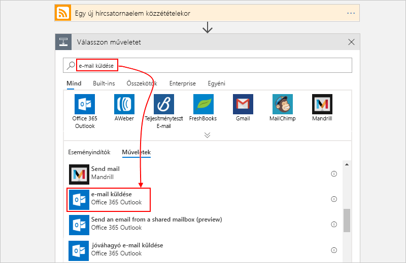

   Ha a műveletek listáját meghatározott alkalmazásra vagy szolgáltatásra szeretné szűkíteni, először válassza ki az adott alkalmazást vagy szolgáltatást:

   * Munkahelyi vagy iskolai Azure-fiókok esetében válassza az Office 365 Outlookot. 
   * Személyes Microsoft-fiókok esetében válassza az Outlook.com-összekötőt.

3. Ha a rendszer elkéri a hitelesítő adatokat, jelentkezzen be az e-mail-fiókjába, hogy a Logic Apps kapcsolatot létesíthessen vele.

4. Az **E-mail küldése** műveletnél adja meg az adatokat, amelyeket hozzá szeretne adni az e-mailhez. 

   1. A **Címzett** mezőben adja meg a címzett e-mail-címét. 
   Tesztelési célokra használhatja a saját e-mail-címét.

      Egyelőre hagyja figyelmen kívül a **Dinamikus tartalom hozzáadása** megjelenő listáját. 
      Amikor valamely szerkesztőmezőbe kattint, ez a lista jelenik meg, és tartalmazza az előző lépésből átvett azon paramétereket, amelyeket bemenetként a munkafolyamatba foglalhat. 

   2. A **Tárgy** mezőbe írja be ezt a szöveget egy záró üres szóközzel: ```New RSS item: ```

      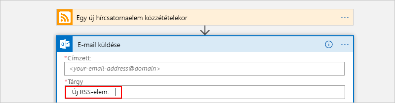
 
   3. A **Dinamikus tartalom hozzáadása** listából válassza ki az RSS-elem címébe foglalni kívánt **Hírcsatorna címe** elemet.

      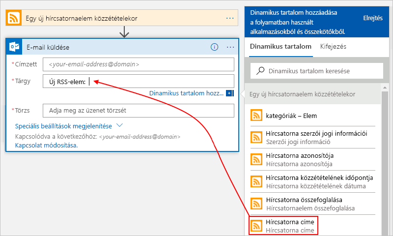

      Amikor végzett, az e-mail tárgya ehhez a példához hasonlóan néz ki:

      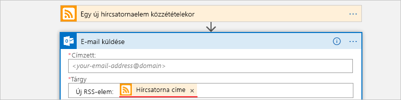

      Ha egy „For each” hurok jelenik meg a tervezőn, akkor tömböz tartozó tokent választott ki, például a **categories-item** tokent. 
      Az ilyen tokentípusoknál a tervező automatikusan hozzáadja ezt a hurkot a tokenre hivatkozó művelet köré. 
      Így a logikai alkalmazás a tömb mindegyik elemén végrehajtja ugyanazt a műveletet. 
      A hurok eltávolításához válassza a hurok címsorán lévő **három pontot** (**...**), majd válassza a **Törlés** lehetőséget.

   4. A **Törzs** mezőbe írja be a képen látható szöveget, és válassza ki a lenti tokeneket az e-mail törzséhez. 
   Ha üres sorokat kíván hozzáadni a szerkesztőmezőkhöz, nyomja le a Shift + Enter billentyűkombinációt. 

      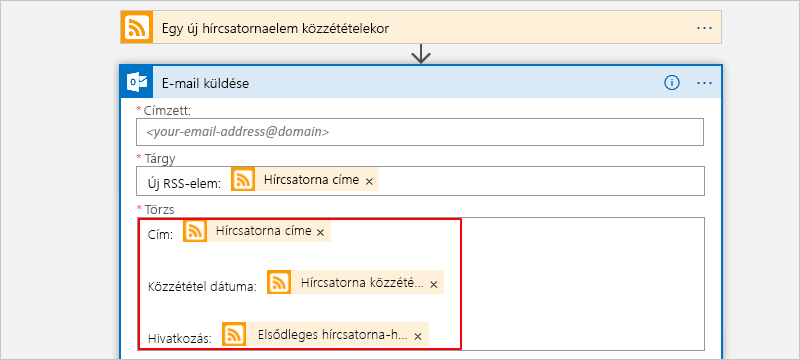

      | Tulajdonság | Leírás | 
      |----------|-------------| 
      | **Hírcsatorna címe** | Az elem címe | 
      | **Hírcsatorna közzétételének időpontja** | Az elem közzétételének dátuma és ideje | 
      | **Elsődleges hírcsatorna-hivatkozás** | Az elem URL-címe | 
      ||| 
   
5. Mentse a logikai alkalmazást.

A következő lépés a logikai alkalmazás tesztelése.

## <a name="run-your-logic-app"></a>A logikai alkalmazás futtatása

A logikai alkalmazás manuális elindításához a tervező eszköztárán válassza a **Futtatás** elemet. Azt is megvárhatja, hogy a logikai alkalmazás ellenőrizze az RSS-hírcsatornát a megadott ütemezés szerint (percenként egyszer). Ha az RSS-hírcsatornában új elemek vannak, a logikai alkalmazás e-mailt küld minden új elemről. Ha nincsenek, a logikai alkalmazás megvárja a következő esedékes időpontot, mielőtt újra elvégezné az ellenőrzést. 

Példa a logikai alkalmazás által küldött e-mailekre. Ha nem kap e-mailt, ellenőrizze a levélszemét mappát.

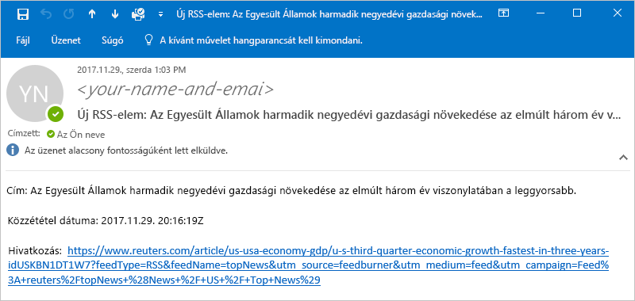

A gyakorlatban ez úgy néz ki, hogy amikor a trigger ellenőrzi az RSS-hírcsatornát és új elemeket talál, akkor aktiválódik, és a Logic Apps-motor létrehozza a logikaialkalmazás-munkafolyamat egy példányát, amely futtatja a munkafolyamat részét képező műveleteket.
Ha a trigger nem talál elemeket, akkor nem indul el, és „kihagyja” a munkafolyamat-példány létrehozását.

Gratulálunk! Sikeresen felépítette és futtatta az első logikai alkalmazását az Azure Portallal.

## <a name="clean-up-resources"></a>Az erőforrások eltávolítása

Ha már nincs szükség erre a mintára, törölje a logikai alkalmazást és a kapcsolódó erőforrásokat tartalmazó erőforráscsoportot. 

1. Az Azure főmenüjében lépjen az **Erőforráscsoportok** elemre, és válassza ki a logikai alkalmazás erőforráscsoportját. Az **Áttekintés** lapon válassza az **Erőforráscsoport törlése** lehetőséget. 

   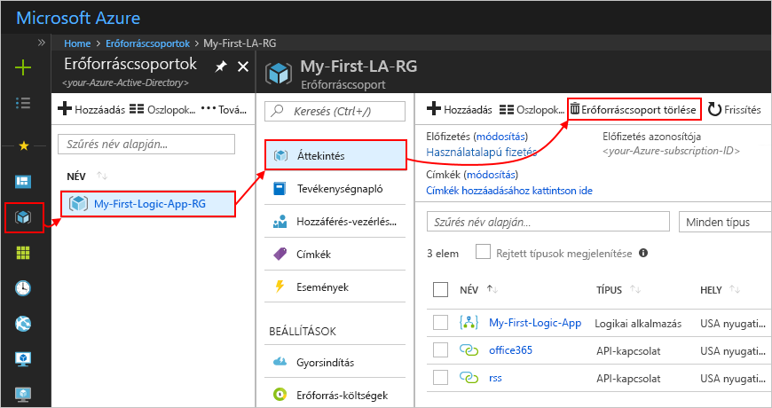

2. Megerősítésként írja be az erőforráscsoport nevét, és válassza a **Törlés** lehetőséget.

   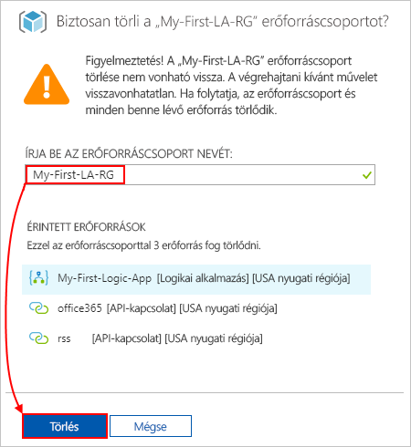

> [!NOTE]
> Amikor törli a logikai alkalmazást, a rendszer nem kezdeményez új futtatásokat. A rendszer minden folyamatban lévő és függő futtatást megszakít. Ha több ezer futtatása van, a megszakítás jelentős ideig eltarthat.

## <a name="get-support"></a>Támogatás kérése

* A kérdéseivel látogasson el az [Azure Logic Apps fórumára](https://social.msdn.microsoft.com/Forums/en-US/home?forum=azurelogicapps).
* A funkciókkal kapcsolatos ötletek elküldéséhez vagy megszavazásához látogasson el a [Logic Apps felhasználói visszajelzéseinek oldalára](http://aka.ms/logicapps-wish).

## <a name="next-steps"></a>További lépések

Ebben a rövid útmutatóban létrehozta az első logikai alkalmazását, amely RSS-frissítéseket keres a megadott ütemezés alapján (percenként), és adott műveletet végez (e-mailt küld), amikor új tartalmakat talál. Ha további ismeretekre szeretne szert tenni, folytassa ezzel az oktatóanyaggal, amely összetettebb, ütemezésalapú munkafolyamatokat hoz létre:

> [!div class="nextstepaction"]
> [Forgalom ellenőrzése ütemezésalapú logikai alkalmazás használatával](../logic-apps/tutorial-build-schedule-recurring-logic-app-workflow.md)
