# Rövid útmutató: Feladatok, folyamatok és munkafolyamatok létrehozása és automatizálása az Azure Logic Apps – Visual Studio használatával

Az [Azure Logic Apps](../logic-apps/logic-apps-overview.md) és a Visual Studio segítségével munkafolyamatokat hozhat létre olyan feladatok és folyamatok automatizálására, amelyek alkalmazásokat, adatokat, rendszereket és szolgáltatásokat integrálnak vállalatok és intézmények között. Ez a rövid útmutató bemutatja, hogyan tervezheti meg és építheti fel ezeket a munkafolyamatokat logikai alkalmazások létrehozásával a Visual Studióban, és hogyan helyezheti üzembe a létrehozott alkalmazásokat az <a href="https://docs.microsoft.com/azure/guides/developer/azure-developer-guide" target="_blank">Azure-ban</a> a felhőben. Bár ezeket a feladatokat az <a href="https://portal.azure.com" target="_blank">Azure Portalon</a> is elvégezheti, a Visual Studio lehetővé teszi, hogy logikai alkalmazásokat adjon meg a források vezérléséhez, a különböző verziók közzétételéhez, valamint különböző üzembe helyezési környezetekhez való Azure Resource Manager-sablonok létrehozásához. 

Ha még nem használta az Azure Logic Apps alkalmazást, és csak az alapvető fogalmakat szeretné megismerni, próbálja ki ehelyett [a logikai alkalmazások Azure Portalon történő létrehozásáról szóló rövid útmutatót](../logic-apps/quickstart-create-first-logic-app-workflow.md). A Logikaialkalmazás-tervező hasonlóan működik az Azure Portalon és a Visual Studióban. 

Ugyanolyan logikai alkalmazást fog létrehozni, mint az Azure Portal rövid útmutatójában, csak a Visual Studio segítségével. Ez a logikai alkalmazás monitorozza a webhelyek RSS-hírcsatornáját, és e-mailt küld a webhelyen közzétett minden új elemről. Az elkészült logikai alkalmazás nagyjából a következő munkafolyamathoz hasonlít:

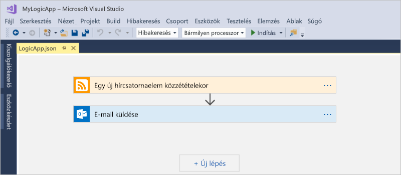

Mielőtt nekikezdene, győződjön meg arról, hogy rendelkezik a következőkkel:

* Ha nem rendelkezik Azure-előfizetéssel, <a href="https://azure.microsoft.com/free/" target="_blank">regisztráljon egy ingyenes Azure-fiókra</a>.

* Ha még nincsenek telepítve, töltse le és telepítse az alábbi eszközöket: 

  * <a href="https://www.visualstudio.com/downloads" target="_blank">Visual Studio 2017 vagy Visual Studio 2015 – Community Edition vagy újabb</a>. 
  Ez a rövid útmutató a Visual Studio Community 2017 kiadást használja, amely ingyenes.

  * <a href="https://azure.microsoft.com/downloads/" target="_blank">Microsoft Azure SDK for .NET (2.9.1 vagy újabb)</a> és <a href="https://github.com/Azure/azure-powershell#installation" target="_blank">Azure PowerShell</a>. 
  További információ az <a href="https://docs.microsoft.com/dotnet/azure/dotnet-tools?view=azure-dotnet">Azure SDK for .NET</a> készlettel kapcsolatban.

  * <a href="https://marketplace.visualstudio.com/items?itemName=VinaySinghMSFT.AzureLogicAppsToolsforVisualStudio-18551" target="_blank">Azure Logic Apps Tools for Visual Studio 2017</a> vagy a <a href="https://marketplace.visualstudio.com/items?itemName=VinaySinghMSFT.AzureLogicAppsToolsforVisualStudio" target="_blank">Visual Studio 2015-ös verziója</a>
  
    Letöltheti és telepítheti az Azure Logic Apps alkalmazást közvetlenül a Visual Studio piacteréről, vagy nézzen utána, <a href="https://docs.microsoft.com/visualstudio/ide/finding-and-using-visual-studio-extensions" target="_blank">hogyan telepítheti a bővítményt a Visual Studio rendszerén belül</a>. 
    Ne feledje, hogy a telepítés után újra kell indítani a Visual Studiót.

* A Logic Apps által támogatott e-mail-fiók, például Office 365 Outlook, Outlook.com vagy Gmail. Más szolgáltatók esetén <a href="https://docs.microsoft.com/connectors/" target="_blank">tekintse át az itt felsorolt összekötőket</a>. Ez a logikai alkalmazás az Office 365 Outlookot használja. Ha más szolgáltatót használ, a lépések ugyanazok, de a felhasználói felület kissé eltérhet.

* Internet-hozzáférés a beágyazott Logikaialkalmazás-tervező használatakor.

  A tervezőnek internetkapcsolatra van szüksége, hogy létre tudja hozni az erőforrásokat az Azure-ban, és be tudja olvasni a tulajdonságokat és adatokat a logikai alkalmazásban lévő összekötőkből. 
  Ha például a Dynamics CRM Online-összekötőt használja, a tervező elérhető alapértelmezett és egyéni tulajdonságokat keres a CRM-példányon.

## Azure erőforráscsoport-projekt létrehozása

Első lépésként hozzon létre egy [Azure erőforráscsoport-projektet](../azure-resource-manager/vs-azure-tools-resource-groups-deployment-projects-create-deploy.md). További információk az [Azure-erőforráscsoportokról és -erőforrásokról](../azure-resource-manager/resource-group-overview.md).

1. Indítsa el a Visual Studiót, és jelentkezzen be az Azure-fiókjával.

2. A **Fájl** menüben válassza az **Új** > **Projekt** elemet. (Billentyűparancs: Ctrl+Shift+N)

   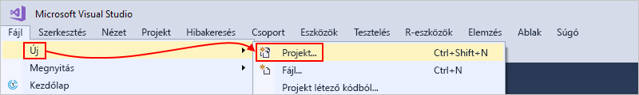

3. A **Telepítve** területen válassza a **Visual C#** vagy a **Visual Basic** elemet. Válassza a **Felhő** > **Azure-erőforráscsoport** elemet. Adjon nevet a projektnek, például a következőt:

   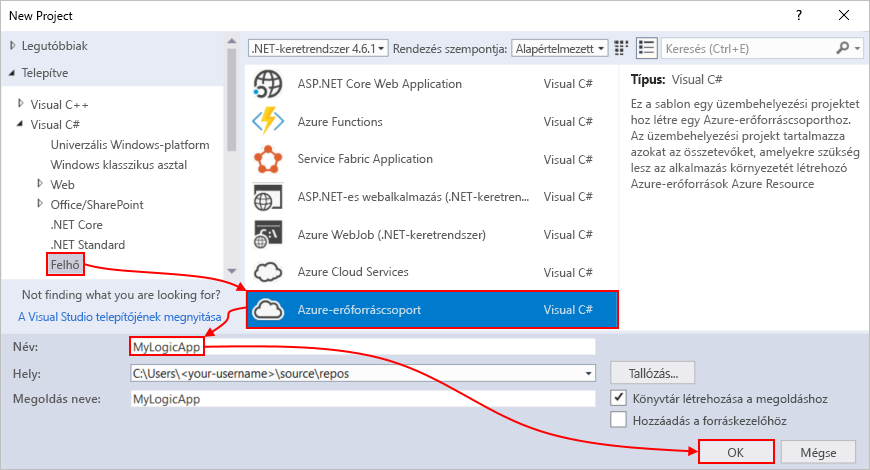

4. Válassza a **Logikai alkalmazás** sablont. 

   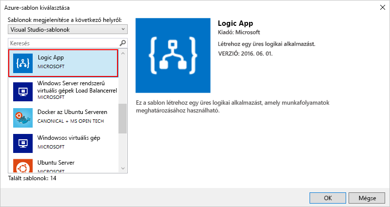

   Miután a Visual Studio létrehozta a projektet, megnyílik a Megoldáskezelő, és megjeleníti a megoldást. 

   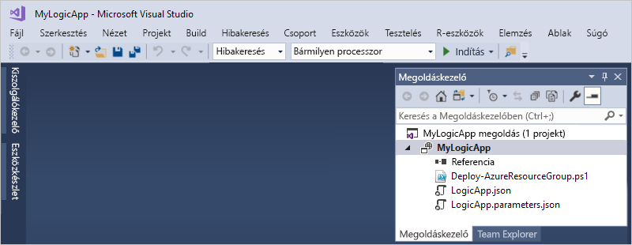

   A megoldásban a **LogicApp.json** fájl nem csak a logikai alkalmazás definícióját tárolja, hanem az üzembe helyezéshez beállítható Azure Resource Manager-sablont is.

## Üres logikai alkalmazás létrehozása

Az Azure erőforráscsoport-projekt létrehozása után hozza létre és állítsa össze a logikai alkalmazást az **Üres logikai alkalmazás** sablonból.

1. A Megoldáskezelőben nyissa meg a **LogicApp.json** fájl helyi menüjét. Válassza a lehetőséget az elem **megnyitására a Logikaialkalmazás-tervezővel**. (Billentyűparancs: Ctrl+L)

   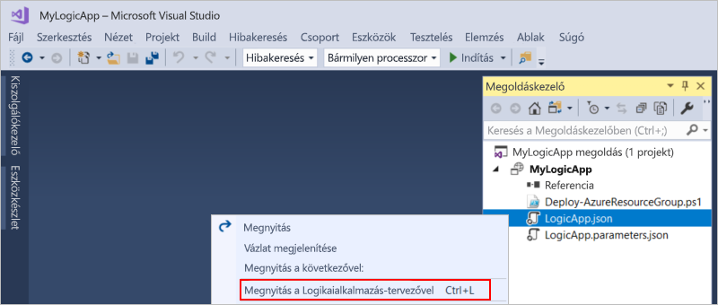

2. Az **Előfizetés** mezőben válassza ki a használni kívánt Azure-előfizetést. Az **Erőforráscsoport** mezőben válassza az **Új létrehozása...** lehetőséget, amely egy új Azure-erőforráscsoportot hoz létre. 

   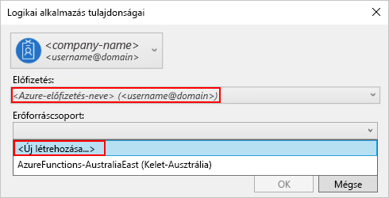

   A Visual Studiónak az Azure-előfizetésére és egy erőforráscsoportra van szüksége a logikai alkalmazással és a kapcsolatokkal társított erőforrások létrehozásához és üzembe helyezéséhez. 

   | Beállítás | Példaérték | Leírás | 
   | ------- | ------------- | ----------- | 
   | Felhasználói profilok listája | Contoso   jamalhartnett@contoso.com | Alapértelmezés szerint a bejelentkezéshez használt fiók | 
   | **Előfizetés** | Utólagos, használatalapú fizetés   (jamalhartnett@contoso.com) | Az Azure-előfizetés és a társított fiók neve |
   | **Erőforráscsoport** | MyLogicApp-RG   (USA nyugati régiója) | A logikai alkalmazáshoz kapcsolódó erőforrások tárolására és üzembe helyezésére szolgáló Azure-erőforráscsoport és hely | 
   | **Hely** | MyLogicApp-RG2   (USA nyugati régiója) | Egy másik hely, ha nem az erőforráscsoport helyét szeretné használni |
   ||||

3. Megnyílik a Logikaialkalmazás-tervező, és egy bemutató videót és a gyakran használt triggereket tartalmazó oldalt jelenít meg. Görgessen át a videón és a triggereken. A **Sablonok** területen válassza az **Üres logikai alkalmazás** elemet.

   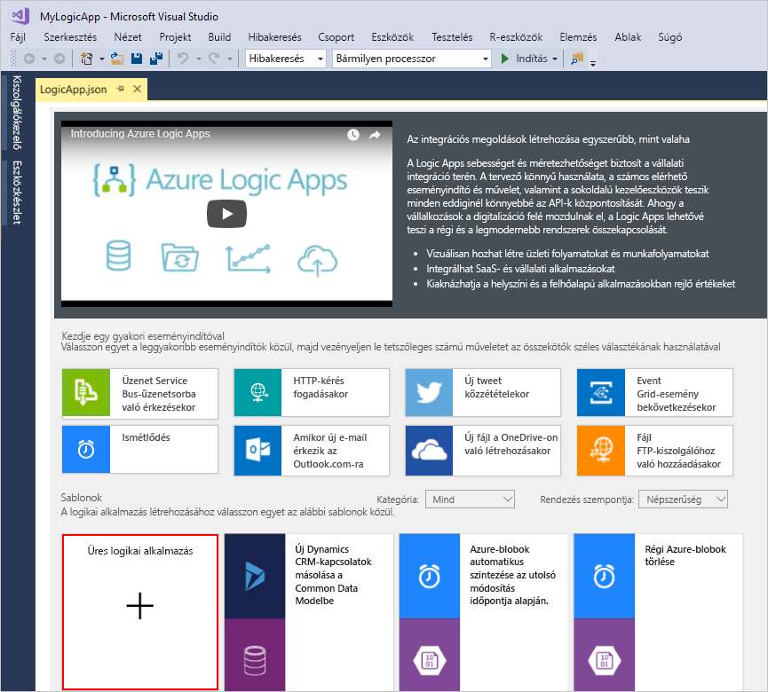

## A logikai alkalmazás munkafolyamatának felépítése

Ezután adjon hozzá egy [eseményindítót](../logic-apps/logic-apps-overview.md#logic-app-concepts), amely egy új RSS-hírcsatornaelem megjelenésekor aktiválódik. Mindegyik logikai alkalmazást egy trigger indít el, amelyet adott feltételek teljesülése aktivál. A Logic Apps-motor a trigger minden aktiválásakor létrehoz egy logikaialkalmazás-példányt, amely futtatja a munkafolyamatot.

1. A Logikaialkalmazás-tervezőben írja be az „rss” kifejezést a keresőmezőbe. Válassza ki a következő eseményindítót: **Egy új hírcsatornaelem közzétételekor**

   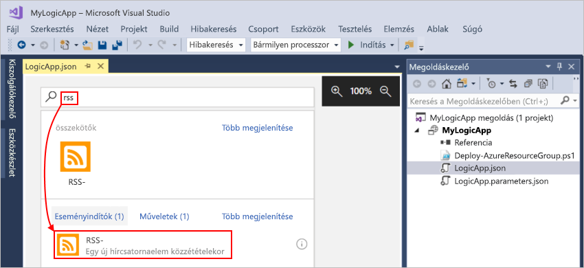

   A trigger megjelenik a tervezőben:

   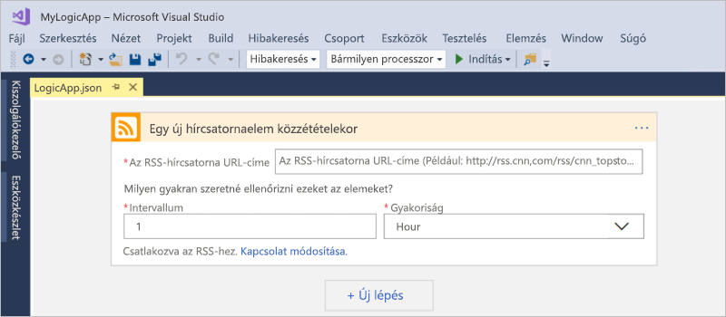

2. A logikai alkalmazás kiépítésének befejezéséhez kövesse az [Azure Portal rövid útmutatójának](../logic-apps/quickstart-create-first-logic-app-workflow.md#add-rss-trigger) munkafolyamat-lépéseit, majd térjen vissza erre a cikkre.

   Az elkészült logikai alkalmazás az alábbihoz hasonlít: 

   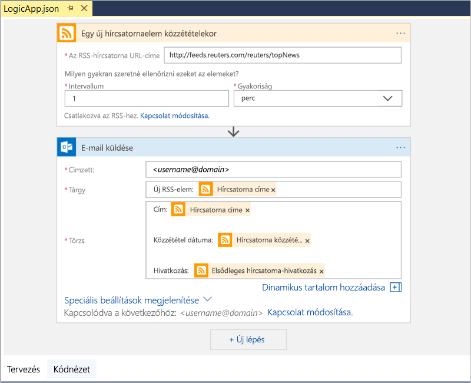

3. A logikai alkalmazás mentéséhez mentse a Visual Studio-megoldást. (Billentyűparancs: Ctrl + S)

Mielőtt tesztelhetné a logikai alkalmazást, üzembe kell helyeznie az Azure-ban.

## Logikai alkalmazás üzembe helyezése az Azure-ban

Mielőtt futtathatná a logikai alkalmazást, üzembe kell helyeznie a Visual Studióból az Azure-ba, ami csak néhány lépést igényel.

1. A Megoldáskezelőben a projekt helyi menüjéből válassza az **Üzembe helyezés** > **Új** elemet. Ha szükséges, jelentkezzen be Azure-fiókjával.

   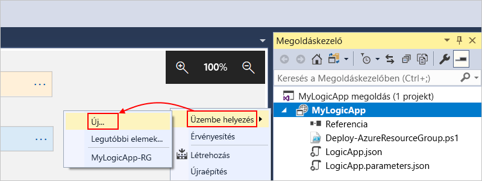

2. Az üzembe helyezéshez őrizze meg az Azure-előfizetést, az erőforráscsoportot és a többi alapértelmezett beállítást. Ha elkészült, válassza az **Üzembe helyezés** elemet. 

   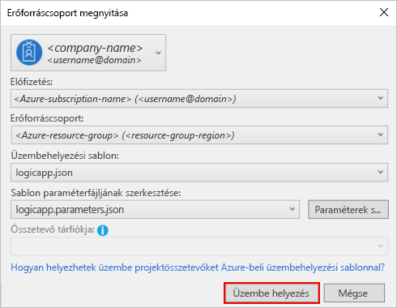

3. Ha megjelenik a **Paraméterek szerkesztése** mező, adja meg a logikai alkalmazás üzembe helyezéskor használni kívánt erőforrásnevét, majd mentse a beállításokat, például:

   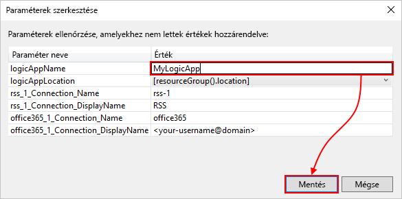

   Amikor az üzembe helyezés elindul, az alkalmazás üzembehelyezési állapota a Visual Studio **Kimenet** ablakában jelenik meg. 
   Ha az állapot nem jelenik meg, nyissa meg a **Kimenet mutatása innen** listát, és válassza ki az Azure-erőforráscsoportot.

   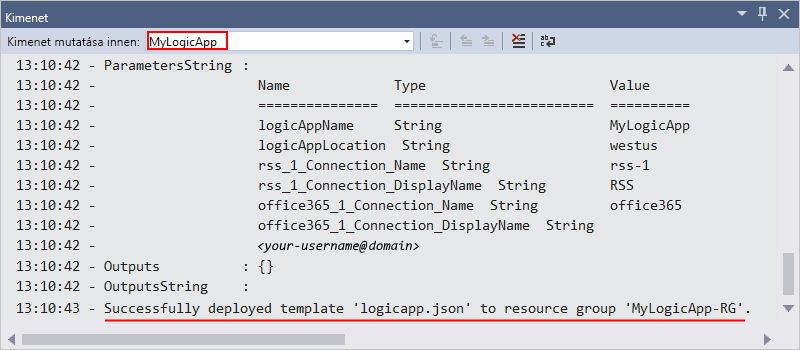

   Miután befejeződött az üzembe helyezés, a logikai alkalmazás aktiválódik az Azure Portalon, és a megadott ütemezés alapján ellenőrzi az RSS-hírcsatornát (percenként). 
   Ha az RSS-hírcsatornában új elemek vannak, a logikai alkalmazás e-mailt küld minden új elemről. 
   Ha nincsenek, a logikai alkalmazás megvárja a következő esedékes időpontot, mielőtt újra elvégezné az ellenőrzést. 

   Itt láthat példákat a logikai alkalmazás által küldött e-mailekre. 
   Ha nem kap e-mailt, ellenőrizze a levélszemét mappát. 

   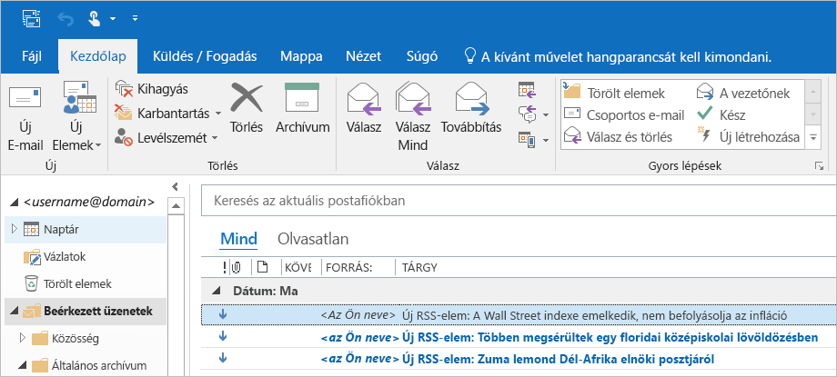

   A gyakorlatban ez úgy néz ki, hogy amikor a trigger ellenőrzi az RSS-hírcsatornát és új elemeket talál, akkor aktiválódik, és a Logic Apps-motor létrehozza a logikaialkalmazás-munkafolyamat egy példányát, amely futtatja a munkafolyamat részét képező műveleteket.
   Ha a trigger nem talál elemeket, akkor nem indul el, és „kihagyja” a munkafolyamat-példány létrehozását.

Gratulálunk, sikeresen összeállította és üzembe helyezte a logikai alkalmazást a Visual Studióval! A logikai alkalmazás kezeléséhez és az előzményeinek megtekintéséhez lásd a [logikai alkalmazások Visual Studióval történő kezelésével](../logic-apps/manage-logic-apps-with-visual-studio.md) foglalkozó cikket.

## Az erőforrások eltávolítása

Ha már nincs rá szükség, törölje a logikai alkalmazást és a kapcsolódó erőforrásokat tartalmazó erőforráscsoportot.

1. Jelentkezzen be az <a href="https://portal.azure.com" target="_blank">Azure Portalra</a> a logikai alkalmazás létrehozásához használt fiókkal. 

2. Az Azure főmenüjében válassza az **Erőforráscsoportok** lehetőséget.
Válassza ki a logikai alkalmazás erőforráscsoportját, majd kattintson az **Áttekintés** elemre.

3. Az **Áttekintés** lapon válassza az **Erőforráscsoport törlése** lehetőséget. Megerősítésként írja be az erőforráscsoport nevét, és válassza a **Törlés** lehetőséget.

   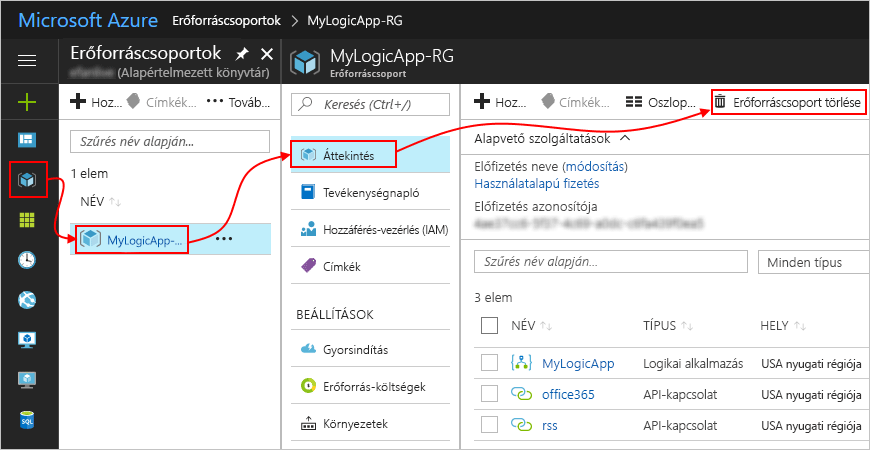

4. Törölje a Visual Studio-megoldást a helyi számítógépről.

## Támogatás kérése

* A kérdéseivel látogasson el az <a href="https://social.msdn.microsoft.com/Forums/en-US/home?forum=azurelogicapps" target="_blank">Azure Logic Apps fórumára</a>.
* A funkciókkal kapcsolatos ötletek elküldéséhez vagy megszavazásához látogasson el a <a href="http://aka.ms/logicapps-wish" target="_blank">Logic Apps felhasználói visszajelzéseinek oldalára</a>.

## További lépések

Ebben a cikkben egy logikai alkalmazást állított össze, helyezett üzembe és futtatott a Visual Studióval. A logikai alkalmazások Visual Studióval végzett kezelésére és speciális üzembe helyezésére vonatkozó további információkat ezekben a cikkekben talál:

> [!div class="nextstepaction"]
> * [Logikai alkalmazások kezelése a Visual Studióval](../logic-apps/manage-logic-apps-with-visual-studio.md)
> * [Üzembehelyezési sablonok létrehozása logikai alkalmazásokhoz a Visual Studióval](../logic-apps/logic-apps-create-deploy-template.md)
