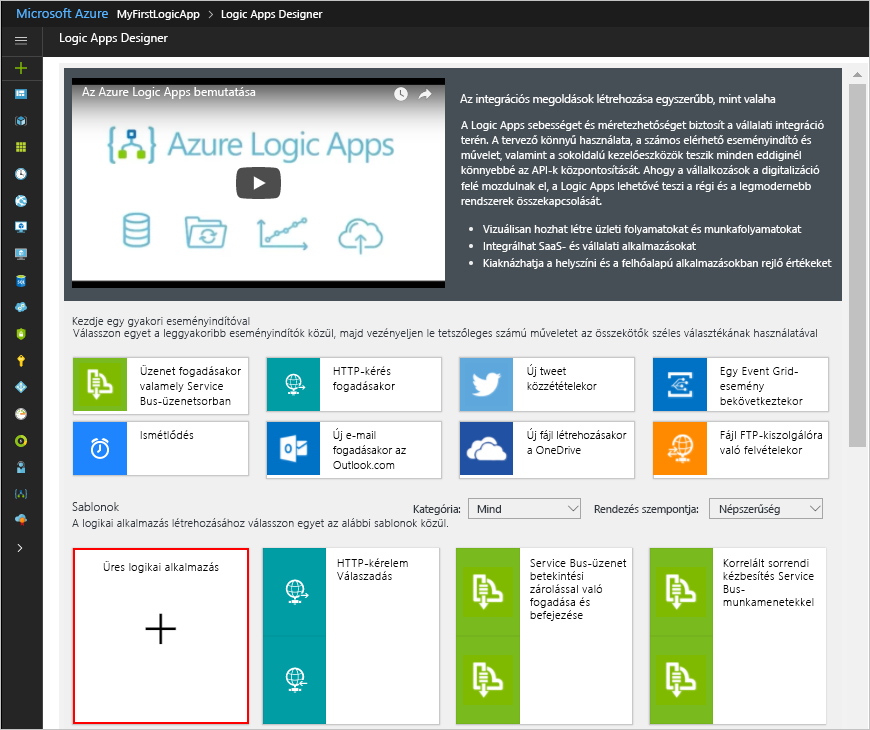

# <a name="check-traffic-with-a-scheduler-based-logic-app"></a>Forgalom ellenőrzése ütemezőn alapuló logikai alkalmazás használatával

Az Azure Logic Apps segítségével automatizálhatja az ütemezés szerint futó munkafolyamatokat. Ez az oktatóanyag bemutatja, hogyan hozhat létre egy ütemező eseményindítóval rendelkező [logikai alkalmazást](../logic-apps/logic-apps-overview.md), amely hétköznap reggelenként fut, és ellenőrzi az utazási időt két pont között, a forgalommal együtt. Ha az idő meghaladja a megadott határértéket, a logikai alkalmazás e-mailt küld, amely az utazási időt és az úti cél eléréséhez szükséges többletidőt tartalmazza.

Eben az oktatóanyagban az alábbiakkal fog megismerkedni:

> [!div class="checklist"]
> * Üres logikai alkalmazás létrehozása. 
> * Eseményindító hozzáadása, amely a logikai alkalmazás ütemezőjeként működik.
> * Művelet hozzáadása, amely lekéri az útvonal megtételéhez szükséges időt.
> * Művelet hozzáadása, amely létrehoz egy változót, átalakítja az utazási időt másodpercekből percekké, majd a változóba menti az eredményt.
> * Feltétel hozzáadása, amely összehasonlítja az utazási időt a megadott határértékkel.
> * Művelet hozzáadása, amely e-mailt küld, ha az utazási idő meghaladja a határértéket.

Az elkészült logikai alkalmazás nagyjából a következő munkafolyamathoz hasonlít:


Ha nem rendelkezik Azure-előfizetéssel, <a href="https://azure.microsoft.com/free/" target="_blank">regisztrálhat egy ingyenes Azure-fiókra</a> az eljárás megkezdése előtt.

## <a name="prerequisites"></a>Előfeltételek

* A Logic Apps által támogatott e-mail-szolgáltató (például Office 365 Outlook, Outlook.com vagy Gmail) által üzemeltetett e-mail-fiók. Más szolgáltatók esetén [tekintse át az itt felsorolt összekötőket](https://docs.microsoft.com/connectors/). Ez a rövid útmutató egy Outlook.com-fiókot használ. Ha más e-mail-fiókot használ, az általános lépések ugyanazok, a felhasználói felület azonban némiképp eltérhet.

* Az útvonal megtételéhez szükséges idő lekéréséhez szükség van a Bing Térképek API hozzáférési kulcsára. A kulcs lekéréséhez kövesse a <a href="https://msdn.microsoft.com/library/ff428642.aspx" target="_blank">Bing Térképek-kulcs lekérése</a> lépéseit. 

## <a name="sign-in-to-the-azure-portal"></a>Jelentkezzen be az Azure Portalra

Jelentkezzen be az <a href="https://portal.azure.com" target="_blank">Azure Portalra</a> az Azure-fiókja hitelesítő adataival.

## <a name="create-your-logic-app"></a>A logikai alkalmazás létrehozása

1. Az Azure fő menüjéből válassza az **Erőforrás létrehozása** > **Enterprise Integration** > **Logic App** elemet.

   

2. A **Logikai alkalmazás létrehozása** területen adja meg a logikai alkalmazás alábbi adatait az itt látható módon. Ha elkészült, válassza a **Rögzítés az irányítópulton** > **Létrehozás** lehetőséget.

   

   | Beállítás | Érték | Leírás | 
   | ------- | ----- | ----------- | 
   | **Name (Név)** | LA-TravelTime | A logikai alkalmazás neve | 
   | **Előfizetés** | <*your-Azure-subscription-name*> | Az Azure-előfizetés neve | 
   | **Erőforráscsoport** | LA-TravelTime-RG | A kapcsolódó erőforrások rendezéséhez használt [Azure-erőforráscsoport](../azure-resource-manager/resource-group-overview.md) neve | 
   | **Hely** | USA 2. keleti régiója | A logikai alkalmazással kapcsolatos információk tárolására szolgáló régió | 
   | **Log Analytics** | Ki | A diagnosztikai naplózáshoz maradjon a **Ki** beállításnál. | 
   |||| 

3. Miután az Azure üzembe helyezte az alkalmazást, megnyílik a Logic Apps Designer, és egy bemutató videót és a gyakori logikaialkalmazás-minták sablonjait tartalmazó oldalt jelenít meg. A **Sablonok** területen válassza az **Üres logikai alkalmazás** elemet.

   

Adja hozzá az ismétlődési [eseményindítót](../logic-apps/logic-apps-overview.md#logic-app-concepts), amely a megadott ütemezés szerint aktiválódik. Minden logikai alkalmazást egy eseményindítónak kell indítania, amely akkor aktiválódik, ha egy adott esemény bekövetkezik, vagy ha az új adatok teljesítenek egy adott feltételt. További információkért lásd: [Az első logikai alkalmazás létrehozása](../logic-apps/quickstart-create-first-logic-app-workflow.md).

## <a name="add-scheduler-trigger"></a>Ütemező eseményindító hozzáadása

1. A tervezőben írja be az „ismétlődés” kifejezést a keresőmezőbe. Válassza ki a következő eseményindítót: **Ütemezés – Ismétlődés**

   

2. Az **Ismétlődés** alakzaton válassza a **három pont** (**...**) gombot, majd az **Átnevezés** lehetőséget. Nevezze át az eseményindítót a következő leírásra: ```Check travel time every weekday morning```

   

3. Az eseményindítón belül válassza a **Speciális beállítások megjelenítése** lehetőséget.

4. Adja meg az eseményindító ütemezési és ismétlődési részleteit az itt ismertetett módon:

   

   | Beállítás | Érték | Leírás | 
   | ------- | ----- | ----------- | 
   | **Intervallum** | 1 | Az ellenőrzések között kivárt intervallumok száma | 
   | **Gyakoriság** | Hét | Az ismétlődéshez használni kívánt időegység | 
   | **Időzóna** | None | Csak akkor érvényes, ha megadja a kezdési időt. Akkor hasznos, ha nem helyi időzónát ad meg. | 
   | **Kezdési idő** | None | Késlelteti az ismétlődést a megadott dátumig és időpontig. További információkért lásd: [Rendszeresen futó feladatok és a munkafolyamatok ütemezése](../connectors/connectors-native-recurrence.md). | 
   | **Ezeken a napokon** | Hétfő, kedd, szerda, csütörtök, péntek | Csak akkor érhető el, ha a **Gyakoriság** értéke „Hét” | 
   | **Ezekben az órákban** | 7, 8, 9 | Csak akkor érhető el, ha a **Gyakoriság** értéke „Hét” vagy „Nap”. Válassza ki, hogy a nap melyik órájában fusson az ismétlődés. Ez a példa 7, 8 és 9 órakor fut. | 
   | **Ezekben a percekben** | 0, 15, 30, 45 | Csak akkor érhető el, ha a **Gyakoriság** értéke „Hét” vagy „Nap”. Válassza ki, hogy a nap melyik percében fusson az ismétlődés. Ez a példa óra egésztől kezdve 15 percenként fut. | 
   ||||

   Ez az eseményindító minden hétköznap, 15 percenként aktiválódik, 7:00-tól egészen 9:45-ig. 
   Az **Előnézet** mező az ismétlődési ütemezést mutatja. 
   További információkért lásd: [Feladatok és a munkafolyamatok ütemezése](../connectors/connectors-native-recurrence.md) és [Munkafolyamat-műveletek és eseményindítók](../logic-apps/logic-apps-workflow-actions-triggers.md#recurrence-trigger).

5. Ha egyelőre el szeretné rejteni az eseményindító részleteit, kattintson az alakzat címsorába.

   

6. Mentse a logikai alkalmazást. A tervező eszköztárán válassza a **Mentés** parancsot. 

A logikai alkalmazás most már működőképes, de az ismétlődésen kívül nem csinál semmit. Most adjunk hozzá egy műveletet, amely az eseményindítóra válaszol.

## <a name="get-the-travel-time-for-a-route"></a>Útvonal megtételéhez szükséges idő lekérése

Most, hogy van eseményindítója, adjon hozzá egy olyan [műveletet](../logic-apps/logic-apps-overview.md#logic-app-concepts), amely lekéri az utazási időt két pont között. A Logic Apps biztosít egy összekötőt a Bing Térképek API-hoz, hogy könnyedén lekérhesse ezt az információt. Mielőtt hozzákezdene ehhez a feladathoz, ellenőrizze, hogy rendelkezik-e az oktatóanyag előfeltételeiben említett Bing Térképek API-kulccsal.

1. A Logic App Designerben az eseményindító területén válassza a **+ Új lépés** > **Művelet hozzáadása** elemet.

2. Keressen rá a „térképek” kifejezésre, és válassza ki a következő műveletet: **Bing Térképek – Útvonal lekérése**

3. Ha nem rendelkezik Bing Térképek-kapcsolattal, a rendszer arra kéri, hogy hozzon létre egyet. Adja meg az alábbi kapcsolati adatokat, majd válassza a **Létrehozás** lehetőséget.

   

   | Beállítás | Érték | Leírás |
   | ------- | ----- | ----------- |
   | **Kapcsolat neve** | BingMapsConnection | Adja meg a kapcsolat nevét. | 
   | **API-kulcs** | <*saját-Bing-Térképek-kulcsa*> | Adja meg a korábban kapott Bing Térképek-kulcsot. Ha nem rendelkezik Bing Térképek-kulccsal, tudja meg, <a href="https://msdn.microsoft.com/library/ff428642.aspx" target="_blank">hogyan kérhet le kulcsot</a>. | 
   | | | |  

4. Nevezze át a műveletet a következő leírásra: ```Get route and travel time with traffic```

5. Adja meg az **Útvonal lekérése** művelet részleteit az itt ismertetett módon, például:

    

   | Beállítás | Érték | Leírás |
   | ------- | ----- | ----------- |
   | **1. útvonalpont** | <*kiindulási-hely*> | Az útvonal kiindulópontja | 
   | **2. útvonalpont** | <*érkezési-hely*> | Az útvonal célállomása | 
   | **Elkerülés** | None | Az útvonal elkerülni kívánt elemei, például autópályák, útdíjak stb. | 
   | **Optimalizálás** | timeWithTraffic | Az útvonal optimalizálására szolgáló paraméter (például távolság, utazási idő a jelenlegi forgalom mellett stb.). Válassza ki a következő paramétert: „timeWithTraffic” | 
   | **Távolság mértékegysége** | <*igény-szerint*> | Az útvonalhoz használt távolság-mértékegység. A cikk a következő egységet használja: „Mérföld”  | 
   | **Közlekedési mód** | Vezetés | Az útvonalhoz használt közlekedési mód. Válassza ki a következő módot: „Vezetés” | 
   | **Tranzit dátuma és időpontja** | None | Csak a tranzit módra vonatkozik | 
   | **Dátum és időpont típusa** | None | Csak a tranzit módra vonatkozik | 
   |||| 

   További információk ezekről a paraméterekről: [Útvonal kiszámítása](https://msdn.microsoft.com/library/ff701717.aspx).

6. Mentse a logikai alkalmazást.

Ezután hozzon létre egy változót a jelenlegi utazási idő átalakításához, és másodpercek helyett percekként való tárolásához. Így nem kell megismételnie az átalakítást, és egyszerűbben használhatja az értéket a későbbi lépésekben. 

## <a name="create-variable-to-store-travel-time"></a>Változó létrehozása az utazási idő tárolásához

Előfordulhat, hogy műveleteket szeretne végrehajtani a munkafolyamat adatain, és az eredményeket fel szeretné használni a későbbi műveletekben. Ha az egyszerű újrafelhasználás vagy hivatkozás érdekében menteni szeretné az eredményeket, létrehozhat változókat a feldolgozás utáni tárolásukhoz. A logikai alkalmazásban csak a legfelső szinten hozhat létre változókat.

Alapértelmezés szerint az előző **Útvonal lekérése** művelet a jelenlegi utazási időt másodpercekben kifejezve adja vissza az **Utazás időtartama forgalommal** mezőben, a forgalommal együtt. Ha átalakítja, és inkább percekként tárolja az értéket, később átalakítás nélkül, egyszerűbben tudja felhasználni.

1. Az **Útvonal lekérése** művelet alatt válassza a **+ Új lépés** > **Művelet hozzáadása** elemet.

2. Keressen rá a „változók” kifejezésre, és válassza ki a következő műveletet: **Változók – Változó inicializálása**

   

3. Nevezze át a műveletet a következő leírásra: ```Create variable to store travel time```

4. Adja meg a változó részleteit az itt leírt módon:

   | Beállítás | Érték | Leírás | 
   | ------- | ----- | ----------- | 
   | **Name (Név)** | travelTime | A változó neve | 
   | **Típus** | Egész szám | A változó adattípusa | 
   | **Érték** | Egy kifejezés, amely átalakítja a jelenlegi utazási időt másodpercekből percekké (lásd a táblázat alatti lépéseket). | A változó kezdeti értéke | 
   |||| 

   1. Az **Érték** mező kifejezésének létrehozásához kattintson a mezőbe, hogy megjelenjen a dinamikus tartalmak listája. 
   Ha szükséges, állítsa szélesebbre a böngésző ablakát, amíg meg nem jelenik a lista. 
   A dinamikus tartalmak listájában válassza a **Kifejezés** lehetőséget. 

      

      Amikor valamely szerkesztőmezőbe kattint, megjelenik a dinamikus tartalmak listája vagy a beágyazott paraméterek listája. Ez a lista a korábbi műveletek paramétereit jeleníti meg, amelyeket bemenetként használhat a munkafolyamatban. 
      A dinamikus tartalmak listája egy kifejezésszerkesztőt is tartalmaz, amelyben függvényeket választhat ki a műveletek végrehajtásához. 
      A kifejezésszerkesztő csak a dinamikus tartalmak listájában jelenik meg.

      A böngésző szélessége határozza meg, hogy melyik lista fog megjelenni. 
      Ha a böngésző széles, a dinamikus tartalmak listája jelenik meg. 
      Ha a böngésző keskeny, a paraméterlista jelenik meg a kijelölt szerkesztőmező alatt beágyazva.

   2. A kifejezésszerkesztőbe írja be a következő kifejezést: ```div(,60)```

      

   3. Vigye az egérmutatót a kifejezésre, a bal oldali zárójel (**(**) és a vessző (**,**) közé. 
   Válassza ki a **Dinamikus tartalom** elemet.

      

   4. A dinamikus tartalmak listájában válassza az **Utazás időtartama forgalommal** lehetőséget.

      

   5. Amikor a rendszer feloldotta a mezőt a kifejezésen belül, kattintson az **OK** gombra.

      

      Megjelenik az **Érték** mező az itt látható módon:

      

5. Mentse a logikai alkalmazást.

Ezután adjon hozzá egy feltételt, amely ellenőrzi, hogy a jelenlegi utazás idő meghaladja-e a megadott határértéket.

## <a name="compare-travel-time-with-limit"></a>Az utazási idő összehasonlítása a határértékkel

1. Az előző művelet alatt válassza a **+ Új lépés** > **Feltétel hozzáadása** elemet. 

2. Nevezze át a feltételt a következő leírásra: ```If travel time exceeds limit```

3. Hozzon létre egy feltételt, amely az itt ismertetett módon ellenőrzi, hogy a **travelTime** meghaladja-e a megadott határértéket:

   1. A feltételen belül kattintson az **Érték választása** mezőbe, amely a bal oldalon (széles böngészőnézet) vagy felül (keskeny böngészőnézet) található.

   2. A dinamikus tartalmak listájából vagy a paraméterlistából válassza ki a **travelTime** mezőt a **Változók** alatt.

   3. Az összehasonlítás mezőben válassza ki a következő operátort: **nagyobb, mint**

   4. A jobb oldalon (széles nézet) vagy lent (keskeny nézet) található **Érték választása** mezőbe írja be a következő határértéket: ```15```

   Például, ha keskeny nézetben dolgozik, a következőképpen hozza létre a feltételt:

   

4. Mentse a logikai alkalmazást.

Következő lépésként adja hozzá a műveletet, amelyet a rendszer akkor hajt végre, ha az utazási idő meghaladja a határértéket.

## <a name="send-email-when-limit-exceeded"></a>E-mail küldése a határérték túllépésekor

Ezután adjon hozzá egy műveletet, amely e-mailt küld, ha az utazási idő meghaladja a határértéket. Az e-mail a jelenlegi utazási időt és a megadott útvonal teljesítéséhez szükséges többletidőt tartalmazza. 

1. A feltétel **Ha igaz** ágában válassza a **Művelet hozzáadása** lehetőséget.

2. Keressen rá az „e-mail küldése” kifejezésre, és válassza ki az e-mail-összekötőt, valamint a használni kívánt „e-mail küldése műveletet”.

   

   * Személyes Microsoft-fiókok esetében válassza az **Outlook.com** lehetőséget. 
   * Munkahelyi vagy iskolai Azure-fiókok esetében válassza az **Office 365 Outlook** lehetőséget.

3. Ha még nem rendelkezik kapcsolattal, a rendszer arra kéri, hogy jelentkezzen be az e-mail-fiókjába.

   A Logic Apps létrehoz egy kapcsolatot az e-mail-fiókjával.

4. Nevezze át a műveletet a következő leírásra: ```Send email with travel time```

5. A **Címzett** mezőben adja meg a címzett e-mail-címét. Tesztelés céljából használja a saját e-mail-címét.

6. A **Tárgy** mezőben adja meg az e-mail tárgyát és a **travelTime** változót.

   1. Írja be a ```Current travel time (minutes): ``` szöveget, záró szóközzel. 
   
   2. A paraméterlistából vagy a dinamikus tartalmak listájából válassza ki a **travelTime** elemet a **Változók** alatt. 
   
      Például, ha a böngésző keskeny nézetben jelenik meg:

      

7. A **Törzs** mezőben adja meg az e-mail törzsének tartalmát. 

   1. Írja be a ```Add extra travel time (minutes): ``` szöveget, záró szóközzel. 
   
   2. Ha szükséges, állítsa szélesebbre a böngésző ablakát, amíg meg nem jelenik a dinamikus tartalmak listája. 
   A dinamikus tartalmak listájában válassza a **Kifejezés** lehetőséget.

      

   3. A kifejezésszerkesztőbe írja be a következő kifejezést, hogy ki tudja számítani a határértéket meghaladó percek számát: ```sub(,15)```

      

   4. Vigye az egérmutatót a kifejezésre, a bal oldali zárójel (**(**) és a vessző (**,**) közé. Válassza ki a **Dinamikus tartalom** elemet.

      

   5. A **Változók** alatt válassza a **travelTime** elemet.

      

   6. Amikor a rendszer feloldotta a mezőt a kifejezésen belül, kattintson az **OK** gombra.

      

      Megjelenik a **Törzs** mező az itt látható módon:

      

8. Mentse a logikai alkalmazást.

Következő lépésként tesztelje a logikai alkalmazást, amely most az alábbi példára hasonlít:


## <a name="run-your-logic-app"></a>A logikai alkalmazás futtatása

A logikai alkalmazás manuális elindításához a tervező eszköztárán válassza a **Futtatás** elemet. Ha a jelenlegi utazási idő nem haladja meg a határértéket, a logikai alkalmazás semmi mást nem tesz, csak megvárja a következő esedékes időpontot, amikor újra elvégzi az ellenőrzést.
Ha azonban a jelenlegi utazási idő meghaladja a határértéket, kapni fog egy e-mailt, benne a jelenlegi utazási idővel és a határértéket meghaladó percek számával. Íme egy példa a logikai alkalmazás által küldött e-mailre:


Ha nem kap e-mailt, ellenőrizze a levélszemét mappát. Előfordulhat, hogy az ilyen típusú levelek fennakadnak a levélszemétszűrőn. Ha nem biztos abban, hogy a logikai alkalmazás megfelelően futott-e, tekintse meg a [logikai alkalmazás hibaelhárításával foglalkozó szakaszt](../logic-apps/logic-apps-diagnosing-failures.md).

Gratulálunk, sikeresen létrehozott és futtatott egy ütemezésen alapuló, ismétlődő logikai alkalmazást. 

Ha további logikai alkalmazásokat szeretne létrehozni, amelyek az **Ütemezés – Ismétlődés** eseményindítót használják, tekintse meg az alábbi sablonokat, amelyek a logikai alkalmazás létrehozása után válnak elérhetővé:

* Napi emlékeztetők küldésének beállítása.
* Régebbi Azure-blobok törlése.
* Üzenet hozzáadása egy Azure Storage-üzenetsorhoz.

## <a name="clean-up-resources"></a>Az erőforrások eltávolítása

Ha már nincs rá szükség, törölje a logikai alkalmazást és a kapcsolódó erőforrásokat tartalmazó erőforráscsoportot. Az Azure főmenüjében lépjen az **Erőforráscsoportok** elemre, és válassza ki a logikai alkalmazás erőforráscsoportját. Válassza az **Erőforráscsoport törlése** elemet. Megerősítésként írja be az erőforráscsoport nevét, és válassza a **Törlés** lehetőséget.


## <a name="get-support"></a>Támogatás kérése

* A kérdéseivel látogasson el az [Azure Logic Apps fórumára](https://social.msdn.microsoft.com/Forums/en-US/home?forum=azurelogicapps).
* A funkciókkal kapcsolatos ötletek elküldéséhez vagy megszavazásához látogasson el a [Logic Apps felhasználói visszajelzéseinek oldalára](http://aka.ms/logicapps-wish).

## <a name="next-steps"></a>További lépések

Ebben az oktatóanyagban létrehozott egy logikai alkalmazást, amely ellenőrzi a forgalmat a megadott ütemezés alapján (hétköznap reggelente), és végrehajt egy adott műveletet (e-mailt küld), amikor az utazási idő meghaladja a megadott határértéket. Most megismerheti, hogyan hozhat létre egy olyan logikai alkalmazást az Azure- és Microsoft-szolgáltatások, valamint más SaaS-alkalmazások integrálásával, amely levelezési listára vonatkozó kérelmeket küld el jóváhagyásra.

> [!div class="nextstepaction"]
> [Levelezési listára vonatkozó kérelmek kezelése](../logic-apps/tutorial-process-mailing-list-subscriptions-workflow.md)
