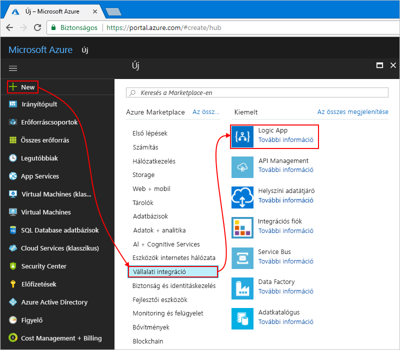

# <a name="tutorial-automate-handling-emails-and-attachments-with-azure-logic-apps"></a>Oktatóanyag: Kezelési e-maileket és mellékleteket az Azure Logic Apps automatizálása

Az Azure Logic Apps segítségével automatizálhatja a munkafolyamatait, és integrálhatja az adatokat különböző Azure- és Microsoft-szolgáltatások, más szolgáltatott szoftveralkalmazások (SaaS), valamint a helyszíni rendszerek között. Ez az oktatóanyag bemutatja, hogyan hozhat létre bejövő e-maileket és mellékleteket kezelő [logikai alkalmazásokat](../logic-apps/logic-apps-overview.md). Ez a logikai alkalmazás elemzi az e-mailek tartalmának, menti a tartalmat az Azure storage, és értesítést küld a tartalom megtekintésével. 

Eben az oktatóanyagban az alábbiakkal fog megismerkedni:

> [!div class="checklist"]
> * Az [Azure storage](../storage/common/storage-introduction.md) és a Storage Explorer konfigurálása a mentett e-mailek és mellékletek ellenőrzésére.
> * [Azure-függvény](../azure-functions/functions-overview.md) létrehozása az e-mailekben található HTML-formázás eltávolítására. Ebben az oktatóanyagban megtalálja az ehhez a függvényhez használható kódot.
> * Üres logikai alkalmazás létrehozása.
> * Eseményindító hozzáadása az e-mailek mellékleteinek figyelésére.
> * Feltétel hozzáadása annak ellenőrzéséhez, hogy az e-maileknek van-e melléklete.
> * Művelet hozzáadása az Azure-függvény meghívásához, ha egy e-mail melléklettel rendelkezik.
> * Művelet hozzáadása tárolóblobok létrehozására az e-mailek és a mellékletek számára.
> * Művelet hozzáadása e-mail-értesítések küldésére.

Az elkészült logikai alkalmazás nagyjából a következő munkafolyamathoz hasonlít:


Ha nem rendelkezik Azure-előfizetéssel, <a href="https://azure.microsoft.com/free/" target="_blank">regisztrálhat egy ingyenes Azure-fiókra</a> az eljárás megkezdése előtt. 

## <a name="prerequisites"></a>Előfeltételek

* A Logic Apps által támogatott e-mail-szolgáltató (például Office 365 Outlook, Outlook.com vagy Gmail) által üzemeltetett e-mail-fiók. Más szolgáltatók esetén [tekintse át az itt felsorolt összekötőket](https://docs.microsoft.com/connectors/).

  Ez a logikai alkalmazás Office 365 Outlook-fiókot használ. 
  Ha más e-mail-fiókot használ, az általános lépések ugyanazok, a felhasználói felület azonban némiképp eltérhet.

* Az <a href="https://storageexplorer.com/" target="_blank">ingyenes Microsoft Azure Storage Explorer</a> letöltése és telepítése. Az eszköz segítségével ellenőrizheti, hogy a Storage-tároló megfelelően van-e beállítva.

## <a name="sign-in-to-azure-portal"></a>Bejelentkezés az Azure portálra

Jelentkezzen be az <a href="https://portal.azure.com" target="_blank">Azure Portalra</a> az Azure-fiókja hitelesítő adataival.

## <a name="set-up-storage-to-save-attachments"></a>Tároló beállítása a mellékletek mentésére

A bejövő e-mailek és mellékletek blobként menthetőek egy [Azure Storage-tárolóba](../storage/common/storage-introduction.md). 

1. A Storage-tároló létrehozása előtt [hozzon létre egy tárfiókot](../storage/common/storage-quickstart-create-account.md) az alábbi beállításokkal:

   | Beállítás | Érték | Leírás | 
   |---------|-------|-------------| 
   | **Name (Név)** | attachmentstorageacct | A tárfiók neve | 
   | **Üzemi modell** | Resource Manager | Az [üzemi modell](../azure-resource-manager/resource-manager-deployment-model.md) az erőforrások üzembe helyezésének felügyeletéhez | 
   | **Fióktípus** | Általános célú | A [tárfiók típusa](../storage/common/storage-introduction.md#types-of-storage-accounts) | 
   | **Hely** | USA nyugati régiója | A tárfiókkal kapcsolatos információk tárolására szolgáló régió | 
   | **Replikáció** | Helyileg redundáns tárolás (LRS) | Ez a beállítás határozza meg az adatok másolásának, tárolásának, felügyeletének és szinkronizálásának módját. Lásd: [helyileg redundáns tárolás (LRS): Az Azure Storage alacsony költségű adatredundancia](../storage/common/storage-redundancy-lrs.md). | 
   | **Teljesítmény** | Standard | Ez a beállítás adja meg a támogatott adattípusokat és az adathordozót az adatok tárolásához. Lásd: [A tárfiókok típusai](../storage/common/storage-introduction.md#types-of-storage-accounts). | 
   | **Biztonságos átvitelre van szükség** | Letiltva | Ez a beállítás adja meg a kapcsolatokról érkező kérésekre vonatkozó biztonsági követelményeket. Lásd: [Biztonságos átvitel megkövetelése](../storage/common/storage-require-secure-transfer.md). | 
   | **Előfizetés** | <*your-Azure-subscription-name*> | Az Azure-előfizetés neve | 
   | **Erőforráscsoport** | LA-Tutorial-RG | A kapcsolódó erőforrások rendezéséhez és felügyeletéhez használt [Azure-erőforráscsoport](../azure-resource-manager/resource-group-overview.md) neve. <p>**Megjegyzés:** Egy erőforráscsoport létezik egy adott régión belül. Bár az ebben az oktatóanyagban bemutatott elemek nem feltétlenül érhetőek el minden régióban, igyekezzen ugyanazt a régiót használni, amikor csak lehetséges. | 
   | **Virtuális hálózatok konfigurálása** | Letiltva | Ebben az oktatóanyagban tartsa meg a **Letiltva** beállítást. | 
   |||| 

   A tárfiók létrehozásához az [Azure PowerShellt](../storage/common/storage-quickstart-create-storage-account-powershell.md) vagy az [Azure CLI-t](../storage/common/storage-quickstart-create-storage-account-cli.md) is használhatja.

2. Miután az Azure telepíti a tárfiókot, kérje le annak hozzáférési kulcsát:

   1. A tárfiók menüjében a **Beállítások** alatt válassza a **Hozzáférési kulcsok** lehetőséget. 

   2. Másolja a tárfiók nevét és a **key1** elemet, majd mentse ezeket az értékeket egy biztonságos helyre.

      

   A tárfiók hozzáférési kulcsát az [Azure PowerShell](https://docs.microsoft.com/powershell/module/az.storage/get-azstorageaccountkey) vagy az [Azure CLI](https://docs.microsoft.com/cli/azure/storage/account/keys?view=azure-cli-latest.md#az-storage-account-keys-list) használatával is lekérheti. 

3. Hozzon létre egy Blob Storage-tárolót az e-mail-mellékletek számára.
   
   1. A tárfiók menüjében válassza az **Áttekintés** lehetőséget. 
   A **Szolgáltatások** területen válassza a **Blobok** lehetőséget.

      

   2. Ha megnyílik a **Tárolók** lap, az eszköztáron válassza a **Tároló** elemet. 

   3. Az **Új tároló** területen a tároló neveként írja be a „mellékletek” szöveget. 
   A **Nyilvános hozzáférés szintje** alatt válassza a **Tároló (Névtelen olvasási hozzáférés tárolók és blobok esetén)** lehetőséget, majd kattintson az **OK** gombra.

      Amikor elkészült, a Storage-tárolót a tárfiókjában találja itt, az Azure Portalon:

      

   A tárfiók létrehozásához az [Azure PowerShellt](https://docs.microsoft.com/powershell/module/az.storage/new-azstoragecontainer) vagy az [Azure CLI-t](https://docs.microsoft.com/cli/azure/storage/container?view=azure-cli-latest#az-storage-container-create) is használhatja. 

Ezután csatlakoztassa a Storage Explorert a tárfiókhoz.

## <a name="set-up-storage-explorer"></a>A Storage Explorer beállítása

Most csatlakoztassa a Storage Explorert a tárfiókjához, így ellenőrizheti, hogy a logikai alkalmazás megfelelően menti-e blobokként a mellékleteket a Storage-tárolóba.

1. Nyissa meg a Microsoft Azure Storage Explorert. 

   A Storage Explorer kérni fogja a kapcsolatot a tárfiókhoz. 

2. A **Csatlakozás az Azure Storage-hoz** panelen válassza a **Tárfiók nevének és kulcsának használata** lehetőséget, és válassza a **Tovább** lehetőséget. 

   

   > [!TIP]
   > Ha nem jelenik meg figyelmeztetés, a Storage Explorer eszköztárán válassza a **Fiók hozzáadása** lehetőséget.

3. A **Fióknév** alatt adja meg a tárfiók nevét. A **Fiókkulcs** területen adja meg a korábban mentett hozzáférési kulcsot. Kattintson a **Tovább** gombra.

4. Ellenőrizze a csatlakozási adatokat, majd válassza a **Csatlakozás** elemet. 

   A Storage Explorer létrehozza a kapcsolatot, és megjelenti a tárfiókot az Explorer ablakban a **(Helyi és csatolt)** > **Tárfiókok** területen. 

5. Ha meg szeretné keresni a Blob Storage-fiókját, a **Tárfiókok** területen bontsa ki a tárfiókját, amelynek a neve jelen esetben **attachmentstorageacct**, majd bontsa ki a **Blobtárolók** elemet, ahol megtalálja a **mellékletek** tárolót, például: 

   

Ezután hozzon létre egy [Azure-függvényt](../azure-functions/functions-overview.md) a bejövő e-mailekben lévő a HTML-formázás eltávolításához.

## <a name="create-function-to-clean-html"></a>Függvény létrehozása a HTML-formázás tisztításához

Most az ezekben a lépésekben megadott kódrészlet használatával hozzon létre egy Azure-függvényt az egyes bejövő e-mailekben található HTML-formázás eltávolítására. Így az e-mailek tartalma tisztább és könnyebben feldolgozható lesz. Ez a függvény azután a logikai alkalmazásból hívható majd meg.

1. A függvény létrehozása előtt [hozzon létre egy függvényalkalmazást](../azure-functions/functions-create-function-app-portal.md) az alábbi beállításokkal:

   | Beállítás | Érték | Leírás | 
   | ------- | ----- | ----------- | 
   | **Alkalmazás neve** | CleanTextFunctionApp | A függvényalkalmazás globálisan egyedi leíró neve | 
   | **Előfizetés** | <*your-Azure-subscription-name*> | A korábban is használt Azure-előfizetés | 
   | **Erőforráscsoport** | LA-Tutorial-RG | A korábban is használt Azure-erőforráscsoport | 
   | **Szolgáltatási csomag** | Használatalapú csomag | Ez a beállítás határozza meg az erőforrások, például a számítási teljesítmény lefoglalásának és méretezésének módját a függvényalkalmazás futtatásához. Lásd a [szolgáltatási csomagok összehasonlítását](../azure-functions/functions-scale.md). | 
   | **Hely** | USA nyugati régiója | A korábban is használt régió | 
   | **Futtatókörnyezet verme** | Elsődleges nyelv | Válasszon egy olyan futtatókörnyezetet, amely támogatja a kedvenc függvényprogramozási nyelvét. Válassza ki a .NET-moduljának C# és F# funkciók. |
   | **Tárolás** | cleantextfunctionstorageacct | Hozzon létre egy tárfiókot a függvényalkalmazás számára. Csak kisbetűket és számokat használjon. <p>**Megjegyzés:** Ez a tárfiók a függvényalkalmazást tartalmazza, és a korábban létrehozott storage-fiók e-mail-mellékletek eltér. | 
   | **Application Insights** | Ki | Bekapcsolja az [Application Insights](../azure-monitor/app/app-insights-overview.md) alkalmazásmonitorozását, de ehhez az oktatóanyaghoz válassza a **kikapcsolva** beállítást. | 
   |||| 

   Ha a függvényalkalmazás az üzembe helyezést követően nem nyílik meg automatikusan, az <a href="https://portal.azure.com" target="_blank">Azure Portalon</a> találja meg. Az Azure főmenüjéből válassza az **Függvényalkalmazások** lehetőséget, majd válassza ki a függvényalkalmazását. 

   

   Ha a **Függvényalkalmazások** (Function Apps) nem jelenik meg az Azure menüjében, lépjen inkább a **Minden szolgáltatás** menüre. A keresőmezőben keressen rá a **Függvényalkalmazások** szóra. További információ: [A függvény létrehozása](../azure-functions/functions-create-first-azure-function.md).

   Ellenkező esetben az Azure automatikusan megnyitja a függvényalkalmazást, ahogy alább látható:

   

   Függvényalkalmazás létrehozásához az [Azure CLI](../azure-functions/functions-create-first-azure-function-azure-cli.md) vagy [PowerShell- és Resource Manager-sablonok](../azure-resource-manager/resource-group-template-deploy.md) is használhatóak.

2. A **Függvényalkalmazások** alatt bontsa ki a **CleanTextFunctionApp** csoportot, és válassza a **Függvények** lehetőséget. A függvények eszköztárán válassza az **Új függvény** lehetőséget.

   

3. A **Válasszon az alábbi sablonok közül vagy lépjen a gyors üzembe helyezéshez** alatt nyissa meg a **Forgatókönyv** listát, majd válassza a **Core** elemet. A **HTTP-trigger** sablonban válassza a **C#** lehetőséget.

   

   > [!NOTE]
   > Ebben a példában megtalálható a C# mintakód, így a C# ismerete nélkül is követhető a példa.

4. Az **Új függvény** panelen, a **Név** területen adja meg ezt: ```RemoveHTMLFunction```. Az **Engedélyszint** értékének adja a **Függvényt**, majd válassza a **Létrehozás** elemet.

   

5. Miután megnyílik a szerkesztő, a sablonban lévő kód helyére illessze be ezt a mintakódot, amely eltávolítja a HTML-formázást és visszaadja az eredményeket a hívónak:

   ``` CSharp
    #r "Newtonsoft.Json"

    using System.Net;
    using Microsoft.AspNetCore.Mvc;
    using Microsoft.Extensions.Primitives;
    using Newtonsoft.Json;
    using System.Text.RegularExpressions;

    public static async Task<IActionResult> Run(HttpRequest req, ILogger log)
    {
        log.LogInformation("HttpWebhook triggered");

        // Parse query parameter
        string emailBodyContent = await new StreamReader(req.Body).ReadToEndAsync();

         // Replace HTML with other characters
        string updatedBody = Regex.Replace(emailBodyContent, "<.*?>", string.Empty);
        updatedBody = updatedBody.Replace("\\r\\n", " ");
        updatedBody = updatedBody.Replace(@"&nbsp;", " ");

        // Return cleaned text
        return (ActionResult) new OkObjectResult(new { updatedBody });
    }
   ```

6. Ha elkészült, kattintson a **Mentés** gombra. A függvény teszteléséhez válassza **Tesztelés** lehetőséget a szerkesztő jobb szélén lévő nyíl (**<**) ikon alatt. 

   

7. A **Tesztelés** panelen a **Kérelem törzse** alatt írja be ezt a sort, majd kattintson a **Futtatás** gombra.

   ```json
   {"name": "<p><p>Testing my function</br></p></p>"}
   ```

   

   A **Kimenet** ablakban látható a függvény eredménye:

   ```json
   {"updatedBody":"{\"name\": \"Testing my function\"}"}
   ```

Miután ellenőrizte, hogy működik-e a függvény, készítse el a logikai alkalmazást. Bár ez az oktatóanyag bemutatja, hogyan hozhat létre olyan függvényt, amely eltávolítja az e-mailek HTML-formázását, a Logic Apps biztosít egy **HTML–szöveg** összekötőt is.

## <a name="create-your-logic-app"></a>A logikai alkalmazás létrehozása

1. Az Azure fő menüjéből válassza az **Erőforrás létrehozása** > 
**Integráció** > **Logic App** elemet.

   

2. A **Logikai alkalmazás létrehozása** területen adja meg a logikai alkalmazás alábbi adatait az itt látható módon. Ha elkészült, válassza a **Rögzítés az irányítópulton** > **Létrehozás** lehetőséget.

   

   | Beállítás | Érték | Leírás | 
   | ------- | ----- | ----------- | 
   | **Name (Név)** | LA-ProcessAttachment | A logikai alkalmazás neve | 
   | **Előfizetés** | <*your-Azure-subscription-name*> | A korábban is használt Azure-előfizetés | 
   | **Erőforráscsoport** | LA-Tutorial-RG | A korábban is használt Azure-erőforráscsoport |
   | **Hely** | USA nyugati régiója | A korábban is használt régió | 
   | **Log Analytics** | Ki | Ebben az oktatóanyagban tartsa meg a **Ki** beállítást. | 
   |||| 

3. Miután az Azure üzembe helyezte az alkalmazást, megnyílik a Logic Apps Designer, és egy bemutató videót és a gyakori logikaialkalmazás-minták sablonjait tartalmazó oldalt jelenít meg. A **Sablonok** területen válassza az **Üres logikai alkalmazás** elemet.

   

Ezután adjon hozzá egy [eseményindítót](../logic-apps/logic-apps-overview.md#logic-app-concepts), amely a melléklettel rendelkező beérkező e-maileket figyeli. Minden logikai alkalmazást egy eseményindítónak kell indítania, amely akkor aktiválódik, ha egy adott esemény bekövetkezik, vagy ha az új adatok teljesítenek egy adott feltételt. További információkért lásd: [Az első logikai alkalmazás létrehozása](../logic-apps/quickstart-create-first-logic-app-workflow.md).

## <a name="monitor-incoming-email"></a>A bejövő e-mailek monitorozása

1. A tervezőben a keresőmezőbe szűrőként írja be az „"when new email arrives” (új e-mail érkezésekor) szöveget. Válassza ezt az eseményindítót az e-mail-szolgáltatóhoz: **Új e-mail érkezésekor - <*az e-mail-szolgáltatója*>**

   Példa:

   

   * Munkahelyi vagy iskolai Azure-fiókok esetében válassza az Office 365 Outlookot. 
   * Személyes Microsoft-fiókok esetében válassza az Outlook.com-összekötőt. 

2. Ha a rendszer kéri a hitelesítő adatokat, jelentkezzen be az e-mail-fiókjába, hogy a Logic Apps kapcsolatot létesíthessen vele.

3. Most adja meg az eseményindító által az új e-mailek szűréséhez alkalmazott feltételeket.

   1. Adja meg a mappát, az időtartamot és a gyakoriságot az e-mailek ellenőrzéséhez.

      

      | Beállítás | Érték | Leírás | 
      | ------- | ----- | ----------- | 
      | **Mappa** | Beérkezett üzenetek | Az ellenőrizni kívánt e-mail-mappa | 
      | **Intervallum** | 1 | Az ellenőrzések között kivárt intervallumok száma | 
      | **Gyakoriság** | Perc | Az ellenőrzések közötti intervallumok időegysége | 
      |  |  |  | 
  
   2. Kattintson a **Speciális beállítások megjelenítése** elemre, és adja meg az alábbi beállításokat:

      | Beállítás | Érték | Leírás | 
      | ------- | ----- | ----------- | 
      | **Melléklettel rendelkezik** | Igen | Csak a melléklettel rendelkező e-mailek beolvasása. <p>**Megjegyzés:** Az eseményindító nem távolítja el e-mailt a fiókból, csak az új üzeneteket ellenőrzése, és feldolgozza, amelyek megfelelnek a tárgyszűrőnek. | 
      | **Mellékletek is** | Igen | A mellékletek egyszerű ellenőrzése helyett azok lekérése bemenetként a munkafolyamathoz. | 
      | **Tárgyszűrő** | ```Business Analyst 2 #423501``` | Az e-mail tárgyában keresendő szöveg | 
      |  |  |  | 

4. Ha egyelőre el szeretné rejteni az eseményindító részleteit, kattintson az eseményindító címsorába.

   

5. Mentse a logikai alkalmazást. A tervező eszköztárán válassza a **Mentés** parancsot.

   A logikai alkalmazás most már működőképes, de mindössze annyit csinál, hogy ellenőrzi az e-maileket. 
   Ezután adja hozzá egy feltételt, amely meghatározza a munkafolyamat folytatására vonatkozó kritériumokat.

## <a name="check-for-attachments"></a>Mellékletek ellenőrzése

Most adjon meg olyan feltételt, amely csak a csatolmánnyal rendelkező e-maileket választja ki.

1. Az eseményindító alatt válassza az **Új lépés** > **Feltétel hozzáadása** elemet.

   

2. Adjon egy leíróbb nevet a feltételnek.

   1. A feltétel címsorán válassza a **három pont** (**...** ) > **Átnevezés** lehetőséget.

      

   2. Nevezze át a feltételt a következő leírással: ```If email has attachments and key subject phrase```

3. Hozzon létre egy olyan feltételt, amely ellenőrzi, hogy mely e-mailnek van csatolmánya. 

   1. Az első sorban az **And** (És) alatt kattintson a bal oldali mezőbe. 
   A megjelenő dinamikus tartalomlistában válassza a **Has attachment** (Rendelkezik melléklettel) tulajdonságot.

      

   2. A középső mezőben tartsa meg az **is equal to** (egyenlő) operátort.

   3. A jobb oldali mezőbe írja be a **igaz** összehasonlítandó értéket a **rendelkezik melléklettel** tulajdonság értékét a trigger.

      

      Ha a két érték egyezik, az e-mail legalább egy melléklettel rendelkezik, a feltétel teljesül, és a munkafolyamat folytatódik.

   A kódszerkesztő ablakban megtekinthető mögöttes logikaialkalmazás-definícióban ez a feltétel az alábbi példához hasonlóan néz ki:

   ```json
   "Condition": {
      "actions": { <actions-to-run-when-condition-passes> },
      "expression": {
         "and": [ {
            "equals": [
               "@triggerBody()?['HasAttachment']",
                 "true"
            ]
         } ]
      },
      "runAfter": {},
      "type": "If"
   }
   ```

4. Mentse a logikai alkalmazást. A tervező eszköztárán válassza a **Mentés** parancsot.

### <a name="test-your-condition"></a>A feltétel tesztelése

Most tesztelje le, hogy a feltétel megfelelően működik-e:

1. Ha a logikai alkalmazás még nem futna, kattintson a **Futtatás** gombra a tervező eszköztáron.

   Ezzel a lépéssel manuálisan indíthatja a logikai alkalmazást, és nem kell megvárnia, amíg letelik a megadott időtartam. 
   Addig azonban semmi nem történik, amíg a teszt e-mail meg nem érkezik a postaládájába. 

2. Küldjön magának egy e-mailt, amely megfelel az alábbi feltételeknek:

   * Az e-mail tárgya tartalmazza az eseményindító **Tárgyszűrőjében** megadott szöveget: ```Business Analyst 2 #423501```

   * Az e-mail rendelkezik egy melléklettel. 
   Most csak hozzon létre egy üres szövegfájlt, és csatolja a fájlt az e-mailhez.

   Amint az e-mailek megérkezik, a logikai alkalmazás ellenőrzi a mellékleteket és a megadott szöveget a tárgyban.
   Ha a feltétel teljesül, az eseményindító aktiválódik, a Logic Apps-motorral létrehozat egy logikai alkalmazáspéldányt, és elindíttatja a munkafolyamatot. 

3. A logikai alkalmazás menüjében az **Áttekintés** gombra kattintva ellenőrizze, hogy az eseményindító aktiválódott, és a logikai alkalmazás sikeresen lefutott-e.

   

   Ha az eseményindító nem aktiválódott, vagy a logikai alkalmazás a sikeres aktiválás ellenére nem futott le, tekintse meg a [logikai alkalmazás hibaelhárításával foglalkozó szakaszt](../logic-apps/logic-apps-diagnosing-failures.md).

Ezt követően adja meg a **Ha igaz** ágban végrehajtandó műveleteket. Az e-mailek és esetleges mellékleteik mentéséhez törölni kell az e-mail törzsének HTML-formázását, majd blobokat létrehozni a Storage-tárolóban az e-mail és a mellékletek számára.

> [!NOTE]
> A logikai alkalmazásnak semmit nem kell tennie a **Ha hamis** ágon, azaz akkor, ha egy e-mail nem rendelkezik melléklettel. Soron kívüli feladatként az oktatóanyag befejezése után a **Ha hamis** ágban is hozzáadhat valamilyen megfelelő műveletet, amelyet végre szeretne hajtatni.

## <a name="call-removehtmlfunction"></a>A RemoveHTMLFunction meghívása

Ez a lépés hozzáadja az előzőleg létrehozott Azure-függvényt a logikai alkalmazáshoz, és az e-mail eseményindítójától érkező e-mail szövegtörzsét átadja a függvénynek.

1. A logikai alkalmazás menüjében válassza a **Logic App tervező** lehetőséget. A **Ha igaz** ágban válassza a **Művelet hozzáadása** lehetőséget.

   

2. A keresőmezőbe keresse meg az "azure functions", és válassza a következő műveletet: **Válassza ki az Azure-függvény – az Azure Functions**

   

3. Válassza ki a korábban létrehozott függvényalkalmazást: **CleanTextFunctionApp**

   

4. Most válassza ki a függvényt: **RemoveHTMLFunction**

   

5. Nevezze át a függvényalakzatot a következő leírással: ```Call RemoveHTMLFunction to clean email body```

6. Most adja meg a függvény által feldolgozandó bemenetet. 

   1. A **Kérelem törzse** mezőben adja meg a következő szöveget záró szóközzel: 
   
      ```{ "emailBody": ``` 

      Miközben a következő lépésekben ezzel a bemenettel dolgozik, érvénytelen JSON-ra figyelmeztető hibaüzenet jelenik egészen addig, amíg a bemenet helyes JSON-formázást nem kap.
      A függvény előző tesztelésekor a megadott bemenet a JavaScript Object Notation (JSON) formátumot használta. 
      Ezért a kérelem törzsének is ezt a formátumot kell követnie.

      Amíg a kurzor a **Kérelem törzse** mezőben van, megjelenik egy dinamikus tartalomlista is, amelyből kiválaszthatja a korábban már megadott tulajdonságértékeket is. 
      
   2. A dinamikus listából a **When a new mail arrives** (Új e-mail érkezésekor) alatt válassza a **Body** (Törzs) tulajdonságot. A tulajdonság után ne felejtse el beírni a záró kapcsos zárójelet: ```}```

      

   Ha elkészült, a függvény bemenete a következő példához hasonlít:

   

7. Mentse a logikai alkalmazást.

Ezután adjon hozzá egy műveletet, amely egy blobot hoz létre a tárolóban az e-mail törzsének mentéséhez.

## <a name="create-blob-for-email-body"></a>Blob létrehozása az e-mail törzséhez

1. Az **If true** (Ha igaz) szakaszban az Azure-függvénye alatt válassza a **Művelet hozzáadása** lehetőséget. 

2. A Keresés mezőbe írja be a "blob létrehozása" szűrőként, és válassza a következő műveletet: **Azure Blob Storage blob - létrehozása**

   

3. Létesítsen kapcsolatot a tárfiókkal az itt bemutatott beállításokkal. Ha elkészült, kattintson a **Létrehozás** gombra.

   

   | Beállítás | Érték | Leírás | 
   | ------- | ----- | ----------- | 
   | **Kapcsolat neve** | AttachmentStorageConnection | A kapcsolat leíró neve | 
   | **Tárfiók** | attachmentstorageacct | A mellékletek mentéséhez korábban létrehozott tárfiók neve | 
   |||| 

4. Nevezze át a **Blob létrehozása** műveletet a következő leírással: ```Create blob for email body```

5. A **Blob létrehozása** műveletnél adja meg ezeket az adatokat, és válassza ki ezeket a mezőket a blob létrehozásához az itt ismertetett módon:

   

   | Beállítás | Érték | Leírás | 
   | ------- | ----- | ----------- | 
   | **Mappa elérési útja** | /attachments | A korábban létrehozott tároló elérési útja és neve. Ehhez a példához kattintson a mappa ikonra, majd válassza az „/attachments” tárolót. | 
   | **Blob neve** | **Feladó** mező | Ehhez a példához a blob neveként használja a feladó nevét. Kattintson a mezőn belülre, hogy megjelenjen a dinamikus tartalomlista, majd a **When a new mail arrives** (Új e-mail érkezésekor) alatt válassza a **Feladó** mezőt. | 
   | **Blob tartalma** | **Tartalom** mező | Ebben a példában blobtartalomként használjon HTML-mentes e-mail-törzset. Kattintson a mezőn belülre, hogy megjelenhessen a dinamikus tartalomlista, majd a **Call RemoveHTMLFunction to clean email body** (a RemoveHTMLFunction meghívása az e-mail-törzs megtisztításához) alatt válassza a **Body** elemet. |
   |||| 

   Ha elkészült, a művelet a következő példához hasonlít:

   

6. Mentse a logikai alkalmazást. 

### <a name="check-attachment-handling"></a>A mellékletek kezelésének ellenőrzése

A következő lépés annak tesztelése, hogy a logikai alkalmazás a megadott módon kezeli-e az e-maileket:

1. Ha a logikai alkalmazás még nem futna, kattintson a **Futtatás** gombra a tervező eszköztáron.

2. Küldjön magának egy e-mailt, amely megfelel az alábbi feltételeknek:

   * Az e-mail tárgya tartalmazza az eseményindító **Tárgyszűrőjében** megadott szöveget: ```Business Analyst 2 #423501```

   * Az e-mail legalább egy melléklettel rendelkezik. 
   Most csak hozzon létre egy üres szövegfájlt, és csatolja a fájlt az e-mailhez.

   * Az e-mailek rendelkezik teszttartalmakkal a szövegtörzsben, például: 

     ```
     Testing my logic app
     ```

   Ha az eseményindító nem aktiválódott, vagy a logikai alkalmazás a sikeres aktiválás ellenére nem futott le, tekintse meg a [logikai alkalmazás hibaelhárításával foglalkozó szakaszt](../logic-apps/logic-apps-diagnosing-failures.md).

3. Ellenőrizze, hogy a logikai alkalmazás mentette-e az e-mailt a megfelelő tárolóba. 

   1. A Storage Explorerben bontsa ki a **(Local and Attached)** (Helyi és csatolt) > 
   **Tárfiókok** (Storage Accounts) > **attachmentstorageacct (External)** (külső) > 
   **Blob Containers** (Blob-tárolók) > **attachments** elemet.

   2. Ellenőrizze az **attachments** tárolóban az e-mailt. 

      Ekkor még csak az e-mail jelenik meg a tárolóban, mivel a logikai alkalmazás egyelőre nem dolgozza fel a mellékleteket.

      

   3. Amikor végzett, törölje az e-mailt a Storage Explorerben.

4. Ha szeretné, az egyelőre tétlen **Ha hamis** ág teszteléséhez küldhet egy olyan e-mailt, amely nem felel meg a feltételeknek.

Ezután adjon hozzá egy iterációt az összes e-mail-melléklet feldolgozására.

## <a name="process-attachments"></a>Mellékletek feldolgozása

Az e-mail összes melléklet feldolgozásához a logikai alkalmazás munkafolyamatához adjon hozzá egy **For each** iterációt.

1. A **Blob létrehozása az e-mail törzséhez** alatt válassza a **Továbbiak** > **For each hozzáadása** elemet.

   

2. Nevezze át az iterációt a következő leírással: ```For each email attachment```

3. Most adja meg az iteráció által feldolgozandó adatokat. Kattintson a **Kimenet választása az előző lépésekből** mezőn belülre, hogy megjelenhessen a dinamikus tartalomlista, majd válassza a **Mellékletek** elemet. 

   

   A **Mellékletek** mező egy tömböt továbbít, amely az e-mailben szereplő összes mellékletet tartalmazza. 
   A **For each** iteráció a tömbben beadott mindegyik elemre vonatkozóan megismétli a műveleteket.

4. Mentse a logikai alkalmazást.

Ezután adja hozzá a műveletet, amely az egyes mellékleteket blobként menti az **attachments** Storage-tárolóba.

## <a name="create-blob-for-each-attachment"></a>Blob létrehozása minden melléklethez

1. A **Minden e-mail-melléklethez** iterációban válassza a **Művelet hozzáadása** lehetőséget, így megadhatja az összes megtalált mellékleteken végrehajtandó feladatot.

   

2. A Keresés mezőbe írja be a "blob létrehozása" szűrőként, és válassza ki ezt a műveletet: **Azure Blob Storage blob - létrehozása**

   

3. Nevezze át a **Blob létrehozása 2** műveletet a következő leírással: ```Create blob for each email attachment```

4. A **Blob létrehozása az e-mail-mellékletek számára** műveletnél adja meg ezeket az adatokat, és válassza ki a paramétereket az egyes blobok létrehozásához az itt ismertetett módon:

   

   | Beállítás | Érték | Leírás | 
   | ------- | ----- | ----------- | 
   | **Mappa elérési útja** | /attachments | A korábban létrehozott tároló elérési útja és neve. Ehhez a példához kattintson a mappa ikonra, majd válassza az „/attachments” tárolót. | 
   | **Blob neve** | **Név** mező | Ehhez a példához a blob neveként használja a melléklet nevét. Kattintson a mezőn belülre, hogy megjelenjen a dinamikus tartalomlista, majd az **Új e-mail érkezésekor** alatt válassza a **Név** mezőt. | 
   | **Blob tartalma** | **Tartalom** mező | Ebben a példában blobtartalomként használja a **Tartalom** mezőt. Kattintson a mezőn belülre, hogy megjelenjen a dinamikus tartalomlista, majd az **Új e-mail érkezésekor** alatt válassza a **Tartalom** mezőt. |
   |||| 

   Ha elkészült, a művelet a következő példához hasonlít:

   

5. Mentse a logikai alkalmazást. 

### <a name="check-attachment-handling"></a>A mellékletek kezelésének ellenőrzése

A következő lépés annak tesztelése, hogy a logikai alkalmazás a megadott módon kezeli-e a mellékleteket:

1. Ha a logikai alkalmazás még nem futna, kattintson a **Futtatás** gombra a tervező eszköztáron.

2. Küldjön magának egy e-mailt, amely megfelel az alábbi feltételeknek:

   * Az e-mail tárgya tartalmazza az eseményindító **Tárgyszűrőjében** megadott szöveget: ```Business Analyst 2 #423501```

   * Az e-mail legalább két melléklettel rendelkezik. 
   Most csak hozzon létre két üres szövegfájlt, és csatolja a fájlokat az e-mailhez.

   Ha az eseményindító nem aktiválódott, vagy a logikai alkalmazás a sikeres aktiválás ellenére nem futott le, tekintse meg a [logikai alkalmazás hibaelhárításával foglalkozó szakaszt](../logic-apps/logic-apps-diagnosing-failures.md).

3. Ellenőrizze, hogy a logikai alkalmazás elmentette-e az e-mailt és a mellékleteket a megfelelő tárolóba. 

   1. A Storage Explorerben bontsa ki a **(Local and Attached)** (Helyi és csatolt) > 
   **Tárfiókok** (Storage Accounts) > **attachmentstorageacct (External)** (külső) > 
   **Blob Containers** (Blob-tárolók) > **attachments** elemet.

   2. Ellenőrizze az **attachments** tárolóban az e-mailt és a mellékleteket egyaránt.

      

   3. Amikor végzett, törölje az e-mailt és a mellékleteket a Storage Explorerben.

Ezután adjon meg egy műveletet, hogy a logikai alkalmazás egy e-mail-üzenetet küldjön a mellékletek áttekintésére vonatkozóan.

## <a name="send-email-notifications"></a>E-mail-értesítések küldése

1. Az a **ha igaz** ágban a **mindegyik e-mail-melléklet számára** ikonjához, válassza a **művelet hozzáadása**. 

   

2. A keresőmezőbe szűrőként írja be a „send email” (e-mail küldése) kifejezést, majd válassza a „send e-mail” műveletet a saját levelezési szolgáltatójához. 

   Ha a műveletek listáját adott szolgáltatásra szeretné szűrni, először kiválaszthatja az összekötőt.

   

   * Munkahelyi vagy iskolai Azure-fiókok esetében válassza az Office 365 Outlookot. 
   * Személyes Microsoft-fiókok esetében válassza az Outlook.com-összekötőt. 

3. Ha a rendszer kéri a hitelesítő adatokat, jelentkezzen be az e-mail-fiókjába, hogy a Logic Apps kapcsolatot létesíthessen vele.

4. Nevezze át az **E-mail küldése** műveletet a következő leírással: ```Send email for review```

5. Adja meg a művelet adatait, és válassza ki az e-mailben szerepeltetni kívánt mezőket az itt ismertetett módon. Ha üres sorokat kíván hozzáadni a szerkesztőmezőkhöz, nyomja le a Shift + Enter billentyűkombinációt.  

   

   Ha a dinamikus tartalomlistában nem találja a kívánt mezőt, válassza a **Továbbiak** lehetőséget az **Új e-mail érkezésekor** mellett. 

   | Beállítás | Érték | Megjegyzések | 
   | ------- | ----- | ----- | 
   | **Törzs** | ```Please review new applicant:``` <p>```Applicant name: ``` **Feladó** <p>```Application file location: ``` **Elérési út** <p>```Application email content: ``` **Törzs** | Az e-mail szövegtörzsének tartalma. Kattintson a mezőn belülre, írja be a példa szöveget, majd a dinamikus tartalomlistából válassza az alábbi mezőket: <p>- A **Feladó** mezőt az **Új e-mail érkezésekor** alatt </br>- Az **Elérési út** mezőt a **Blob létrehozása az e-mail törzséhez** alatt </br>- A **Törzs** mezőt a **Call RemoveHTMLFunction to clean email body** (A RemoveHTMLFunction meghívása az e-mail-törzs megtisztításához) alatt | 
   | **Tárgy**  | ```ASAP - Review applicant for position: ``` **Tárgy** | Az e-mail tárgya, amelyet használni kíván. Kattintson a mezőn belülre, írja be a példa szöveget, majd a dinamikus tartalomlistából az **Új e-mail érkezésekor** mellett válassza a **Tárgy** mezőt. | 
   | **Címzett** | <*recipient-email-address*> | Tesztelési célokra használhatja a saját e-mail-címét. | 
   |||| 

   > [!NOTE] 
   > Ha olyan mezőt választ ki, amely egy tömböt tartalmaz, például a **Tartalom** elemet, amely egy mellékleteket tartalmazó tömb, a tervező automatikusan hozzáad egy „For each” iterációt a mezőre hivatkozó művelet köré. Így a logikai alkalmazás a tömb mindegyik elemén végrehajthatja az adott műveletet. Az iteráció eltávolításához törölje a mezőt a tömbből, helyezze a hivatkozó műveletet a tömbön kívül, válassza az iteráció címsorában lévő három pontot (**...**), majd válassza a **Törlés** lehetőséget.
     
6. Mentse a logikai alkalmazást. 

Következő lépésként tesztelje a logikai alkalmazást, amely most az alábbi példára hasonlít:


## <a name="run-your-logic-app"></a>A logikai alkalmazás futtatása

1. Küldjön magának egy e-mailt, amely megfelel az alábbi feltételeknek:

   * Az e-mail tárgya tartalmazza az eseményindító **Tárgyszűrőjében** megadott szöveget: ```Business Analyst 2 #423501```

   * Az e-mail egy vagy több melléklettel rendelkezik. 
   Megint felhasználhatja az üres szövegfájlokat az előző tesztből. 
   Ha valószerűbb forgatókönyvet szeretne, csatoljon egy önéletrajzfájlt.

   * Az e-mail törzse tartalmazza a következő szöveget (másolható és beilleszthető):

     ```
     Name: Jamal Hartnett   
     
     Street address: 12345 Anywhere Road   
     
     City: Any Town   
     
     State or Country: Any State   
     
     Postal code: 00000   
     
     Email address: jamhartnett@outlook.com   
     
     Phone number: 000-000-0000   
     
     Position: Business Analyst 2 #423501   

     Technical skills: Dynamics CRM, MySQL, Microsoft SQL Server, JavaScript, Perl, Power BI, Tableau, Microsoft Office: Excel, Visio, Word, PowerPoint, SharePoint, and Outlook   

     Professional skills: Data, process, workflow, statistics, risk analysis, modeling; technical writing, expert communicator and presenter, logical and analytical thinker, team builder, mediator, negotiator, self-starter, self-managing  
     
     Certifications: Six Sigma Green Belt, Lean Project Management   
     
     Language skills: English, Mandarin, Spanish   
     
     Education: Master of Business Administration   
     ```

2. Futtassa a logikai alkalmazást. Ha sikeresen fut, a logikai alkalmazás egy, a következőhöz hasonló e-mailt küld:

   

   Ha nem kap e-mailt, ellenőrizze a levélszemét mappát. 
   Előfordulhat, hogy az ilyen típusú levelek fennakadnak a levélszemétszűrőn. 
   Ha nem biztos abban, hogy a logikai alkalmazás megfelelően futott-e, tekintse meg a [logikai alkalmazás hibaelhárításával foglalkozó szakaszt](../logic-apps/logic-apps-diagnosing-failures.md).

Gratulálunk, sikeresen létrehozott és futtatott egy logikai alkalmazást, amely feladatokat automatizál különböző Azure-szolgáltatásokban, és egyéni kódokat hív meg.

## <a name="clean-up-resources"></a>Az erőforrások eltávolítása

Ha már nincs rá szükség, törölje a logikai alkalmazást és a kapcsolódó erőforrásokat tartalmazó erőforráscsoportot. Az Azure főmenüjében lépjen az **Erőforráscsoportok** elemre, és válassza ki a logikai alkalmazás erőforráscsoportját. Válassza az **Erőforráscsoport törlése** elemet. Megerősítésként írja be az erőforráscsoport nevét, és válassza a **Törlés** lehetőséget.


## <a name="get-support"></a>Támogatás kérése

* A kérdéseivel látogasson el az [Azure Logic Apps fórumára](https://social.msdn.microsoft.com/Forums/en-US/home?forum=azurelogicapps).
* A funkciókkal kapcsolatos ötletek elküldéséhez vagy megszavazásához látogasson el a [Logic Apps felhasználói visszajelzéseinek oldalára](https://aka.ms/logicapps-wish).

## <a name="next-steps"></a>További lépések

Az oktatóanyagban létrehoztunk egy logikai alkalmazást e-mail mellékletek, feldolgozására és tárolására Azure-szolgáltatások, például az Azure Storage és az Azure Functions integrálásával. Most megismerkedhet a logikai alkalmazások létrehozásához használható egyéb összekötőkkel.

> [!div class="nextstepaction"]
> [További tudnivalók a Logic Apps összekötőiről](../connectors/apis-list.md)
