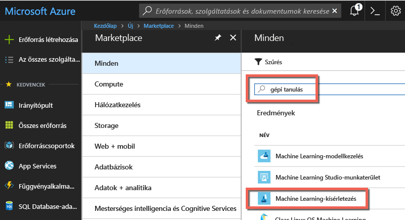
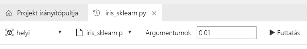
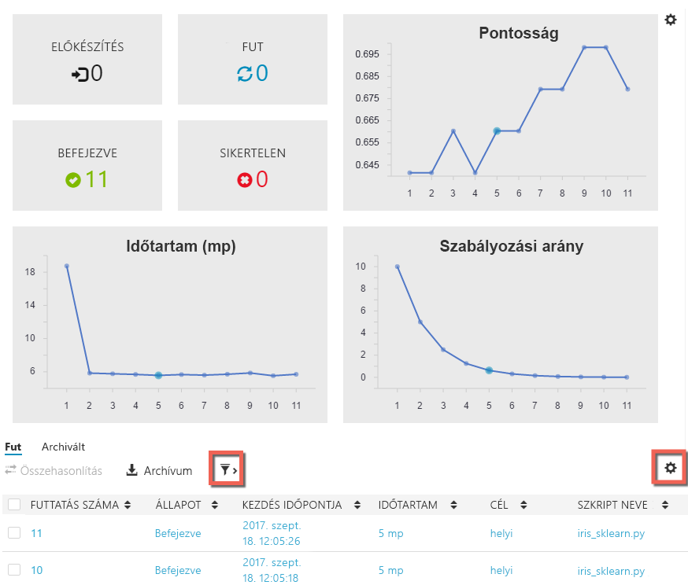

# Fiókok létrehozása az Azure Machine Learning előzetes verziójához és az Azure Machine Learning Workbench telepítése
Az Azure Machine Learning-szolgáltatások (előzetes verzió) egy átfogó, integrált és fejlett adatelemzési megoldás. A hivatásos adatszakértők számára nyújt segítséget az adatok előkészítésében, a kísérletek kidolgozásában és a modellek felhőszinten való üzembe helyezésében.

Ez a rövid útmutató bemutatja a kísérleti és modellkezelési fiókok létrehozását az Azure Machine Learning előzetes verziójában. Emellett az Azure Machine Learning Workbench részét képező asztali alkalmazás és parancssori eszközök telepítését is bemutatja. Ezután az [Iris flower adatkészlet](https://en.wikipedia.org/wiki/iris_flower_data_set) segítségével végigvesszük az Azure Machine Learning előzetes verziójának funkcióit, és létrehozunk egy modellt az írisz típusának a fizikai tulajdonságok alapján történő előrejelzéséhez.  

Ha nem rendelkezik Azure-előfizetéssel, mindössze néhány perc alatt létrehozhat egy [ingyenes fiókot](https://azure.microsoft.com/free/?WT.mc_id=A261C142F) a virtuális gép létrehozásának megkezdése előtt.

## Előfeltételek

Az Azure Machine Learning Workbench asztali alkalmazás jelenleg kizárólag a következő operációs rendszereken telepíthető: 
- Windows 10
- Windows Server 2016
- macOS Sierra
- macOS High Sierra

## Jelentkezzen be az Azure Portalra
Jelentkezzen be az [Azure Portalra](https://portal.azure.com/).

## Azure Machine Learning-fiókok létrehozása
Azure Machine Learning-fiókokat az Azure Portal használatával hozhat létre: 
1. A portál bal felső sarkában válassza az **Új** (+) gombot.

2. Írja be a **Machine Learning** kifejezést a keresősávba. Válassza a **Machine Learning-kísérletezés (előzetes verzió)** elnevezésű keresési eredményt.  A csillag ikonra kattintva megjelölheti ezt a választást kedvencként az Azure Portalon.

   

3. Válassza a **+ Hozzáadás** lehetőséget a Machine Learning-kísérletezés egy új fiókjának konfigurálásához. Megnyílik a részletes űrlap.

   

4. Adja meg az alábbi adatokat a Machine Learning-kísérletezés űrlapján:

   Beállítás|Ajánlott érték|Leírás
   ---|---|---
   Kísérletezés-fiók neve | _Egyedi név_ |Válasszon egy egyedi nevet a fiók azonosításához. Használhatja a saját nevét, vagy egy részleg vagy projekt nevét is. Olyasmit adjon meg, amivel a legjobban azonosítható a kísérlet. A név 2–32 karakter hosszúságú lehet. A név csak alfanumerikus és kötőjel (-) karaktert tartalmazhat. 
   Előfizetés | _Az Ön előfizetése_ |Válassza ki a kísérlethez használni kívánt Azure-előfizetést. Ha több előfizetéssel rendelkezik, válassza a megfelelő előfizetést, amelyen az erőforrás terhelve van.
   Erőforráscsoport | _Az erőforráscsoport_ | Meghatározhat egy új erőforráscsoport-nevet, vagy használhat egy meglévőt az előfizetéséből.
   Hely | _A felhasználókhoz legközelebb eső régió_ | Válassza ki a felhasználókhoz és az adatforrásokhoz legközelebb eső helyet.
   Munkaállomások száma | 2 | Adja meg a munkaállomások számát. Ez a beállítás hatással van a [díjszabásra](https://azure.microsoft.com/pricing/details/machine-learning/) is. Az első két munkaállomás használata ingyenes. Ebben a rövid útmutatóban használjon két munkaállomást. A munkaállomások számát később igény szerint módosíthatja majd az Azure Portalon.
   Tárfiók | _Egyedi név_ | Válassza az **Új létrehozása** elemet, és adjon meg egy nevet az Azure-tárfiók létrehozásához. Másik lehetőségként válassza a **Meglévő használata** lehetőséget, majd a legördülő listából válasszon egy meglévő tárfiókot. A tárfiók megadása kötelező, hiszen a projektösszetevőket és a futtatási előzményadatokat tárolja. 
   A Kísérletezés-fiók munkaterülete | _Egyedi név_ | Adja meg az új munkaterület nevét. A név 2–32 karakter hosszúságú lehet. A név csak alfanumerikus és kötőjel (-) karaktert tartalmazhat.
   A munkaterülethez társított tulajdonos | _Saját fiók_ | Válassza ki a saját fiókját a munkaterület tulajdonosaként.
   Modellkezelési fiók létrehozása | *bejelölve* | A Kísérletezés-fiók létrehozási folyamatának részeként létrehozhat egy Machine Learning Modellkezelés-fiókot is. Ezt az erőforrást akkor fogja használni, ha kész valós idejű webszolgáltatásként üzembe helyezni és felügyelni a modelljeit. Javasoljuk, hogy a Kísérletezés-fiókkal egy időben hozza létre a Modellkezelés-fiókot is.
   Fióknév | _Egyedi név_ | Válasszon egy egyedi nevet a Modellkezelés-fiók azonosításához. Használhatja a saját nevét, vagy egy részleg vagy projekt nevét is. Olyasmit adjon meg, amivel a legjobban azonosítható a kísérlet. A név 2–32 karakter hosszúságú lehet. A név csak alfanumerikus és kötőjel (-) karaktert tartalmazhat. 
   Modellkezelési tarifacsomag | **DEVTEST** | Válassza a **Nincs kijelölt tarifacsomag** lehetőséget az új Modellkezelés-fiók tarifacsomagjának megadásához. A költségmegtakarítás érdekében válassza a **DEVTEST** tarifacsomagot, ha elérhető az előfizetésén (korlátozottan elérhető). Ellenkező esetben válassza az S1 tarifacsomagot. Kattintson a **Kiválasztás** gombra a beállított tarifacsomag mentéséhez. 
   Rögzítés az irányítópulton | _bejelölve_ | A **Rögzítés az irányítópulton** lehetőség bejelölésével egyszerűen nyomon követheti a Machine Learning-kísérletezés fiókját az Azure Portal irányítópultjának első lapján.

5. A **Létrehozás** lehetőség kiválasztásával indíthatja el a létrehozás folyamatát.

6. Az Azure Portal eszköztárán kattintson az **Értesítések** (harang ikon) elemre az üzembe helyezési folyamat megfigyeléséhez. 

   Az értesítés a következőt jeleníti meg: **Üzembe helyezés folyamatban**. Amint a folyamat véget ért, az értesítés **Az üzembe helyezés sikerült** állapotra vált. Sikeres befejezés esetén megnyílik a Machine Learning-kísérletezés fiókjának lapja.
   
   

Ettől kezdve az Azure Machine Learning Workbench a következő két szakasz valamelyikében foglaltak szerint telepíthető, a helyi számítógép operációs rendszerétől függően. 

## Azure Machine Learning Workbench telepítése Windows rendszeren
Az Azure Machine Learning Workbench telepítése Windows 10, Windows Server 2016 vagy újabb verziójú operációs rendszert futtató számítógépen.

1. Töltse le az Azure Machine Learning Workbench [AmlWorkbenchSetup.msi](https://aka.ms/azureml-wb-msi) elnevezésű telepítőjének legújabb verzióját.

2. Kattintson duplán a letöltött **AmlWorkbenchSetup.msi** telepítőre a Fájlkezelőben.

   >[!IMPORTANT]
   >Töltse le a telepítőt a meghajtóra, majd futtassa onnan. Ne közvetlenül a böngésző letöltésvezérlőjéből futtassa.

3. A telepítés befejezéséhez kövesse a képernyőn megjelenő utasításokat.

   A telepítő letölti az összes szükséges összetevőt, köztük a Python-, a Miniconda- és az egyéb kapcsolódó kódtárakat. A telepítőnek hozzávetőleg fél óra szükséges az összes összetevő előkészítéséhez. 

4. Az Azure Machine Learning Workbench most a következő mappába van telepítve:
   
   `C:\Users\<user>\AppData\Local\AmlWorkbench`

## Azure Machine Learning Workbench telepítése macOS rendszeren
Az Azure Machine Learning Workbench telepítése macOS Sierra vagy újabb operációs rendszert futtató számítógépre.

1. Töltse le az Azure Machine Learning Workbench [AmlWorkbench.dmg](https://aka.ms/azureml-wb-dmg) elnevezésű telepítőjének legújabb verzióját.

   >[!IMPORTANT]
   >Töltse le a telepítőt a meghajtóra, majd futtassa onnan. Ne közvetlenül a böngésző letöltésvezérlőjéből futtassa.

2. Kattintson duplán a letöltött **AmlWorkbench.dmg** telepítőre a Finderben.

3. A telepítés befejezéséhez kövesse a képernyőn megjelenő utasításokat.

   A telepítő letölti az összes szükséges összetevőt, köztük a Python-, a Miniconda- és az egyéb kapcsolódó kódtárakat. A telepítőnek hozzávetőleg fél óra szükséges az összes összetevő előkészítéséhez. 

4. Az Azure Machine Learning Workbench most a következő mappába van telepítve: 

   `/Applications/Azure ML Workbench.app`

## Az Azure Machine Learning Workbench futtatása az első bejelentkezéshez
1. Amint a telepítés befejeződött, válassza a **Workbench indítása** lehetőséget a telepítő utolsó lapján. Ha bezárta a telepítőt, az alkalmazást az asztalon található Machine Learning Workbench parancsikonnal, vagy a **Start** menü **Azure Machine Learning Workbench** elemével indíthatja el.

2. Jelentkezzen be a Workbench alkalmazásba azzal a fiókkal, amelyiket az Azure-erőforrások kiosztásához használta. 

3. A sikeres bejelentkezést követően a Workbench megkísérli megtalálni a korábban létrehozott Machine Learning-kísérletezés-fiókokat. A keresést az összes olyan Azure-előfizetésre kiterjeszti, amelyekhez az adott hitelesítő adatokkal hozzáférése van. Ha legalább egy Kísérletezés-fiókot talál, a Workbench az adott fiókkal nyílik meg. Ezután kilistázza az adott fiókban talált munkaterületeket és projekteket. 

   >[!TIP]
   > Ha több Kísérletezés-fiókhoz is hozzáfér, a fiókok közötti váltáshoz válassza az avatar ikont a Workbench alkalmazás bal alsó sarkában.

A webszolgáltatások üzembehelyezési környezetének létrehozásával kapcsolatban lásd [az üzembehelyezési környezet beállítását](deployment-setup-configuration.md).

## Új projekt létrehozása
1. Indítsa el az Azure Machine Learning Workbench alkalmazást, és jelentkezzen be. 

2. Válassza a **Fájl** > **Új projekt** lehetőséget (vagy a **+** jelet a **PROJEKTEK** ablaktáblán). 

3. Töltse ki a **Projekt neve** és a **Projektkönyvtár** mezőket. A **Projekt leírása** mező kitöltése nem kötelező, de hasznos lehet. Egyelőre a **Visualstudio.com GIT-adattár URL-címe** mezőt hagyja üresen. Válasszon egy munkaterületet, és válassza ki az **Írisz osztályozása** sablont projektsablonként.

   >[!TIP]
   >Vagy kitöltheti a Git-adattár szövegmezőt, és megadhatja egy, a [Visual Studio Team Services](https://www.visualstudio.com)-projektben üzemeltetett Git-adattár URL-címét. A Git-adattárnak már léteznie kell, és üresnek kell lennie, „master” ág nélkül. Továbbá írási hozzáféréssel is rendelkeznie kell a helyhez. A Git-adattár hozzáadásával előkészítheti a későbbi barangolási és megosztási forgatókönyveket. [További információk](using-git-ml-project.md).

4. Válassza a **Létrehozás** gombot a projekt létrehozásához. Létrejön és megnyílik egy új projekt. Ezen a ponton áttekintheti a projekt kezdőlapját, adatforrásait, jegyzetfüzeteit és forráskódfájljait. 

    >[!TIP]
    >A projektet egyszerűen megnyithatja a Visual Studio Code vagy egyéb szerkesztőben egy IDE- (integrált fejlesztőkörnyezeti) hivatkozás konfigurálásával, majd megnyithatja azon belül a projektkönyvtárat. [További információk](how-to-configure-your-IDE.md). 

## Python-szkriptek futtatása
Futtassunk egy szkriptet a helyi számítógépen. 

1. Mindegyik projektnek megvan a maga **Projekt-irányítópult** lapja. Válassza ki az alkalmazás tetején a parancssáv **helyi** elemét végrehajtási célként, valamint az **iris_sklearn.py** szkriptet futtatandó szkriptként. A minta néhány további fájlt is tartalmaz, amelyeket majd később megtekinthet. 

   

2. Az **Argumentumok** szövegmezőbe írja be a következőt: **0,01**. Ezt az értéket használja a kód a regularizációs arány beállításához. Az érték használatával a regressziós modell lineáris tanításának módja konfigurálható. 

3. Kattintson a **Futtatás** gombra az **iris_sklearn.py** szkript számítógépen történő futtatásának elindításához. 

   A modell létrehozásához a kód a népszerű [scikit-learn](http://scikit-learn.org/stable/index.html) Python-kódtár [logisztikai regressziós](https://en.wikipedia.org/wiki/logistic_regression) algoritmusát használja.

4. Ha eddig nem volt látható, a **Feladatok** panel becsúszik jobb oldalról, és egy **iris_sklearn** feladat jelenik meg rajta. Amint futni kezd, a feladat átvált **Elküldés** állapotról **Fut** állapotra, majd néhány másodpercen belül **Kész** állapotra. 

   Gratulálunk! Sikeresen végrehajtott egy Python-szkriptet az Azure Machine Learning Workbench alkalmazásban.

6. Ismételje meg a 2–4. lépést több alkalommal. Minden egyes alkalommal használjon eltérő, a **10**–**0,001** tartományba tartozó argumentumokat.

## Futtatási előzmények megtekintése
1. Lépjen a **Futtatások** nézetre, és válassza ki az **iris_sklearn.py** elemet a listában. Megnyílik az **iris_sklearn.py** futtatási előzményeinek irányítópultja. Ez az **iris_sklearn.py** összes futtatását megjeleníti. 

   

2. A futtatási előzmények irányítópultján a kiemelt metrikák, néhány alapértelmezett diagram és az egyes futtatások metrikáinak listája látható. A nézet rendezéssel, szűréssel és a konfiguráció módosításával testre szabható. Ehhez kattintson a konfiguráció vagy a szűrő ikonjára.

   

3. Az egyes befejezett futtatásokat kiválasztva megtekintheti az adott végrehajtás részletes nézetét. A részletek többek között további metrikákat, a létrejött fájlokat, valamint egyéb, esetleg hasznos naplóadatokat tartalmaznak.

## Következő lépések
Sikeresen létrehozott egy Azure Machine Learning-kísérletezés-fiókot és egy Azure Machine Learning Modellkezelés-fiókot. Telepítette az Azure Machine Learning Workbench asztali alkalmazást és parancssori felületet. Létrehozott egy új projektet, és egy szkript futtatásával egy modellt, valamint megvizsgálta a szkript futtatási előzményeit.

A munkafolyamat behatóbb megismeréséért, többek között az íriszmodell webszolgáltatásként való üzembe helyezéséhez kövesse a teljes *Írisz osztályozása* oktatóanyagot. Az oktatóanyag részletes útmutatásokat tartalmaz az [adatok előkészítésével](tutorial-classifying-iris-part-1.md), a [kísérletezéssel](tutorial-classifying-iris-part-2.md) és a [modellkezeléssel](tutorial-classifying-iris-part-3.md) kapcsolatban. 

> [!div class="nextstepaction"]
> [Írisz osztályozása oktatóanyag](tutorial-classifying-iris-part-1.md)
