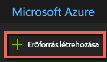
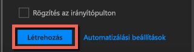

# <a name="quickstart-install-and-get-started-with-azure-machine-learning-services"></a>Rövid útmutató: Az Azure Machine Learning-szolgáltatások telepítése és az első lépések
Az Azure Machine Learning-szolgáltatások (előzetes verzió) átfogó, integrált és fejlett adatelemzési megoldások. A hivatásos adatszakértők számára nyújt segítséget az adatok előkészítésében, a kísérletek kidolgozásában és a modellek felhőszinten való üzembe helyezésében.

Ez a rövid útmutató a következőket mutatja be:

* Szolgáltatásfiókok létrehozása az Azure Machine Learning-szolgáltatásokhoz
* Telepítse az Azure Machine Learning Workbenchet, és jelentkezzen be.
* Projekt létrehozása a Workbenchben
* Szkriptek futtatása a projektben  
* A parancssori felület (CLI) elérése


Mivel a Microsoft Azure-portfólió részét képezik, az Azure Machine Learning-szolgáltatások használatához szükség van egy Azure-előfizetésre. Ha nem rendelkezik Azure-előfizetéssel, mindössze néhány perc alatt létrehozhat egy [ingyenes fiókot](https://azure.microsoft.com/free/?WT.mc_id=A261C142F) a virtuális gép létrehozásának megkezdése előtt.

Emellett megfelelő engedélyekkel is rendelkeznie kell az erőforráscsoportok, virtuális gépek és hasonló objektumok létrehozásához. 

<a name="prerequisites"></a>Az Azure Machine Learning Workbench alkalmazás a következő operációs rendszereken telepíthető:
- Windows 10 vagy Windows Server 2016
- macOS Sierra vagy High Sierra

## <a name="create-azure-machine-learning-services-accounts"></a>Azure Machine Learning-szolgáltatásfiókok létrehozása
Azure Machine Learning-fiókokat az Azure Portalon hozhat létre: 
1. Jelentkezzen be az [Azure Portalra](https://portal.azure.com/) a használni kívánt Azure-előfizetés hitelesítő adataival. Ha nem rendelkezik Azure-előfizetéssel, hozzon létre egy [ingyenes fiókot](https://azure.microsoft.com/free/?WT.mc_id=A261C142F). 

   

1. A portál bal felső sarkában válassza az **Erőforrás létrehozása** (+) gombot.

   

1. Írja be a **Machine Learning** kifejezést a keresősávba. Válassza a **Machine Learning-kísérletezés** elnevezésű találatot. 

   

1. Görgessen le a **Machine Learning-kísérletezés** panel aljára, és válassza a **Létrehozás** elemet a kísérletezési fiók meghatározásának megkezdéséhez.  

   

1. Az **ML-kísérletezés** panelen konfigurálja a Machine Learning-kísérletezési fiókot. 

   Beállítás|Oktatóanyaghoz ajánlott érték|Leírás
   ---|---|---
   Kísérletezés-fiók neve | _Egyedi név_ |Adjon meg egy egyedi nevet a fiók azonosításához. Használhatja a saját nevét, vagy egy részleg vagy projekt nevét is. Olyasmit adjon meg, amivel a legjobban azonosítható a kísérlet. A név 2–32 karakter hosszúságú lehet. A név csak alfanumerikus és kötőjel (-) karaktert tartalmazhat. 
   Előfizetés | _Az Ön előfizetése_ |Válassza ki a kísérlethez használni kívánt Azure-előfizetést. Ha több előfizetéssel rendelkezik, válassza a megfelelő előfizetést, amelyen az erőforrás terhelve van.
   Erőforráscsoport | _Az erőforráscsoport_ | Az előfizetése valamelyik meglévő erőforráscsoportját használja, vagy adjon meg egy nevet új erőforráscsoport létrehozásához a kísérletezési fiók számára. 
   Hely | _A felhasználókhoz legközelebb eső régió_ | Válassza ki a felhasználókhoz és az adatforrásokhoz legközelebb eső helyet.
   Munkaállomások száma | 2 | Adja meg a munkaállomások számát. Itt találhat további tudnivalókat arról, [hogyan befolyásolja a munkaállomások száma a díjszabást](https://azure.microsoft.com/pricing/details/machine-learning/).<br/><br/>Ehhez a rövid útmutatóhoz csak két munkaállomásra van szükség. A munkaállomások igény szerint adhatók hozzá és távolíthatók el az Azure Portalon.
   Tárfiók | _Egyedi név_ | Válassza az **Új létrehozása** elemet, és adjon meg egy nevet az [Azure Storage-fiók](https://docs.microsoft.com/en-us/azure/storage/common/storage-quickstart-create-account?tabs=portal) létrehozásához. A név 3–24 karakter hosszúságú lehet, és csak alfanumerikus karaktereket tartalmazhat. Másik lehetőségként válassza a **Meglévő használata** lehetőséget, majd a legördülő listából válasszon egy meglévő tárfiókot. A tárfiók megadása kötelező, hiszen a projektösszetevőket és a futtatási előzményadatokat tárolja. 
   A Kísérletezés-fiók munkaterülete | IrisGarden<br/>(az oktatóanyagokban használt név) | Adja meg a fiók munkaterületének nevét. A név 2–32 karakter hosszúságú lehet. A név csak alfanumerikus és kötőjel (-) karaktert tartalmazhat. Ez a munkaterület tartalmazza a kísérletek létrehozásához, kezeléséhez és közzétételéhez szükséges eszközöket.
   A munkaterülethez társított tulajdonos | _Saját fiók_ | Válassza ki a saját fiókját a munkaterület tulajdonosaként.
   Modellkezelési fiók létrehozása | **bejelölve** |Hozzon létre egy modellkezelési fiókot, hogy ez az erőforrás elérhető legyen, amikor valós idejű webszolgáltatásként szeretné üzembe helyezni és felügyelni a modelleket. <br/><br/>Ez nem kötelező, de javasoljuk, hogy a kísérletezési fiókkal egy időben hozza létre a modellkezelési fiókot.
   Fióknév | _Egyedi név_ | Válasszon egy egyedi nevet a Modellkezelés-fiók azonosításához. Használhatja a saját nevét, vagy egy részleg vagy projekt nevét is. Olyasmit adjon meg, amivel a legjobban azonosítható a kísérlet. A név 2–32 karakter hosszúságú lehet. A név csak alfanumerikus és kötőjel (-) karaktert tartalmazhat. 
   Modellkezelési tarifacsomag | **DEVTEST** | Válassza a **Nincs kijelölt tarifacsomag** lehetőséget az új Modellkezelés-fiók tarifacsomagjának megadásához. A költségmegtakarítás érdekében válassza a **DEVTEST** tarifacsomagot, ha elérhető az előfizetésén (korlátozottan elérhető). Ellenkező esetben válassza az S1 tarifacsomagot. Kattintson a **Kiválasztás** gombra a beállított tarifacsomag mentéséhez. 
   Rögzítés az irányítópulton | _bejelölve_ | A **Rögzítés az irányítópulton** lehetőség bejelölésével egyszerűen nyomon követheti a Machine Learning-kísérletezés fiókját az Azure Portal irányítópultjának első lapján.

   

5. A **Létrehozás** lehetőség kiválasztásával indíthatja el a kísérletezési fiók és a modellkezelési fiók létrehozási folyamatát.

   

   A fiók létrehozása pár percet is igénybe vehet. Az üzembehelyezési folyamat állapotának ellenőrzéséhez kattintson az Azure Portal eszköztárában található Értesítések ikonra (harang).
   
   


## <a name="install-and-log-in-to-workbench"></a>A Workbench telepítése és bejelentkezés

Az Azure Machine Learning Workbench Windows és macOS rendszeren érhető el. Itt megtalálhatja a [támogatott platformok](#prerequisites) listáját.

>[!WARNING]
>A telepítés körülbelül 30 percet vesz igénybe. 

1. Töltse le és indítsa el a Workbench legújabb verziójának telepítőjét. 
   >[!IMPORTANT]
   >Töltse le a telepítőt a meghajtóra, majd futtassa onnan. Ne közvetlenül a böngésző letöltésvezérlőjéből futtassa.

   **Windows rendszeren:** 

   &nbsp;&nbsp;&nbsp;&nbsp;A. Töltse le az [AmlWorkbenchSetup.msi](https://aka.ms/azureml-wb-msi) fájlt.  <br/>
   &nbsp;&nbsp;&nbsp;&nbsp;B. Kattintson duplán a letöltött telepítőre a Fájlkezelőben.

   **macOS rendszeren:** 

   &nbsp;&nbsp;&nbsp;&nbsp;A. Töltse le az [AmlWorkbench.dmg](https://aka.ms/azureml-wb-dmg) fájlt. <br/>
   &nbsp;&nbsp;&nbsp;&nbsp;B. Kattintson duplán a letöltött telepítőre a Finderben.<br/><br/>

1. A telepítőben kövesse a képernyőn megjelenő utasításokat. 

   **A telepítés körülbelül 30 percet vesz igénybe.**  
   
   | |Az Azure Machine Learning Workbench telepítési útvonala|
   |--------|------------------------------------------------|
   |Windows|C:\Users\\<felhasználó\>\AppData\Local\AmlWorkbench|
   |macOS|/Applications/Azure ML Workbench.app|

   A telepítő letölti és beállítja az összes szükséges függőséget, köztük a Python-, a Miniconda- és az egyéb kapcsolódó kódtárakat. Ez a telepítési csomag tartalmazza az Azure többplatformos parancssori eszközét (Azure CLI) is.

1. A Workbench elindításához válassza a **Workbench indítása** gombot a telepítő utolsó lapján. 

   Ha már bezárta a telepítőt:
   + Windowsban használja a **Machine Learning Workbench** asztali parancsikonját. 
   + MacOS rendszeren válassza a Launchpaden az **Azure ML Workbench** elemet.

1. Az első képernyőn válassza a **Bejelentkezés Microsoft-fiókkal** elemet az Azure Machine Learning Workbenchben való hitelesítéshez. A kísérletezési és a modellkezelési fiókok létrehozásához ugyanazokat a hitelesítő adatokat használja, amelyet az Azure Portalon is használt. 

   Miután bejelentkezett, a Workbench az Azure-előfizetésben elsőként észlelt kísérletezési fiókot használja, és megjeleníti a fiókhoz tartozó összes munkaterületet és célprojektet. 

   >[!TIP]
   > Másik kísérletezési fiókra is válthat a Workbench alkalmazás ablakának bal alsó sarkában lévő ikonnal.

## <a name="create-a-project-in-workbench"></a>Projekt létrehozása a Workbenchben

Az Azure Machine Learningben a projektek a problémák megoldása érdekében végzett munka logikai tárolói. Egyetlen, a helyi lemezen lévő mappára vannak leképezve, és tetszőleges számú fájl vagy almappa adható hozzájuk. 

Itt az [Iris flower adathalmazt](https://en.wikipedia.org/wiki/Iris_flower_data_set) tartalmazó sablonnal hozunk létre egy új Workbench-projektet. Az ezen rövid útmutatót követő oktatóanyagok ezekre az adatokra támaszkodva készítenek olyan modellt, amely előrejelzi az írisz típusát néhány fizikai jellemzője alapján.  

1. Amikor meg van nyitva az Azure Machine Learning Workbench, válassza a **PROJEKTEK** panelen lévő pluszjelet (+), majd az **Új projekt** lehetőséget.  

   

1. Töltse ki az űrlap mezőit, és válassza a **Létrehozás** gombot, hogy új projektet hozzon létre a Workbenchben.

   Mező|Oktatóanyaghoz ajánlott érték|Leírás
   ---|---|---
   Projektnév | myIris |Adjon meg egy egyedi nevet a fiók azonosításához. Használhatja a saját nevét, vagy egy részleg vagy projekt nevét is. Olyasmit adjon meg, amivel a legjobban azonosítható a kísérlet. A név 2–32 karakter hosszúságú lehet. A név csak alfanumerikus és kötőjel (-) karaktert tartalmazhat. 
   Projektkönyvtár | c:\Temp\ | Adja meg a könyvtárat, amelyben a projekt létrejött.
   Projekt leírása | _hagyja üresen_ | A projekt leírására szolgáló mező, amelyet nem kötelező kitölteni.
   Visualstudio.com GIT-adattár URL-címe |_hagyja üresen_ | Nem kötelező kitölteni. Dönthet úgy, hogy egy projektet Git-adattárhoz társít a Visual Studio Team Servicesben a forráskezelés és az együttműködés megkönnyítése érdekében. [További tudnivalókat erről a lehetőségről itt talál](https://docs.microsoft.com/en-us/azure/machine-learning/preview/using-git-ml-project#step-3-set-up-a-machine-learning-project-and-git-repo). 
   Kiválasztott munkaterület | IrisGarden (ha van) | Válasszon egy olyan munkaterületet, amelyet a kísérletezési fiókhoz hozott létre az Azure Portalon. <br/>Ha követte a rövid útmutatót, rendelkeznie kell egy IrisGarden nevű munkaterülettel. Ha nincs ilyen munkaterülete, válassza azt, amelyet a kísérletezési fiók létrehozásakor hozott létre, vagy válasszon egy tetszőleges munkaterületet.
   Projektsablon | Írisz osztályozása | A sablonok olyan szkripteket és adatokat tartalmaznak, amelyek elősegítik a termék különböző funkcióinak megismerését. Ez a sablon azokat a szkripteket és adatokat tartalmazza, amelyekre szüksége van ehhez a rövid bemutatóhoz, illetve a dokumentációs webhelyen található egyéb oktatóanyagokhoz. 

   
 
 Létrejön egy új projekt, és megnyílik az irányítópultja. Ezen a ponton áttekintheti a projekt kezdőlapját, adatforrásait, jegyzetfüzeteit és forráskódfájljait. 

>[!TIP]
>Konfigurálhatja a Workbenchet úgy, hogy használható legyen a Python IDE-vel a zökkenőmentes adatelemzés-fejlesztési élmény érdekében. Ezután az IDE-ben kezelheti a projektet. [További tudnivalókat itt talál](how-to-configure-your-IDE.md). 

## <a name="run-a-python-script"></a>Python-szkriptek futtatása

Most futtathatja az **iris_sklearn.py** szkriptet a helyi számítógépen. Alapértelmezés szerint ez a szkript szerepel az **Írisz osztályozása** projektsablonban. A szkript a népszerű [scikit-learn](http://scikit-learn.org/stable/index.html) Python-kódtár segítségével hozza létre a [logisztikai regressziós](https://en.wikipedia.org/wiki/Logistic_regression) modellt.

1. A **Projekt-irányítópult** oldal tetején lévő parancssávban válassza a **helyi** elemet végrehajtási célként, majd az **iris_sklearn.py** szkriptet futtatandó szkriptként. Ezek az értékek alapértelmezés szerint előre ki vannak választva. 

   A minta további fájlokat is tartalmaz, amelyeket majd később megtekinthet, de ebben a rövid útmutatóban csak az **iris_sklearn.py** fájllal foglalkozunk. 

   

1. Az **Argumentumok** szövegmezőbe írja be a következőt: **0,01**. Ez a szám megfelel a regularizációs aránynak, és a szkriptben a logisztikai regressziós modell konfigurálásához használatos. 

1. Válassza a **Futtatás** parancsot a szkript végrehajtásának megkezdéséhez a számítógépen. Az **iris_sklearn.py** feladat azonnal megjelenik a jobb oldali **Feladatok** panelen, ahol figyelemmel kísérheti a szkript végrehajtását.

   Gratulálunk! Sikeresen futtatott egy Python-szkriptet az Azure Machine Learning Workbenchben.

1. Többször ismételje meg a 2–3. lépést különböző, **0,001** és **10** közötti argumentumértékekkel (használhatja például a 10 hatványait). Mindegyik futtatás megjelenik a **Feladatok** panelen.

1. A futtatási előzmények megvizsgálásához válassza a **Futtatások** nézetet, majd az **iris_sklearn.py** fájlt a futtatások listájában. 

   

   Ez a nézet az **iris_sklearn.py** összes futtatását megjeleníti. A futtatási előzmények irányítópultján a kiemelt metrikák, néhány alapértelmezett diagram és az egyes futtatások metrikáinak listája látható. 

1. A nézet testreszabható rendezéssel, szűréssel és a konfiguráció fogaskerék és szűrő ikonokkal való módosításával.

   

3. A Feladatok panelen az egyes befejezett futtatásokat kiválasztva megtekintheti az adott végrehajtás részletes nézetét. A részletek többek között további metrikákat, a létrejött fájlokat, valamint egyéb, esetleg hasznos naplóadatokat tartalmaznak.

## <a name="start-the-cli"></a>A parancssori felület elindítása

Az Azure Machine Learning parancssori felülete (CLI) is telepítve van. A parancssori felületen elérheti és kezelheti az Azure Machine Learning-szolgáltatásokat az `az` parancsokkal, és a teljes adatelemzési munkafolyamathoz szükséges összes feladatot elvégezheti. [Részletek](tutorial-iris-azure-cli.md)

Az Azure Machine Learning parancssori felületét a Workbench eszköztáráról indíthatja el a **Fájl → Parancssor megnyitása** paranccsal.

Az Azure Machine Learning parancssori felületén használható parancsokkal kapcsolatban a --help argumentummal kaphat segítséget.

```az ml --help```

## <a name="clean-up-resources"></a>Az erőforrások eltávolítása

[!INCLUDE [aml-delete-resource-group](../../../includes/aml-delete-resource-group.md)]

## <a name="next-steps"></a>További lépések
Létrehozta a szükséges Azure Machine Learning-fiókokat, és telepítette az Azure Machine Learning Workbench alkalmazást. Létrehozott egy projektet is, futtatott egy szkriptet, és megvizsgálta a szkript futtatási előzményeit.

A munkafolyamat behatóbb megismeréséért, többek között az íriszmodell webszolgáltatásként való üzembe helyezéséhez kövesse a teljes *Írisz osztályozása* oktatóanyagot. Az oktatóanyag részletes útmutatásokat tartalmaz az [adatok előkészítésével](tutorial-classifying-iris-part-1.md), a [kísérletezéssel](tutorial-classifying-iris-part-2.md) és a [modellkezeléssel](tutorial-classifying-iris-part-3.md) kapcsolatban. 

> [!div class="nextstepaction"]
> [Oktatóanyag: Írisz osztályozása (1. rész)](tutorial-classifying-iris-part-1.md)

>[!NOTE]
> Bár a modellkezelési fiókot már létrehozta, a környezet még nincs beállítva a webszolgáltatások üzembe helyezéséhez. Itt megtudhatja, hogyan állíthatja be az [üzembehelyezési környezetet](deployment-setup-configuration.md).
