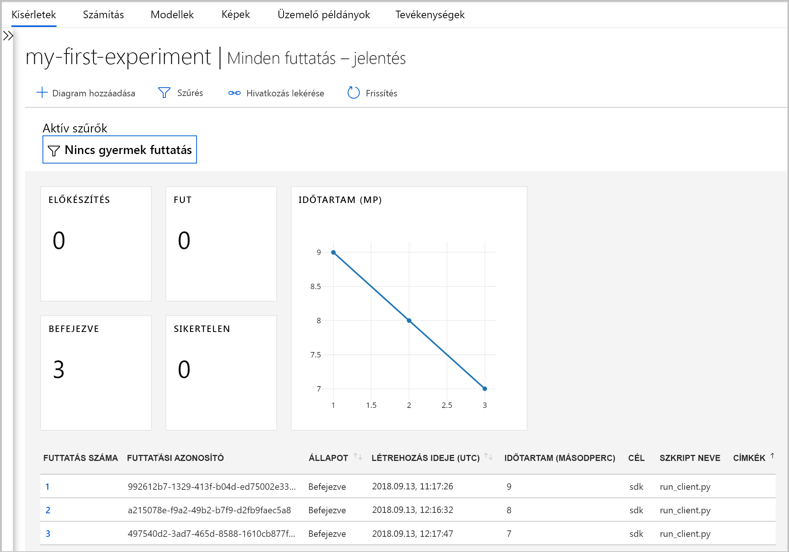
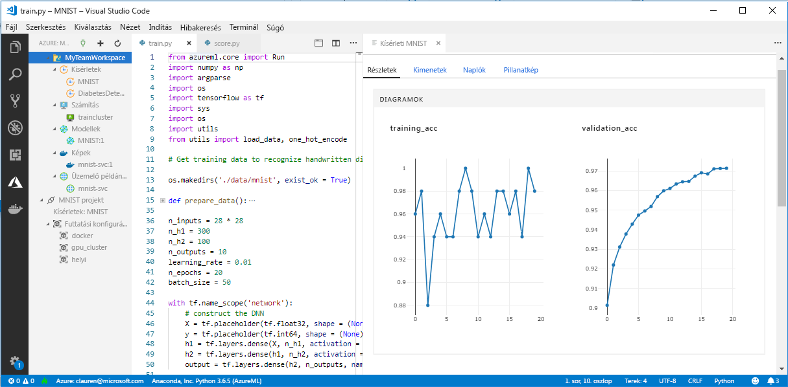

# Mi történik a Machine Learning Workbench az Azure Machine Learning szolgáltatás?

Az Azure Machine Learning Workbench alkalmazást és néhány más korai funkciókat is hozzárendelésénél a 2018 szeptember kiadásban, hogy egy továbbfejlesztett módon [architektúra](concept-azure-machine-learning-architecture.md). A felhasználói élmény javítása érdekében a kiadás számos jelentős frissítés kéri, a felhasználói visszajelzések tartalmazza. A modell üzembe helyezése a Kísérletezési futtatások fő funkció nem változott. Most már használhatja a nagy teljesítményű, de <a href="https://aka.ms/aml-sdk" target="_blank">SDK</a> és a [Azure CLI-vel](reference-azure-machine-learning-cli.md) a gépi tanulási folyamatok és feladatok elvégzéséhez.  

Ebben a cikkben megismerheti, mi változott, és hogyan érinti a már meglévő munkáját az Azure Machine Learning Workbench és annak API-k a kapcsolatban.

## Mi változott?

Az Azure Machine Learning szolgáltatás legújabb kiadása a következő szolgáltatásokat tartalmazza:
+ A [egyszerűsített Azure-erőforrások modell](concept-azure-machine-learning-architecture.md).
+ A [új portál felhasználói Felületét](how-to-track-experiments.md) a kísérletek kezeléséhez és számítási céljainak.
+ Egy új, szélesebb körű Python <a href="https://aka.ms/aml-sdk" target="_blank">SDK</a>.
+ Az új kibontva [Azure CLI-bővítmény](reference-azure-machine-learning-cli.md) a machine Learning szolgáltatáshoz.

A [architektúra](concept-azure-machine-learning-architecture.md) át lett alakítva a könnyű használhatóság. Több Azure-erőforrás és -fiók helyett csak egy [Azure Machine Learning-munkaterület](concept-azure-machine-learning-architecture.md#workspace) szükséges. Az [Azure Portalon](quickstart-get-started.md) gyorsan létrehozhat munkaterületeket. Munkaterület használatával több felhasználó tud tárolni a képzés és számítási célokat, modell kísérletek, Docker-rendszerképek, üzembe helyezett modellnél és így tovább.

Bár a jelenlegi kiadásban új továbbfejlesztett CLI és az SDK ügyfeleket, maga a workbench asztali alkalmazás elavult. Nyomon követheti a kísérletek a most a [munkaterület irányítópultot az Azure Portalon](how-to-track-experiments.md#view-the-experiment-in-the-azure-portal). Használja az irányítópultot a kísérlet előzményeinek beolvasására, a munkaterülethez rendelt számítási célok, a modellek és a Docker-rendszerképek kezelésére, vagy akár webszolgáltatások üzembe helyezésére.

## Hogyan kell áttelepíteni az adatokat?

Az Azure Machine Learning szolgáltatás korábbi verziójában létrehozott összetevők a legtöbb vannak tárolva a saját helyi vagy felhőbeli tárhelyén. Ezek a munkadarabok sohasem fognak eltűnni. Az áttelepítéshez újra kell regisztrálnia az összetevőket a frissített Azure Machine Learning szolgáltatásban. Azt, hogy mit és hogyan telepíthet át, ebből az [áttelepítésről szóló cikkből](how-to-migrate.md) ismerheti meg.

## Támogatási idővonal

A Machine Learning-kísérletezés és Modellkezelés-fiók és a Machine Learning Workbench alkalmazás 2018 szeptember után továbbra is használhatja. A következő erőforrások támogatása, amely a kiadás után három-négy hónapon belül fokozatosan törlődni fog. A régi funkciók dokumentációja továbbra is megtalálható a tartalomjegyzék alján, az [Erőforrások szakaszban](../desktop-workbench/tutorial-classifying-iris-part-1.md).

|Kivezetési&nbsp;fázis|Korábbi funkciók támogatásának részletezése|
|:---:|----------------|
|2018. december 4.|Lehetővé teszi az Azure Machine Learning-kísérletezés és a Modellkezelési fiókok létrehozását az Azure Portalon, és a parancssori felületen véget ért. Machine Learning számítási környezetek létrehozása a parancssori felületen is véget ért. Ha rendelkezik egy meglévő fiókot, a parancssori felület és a Machine Learning Workbench asztali továbbra is működni ebben a fázisban.|
|2019. január 9.|Minden más támogatási ezen a napon befejeződik. Példák a fennmaradó API-k és a Machine Learning Workbench asztali.|

[Kezdje meg a migrálást](how-to-migrate.md) még ma. Az új használatával érhető el a legújabb funkciókat <a href="https://aka.ms/aml-sdk" target="_blank">SDK</a>, a [CLI](reference-azure-machine-learning-cli.md), és a [portál](quickstart-get-started.md).

## Mi a helyzet a futtatási előzményekkel?

Futtatási előzmények egy ideig lesz elérhető. Ha Ön szeretne váltani az Azure Machine Learning szolgáltatás frissített verzióját, exportálhatja a futtatási előzményeket, ha azt szeretné, hogy megőrzi.

Futtatási előzményeket az úgynevezett **kísérletek** a jelenlegi kiadásban. A modell kísérletek összegyűjtheti, és ismerje meg azokat az SDK-t, a parancssori felület vagy az Azure portal használatával.

A portál munkaterület irányítópult csak a Microsoft Edge, Chrome és a Firefox böngésző esetében támogatott:

[ ] (. / media/overview-what-happened-to-workbench/image001.png#lightbox)

## Továbbra is előkészíthetem az adatokat?

A már meglévő adatfájlok előkészítése nem a legújabb verziót a hordozható, mert a Machine Learning Workbench már nincs. Azonban továbbra is előkészítheti az adatokat modellezésre.  

A méretüktől adatkészletekhez a segítségével a [az Azure Machine Learning Data Prep SDK](http://aka.ms/data-prep-sdk) gyorsan előkészítheti az adatokat a modellezési Python-kód írásával. 

Követheti [ebben az oktatóanyagban](tutorial-data-prep.md) tudhat meg többet az Azure Machine Learning Data Prep SDK használatával.

## Megmaradnak a projektek?

Nem fog elveszni sem kód, sem munka. A régebbi verzióban, a projektek helyi könyvtárral rendelkező felhőbeli entitások. A legújabb verzió csatolása helyi címtárak az Azure Machine Learning szolgáltatáshoz munkaterület a helyi konfigurációs fájl használatával. Tekintse meg a [a legújabb architektúra diagramja](concept-azure-machine-learning-architecture.md).

A projekt tartalmának nagy részét már a helyi gépen. Így egyszerűen hozzon létre egy konfigurációs fájl ebben a könyvtárban, és hivatkozzon arra a kód a munkaterülethez való kapcsolódáshoz. Ismerje meg, hogyan [migrálni a meglévő projekteket](how-to-migrate.md#projects).

Ismerje meg, hogyan kezdheti el [Python és a fő SDK](quickstart-create-workspace-with-python.md) vagy [az Azure portal](quickstart-get-started.md).

## Mi a helyzet a regisztrált modellek és lemezképek?
 
Ha azt szeretné, hogy továbbra is használhatja őket a régi modellben beállításjegyzék regisztrált modellek kell áttelepíteni az új munkaterülethez. A modellek áttelepítése [töltse le a modelleket, és regisztrálja őket újra](how-to-migrate.md) az új munkaterületen. 

A rendszerképeket, amelyet a régi rendszerkép-regisztrációs adatbázisban hozott létre, újra létre kell hozni az új munkaterületen, hogy továbbra is használhassa őket. Ezek a lemezképek a következő újra létrehozhatja a [konfigurálása és a rendszerkép létrehozása](how-to-deploy-and-where.md#configureimage) szakaszok. 

## Mi a helyzet az üzembe helyezett webszolgáltatásokkal?

A modellek webszolgáltatásként a Machine Learning Modellkezelés-fiók segítségével telepítve fog működni, mindaddig, amíg az Azure Container Service használata támogatott. Ezek a webszolgáltatások fog működni, Machine Learning Modellkezelési fiókok támogatás vége után is. Azonban, amikor véget ér a régi CLI támogatása, többé nem fogja tudni kezelni ezeket a webszolgáltatásokat.

Az újabb verzióra, a modellek webszolgáltatásként való Azure Container Instances szolgáltatásban vagy az Azure Kubernetes Service (AKS)-fürtöket üzembe helyezve. FPGA-kban és az Azure IoT Edge-ben is telepítheti. További információkért lásd a cikk [üzembe helyezése és hol](how-to-deploy-and-where.md). Nem kell módosítani a pontozási fájlokat, függőségeket és sémákat, telepítse újra a modellek az új SDK-t vagy a parancssori felület használatával. 

## Mi a helyzet a régi SDK és parancssori felület?

Igen, ezek továbbra is működnek, amíg a január. Lásd az előző [ütemterv](#timeline). Javasoljuk, hogy indítsa el a legújabb SDK vagy parancssori felület az új kísérletek és modellek létrehozása.

A legújabb verziót az új Python SDK használatával bármilyen Python-környezetet az Azure Machine Learning szolgáltatás is dolgozhat. Ismerje meg, hogyan telepítheti a legújabb <a href="https://aka.ms/aml-sdk" target="_blank">SDK-t</a>. Is használhatja a frissített [Azure Machine Learning parancssori bővítmény](reference-azure-machine-learning-cli.md) a számos `az ml` használják a szolgáltatást minden parancssori környezetben, beleértve az Azure Cloud Shell-parancsokat.

## Mi a helyzet a Visual Studio Code az Azure Machine Learning?

Ebben a legújabb kiadásban a Visual Studio Code az Azure Machine Learning rendelkezik lettek kibontva és továbbfejlesztve, hogy a fenti új funkciók.

[ ] (. / media/overview-what-happened-to-workbench/vscode-big.png#lightbox)

## Mi a helyzet a tartománycsomagokkal?

A tartományhoz tartozó csomagok [számítógépes látástechnológiai, szövegelemzési és előrejelzési](../desktop-workbench/reference-python-package-overview.md) nem használható az Azure Machine Learning legújabb verzióját. Azonban továbbra is hozhat létre és számítógépes látástechnológiai, szöveg és előrejelzési a legújabb Azure Machine Learning Python-modellek betanításához <a href="https://aka.ms/aml-sdk" target="_blank">SDK</a>. Megtudhatja, hogyan telepítheti át a már meglévő modellek a számítógépes látástechnológiai, szövegelemzési és előrejelzési csomagok, forduljon a [ AML-Packages@microsoft.com ](mailto:AML-Packages@microsoft.com).

## További lépések

További információ a [legújabb architektúra az Azure Machine Learning szolgáltatás](concept-azure-machine-learning-architecture.md). Próbálja ki az egyik a gyors útmutatókat vagy oktatóanyagokat:

* [Mi az Azure Machine Learning szolgáltatás?](overview-what-is-azure-ml.md)
* [Gyors útmutató: Hozzon létre egy munkaterületet a Pythonnal](quickstart-get-started.md)
* [Oktatóanyag: A modell tanítása](tutorial-train-models-with-aml.md)
