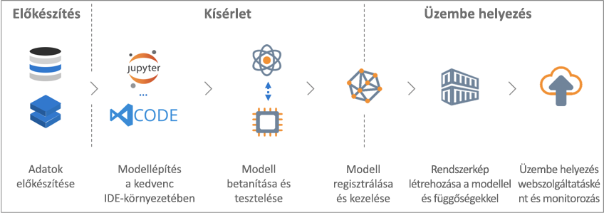

# Mi az Azure Machine Learning szolgáltatás (előzetes verzió)?

Az Azure Machine Learning (előzetes verzió) egy olyan felhőszolgáltatás, amely gépi tanulási modellek fejlesztésére és üzembe helyezésére szolgál. Az Azure Machine Learning szolgáltatás használatával a felhő által biztosított széles skálán is könnyedén nyomon követheti modelljei fejlesztését, betanítását, üzembe helyezését és kezelését.

## Mit jelent a gépi tanulás funkció?

A Machine Learning egy olyan adatelemzési módszer, amely lehetővé teszi, hogy a számítógépek a meglévő adatokból tanulva jövőbeni viselkedéseket, kimeneteket és trendeket jelezhessenek előre. A gépi tanulással a számítógépek konkrét programozás nélkül tanulhatnak.

A gépi tanulás által biztosított előrejelzéseket felhasználva intelligensebbé tehetők az alkalmazások és az eszközök. Ha például online vásárol, a gépi tanulás képes a korábban megvásárolt cikkek alapján olyan termékeket ajánlani, amelyek esetleg szintén érdekelhetik Önt. Vagy például a bankkártya lehúzásakor a gépi tanulás összeveti az adott tranzakciót az adatbázisában található tranzakciókkal, így segít a csalások felismerésében. Ha robotporszívóra bízza a szoba kitakarítását, a gépi tanulás segít eldönteni, hogy a feladat el lett-e végezve.

## Mi az Azure Machine Learning szolgáltatás?

Az Azure Machine Learning szolgáltatás egy felhőalapú környezet gépi tanulási modellek fejlesztésére, betanítására, üzembe helyezésére, kezelésére és nyomon követésére.

[  ] (. / media/overview-what-is-azure-ml/aml.png#lightbox)

Az Azure Machine Learning szolgáltatás teljes körűen támogatja a nyílt forráskódú technológiákat, így több tízezer nyílt forráskódú Python-csomaggal, többek között a TensorFlow-val és a scikit-learnnel is használható.
Kiváló eszközei, mint például a [Jupyter notebooks](http://jupyter.org) és a [Visual Studio Code Tools for AI](https://visualstudio.microsoft.com/downloads/ai-tools-vscode/), megkönnyítik az adatok interaktív feltárását és átalakítását, valamint a modellek fejlesztését és tesztelését.
Az Azure Machine Learning szolgáltatás a [modellek automatizált generálására és finomhangolására szolgáló funkciókat](tutorial-auto-train-models.md) is tartalmaz, így segít könnyeddé, hatékonnyá és pontossá tenni az új modellek létrehozását.

Az Azure Machine Learning szolgáltatás lehetővé teszi, hogy a betanítást a helyi gépen kezdje, majd horizontálisan felskálázza a felhőbe. Az [Azure Batch AI](https://azure.microsoft.com/services/batch-ai/)natív támogatásának és a továbbfejlesztett [hiperparaméter-finomhangoló szolgáltatásoknak](how-to-tune-hyperparameters.md) köszönhetően a felhő erejét kihasználva rövidebb idő alatt jobb modelleket készíthet. 

Ha létrehozta a megfelelő modellt, azt könnyedén üzembe is helyezheti egy tároló segítségével, például a Docker használatával. Ez azt jelenti, hogy a modell könnyedén üzembe helyezhető az [Azure Container Instances](how-to-deploy-to-aci.md) vagy az [Azure Kubernetes Service](how-to-deploy-to-aks.md) szolgáltatásokkal, illetve saját helyszíni vagy felhőalapú tárolómegoldásának használatával.
A már üzembe helyezett modelleket kezelheti és futásukat nyomon követheti, így nyugodtan kísérletezhet addig, amíg megtalálhatja a megfelelő megoldást.

[!INCLUDE [aml-preview-note](../../../includes/aml-preview-note.md)]

## Mire használhatom az Azure Machine Learning szolgáltatást?

Az Azure Machine Learning szolgáltatás képes automatikusan létrehozni és finomhangolni a modellt.
Egy vonatkozó példáért lásd: [Oktatóanyag: Osztályozási modell automatikus betanítása az Azure Automated Machine Learning szolgáltatással](tutorial-auto-train-models.md).

Emellett a Pythonhoz készült Azure Machine Learning <a href="http://aka.ms/aml-sdk" target="_blank">SDK</a> és nyílt forráskódú Python-csomagok használatával saját maga is létrehozhat és betaníthat rendkívül pontos gépi tanulási és mélytanulási modelleket az Azure Machine Learning szolgáltatás egy munkaterületén.
Számos nyílt forráskódú Python-csomagban elérhető gépi tanulási-összetevő közül választhat, például:

- <a href="http://scikit-learn.org/stable/" target="_blank">Scikit-learn</a>
- <a href="https://www.tensorflow.org" target="_blank">Tensorflow</a>
- <a href="https://pytorch.org" target="_blank">PyTorch</a>
- <a href="https://www.microsoft.com/en-us/cognitive-toolkit/" target="_blank">CNTK</a>
- <a href="http://mxnet.io" target="_blank">MXNet</a>

Ha a modellt létrehozta, egy tárolót készíthet (például a Docker használatával), amelyet a teszteléshez helyileg, később pedig akár éles üzemű webszolgáltatásként is üzembe helyezhet az [Azure Container Instances](how-to-deploy-to-aci.md) vagy az [Azure Kubernetes Service](how-to-deploy-to-aks.md) használatával.

Az üzembe helyezett modelleket az [Azure Portal](https://portal.azure.com/) vagy az [Azure Machine Learning parancssori bővítmény](https://review.docs.microsoft.com/azure/machine-learning/service/reference-azure-machine-learning-cli) használatával kezelheti.
A modell metrikáit kiértékelheti, újrataníthatja, és új verziót is üzembe helyezhet, mindezt a modell kísérleteinek nyomon követése mellett.

Az Azure Machine Learning szolgáltatás használatához alább, a [További lépések](#next-steps) résznél kezdhet hozzá.

## Miben különbözik az Azure Machine Learning szolgáltatás a Studio használatától?

Az Azure Machine Learning Studio egy együttműködést ösztönző, az egér húzásával könnyedén vezérelhető vizuális munkaterület, amelyben anélkül készíthet, tesztelhet és helyezhet üzembe gépi tanulási modelleket, hogy kódot kellene írnia hozzá. Előre elkészített és előre konfigurált gépi tanulási algoritmusokat és adatkezelési modulokat használ.

Használja a Machine Learning Studiot akkor, amikor gyorsan és egyszerűen szeretne gépi tanulási modellekkel kísérletezni, és ha a megoldáshoz elegendőek a beépített gépi tanulási algoritmusok is.

A Machine Learning szolgáltatást pedig akkor, amikor Python környezetben dolgozik a gépi tanulási algoritmusok finomhangolásán, vagy ha nyílt forráskódú gépi tanulási kódtárakat venne igénybe.

> [!NOTE]
> Az Azure Machine Learning Studioban létrehozott modellek nem helyezhetők üzembe és nem kezelhetők az Azure Machine Learning szolgáltatással.

## Ingyenes próbaidőszak
Ha nincs még előfizetése, [ingyen létrehozhat egy Azure-fiókot](https://azure.microsoft.com/pricing/free-trial/?WT.mc_id=A261C142F). Azure-szolgáltatásokra elkölthető krediteket kap. A kreditek felhasználása után megtarthatja a fiókját, és tovább használhatja azt az [ingyenes Azure-szolgáltatásokkal](https://azure.microsoft.com/free/). A bankkártyáját semmilyen költség nem terheli, hacsak Ön kifejezetten nem módosítja beállításait ennek engedélyezéséhez. Másik lehetőségként [kihasználhatja MSDN-előfizetői előnyeit](https://azure.microsoft.com/pricing/member-offers/msdn-benefits-details/?WT.mc_id=A261C142F): Az MSDN-előfizetés minden hónapban biztosít Önnek krediteket, amelyekkel fizetős Azure-szolgáltatásokat használhat.

## További lépések

- Munkaterület létrehozása a Machine Learning szolgáltatásban az [Első lépések az Azure Portal használatával](quickstart-get-started.md) című cikk segítségével
 
- A [Képosztályozó modell betanítása az Azure Machine Learning szolgáltatás használatával](tutorial-train-models-with-aml.md) című részletes oktatóanyagból megtudhatja, hogyan taníthatja be és helyezheti üzembe gépi tanulási modelljeit az Azure Machine Learning szolgáltatás segítségével

- A modellek automatikus generálásának és finomhangolásának Azure Machine Learning szolgáltatás részére történő engedélyezéséről az [Oktatóanyag: Gépi tanulási modellek automatizált betanítása az Azure Automated Machine Learning szolgáltatással](tutorial-auto-train-models.md) című cikkből tudhat meg többet

- A szolgáltatás részletes műszaki leírása a következő cikkben található: [Az Azure Machine Learning szolgáltatás architektúrája és fogalmai](concept-azure-machine-learning-architecture.md)

- A Microsoft más gépi tanuláson alapuló eszközeiről további információt az [Egyéb gépi tanuláson alapuló Microsoft-termékek és -szolgáltatások](./overview-more-machine-learning.md) című cikkben talál

<!-- 

An intro to AML or an end-to-end quickstart video could go here.

In this 9-minute video, learn how you can benefit your app. You'll learn about key features and what a typical workflow looks like. 

>[!VIDEO https://channel9.msdn.com/Events/Connect/2016/138/player]
 
+ 0-3 minutes covers key features and use-cases.
+ 3-4 minutes covers service provisioning. 
+ 4-6 minutes covers Import Data wizard used to create an index using the built-in real estate dataset.

-->
