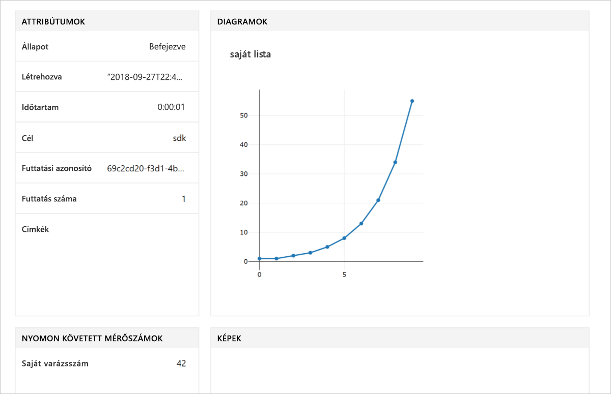

# <a name="quickstart-use-python-to-get-started-with-azure-machine-learning"></a>Rövid útmutató: A Python használata az Azure Machine Learning szolgáltatással való ismerkedéshez

Ebben a rövid útmutatóban az Azure Machine Learning SDK for Python használatával Machine Learning szolgáltatási [munkaterületet](concept-azure-machine-learning-architecture.md) fog létrehozni és használni. Az Azure Machine Learning szolgáltatás használata során ez a munkaterület szolgál majd a gépi tanulási modellekkel való kísérletezés, valamint a betanítás és üzembe helyezés alapjául a felhőben.

Ebben az oktatóanyagban telepíti a Python SDK-t, és:
* Munkaterületet hoz létre az Azure-előfizetésében
* Konfigurációs fájlt hoz létre az adott munkaterülethez a más jegyzetfüzetekben és parancsfájlokban való későbbi használathoz
* Kódot ír a munkaterületen belüli értékek naplózásához
* Megjeleníti a naplózott értékeket a munkaterületen

Az ebben a rövid útmutatóban létrehozott munkaterület és annak konfigurációs fájljai előfeltételként is használhatók más Azure Machine Learning-oktatóanyagokban és -útmutatókban. Csakúgy, mint más Azure-szolgáltatásoknál, itt is vannak az Azure Machine Learning szolgáltatáshoz társított korlátok és kvóták. [Ismerje meg a kvótákat és azt, hogyan kérhet belőlük többet.](how-to-manage-quotas.md)

Az Ön kényelme érdekében a következő Azure-erőforrások automatikusan hozzá lesznek adva a munkaterülethez, ha elérhetők a régióban: [tárolóregisztrációs adatbázis](https://azure.microsoft.com/services/container-registry/), [tároló](https://azure.microsoft.com/services/storage/), [application insights](https://azure.microsoft.com/services/application-insights/) és [key vault](https://azure.microsoft.com/services/key-vault/).

Ha nem rendelkezik Azure-előfizetéssel, mindössze néhány perc alatt létrehozhat egy [ingyenes fiókot](https://azure.microsoft.com/free/?WT.mc_id=A261C142F) a virtuális gép létrehozásának megkezdése előtt.


##  <a name="install-the-sdk"></a>Az SDK telepítése

**Kihagyhatja ezt a szakaszt, ha** 2018. szeptember 27. után létrehozott Data Science Virtual Machine-t (DSVM) használ, mivel ezek a DSVM-ek már előre telepített Python SDK-val rendelkeznek.

Azt javasoljuk, hogy az SDK telepítése előtt először hozzon létre egy elkülönített Python-környezetet. Bár ez a rövid útmutató a [Minicondát](https://conda.io/docs/user-guide/install/index.html) használja, a teljes telepített [Anacondát](https://www.anaconda.com/) vagy a [Python virtualenv](https://virtualenv.pypa.io/en/stable/)-et is használhatja.

### <a name="install-miniconda"></a>A Miniconda telepítése


[Töltse le](https://conda.io/miniconda.html) és telepítse a Minicondát. Válassza a Python 3.7-es vagy újabb verzióját. Ne válasszon Python 2.x verziót.

### <a name="create-an-isolated-python-environment"></a>Elkülönített Python-környezet létrehozása 

Nyisson meg egy parancssori ablakot, és a Python 3.6-os verziójával hozzon létre egy új conda-környezetet `myenv` néven.

```sh
conda create -n myenv -y Python=3.6
```

Aktiválja a környezetet.

  ```sh
  conda activate myenv
  ```

### <a name="install-the-sdk"></a>Az SDK telepítése

Az aktivált conda-környezetben telepítse az SDK-t. Ez a kód telepíti az Azure Machine Learning SDK, valamint a Jupyter Notebook-kiszolgáló alapvető összetevőit a `myenv` conda-környezetben.  A telepítéshez szükséges idő **megközelítőleg 4 perc**.

```sh
pip install azureml-sdk[notebooks]
```

## <a name="create-a-workspace"></a>Munkaterület létrehozása

E parancs beírásával indítsa el a Jupyter Notebookot.
```sh
jupyter notebook
```

A böngészőablakban hozzon létre egy új jegyzetfüzetet az alapértelmezett `Python 3` kernellel. 

Az SDK-verzió megjelenítéséhez írja be a következő Python-kódot egy jegyzetfüzetcellába, és hajtsa végre a kódot.

```python
import azureml.core
print(azureml.core.VERSION)
```

Hozzon létre egy új Azure-erőforráscsoportot és egy új munkaterületet.

Keresse meg az `<azure-subscription-id>` értékét [a Microsoft Azure Portalon lévő előfizetési listában](https://ms.portal.azure.com/#blade/Microsoft_Azure_Billing/SubscriptionsBlade). Bármelyik előfizetést használhatja, amelyben a szerepköre tulajdonos vagy közreműködő.

```python
from azureml.core import Workspace
ws = Workspace.create(name='myworkspace',
                      subscription_id='<azure-subscription-id>',
                      resource_group='myresourcegroup',
                      create_resource_group=True,
                      location='eastus2' # or other supported Azure region
                     )
```

A fenti kód végrehajtása elindíthat egy új böngészőablakot az Azure-fiókjával való bejelentkezéshez. Miután bejelentkezik, a rendszer helyileg gyorsítótárazza a hitelesítési kódot.

A munkaterület adatainak – így a társított tároló, a regisztrációs adatbázis és a kulcstartó – megtekintéséhez írja be a következőt:

```python
ws.get_details()
```

## <a name="write-a-configuration-file"></a>Konfigurációs fájl írása

A munkaterület adatait mentse el egy konfigurációs fájlban az aktuális könyvtárba. A fájl megnevezése: 'aml_config\config.json'.  

Ez a munkaterülethez tartozó konfigurációs fájl később megkönnyíti ugyanennek a munkaterületnek az ugyanabban a könyvtárban vagy egy alkönyvtárban lévő más jegyzetfüzetekkel és parancsfájlokkal való betöltését. 

```python
# Create the configuration file.
ws.write_config()

# Use this code to load the workspace from 
# other scripts and notebooks in this directory.
# ws = Workspace.from_config()
```

A `write_config()` API-hívás létrehozza a konfigurációs fájlt az aktuális könyvtárban. A `config.json` fájl a következőket tartalmazza:

```json
{
    "subscription_id": "<azure-subscription-id>",
    "resource_group": "myresourcegroup",
    "workspace_name": "myworkspace"
}
```

## <a name="use-the-workspace"></a>A munkaterület használata

Írjon olyan kódot, amely az alapszintű SDK API-kat használja a kísérleti futtatások nyomon követéséhez.

```python
from azureml.core import Experiment

# create a new experiemnt
exp = Experiment(workspace=ws, name='myexp')

# start a run
run = exp.start_logging()

# log a number
run.log('my magic number', 42)

# log a list (Fibonacci numbers)
run.log_list('my list', [1, 1, 2, 3, 5, 8, 13, 21, 34, 55]) 

# finish the run
run.complete()
```

## <a name="view-logged-results"></a>A naplózott eredmények megtekintése
A futtatás befejeződése után megtekintheti a kísérleti futtatást a Microsoft Azure Portalon. A következő kód használatával nyomtassa ki a legutóbbi futtatás eredményeinek URL-címét.

```python
print(run.get_portal_url())
```

A hivatkozás segítségével a böngészőjében megtekintheti a naplózott értékeket a Microsoft Azure Portalon.



## <a name="clean-up-resources"></a>Az erőforrások eltávolítása 
>[!IMPORTANT]
>A létrehozott erőforrások előfeltételként is használhatók más Azure Machine Learning-oktatóanyagokban vagy -útmutatókban.

Ha már nem kívánja használni a jelen útmutatóban létrehozott erőforrásokat, akkor törölje őket, nehogy többletköltségek merüljenek fel.

```python
ws.delete(delete_dependent_resources=True)
```

## <a name="next-steps"></a>További lépések

Létrehozta a modellekkel való kísérletezéshez és azok üzembe helyezéséhez szükséges erőforrásokat. Kódot is futtatott egy jegyzetfüzetben, és megvizsgálta a kód futtatási előzményeit a felhőben lévő munkaterületen.

Az Azure Machine Learning oktatóanyagokkal való használathoz szüksége lesz még néhány további csomagra az Ön által használt környezetben:

1. Zárja be a jegyzetfüzetet a böngészőben.
1. A parancssori ablakban használja a `Ctrl`+`C` billentyűkombinációt a jegyzetfüzet-kiszolgáló leállításához.
1. Telepítse a további csomagokat.

    ```sh
    conda install -y cython matplotlib scikit-learn pandas numpy
    pip install azureml-sdk[automl]
    ```

Miután telepítette ezeket a csomagokat, az oktatóanyagokat követve modellt taníthat be és helyezhet üzembe.  

> [!div class="nextstepaction"]
> [Oktatóanyag: Képbesorolási modell betanítása](tutorial-train-models-with-aml.md)

Emellett megismerheti a [GitHubon lévő speciális példákat](https://aka.ms/aml-notebooks) is.
