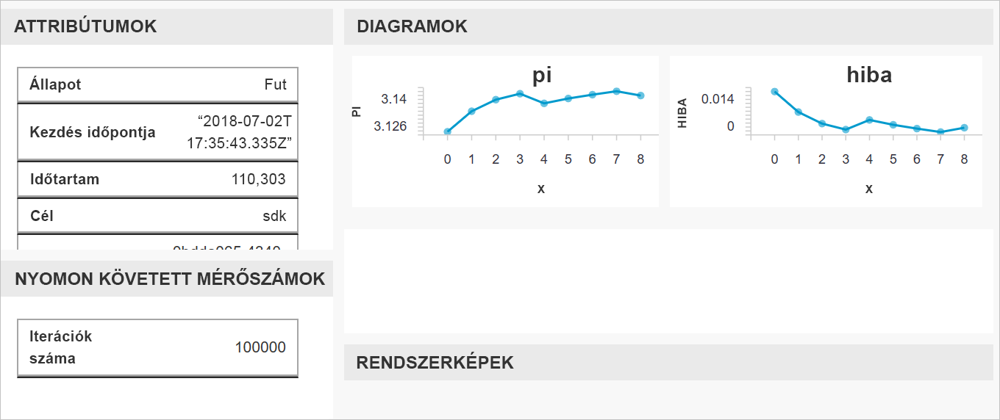

# <a name="quickstart-get-started-with-azure-machine-learning-using-the-cli-extension"></a>Rövid útmutató: Az Azure Machine Learning szolgáltatás használatának első lépései a CLI-bővítménnyel

Ebben a rövid útmutatóban egy Machine Learning CLI-bővítménnyel kezdi el az [Azure Machine Learning szolgáltatás](overview-what-is-azure-ml.md) (előzetes verzió) használatát.

A CLI-vel a következőket fogja megtanulni:

1. Munkaterület létrehozása az Azure-előfizetésben. A munkaterület egy vagy több felhasználó számítási erőforrásainak, modelljeinek, üzemelő példányainak, és futtatási előzményeinek tárolására szolgál a felhőben.
1. Projekt csatolása a munkaterülethez.   A projektek helyi mappák, amelyek a gépi tanulási problémák megoldásához szükséges szkripteket és konfigurációs fájlokat tartalmazzák.  
1. Python-szkript futtatása a projektben, amely naplózza több iteráció bizonyos értékeit.
1. A naplózott értékek megtekintése a munkaterület futtatási előzményeiben.

> [!NOTE]
> Az Ön kényelme érdekében a következő Azure-erőforrások automatikusan hozzá lesznek adva a munkaterülethez, ha elérhetők a régióban: [tárolóregisztrációs adatbázis](https://azure.microsoft.com/services/container-registry/), [tároló](https://azure.microsoft.com/services/storage/), [application insights](https://azure.microsoft.com/services/application-insights/) és [key vault](https://azure.microsoft.com/services/key-vault/).

Az Ön által létrehozott erőforrások előfeltételként is használhatók más Azure Machine Learning-oktatóanyagokban vagy -útmutatókban.

Ez a CLI az Azure Machine Learning szolgáltatás Python-alapú <a href="http://aka.ms/aml-sdk" target="_blank">SDK-jára</a> épült.

## <a name="prerequisites"></a>Előfeltételek

A rövid útmutató lépéseinek megkezdése előtt győződjön meg róla, hogy rendelkezik a következő előfeltételekkel:

+ Azure-előfizetés. Ha nem rendelkezik Azure-előfizetéssel, mindössze néhány perc alatt létrehozhat egy [ingyenes fiókot](https://azure.microsoft.com/free/?WT.mc_id=A261C142F) a virtuális gép létrehozásának megkezdése előtt.
+ Telepített [Python 3.5 vagy újabb verzió](https://www.python.org/)
+ Telepített [Azure CLI](https://docs.microsoft.com/cli/azure/install-azure-cli?view=azure-cli-latest)

## <a name="install-the-cli-extension"></a>A CLI-bővítmény telepítése

Nyisson meg egy parancssori szerkesztőt a számítógépen, és telepítse [az Azure CLI Machine Learning-bővítményét](reference-azure-machine-learning-cli.md).  A telepítés több percig is eltarthat.

```azurecli
az extension add azureml-sdk
```

## <a name="install-the-sdk"></a>Az SDK telepítése

[!INCLUDE [aml-install-sdk](../../../includes/aml-install-sdk.md)]

## <a name="create-a-resource-group"></a>Hozzon létre egy erőforráscsoportot

Az erőforráscsoport egy tároló, amely Azure-megoldásokhoz kapcsolódó erőforrásokat tárol. Az Azure CLI használatával jelentkezzen be az Azure-ba, adja meg az előfizetést, és hozzon létre egy erőforráscsoportot.

A parancssori ablakban jelentkezzen be az `az login` Azure CLI-paranccsal. Kövesse az utasításokat az interaktív bejelentkezéshez:
    
   ```azurecli
   az login
   ```

Listázza az elérhető Azure-előfizetéseket, és adja meg a használni kívánt előfizetést:
   ```azurecli
   az account list --output table
   az account set --subscription <your-subscription-id>
   az account show
   ```
   ahol a \<your-subscription-id\> a használni kívánt előfizetés azonosítója. A zárójeleket hagyja el.

Hozzon létre egy erőforráscsoportot a munkaterület tárolásához.
Ebben a rövid útmutatóban:
   + Az erőforráscsoport neve `docs-aml`.
   + A régió az `eastus2`. 

   ```azurecli
   az group create -n docs-aml -l eastus2
   ```

## <a name="create-a-workspace-and-a-project-folder"></a>Munkaterület és projektmappa létrehozása

A parancssori ablakban hozzon létre egy Azure Machine Learning-munkaterületet az erőforráscsoport alatt.


   Ebben a rövid útmutatóban:
   + A munkaterület neve `docs-ws`.
   + Az erőforráscsoport neve `docs-aml`.

   ```azurecli
   az ml workspace create -n docs-ws -g docs-aml
   ```

A parancssori ablakban hozzon létre egy mappát a helyi gépen az Azure Machine Learning-projekthez.

   ```
   mkdir docs-prj
   cd docs-prj
   ```

## <a name="create-a-python-script"></a>Python-szkript létrehozása

[!INCLUDE [aml-create-script-pi](../../../includes/aml-create-script-pi.md)]

## <a name="run-the-script"></a>A szkript futtatása

Csatolja a mappát projektként a munkaterülethez. A `--history` argumentum az egyes futtatások mérőszámait rögzítő futtatásielőzmények-fájl nevét adja meg.

   ```azurecli
   az ml project attach --history my_history -w docs-ws -g docs-aml
   ```

Futtassa a szkriptet a helyi számítógépen.

   ```azurecli
   az ml run submit -c local pi.py
   ```

   Ez a parancs futtatja a kódot, és megjelenít egy webes hivatkozást a konzolon. Másolja, majd illessze be a hivatkozást a webböngészőjébe.

A webböngészőben látogasson el az URL-címre. Megjelenik egy webes portál a futtatás eredményeivel. Megtekintheti a futtatás vagy az előző futtatások eredményeit, ha voltak.

A portál irányítópultja csak az Edge, a Chrome és a Firefox böngészőben támogatott.

   

## <a name="clean-up-resources"></a>Az erőforrások eltávolítása

[!INCLUDE [aml-delete-resource-group](../../../includes/aml-delete-resource-group.md)]

## <a name="next-steps"></a>További lépések
Létrehozta a modellekkel való kísérletezéshez és azok üzembe helyezéséhez szükséges erőforrásokat. Létrehozott egy projektet is, futtatott egy szkriptet, és megvizsgálta a szkript futtatási előzményeit.

A munkafolyamattal kapcsolatos mélyebb betekintés érdekében kövesse az Azure Machine Learning modellek összeállításával, betanításával és üzembe helyezésével kapcsolatos oktatóanyagát.

> [!div class="nextstepaction"]
> [Oktatóanyag: Összeállítás, betanítás és üzembe helyezés](tutorial-train-models-with-aml.md)