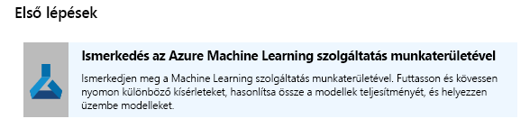
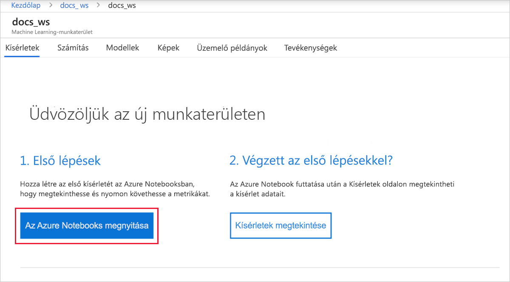
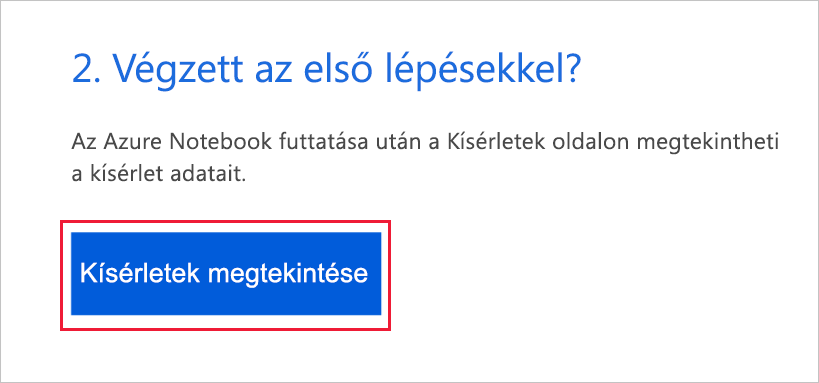
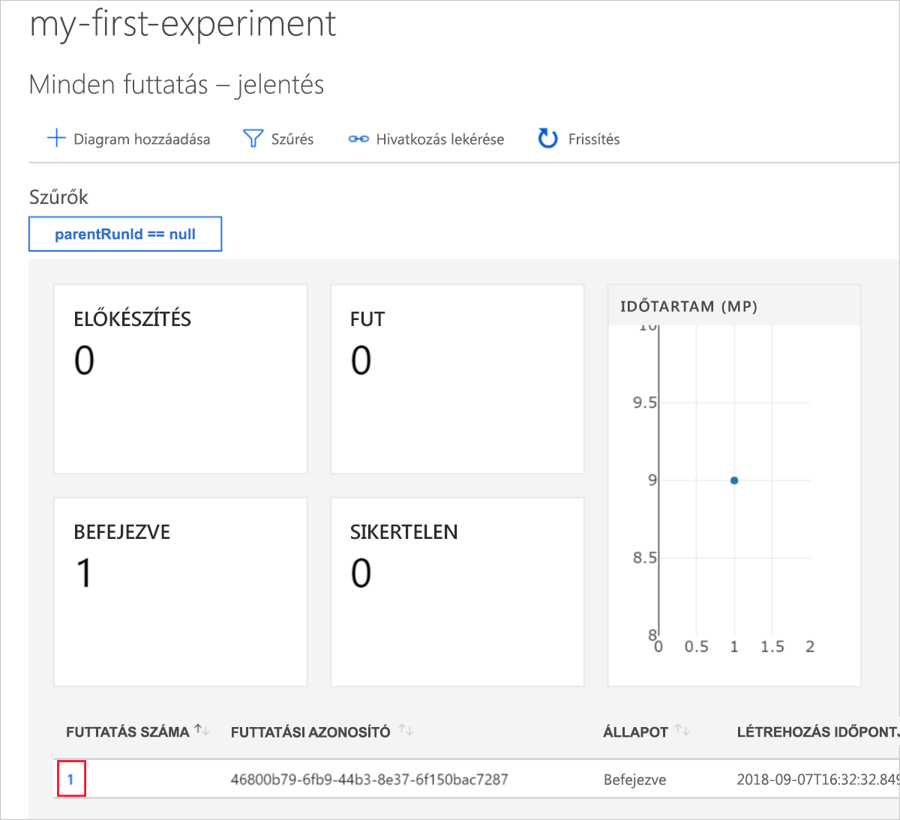
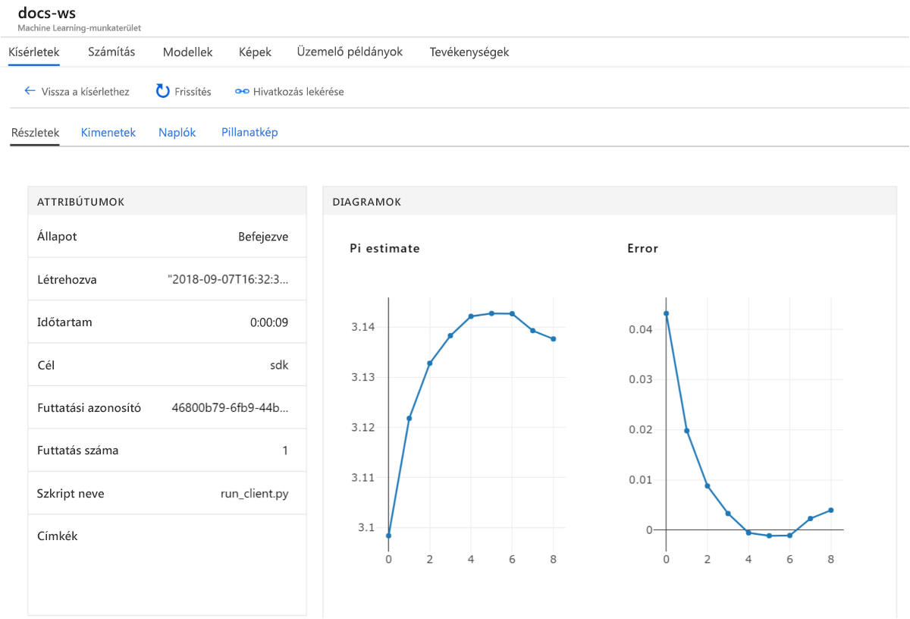

# Gyors útmutató: Az Azure Machine Learning használatának első lépései az Azure portal használatával

Ebben a rövid útmutatóban egy Azure Machine Learning-munkaterületet fog létrehozni az Azure Portalon. A Machine Learning használata során ez a munkaterület szolgál a gépi tanulási modellekkel való kísérletezés, valamint a betanításuk és üzembe helyezésük alapjául a felhőben. Ez a rövid útmutató felhőerőforrásokat használ, és nem igényel telepítést. Ehelyett saját Jupyter notebookok kiszolgáló beállítása: [a rövid útmutató: Az Azure Machine Learning használatának első lépései a Python használatával](quickstart-create-workspace-with-python.md).  
 
> [!VIDEO https://www.microsoft.com/en-us/videoplayer/embed/RE2F9Ad]

Ebben a rövid útmutatóban tegye a következőket:

* Munkaterület létrehozása az Azure-előfizetésben.
* Próbálja ki a Python egy Azure jegyzetfüzet és a naplófájlok értékeket több ismétléseinek között.
* A naplózott értékek megtekintése a munkaterületen.

A következő Azure-erőforrásokat a rendszer automatikusan hozzáadja a munkaterületéhez, ha az Ön régiójában rendelkezésre állnak:

  - [Azure Container Registry](https://azure.microsoft.com/services/container-registry/)
  - [Azure Storage](https://azure.microsoft.com/services/storage/)
  - [Azure Application Insights](https://azure.microsoft.com/services/application-insights/) 
  - [Azure Key Vault](https://azure.microsoft.com/services/key-vault/)

Az Ön által létrehozott erőforrások előfeltételként is használhatók a Machine Learning más szolgáltatási oktatóanyagaiban vagy útmutatóiban. A többi Azure-szolgáltatáshoz hasonlóan a Machine Learninghez társított egyes erőforrások korlátozva vannak. Ilyen például, a számítási fürt méretét. Tudjon meg többet a [alapértelmezett korlátok és a kvóta növelése](how-to-manage-quotas.md).

Ha nem rendelkezik Azure-előfizetéssel, hozzon létre egy ingyenes fiókot megkezdése előtt. Próbálja ki a [Azure Machine Learning szolgáltatás ingyenes vagy fizetős verzióját](http://aka.ms/AMLFree) még ma.

## Munkaterület létrehozása 

[!INCLUDE [aml-create-portal](../../../includes/aml-create-in-portal.md)]

A munkaterületen válassza az `Explore your Azure Machine Learning service Workspace` lehetőséget.

 

## A munkaterület használata

Most tekintse meg, hogyan segít a munkaterület a gépi tanulási szkriptek felügyeletében. Ebben a szakaszban hajtsa végre a következő lépéseket:

* Megnyit egy notebookot az Azure Notebooksban.
* Naplózott értékeket létrehozó kódot futtat.
* A naplózott értékek megtekintése a munkaterületen.

Ez a példa bemutatja, hogyan segíthet a munkaterület a szkriptben létrehozott információk nyomon követésében. 

### Notebook megnyitása 

Az Azure-jegyzetfüzetek futtatásához a Machine Learning, amit az előre konfigurált Jupyter notebookokhoz ingyenes felhőalapú platformot biztosít.  

Kattintson az `Open Azure Notebooks` gombra az első kísérlet kipróbálásához.

 

A cég vagy az intézmény a bejelentkezéshez [rendszergazdai hozzájárulást](https://notebooks.azure.com/help/signing-up/work-or-school-account/admin-consent) írhat elő.

Jelentkezzen be ugyanazzal a fiókkal jelentkezzen be az Azure portal segítségével Azure jegyzetfüzeteket.  A bejelentkezés után megnyílik egy új lap, és megjelenik egy `Clone Library` üzenet. Válassza a(z) `Clone` lehetőséget.

### A notebook futtatása

Két notebook mellett egy `config.json` fájlt is látni fog. Ez a konfigurációs fájl az imént létrehozott munkaterülettel kapcsolatban tartalmaz adatokat.  

Egy notebook megnyitásához válassza a `01.run-experiment.ipynb` elemet.

A cellák egy (Shift + Enter) egyszerre futni. A teljes notebook futtatásához válassza a `Cells` > `Run All` menüpontot. Amikor megjelenik egy csillag __*__, mellett egy cellába, fut-e. A cella kódjának lezárulása után megjelenik egy szám. 

Ha végzett a jegyzetfüzet-ban futó összes cellát, megtekintheti a bejelentkezett értékek a munkaterületén.

## Naplózott értékek megtekintése

A notebook összes cellájának futtatása után lépjen vissza a portál oldalára.  

Válassza a(z) `View Experiments` lehetőséget.

Zárja be a `Reports` előugró ablakot.

Válassza a(z) `my-first-experiment` lehetőséget.

Információk a Futtatás csupán azt tette. Görgessen le az oldalon a futtatások táblájának megkereséséhez. Kattintson a futtatás számának hivatkozására.

 

Láthatja a naplózott értékekhez automatikusan létrehozott grafikonokat. Mindig automatikusan létrejön egy diagram, amikor több értéket naplóz ugyanazzal a névparaméterrel.

   

Mivel a kódot a hozzávetőleges pi véletlenszerű értéket használ, a grafikon különböző értékek jelennek meg.  

## Az erőforrások eltávolítása 

[!INCLUDE [aml-delete-resource-group](../../../includes/aml-delete-resource-group.md)]

Tartsa meg az erőforráscsoportot is, de egyetlen munkaterület törlése. A munkaterület tulajdonságainak megjelenítéséhez, és válassza ki **törlése**.

## További lépések

Létrehozta a modellekkel való kísérletezéshez és azok üzembe helyezéséhez szükséges erőforrásokat. Kódot is futtatott egy notebookban, és áttekintette a kód futtatási előzményeit a felhőben lévő munkaterületen.

Részletes munkafolyamat élményt biztosít betanítása és a modell üzembe helyezése a Machine Learning-oktatóanyagokat követve:  

> [!div class="nextstepaction"]
> [Oktatóanyag: Egy rendszerkép osztályozási modell betanítása](tutorial-train-models-with-aml.md)
