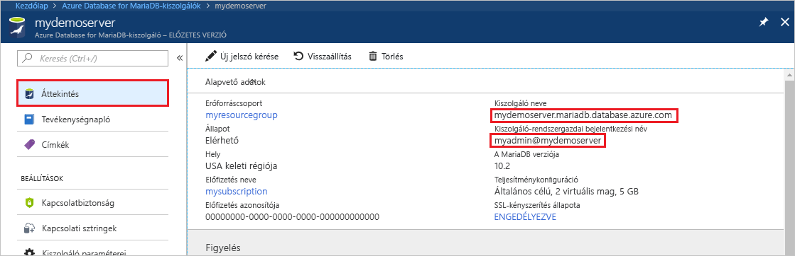
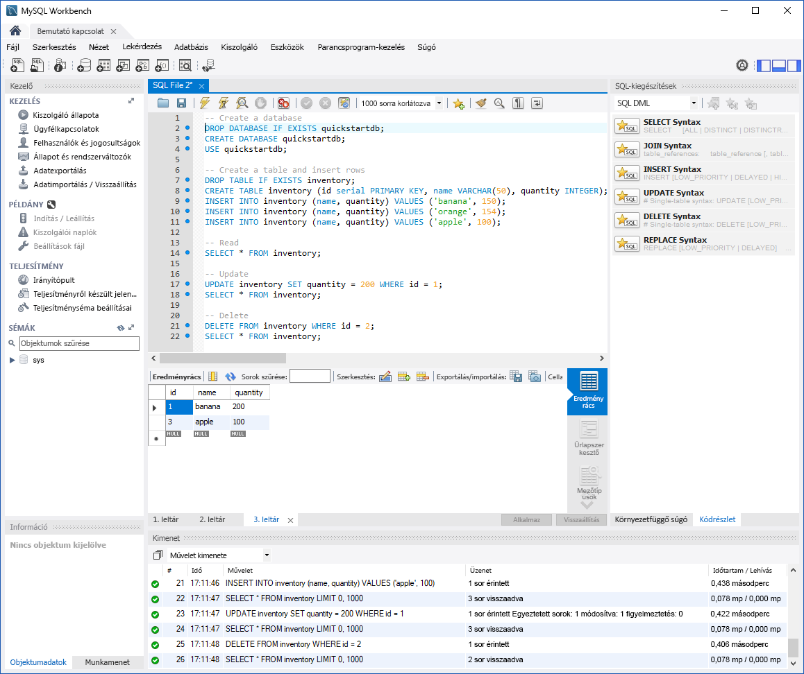

# <a name="azure-database-for-mariadb-use-mysql-workbench-to-connect-and-query-data"></a>Azure Database for MariaDB: Csatlakozás és adatlekérdezés a MySQL Workbench használatával
Ez a rövid útmutató azt szemlélteti, hogyan lehet a MySQL Workbench alkalmazással csatlakozni egy Azure Database for MariaDB-kiszolgálóhoz. 

## <a name="prerequisites"></a>Előfeltételek
A rövid útmutató az alábbi útmutatók valamelyikében létrehozott erőforrásokat használja kiindulópontként:
- [Azure Database for MariaDB-kiszolgáló létrehozása az Azure Portal használatával](./quickstart-create-mariadb-server-database-using-azure-portal.md)
- [Azure Database for MariaDB-kiszolgáló létrehozása az Azure CLI használatával](./quickstart-create-mariadb-server-database-using-azure-cli.md)

## <a name="install-mysql-workbench"></a>A MySQL Workbench telepítése
Töltse le és telepítse a MySQL Workbench alkalmazást a számítógépére [a MySQL webhelyről](https://dev.mysql.com/downloads/workbench/).

## <a name="get-connection-information"></a>Kapcsolatadatok lekérése
Kérje le az Azure Database for MariaDB-hez való csatlakozáshoz szükséges kapcsolatadatokat. Szüksége lesz a teljes kiszolgálónévre és a bejelentkezési hitelesítő adatokra.

1. Jelentkezzen be az [Azure Portalra](https://portal.azure.com/).

2. Az Azure Portal bal oldali menüjében kattintson a **Minden erőforrás** lehetőségre, és keressen rá a létrehozott kiszolgálóra (például **mydemoserver**).

3. Kattintson a kiszolgálónévre.

4. A kiszolgáló **Áttekintés** paneléről jegyezze fel a **Kiszolgálónevet** és a **Kiszolgáló-rendszergazdai bejelentkezési nevet**. Ha elfelejti a jelszavát, ezen a panelen új jelszót is tud kérni.
 

## <a name="connect-to-server-using-mysql-workbench"></a>Csatlakozás a kiszolgálóhoz a MySQL Workbench használatával 
A következő lépések végrehajtásával csatlakozhat egy Azure Database for MariaDB-kiszolgálóhoz a MySQL Workbench használatával:

1.  Indítsa el a MySQL Workbench alkalmazást a számítógépen. 

2.  A **Setup New Connection** (Új kapcsolat beállítása) párbeszédpanelen adja meg a következő információkat a **Parameters** (Paraméterek) lapon:

    

    | **Beállítás** | **Ajánlott érték** | **Mező leírása** |
    |---|---|---|
    |   Kapcsolat neve | Bemutató kapcsolat | Adjon meg egy címkét a kapcsolathoz. |
    | Kapcsolati módszer | Standard (TCP/IP) | A Standard (TCP/IP) elégséges. |
    | Gazdanév | *kiszolgáló neve* | Adja meg azt a kiszolgálónevet, amelyet korábban az Azure Database for MariaDB létrehozásakor használt. Az itt látható példakiszolgáló a mydemoserver.mariadb.database.azure.com. Használja a teljes tartománynevet (\*.mariadb.database.azure.com), ahogyan az a példában látható. Ha nem emlékszik a kiszolgáló nevére, a kapcsolati adatok lekéréséhez kövesse az előző szakasz lépéseit.  |
    | Port | 3306 | Az Azure Database for MariaDB-hez való csatlakozáskor mindig a 3306-os portot használja. |
    | Felhasználónév |  *kiszolgáló-rendszergazdai bejelentkezési név* | Írja be a kiszolgáló-rendszergazdai bejelentkezési felhasználónevet, amelyet korábban az Azure Database for MariaDB létrehozásakor adott meg. A példában szereplő felhasználónév a következő: myadmin@mydemoserver. Ha nem emlékszik a felhasználónévre, a kapcsolati adatok lekéréséhez kövesse az előző szakasz lépéseit. A formátum *username@servername*.
    | Jelszó | az ön jelszava | A jelszó mentéséhez kattintson a **Store in Vault...** (Tárolás a tárolóban...) gombra. |

3.   Kattintson a **Kapcsolat tesztelése** lehetőségre, hogy tesztelje, minden paraméter helyesen lett-e konfigurálva. 

4.   A kapcsolat mentéséhez kattintson az **OK** gombra. 

5.   A **MySQL Connections** (MySQL kapcsolatok) listában kattintson a kiszolgáló csempéjére, majd várja meg a kapcsolat létrejöttét.

        Megnyílik egy új SQL lap egy üres szerkesztővel, ahol beírhatja a lekérdezéseket.
    
        > [!NOTE]
        > Az Azure Database for MariaDB-kiszolgálón alapértelmezés szerint kötelezően SSL-kapcsolatbiztonságra van szükség. Bár általában nincs szükség az SSL-tanúsítványok további konfigurációjára ahhoz, hogy a MySQL Workbench csatlakozzon a kiszolgálóhoz, ajánlott az SSL-hitelesítésszolgáltatói tanúsítványt a MySQL Workbenchhez kötni. Ha le kell tiltania az SSL-t, látogasson el az Azure Portalra, és a Kapcsolatbiztonság lapon használja az SSL-kapcsolat kikényszerítése kapcsológombot a letiltásához.

## <a name="create-table-insert-read-update-and-delete-data"></a>Táblázat létrehozása, adatok beszúrása, olvasása, frissítése és törlése
1. Másolja és illessze be az SQL-mintakódot egy üres SQL-lapra néhány mintaadat bemutatása érdekében.

    Ez a kód a quickstartdb nevű üres adatbázist hozza létre, majd létrehoz egy inventory nevű mintatáblát. Beilleszt néhány sort, majd beolvassa a sorokat. Egy update utasítással módosítja az adatokat, és ismét beolvassa a sorokat. Végül töröl egy sort, majd ismét beolvassa a sorokat.
    
    ```sql
    -- Create a database
    -- DROP DATABASE IF EXISTS quickstartdb;
    CREATE DATABASE quickstartdb;
    USE quickstartdb;
    
    -- Create a table and insert rows
    DROP TABLE IF EXISTS inventory;
    CREATE TABLE inventory (id serial PRIMARY KEY, name VARCHAR(50), quantity INTEGER);
    INSERT INTO inventory (name, quantity) VALUES ('banana', 150);
    INSERT INTO inventory (name, quantity) VALUES ('orange', 154);
    INSERT INTO inventory (name, quantity) VALUES ('apple', 100);
    
    -- Read
    SELECT * FROM inventory;
    
    -- Update
    UPDATE inventory SET quantity = 200 WHERE id = 1;
    SELECT * FROM inventory;
    
    -- Delete
    DELETE FROM inventory WHERE id = 2;
    SELECT * FROM inventory;
    ```

    A képernyőkép az SQL-példakódot és a futtatás utáni kimenetet mutatja az SQL Workbench-ben.
    
    

2. A SQL-mintakód futtatásához kattintson az **SQL File** (SQL-fájl) lévő eszköztár villám ikonjára.
3. Figyelje meg az oldal közepén, a **Result Grid** (Eredménytáblázat) szakaszban lévő többlapos eredményeket. 
4. Figyelje meg az oldal alján lévő **Output** (Kimenet) listát. Láthatja az egyes parancsok állapotát. 

A MySQL Workbench használatával csatlakozott az Azure Database for MariaDB-kiszolgálóhoz, és SQL nyelven lekérdezte az adatokat.

<!--
## Next steps
> [!div class="nextstepaction"]
> [Migrate your database using Export and Import](./concepts-migrate-import-export.md)
-->