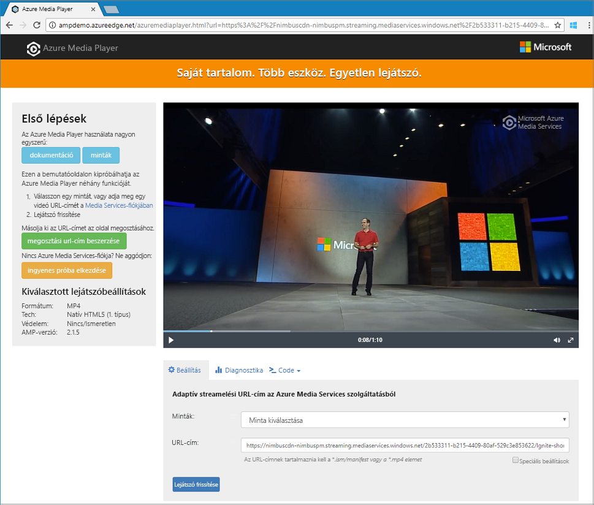

# <a name="quickstart-stream-video-files---net"></a>Rövid útmutató: Videofájlok streamelése – .NET

Ez a rövid útmutató bemutatja, hogy milyen könnyen kezdheti meg a videók kódolását és streamelését számos különféle böngészőben és eszközön az Azure Media Services használatával. A bemenő tartalmak HTTPS- URL- és SAS URL-címekkel vagy az Azure Blob Storage-ban található fájlok elérési útjával határozhatók meg.
A témakörben szereplő minta olyan tartalmakat kódol, amelyeket HTTPS URL-cím segítségével tehet elérhetővé. Vegye figyelembe, hogy az AMS v3 jelenleg nem támogatja a HTTPS URL-címekkel történő darabolásos átviteli kódolást.

A rövid útmutató végére képes lesz videók streamelésére.  



[!INCLUDE [quickstarts-free-trial-note](../../../includes/quickstarts-free-trial-note.md)]

## <a name="prerequisites"></a>Előfeltételek

- Ha nincs telepítve a Visual Studio, szerezze be a [Visual Studio Community 2017](https://www.visualstudio.com/thank-you-downloading-visual-studio/?sku=Community&rel=15)-et.
- Telepítse és a parancssori Felületet helyileg használja, ez a cikk az Azure CLI 2.0-s vagy újabb verziójára van szükség. A rendelkezésére álló verzió azonosításához futtassa a következőt: `az --version`. Ha telepíteni vagy frissíteni szeretne, olvassa el [az Azure CLI telepítését](/cli/azure/install-azure-cli) ismertető cikket. 

    Jelenleg nem minden [Media Services v3 CLI](https://aka.ms/ams-v3-cli-ref) parancsok működnek az Azure Cloud shellben. Javasoljuk, hogy a parancssori Felületet helyileg használja.

- [A Media Services-fiók létrehozása](create-account-cli-how-to.md).

## <a name="download-the-sample"></a>A minta letöltése

Klónozza a gépre a streamelési .NET-mintát tartalmazó GitHub-adattárat a következő paranccsal:  

 ```bash
 git clone http://github.com/Azure-Samples/media-services-v3-dotnet-quickstarts.git
 ```

A minta az [EncodeAndStreamFiles](https://github.com/Azure-Samples/media-services-v3-dotnet-quickstarts/tree/master/AMSV3Quickstarts/EncodeAndStreamFiles) mappában található.

A minta a következő műveleteket hajtja végre:

1. Létrehoz egy átalakítást (először ellenőrzi, hogy létezik-e a megadott átalakítás). 
2. Létrehoz egy kimeneti objektumot, ami a kódolási feladat bemenete lesz.
3. A feladat bemenetét egy HTTPS URL-cím alapján hozza létre.
4. Elküldi a kódolási feladatot a korábban létrehozott bemenet és kimenet használatával.
5. Ellenőrzi a feladat állapotát.
6. Létrehoz egy StreamingLocatort.
7. Streamelési URL-címeket épít fel.

A minta egyes funkcióinak leírásáért vizsgálja meg a kódot, és tekintse meg az [ebben a forrásfájlban](https://github.com/Azure-Samples/media-services-v3-dotnet-quickstarts/blob/master/AMSV3Quickstarts/EncodeAndStreamFiles/Program.cs) található megjegyzéseket.

[!INCLUDE [media-services-v3-cli-access-api-include](../../../includes/media-services-v3-cli-access-api-include.md)]

## <a name="run-the-sample-app"></a>Mintaalkalmazás futtatása

Az alkalmazás futtatásakor megjelennek a videó különböző protokollokkal való lejátszására szolgáló URL-ek. 

1. Az *EncodeAndStreamFiles* alkalmazás futtatásához nyomja le a Ctrl+F5 billentyűkombinációt.
2. Válassza az Apple **HLS** protokollját (a vége *manifest(format=m3u8-aapl)*), és másolja a streamelési URL-címet a konzolról.


A minta [forráskódjában](https://github.com/Azure-Samples/media-services-v3-dotnet-quickstarts/blob/master/AMSV3Quickstarts/EncodeAndStreamFiles/Program.cs) láthatja az URL felépítését. A létrehozásához össze kell fűznie a streamelési végpont gazdanevét és a streamelési lokátor elérési útját.  

## <a name="test-with-azure-media-player"></a>Tesztelés az Azure Media Player használatával

Ebben a cikkben az Azure Media Playert használjuk a streamelés teszteléséhez. 

> [!NOTE]
> Ha a lejátszót egy HTTPS-hely futtatja, az URL-t módosítsa a HTTPS-protokoll használatára.

1. Nyisson meg egy webböngészőt, majd navigáljon a következő helyre: [https://aka.ms/azuremediaplayer/](https://aka.ms/azuremediaplayer/).
2. Az **URL** mezőbe illessze be az alkalmazás futtatásakor kapott streamelési URL-értékek egyikét. 
3. Kattintson az **Update Player** (Lejátszó frissítése) elemre.

Az Azure Media Player használható tesztelésre, az éles környezetben való használata azonban nem ajánlott. 

## <a name="clean-up-resources"></a>Az erőforrások eltávolítása

Ha már nincs szüksége az erőforráscsoportjában lévő egyik erőforrásra sem, beleértve a jelen rövid útmutatóban létrehozott Media Services- és Storage-fiókokat, törölje a korábban létrehozott teljes erőforráscsoportot.

Hajtsa végre a következő CLI-parancsot:

```azurecli
az group delete --name amsResourceGroup
```

## <a name="examine-the-code"></a>A kód vizsgálata

A minta egyes funkcióinak leírásáért vizsgálja meg a kódot, és tekintse meg az [ebben a forrásfájlban](https://github.com/Azure-Samples/media-services-v3-dotnet-quickstarts/blob/master/AMSV3Quickstarts/EncodeAndStreamFiles/Program.cs) található megjegyzéseket.

A [fájlok feltöltésével, kódolásával és streamelésével](stream-files-tutorial-with-api.md) foglalkozó oktatóanyag egy összetettebb streamelési példát biztosít részletesebb magyarázatokkal. 

## <a name="multithreading"></a>Több szál használata

Az Azure Media Services v3 SDK-k nem szálbiztosak. Többszálas alkalmazások használatakor minden szálhoz ajánlott létrehozni egy új AzureMediaServicesClient objektumot.

## <a name="next-steps"></a>További lépések

> [!div class="nextstepaction"]
> [Oktatóanyag: fájlok feltöltése, kódolása és streamelése](stream-files-tutorial-with-api.md)
