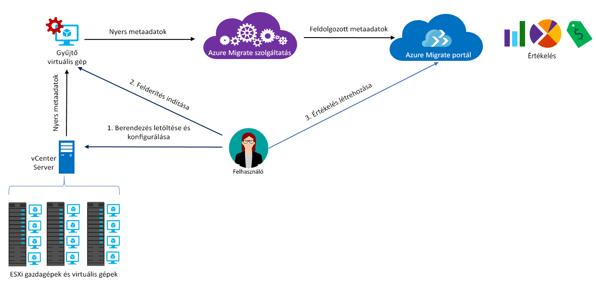

# Az Azure Migrate bemutatása

Az Azure Migrate szolgáltatás a helyszíni számítási feladatokat értékeli ki az Azure-ra történő migráláshoz. A szolgáltatás felméri a helyszíni gépek migrálásra való alkalmasságát, elvégzi a teljesítményalapú méretezést, és költségbecslést ad a helyi számítógépek Azure-ban történő futtatásával kapcsolatban. Ha átemeléses migráláson gondolkodik, vagy épp a migrálási szakaszok felmérésének elején jár, hasznát veheti ennek a szolgáltatásnak. Az értékelés után olyan szolgáltatásokat használhat a számítógépek Azure-ra történő migrálásához, mint az [Azure Site Recovery](https://docs.microsoft.com/azure/site-recovery/site-recovery-overview) vagy az [Azure Database Migration Service](https://docs.microsoft.com/azure/dms/dms-overview).

## Miért javasolt az Azure Migrate használata?

Az Azure Migrate az alábbiakban nyújt segítséget:

- **Az Azure használatához szükséges állapot felmérése**: segít megállapítani, hogy a helyszíni számítógépek alkalmasak-e az Azure-ban való futtatásra.
- **Javaslatok a méretekkel kapcsolatban**: méretezési javaslatokat kaphat az Azure-beli virtuális gépekhez, a helyszíni virtuális gépek korábbi teljesítménye alapján.
- **Becsült havi költség**: megkaphatja a helyszíni gépek Azure-ban való futtatásának költségbecslését.  
- **Megbízható migrálás**: megjelenítheti a helyszíni virtuális gépek függőségeit olyan gépcsoportok létrehozásához, amelyeket együtt fog értékelni és migrálni.

## Aktuális korlátozások

- Jelenleg csak a helyszíni VMware virtuális gépek Azure-beli virtuális gépekre való migrálásának lehetőségeit értékelheti ki. A VMware virtuális gépeket egy 5.5-ös, 6.0-s vagy 6.5-ös verziójú vCenter Servernek kell felügyelnie.
- Hyper-V virtuális gépek felméréséhez az [Azure Site Recovery Deployment Plannert](http://aka.ms/asr-dp-hyperv-doc), fizikai gépek felméréséhez pedig [partnereszközeinket](https://azure.microsoft.com/migration/partners/) használja.
- Egyetlen felderítéssel legfeljebb 1500 virtuális gépet, egyetlen projekt részeként pedig szintén legfeljebb 1500 virtuális gépet deríthet fel. Egyetlen értékeléssel emellett legfeljebb 1500 virtuális gépet értékelhet.
- Ha egy nagyobb méretű környezetet szeretne felderíteni, feloszthatja a felderítést, és létrehozhat több projektet. [További információk](how-to-scale-assessment.md). Az Azure Migrate előfizetésenként legfeljebb 20 projektet támogat.
- Az Azure Migrate kizárólag a felügyelt lemezek migrálásfelmérését támogatja.
- Azure Migrate-projektet csak egyesült államokbeli földrajzi helyen lehet létrehozni. Ettől függetlenül megtervezheti a migrálást egy tetszőleges Azure-beli célhelyre. A migrálási projekt helyét a rendszer csak a helyszíni környezetből felderített metaadatok tárolására használja. [További információ](https://docs.microsoft.com/azure/migrate/resources-faq#discovery-and-assessment) az Azure Migrate által gyűjtött metaadatokról. A gyűjtött metaadatok a kijelölt [Azure-régiócsoport](https://azure.microsoft.com/global-infrastructure/geographies/) egyik régiójában vannak tárolva:

**Régiócsoport** | **Régiók**
--- | ---
Egyesült Államok | USA nyugati középső régiója, USA keleti régiója

## Mi az, amiért fizetnem kell?

[Itt talál további információkat](https://azure.microsoft.com/pricing/details/azure-migrate/) az Azure Migrate díjszabásáról.

## Mit tartalmaz egy értékelés?

Az értékelési beállítások az adott igényekhez szabhatók. Az értékelési tulajdonságokat az alábbi táblázat foglalja össze.

**Tulajdonság** | **Részletek**
--- | ---
**Célhely** | Az Azure-beli hely, ahová a migrálást szeretné végezni.  Az Azure Migrate jelenleg 30 régiót támogat. [Régiók megtekintése](https://azure.microsoft.com/global-infrastructure/services/). Az alapértelmezetten beállított célrégió az USA 2. nyugati régiója.
**Tárolás típusa** | Az Azure-ban lefoglalni kívánt lemezek típusa. Csak akkor alkalmazható, ha a méretezési feltétel a **helyszíni**. A céllemez típusa prémium (ez az alapértelmezett) vagy standard szintű felügyelt lemez lehet. Teljesítményalapú méretezés esetén a lemez méretezésére vonatkozó javaslatot a rendszer automatikusan adja meg a virtuális gépek teljesítményadatainak figyelembevételével.
**Méretezési feltétel** | A méretezés történhet a helyszíni virtuális gépek **teljesítményelőzményei** alapján, esetleg **helyszíniként** (ez az alapértelmezett), a teljesítményelőzmények figyelembevétele nélkül.
**Azure-ajánlat** | Az [Azure-ajánlat](https://azure.microsoft.com/support/legal/offer-details/), amelyre regisztrált. Az Azure Migrate ez alapján becsüli meg a költségeket.
**Azure Hybrid Benefit** | Az értékelés figyelembe veszi, hogy rendelkezik-e szoftvergaranciával, és jogosult-e az [Azure Hybrid Benefit](https://azure.microsoft.com/pricing/hybrid-use-benefit/) kedvezményes díjainak igénybevételére.
**Fenntartott példányok** |  Az értékelés figyelembe veszi, hogy vannak-e [fenntartott példányai](https://azure.microsoft.com/pricing/reserved-vm-instances/) az Azure-ban. Az Azure Migrate ez alapján becsüli meg a költségeket.
**Virtuális gép üzemideje** | A virtuális gépek Azure-ban való futtatásának időtartama. A költségbecslés ezt is figyelembe veszi.
**Tarifacsomag** | A cél Azure-beli virtuális gépek [tarifacsomagja (alapszintű/standard)](../virtual-machines/windows/sizes-general.md). Például ha azt tervezi, hogy éles környezetet migrál, érdemes a standard szintet választani, amely kis késleltetésű virtuális gépeket biztosít, de többe kerülhet. Tesztkörnyezetben viszont érdemes lehet az alapszintű csomag mellett dönteni, amely nagyobb késleltetésű virtuális gépeket biztosít, alacsonyabb költségek mellett. Alapértelmezés szerint a rendszer a [standard](../virtual-machines/windows/sizes-general.md) csomagot használja.
**Teljesítményelőzmények** | Alapértelmezés szerint az Azure Migrate a helyszíni gépek teljesítményét az utolsó nap teljesítményelőzményei alapján, 95%-os százalékértékkel értékeli ki.
**Virtuálisgép-sorozatok** | Méretbecslésekhez használt virtuálisgép-sorozatok. Például egy olyan éles környezetben, amelyet nem szeretne A-sorozatú virtuális gépekre migrálni az Azure-ban, kizárhatja a listából vagy sorozatból az A-sorozatot. Ilyenkor a méretezés csak a kiválasztott sorozatokat veszi figyelembe.   
**Kényelmi faktor** | Az Azure Migrate az értékelés során figyelembe veszi a puffert (kényelmi faktor). Ezt a puffert a rendszer a virtuális gépek gépkihasználtsági adatai (CPU, memória, lemez és hálózat) mellett alkalmazza. A kényelmi faktor áll az olyan problémák mögött, mint a szezonális használat, a rövid teljesítményelőzmények és a jövőbeli használat várható növekedése.   Például egy 10 magos virtuális gép 20%-os kihasználtsággal normál esetben egy 2 magos virtuális gépnek felel meg. 2.0x-es kényelmi faktorral azonban az eredmény ehelyett egy 4 magos virtuális gép. Az alapértelmezett kényelmi beállítás 1.3x.

## Hogyan működik az Azure Migrate?

1.  Hozzon létre egy Azure Migrate projektet.
2.  Az Azure Migrate egy gyűjtőberendezésnek nevezett helyszíni virtuális gépet használ a helyszíni gépek adatainak felderítésére. A berendezés létrehozásához töltse le a telepítőfájlt Open Virtualization Appliance (.ova) formátumban, majd importálja virtuális gépként a helyszíni vCenter Serverre.
3. Csatlakozzon a virtuális géphez a vCenter Serverről, és csatlakozás közben adjon meg hozzá egy új jelszót.
4. Futtassa a gyűjtőt a virtuális gépen a felderítés elindításához.
5. A gyűjtő a VMware PowerCLI-parancsmagok segítségével összegyűjti a virtuális gépek metaadatait. A felderítés ügynök nélkül történik, és nem telepít semmit a VMware-gazdagépekre vagy a virtuális gépekre. Az összegyűjtött metaadatok a virtuális gépek adatait is tartalmazzák (magok, memória, lemezek, lemezméretek és hálózati adapterek). A gyűjtő ezenkívül a virtuális gépek teljesítményadatait is gyűjti, például a processzor- és memóriahasználatot, a lemez IOPS-t, a lemezek átviteli sebességét (MB/s) és a hálózati kimenetet (MB/s).
5.  A rendszer továbbítja a metaadatokat az Azure Migrate projektnek. Ezeket az Azure Portalon tekintheti meg.
6.  Csoportokba rendezheti a felderített virtuális gépeket az értékeléshez. Például egy csoportba helyezheti az azonos alkalmazást futtató virtuális gépeket. A még pontosabb csoportosítás érdekében megtekintheti egy adott géphez vagy egy csoport gépeihez tartozó függőségeket, illetve a csoportok összes gépéhez tartozókat és pontosíthatja a csoportot.
7.  A csoport meghatározását követően hozzon létre hozzá egy értékelést.
8.  Az értékelés befejeződése után megtekintheti azt a portálon, vagy letöltheti Excel-formátumban.

  

## Milyen követelmények vonatkoznak a portokra?

A táblázat összefoglalja az Azure Migrate kommunikációjához szükséges portokat.

Összetevő | Kommunikációs cél |  Részletek
--- | --- |---
Gyűjtő  | Azure Migrate szolgáltatás | A gyűjtő a 443-as SSL-porton keresztül csatlakozik a szolgáltatáshoz.
Gyűjtő | vCenter Server | Alapértelmezés szerint a gyűjtő a 443-as porton csatlakozik a vCenter Serverhez. Ha a kiszolgáló egy másik porton figyel, azt kimenő portként kell konfigurálni a gyűjtő virtuális gépen.
Helyszíni virtuális gép | Log Analytics-munkaterület | [443-as TCP] | [A Microsoft Monitoring Agent (MMA)](../log-analytics/log-analytics-windows-agent.md) a 443-as TCP-portot használja a Log Analyticshez való csatlakozáshoz. Erre a portra csak akkor van szükség, ha a függőségmegjelenítési funkciót használja, amelyhez szükség van az MMA-ügynökre.

## Mi történik az értékelés után?

Miután értékelte a helyszíni gépeket, többféle eszközzel is végrehajthatja a migrálást:

- **Azure Site Recovery**: Az Azure Site Recovery segítségével az Azure-ba végezhet migrálást. Ehhez [elő kell készítenie a szükséges Azure-összetevőket](../site-recovery/tutorial-prepare-azure.md), például a tárfiókot és a virtuális hálózatot. A helyszínen [a VMware-környezetet kell előkészítenie](../site-recovery/vmware-azure-tutorial-prepare-on-premises.md). Ha minden készen áll, állítsa be és engedélyezze az Azure-ba való replikációt, majd migrálja a virtuális gépeket. [További információk](../site-recovery/vmware-azure-tutorial.md).
- **Azure Database Migration**: Ha a helyszíni gépek adatbázist futtatnak (például SQL Servert, MySQL-t vagy Oracle-t), az Azure-ba való migráláshoz használhatja az [Azure Database Migration Service](../dms/dms-overview.md)-t is.

## További lépések

- [Az oktatóanyag utasításait követve](tutorial-assessment-vmware.md) hozzon létre értékelést egy helyszíni VMware virtuális gép számára.
- Tekintse meg az Azure Migrate használatával kapcsolatban felmerülő [gyakori kérdéseket](resources-faq.md).
