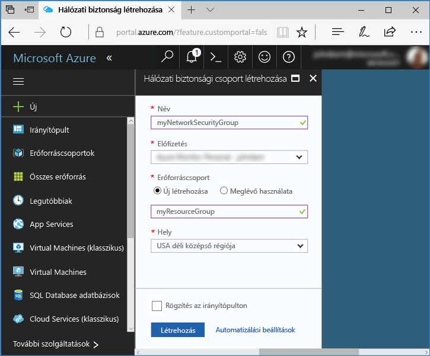
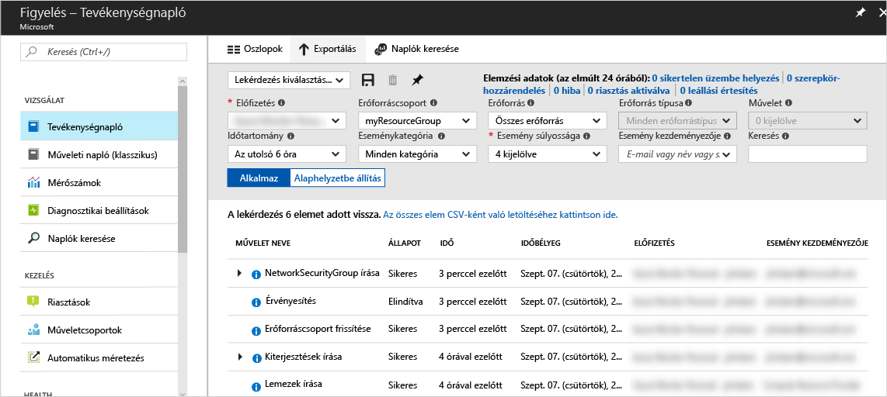
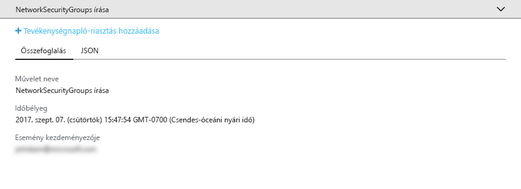
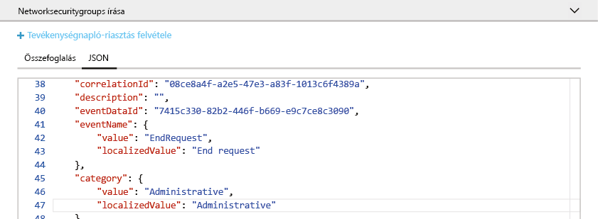
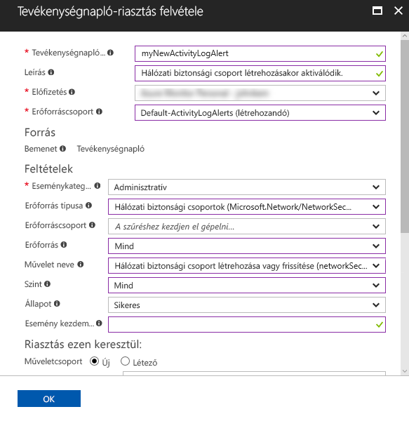
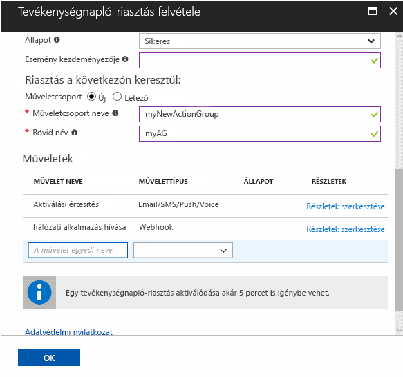

# Az Azure-előfizetés fontosabb műveleteivel kapcsolatos értesítések naplózása és fogadása

Az **Azure-tevékenységnapló** az Azure előfizetés-szintű eseményeit tartalmazza. Információkat biztosít arról, hogy *ki* és *milyen* erőforrásokat hozott létre, frissített vagy törölt, és a műveletekre *mikor* került sor. Ha létrehoz egy **Tevékenységnapló-riasztást**, értesítéseket fog kapni e-mailben, SMS-ben vagy webhookokon keresztül, ha a rendszer a riasztási feltételeknek megfelelő tevékenységeket észlel. Ez a rövid útmutató ismerteti egy egyszerű hálózati biztonsági csoport létrehozását, a Tevékenységnaplóban végzett kereséseket a bekövetkezett események jobb megértéséhez, illetve egy tevékenységnapló-riasztás létrehozását, hogy értesülhessen róla, ha a későbbiekben újabb hálózati biztonsági csoportot hoznak létre.

Ha nem rendelkezik Azure-előfizetéssel, első lépésként mindössze néhány perc alatt létrehozhat egy [ingyenes](https://azure.microsoft.com/free/) fiókot.

## Jelentkezzen be az Azure portálra.

Jelentkezzen be az [Azure portálra](https://portal.azure.com/).

## Hálózati biztonsági csoport létrehozása

1. Kattintson az Azure Portal bal felső sarkában található **Új** gombra.

2. Válassza a **Hálózatkezelés**, majd a **Hálózati biztonsági csoport** elemet.

3. Adja meg a „myNetworkSG” **nevet**, és hozzon létre egy **myResourceGroup** nevű új erőforráscsoportot. Kattintson a **Létrehozás** gombra.

    

## Tallózás a Tevékenységnaplóban a portálon

A rendszer hozzáad egy, a hálózati biztonsági csoport létrehozását leíró eseményt a Tevékenységnaplóhoz. Az esemény azonosításához támaszkodjon az alábbi utasításokra.

1. Kattintson a bal oldali navigációs listán található **Figyelés** gombra. Ez megnyitja a Tevékenységnapló szakaszt. Ez a szakasz a felhasználók által az előfizetése erőforrásain végzett minden művelet előzményét tartalmazza. Az adatokat számos tulajdonság szerint szűrheti (például **Erőforráscsoport**, **Időtartomány** és **Kategória**).

2. A **Tevékenységnapló** szakaszban kattintson az **Erőforráscsoport** legördülő listára, és válassza a **myResourceGroup** elemet. Módosítsa az **Időtartomány** legördülő listában az értéket **Elmúlt 1 órára**. Kattintson az **Alkalmaz** gombra.

    

3. Kattintson a **NetworkSecurityGroups írása** eseményre az események táblázatában.

## Esemény keresése a Tevékenységnaplóban

A megjelenő szakasz a végrehajtott művelet alapvető adatait tartalmazza, azaz a nevét, az időbélyeget és a végrehajtó felhasználót vagy alkalmazást.

Az esemény összes részletének megtekintéséhez kattintson a **JSON** lapra. Ez részletesen ismerteti, milyen jogosultsága volt a felhasználónak vagy alkalmazásnak a művelet végrehajtására, és tartalmazza az esemény kategóriáját és szintjét, valamint a művelet állapotát.

## Tevékenységnapló-riasztás létrehozása

1. Az **Összefoglalás** lapra kattintva térjen vissza az esemény összegzéséhez.

2. A megjelenő összefoglalási szakaszban kattintson a **Tevékenységnapló-riasztás hozzáadása** elemre.

    

3. A megjelenő szakaszban nevezze el a tevékenységnapló-riasztást, és adja meg a leírását.

4. A **Feltételek** területen győződjön meg arról, hogy az **Eseménykategória** beállítása **Felügyeleti**, az **Erőforrás típusa** **Hálózati biztonsági csoportok**, a **Művelet neve** **Hálózati biztonsági csoport létrehozása vagy frissítése**, az **Állapot** **Sikeres**, és minden más feltételmező vagy üres, vagy **Összes** értékre van beállítva. A feltételek határozzák meg azokat a szabályokat, amelyek segítségével megállapítható, hogy a riasztást aktiválni kell-e, amikor új esemény kerül be a Tevékenységnaplóba.

    

5. A **Riasztás ezen keresztül:** területen válassza az **Új** műveletcsoportot, és adjon egy **nevet** és egy **rövid nevet** a műveletcsoportnak. A műveletcsoport határozza meg, milyen műveleteket kell elvégezni, ha a riasztás aktiválódik (azaz egy új esemény megfelel a feltételeknek).

6. A **Műveletek** területen vegyen fel 1 vagy több műveletet. Ehhez adja meg a művelet **Nevét**, a **Művelet típusát** (például e-mail vagy SMS) és az adott művelettípus **Részleteit** (például egy webhook URL-jét, e-mail-címet vagy telefonszámot).

    

7. Kattintson az **OK** gombra a tevékenységnapló-riasztás mentéséhez.

## A tevékenységnapló-riasztás tesztelése

> [!NOTE]
> Egy tevékenységnapló-riasztás életbe léptetése körülbelül 10 percbe telik. Azok az események, amelyekre ennek letelte előtt kerül sor, nem váltanak ki értesítést.
>
>

A riasztás teszteléséhez ismételje meg az előző szakaszt (**hozzon létre egy hálózati biztonsági csoportot**), de ennek a hálózati biztonsági csoportnak adjon másik nevet, és használja újra a meglévő erőforráscsoportot. Néhány percen belül kap egy értesítést a hálózati biztonsági csoport létrejöttéről.

## Az erőforrások eltávolítása

Ha már nincs rájuk szükség, törölje az erőforráscsoportot és a hálózati biztonsági csoportot. Ehhez írja be a létrehozott erőforráscsoport nevét a portál tetején található keresőmezőbe, és kattintson az erőforráscsoport nevére. A megjelenő szakaszban kattintson az **Erőforráscsoport törlése** gombra, írja be az erőforráscsoport nevét, és kattintson a **Törlés** gombra.

## Következő lépések

Ebben a rövid útmutatóban egy művelet végrehajtásával létrehozott egy tevékenységnapló-eseményt, majd létrehozott egy tevékenységnapló-riasztást, hogy értesüljön róla, ha a művelet a jövőben megismétlődik. Ezután tesztelte a riasztást a művelet ismételt elvégzésével. Az Azure 90 napra visszamenőleg teszi elérhetővé a Tevékenységnapló eseményeit. Ha 90 napnál hosszabb ideig kell megőriznie az eseményeket, próbálja meg archiválni a Tevékenységnapló adatait a többi monitorozási adattal együtt.

> [!div class="nextstepaction"]
> [Megfigyelési adatok archiválása](./monitor-tutorial-archive-monitoring-data.md)
