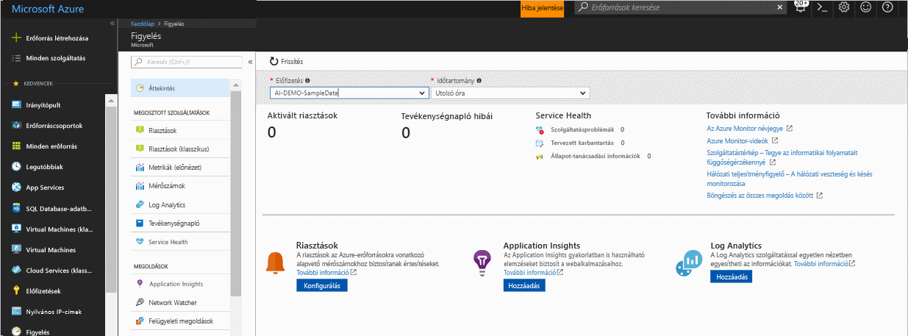
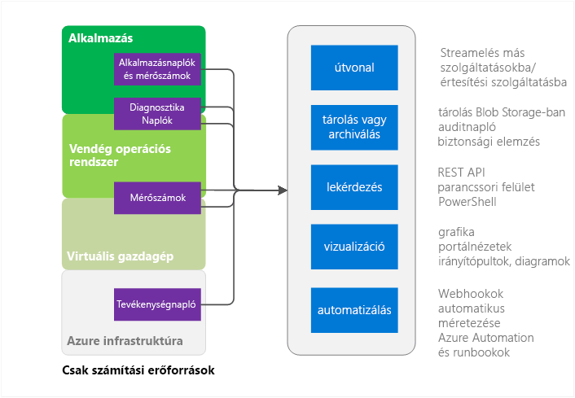
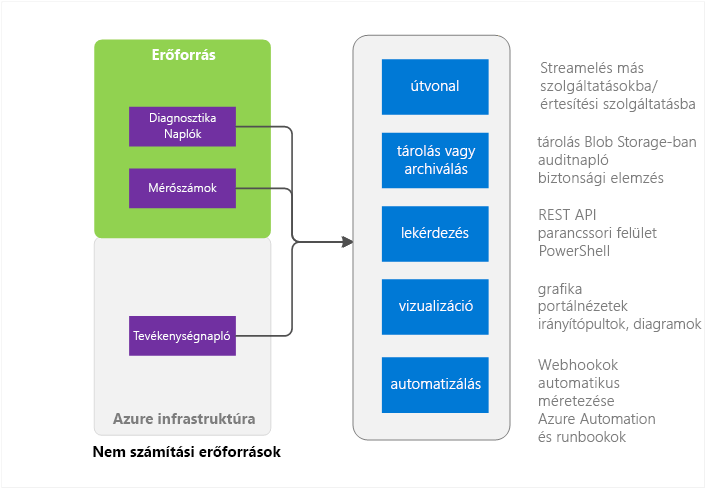

# Az Azure Monitor áttekintése
A cikk áttekintést nyújt a Microsoft Azure-ban elérhető Azure Monitor szolgáltatásról. Az Azure Monitor működését ismerteti, és további útmutatásokat ad az Azure Monitor használatát illetően.  Amennyiben inkább egy bemutató videót szeretne megtekinteni, lásd a cikk alján található Következő lépések hivatkozásokat. 

## Az Azure Monitor és a Microsoft egyéb monitorozási termékei
Az Azure Monitor alapszintű infrastruktúrametrikákat és -naplókat biztosít a legtöbb Microsoft Azure-szolgáltatásról. Azok az Azure-szolgáltatások, amelyek adatai még nem szerepelnek az Azure Monitorban, a későbbiekben válnak elérhetővé.

A Microsoft egyéb termékeket és szolgáltatásokat is kínál, amelyek további monitorozási képességeket biztosítanak a helyszíni telepített rendszerekkel rendelkező fejlesztői, DevOps és informatikai üzemeltető csapatok számára. Az ilyen különböző termékek és szolgáltatások együttműködésének áttekintéséért és ismertetéséért lásd: [Monitorozás a Microsoft Azure-ban](monitoring-overview.md).

## A portál áttekintő oldala

Az Azure Monitor kezdőlapja a következőkben nyújt segítséget a felhasználóknak: 
- Az Azure által nyújtott monitorozási képességek megismerése.
- Az Azure platform és prémium monitorozási képességeinek felderítése, konfigurálása és előkészítése.

Az oldal egy kiindulási pont az eligazodáshoz akár az előkészítés során is. A különböző szolgáltatásokkal kapcsolatos válogatott esetleírásokat tartalmaz, és lehetővé teszi, hogy a felhasználó a környezetükben tekintse meg azokat.
 

Az oldalak megnyitásakor választhat az előfizetések közül, amelyekhez olvasási joggal rendelkezik. A kiválasztott előfizetéssel kapcsolatban a következőket tekintheti meg:

- **Aktivált riasztások és a riasztási források** – A tábla az összegzett darabszámokat, a riasztási forrásokat, valamint a kiválasztott időszakban aktivált riasztások számát mutatja. A régebbi és az újabb riasztásokra egyaránt vonatkozik. További információk az [újabb Azure-riasztásokról](monitoring-overview-unified-alerts.md). 
- **Tevékenységnaplókban szereplő hibák** – Amikor valamely Azure-erőforrás hibaszintű súlyossággal rendelkező eseményeket naplóz, ezekről egy magas szintű összegzést tekinthet meg, és a tevékenységnaplóra átkattintva kivizsgálhatja az egyes eseményeket.
- **Azure Service Health** – Megtekintheti a Service Health-szolgáltatásban szereplő hibák számát, a tervezett karbantartási eseményeket, valamint az állapot-tanácsadási információkat. Az Azure Service Health személyre szabott információkat biztosít, ha az Azure-infrastruktúrával kapcsolatos problémák kihatnak a szolgáltatásaira.  További információkért lásd: [Azure Service Health](../service-health/service-health-overview.md).  
- **Application Insights** – Megtekintheti az aktuális előfizetés alá tartozó egyes AppInsights-erőforrások KPI mutatóit. A KPI-k az ASP.NET-webalkalmazások, Java, csomópont és általános típusok kiszolgálóoldali alkalmazásmonitorozásra vannak optimalizálva. A KPI-k a lekérdezési gyakorisággal, a válaszidőkkel, a hibaarányokkal és a rendelkezésre állási szintekkel kapcsolatos metrikákat tartalmaznak. 

Ha nem regisztrált a Log Analytics vagy az Application Insights szolgáltatásra, vagy ha nem konfigurált Azure-riasztásokat az aktuális előfizetésben, a lapon található hivatkozásokkal kezdheti el a regisztrációt.

## Azure Monitor-források – Compute részhalmaz

Az itt található Compute Services számítási szolgáltatások a következők: 
- Cloud Services 
- Virtuális gépek 
- Virtuálisgép-méretezési csoportok 
- Service Fabric

### Alkalmazás – Diagnosztikai naplók, alkalmazásnaplók és metrikák
Az alkalmazások a vendég operációs rendszer felett futhatnak a számítási modellben. Saját napló- és metrikakészleteket hoznak létre. Az Azure Monitor az Azure diagnosztikai bővítménye (Windows vagy Linux) segítségével gyűjti a legtöbb alkalmazásszintű metrikát és naplót. Ezek a következő típusúak lehetnek:

* Teljesítményszámlálók
* Alkalmazásnaplók
* Windows-eseménynaplók
* .NET-eseményforrás
* IIS-naplók
* Jegyzékalapú ETW
* Összeomlási memóriaképek
* Egyéni hibanaplók

A diagnosztikai bővítmény hiányában csak néhány metrika, például a processzorhasználat érhető el. 

### Gazda és vendég virtuális gépek metrikái
A fent felsorolt számítási erőforrások egy dedikált virtuális gazdagéppel és egy vendég operációs rendszerrel rendelkeznek, amelyeket használnak. A virtuális gazdagép és a vendég operációs rendszer a Hyper-V hipervizor modellben a legfelső szintű virtuális gépnek és egy vendég virtuális gépnek felel meg. Mindkettőről gyűjthet metrikákat. A vendég operációs rendszerről diagnosztikai naplókat is gyűjthet.   

### Tevékenységnapló
A tevékenységnaplóban (korábbi nevén a műveleti vagy auditnaplóban) az erőforrással kapcsolatban az Azure-infrastruktúra által látható információkat kereshet. A napló például az erőforrások létrehozási és megszüntetési időpontjaival kapcsolatos információkat tartalmaz.  További információért lásd: [A tevékenységnapló áttekintése](monitoring-overview-activity-logs.md). 

## Azure Monitor-források – minden más

### Erőforrás – Metrikák és diagnosztikai naplók
A gyűjthető metrikák és diagnosztikai naplók az erőforrás típusától függően változnak. Például a Web Apps a lemezek IO-értékeivel és a processzorkihasználtsági arányokkal kapcsolatos információkat továbbít. Ezek a metrikák a Service Bus-üzenetsorokra vonatkozóan nem léteznek, amelyek viszont az üzenetsor méretével és az üzenetátvitellel kapcsolatos metrikákat szolgáltatnak. Az egyes erőforrásokról gyűjthető metrikák listáját a [támogatott metrikákat](monitoring-supported-metrics.md) ismertető oldalon találja. 

### Gazda és vendég virtuális gépek metrikái
Nem feltétlenül létezik 1:1 megfeleltetés az adott erőforrások és egy adott virtuális gazdagép vagy vendég virtuális gép között, így metrikák sem érhetők el.

### Tevékenységnapló
A tevékenységnapló ugyanaz, mint a számítási erőforrások esetében.  

## Használata az adatok monitorozására
Az adatokkal azok begyűjtése után a következőket teheti az Azure Monitorban.

### Útválasztás
A monitorozási adatokat más helyekre streamelheti. 

Példák erre vonatkozóan:

- Átküldheti az adatokat az Application Insightsba, ahol kiaknázhatja annak gazdagabb vizualizációs és elemzési eszközeit.
- Átküldheti az adatokat az Event Hubsba, ahonnan külső eszközökbe irányíthatja azokat. 

### Tárolás és archiválás
Egyes monitorozási adatok már eleve tárolva vannak és elérhetők az Azure Monitor szolgáltatásban egy megadott ideig. 
- A metrikák 90 napon keresztül érhetők el. 
- A tevékenységnapló-bejegyzések 90 napon keresztül érhetők el. 
- A diagnosztikai naplók nincsenek tárolva. 

Ha az adatokat a fent jelzett időtartamoknál hosszabb ideig szeretné megőrizni, arra használhat egy Azure-tárolót. A monitorozási adatokat a tárfiók az Ön által megadott megőrzési szabályzat alapján tárolja. Az adatok által az Azure-tárfiókban elfoglalt helyért fizetnie kell. 

Az adatok felhasználásának néhány módja:

- Az adatokat azok beírása után az Azure-on belüli és kívüli eszközökkel olvashatja és dolgozhatja fel.
- Az adatokat letöltheti egy helyi archívumba, vagy a megőrzési szabályzat módosításával huzamosabb ideig is megőrizheti azokat a felhőben.  
- Az adatokat archiválási célból korlátlan ideig őrizze meg az Azure-tárolóban. 

### Lekérdezés
A rendszerben vagy az Azure-tárolóban lévő adatokat az Azure Monitor REST API-ja, platformfüggetlen parancssori felületi (CLI) parancsok, PowerShell-parancsmagok vagy a .NET SDK használatával érheti el

Példák erre vonatkozóan:

* Az adatok lekérése egy saját fejlesztésű egyéni monitorozási alkalmazás számára
* Egyéni lekérdezések létrehozása és a lekért adatok továbbítása egy külső alkalmazásnak.

### Vizualizáció
A monitorozási adatok ábrákon és diagramokon való megjelenítésével a trendek könnyebben megfigyelhetőek, mint maguknak az adatoknak a vizsgálatával.  

Néhány vizualizációs módszer:

* Az Azure Portal használata
* Az adatok átirányítása az Azure Application Insightsba
* Az adatok átirányítása a Microsoft PowerBI-ba
* Az adatok átirányítása egy külső vizualizációs eszközbe élő stream használatával vagy egy, az Azure-tárolóban lévő archívum az eszköz általi beolvasásával

### Automatizálás
> [!NOTE]
> A Microsoft Azure-beli riasztások folyamatos fejlesztése révén mostantól a riasztások egy egységes felületen érhetők el. További részletek az [új Azure-riasztásokkal](monitoring-overview-unified-alerts.md) kapcsolatban

Az Azure-riasztásokban a monitorozási adatokat használhatja riasztások vagy akár egész folyamatok aktiválására. Példák erre vonatkozóan:

* A számítási példányok automatikus fel- vagy leskálázása az adatok alapján az alkalmazás terhelésének megfelelően.
* E-mailek küldése metrika- vagy naplókritériumok alapján. 
* Webes URL-cím (webhook) meghívása egy művelet végrehajtására egy Azure-on kívüli rendszerben
* Runbook indítása az Azure Automationben különféle feladatok végrehajtására

## Módszerek az Azure Monitor elérésére
Általában az adatokat azok követéséhez, átirányításához és lekéréséhez a következő módszerekkel kezelheti. Nem mindegyik módszer érhető el mindegyik művelet és adattípus esetében.

* [Azure Portal](https://portal.azure.com)
* [PowerShell](insights-powershell-samples.md)  
* [Platformfüggetlen parancssori felület (CLI)](insights-cli-samples.md)
* [REST API](https://docs.microsoft.com/rest/api/monitor/)
* [.NET SDK](http://www.nuget.org/packages/Microsoft.Azure.Management.Monitor)

## További lépések
További információ
- A kizárólag az Azure Monitorral foglalkozó útmutató videó a következő helyen érhető el:  
[Ismerkedés az Azure Monitorral](https://channel9.msdn.com/Blogs/Azure-Monitoring/Get-Started-with-Azure-Monitor). 
- Az Azure Monitor alkalmazási területeit bemutató videók [a Microsoft Azure monitorozási és diagnosztikai lehetőségeit ismertető](https://channel9.msdn.com/events/Ignite/2016/BRK2234) és [az Ignite 2016 eseményen az Azure Monitorról készült anyagban](https://myignite.microsoft.com/videos/4977) érhetők el.
- Tekintse át az Azure Monitor felületet [az Azure Monitort ismertető](monitoring-get-started.md) anyagban
- Amennyiben a felhőszolgáltatásokkal, virtuális gépekkel, virtuálisgép-méretezési csoportokkal vagy Service Fabric-alkalmazásokkal kapcsolatos problémákat szeretne diagnosztizálni, állítsa be az [Azure Diagnostics bővítményeket](../azure-diagnostics.md).
- Használja az [Application Insights](https://azure.microsoft.com/documentation/services/application-insights/) szolgáltatást, amennyiben az App Service-webalkalmazásokkal kapcsolatos problémákat szeretne diagnosztizálni.
- Tekintse át az [Azure Storage hibaelhárítását](../storage/common/storage-e2e-troubleshooting.md) ismertető cikket, amennyiben tároló blobokat, táblákat vagy üzenetsorokat használ
- [Log Analytics](https://azure.microsoft.com/documentation/services/log-analytics/)
