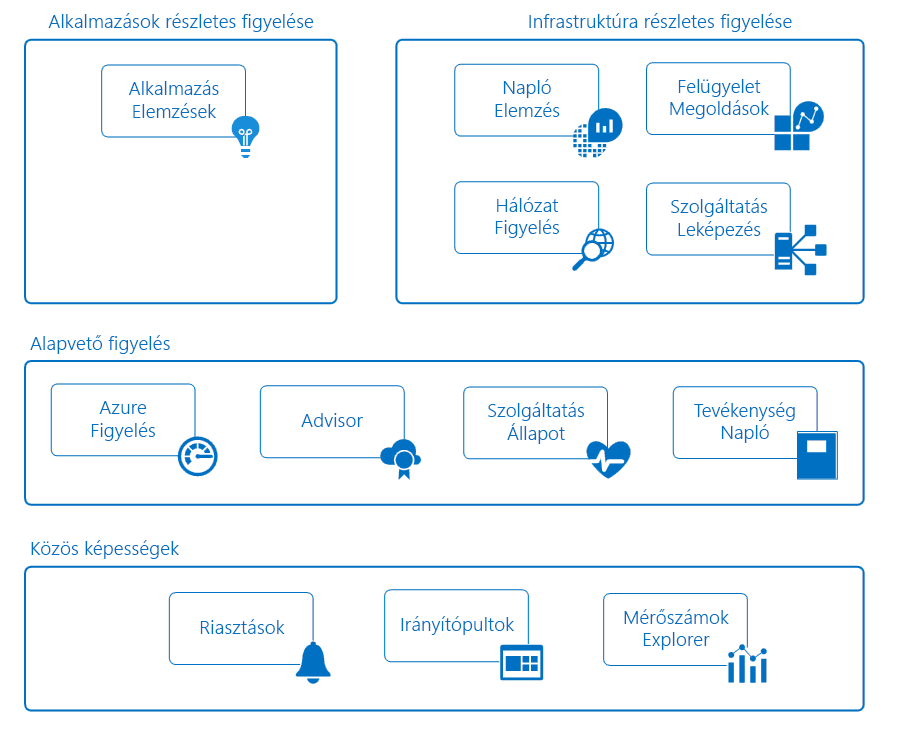

# Azure-alkalmazások és -erőforrások monitorozása

A monitorozás adatok gyűjtését és elemzését jelenti azzal a céllal, hogy meg lehessen állapítani az üzleti alkalmazás és az általa használt erőforrások teljesítményét, állapotát és rendelkezésre állását. A hatékony monitorozási stratégia pontos információkat nyújt az alkalmazás összetevőinek működéséről. Emellett segít növelni az üzemidőt a kritikus problémákra vonatkozó előzetes értesítésekkel, amelyeknek köszönhetően még azelőtt orvosolni lehet ezeket a problémákat, mielőtt tényleges gondot jelentenének.

Az Azure több szolgáltatást is tartalmaz, amelyek önmagukban is betöltenek adott szerepköröket vagy végrehajtanak bizonyos feladatokat a monitorozás területén. Ezek a szolgáltatások együtt egy átfogó megoldást nyújtanak az alkalmazások és az azt támogató Azure-erőforrások telemetriaadatainak gyűjtésére és elemzésére, valamint ezek alapján műveletek végrehajtására. Emellett használhatók kritikus fontosságú helyszíni erőforrások monitorozására egy hibrid monitorozási környezet biztosítása érdekében. A rendelkezésre álló eszközök és adatok megismerése az első lépés az alkalmazás teljes monitorozási stratégiájának kidolgozásában.

Az alábbi ábrán az Azure-erőforrások monitorozásában részt vevő összetevők koncepcióvázlata látható. A következő szakaszok ezeket az összetevőket ismertetik, és a részletes műszaki információkra mutató hivatkozásokat tartalmaznak.

## Közös képességek
Az alapvető és a részletes monitorozási szolgáltatás ugyanolyan funkciókat használnak, amelyek az alábbi képességeket biztosítják.

### Riasztások
Az [Azure-riasztások](../monitoring-and-diagnostics/monitoring-overview-alerts.md) proaktívan értesítik a felhasználót a kritikus állapotokról, és javító intézkedéseket is végrehajthatnak. A riasztási szabályok több forrásból, például metrikákból és naplókból származó adatokat használnak. A szabályok [műveletcsoportokat](../monitoring-and-diagnostics/monitoring-action-groups.md) használnak, amelyek az egyes riasztásokra reagáló címzetteket és műveleteket tartalmazzák. A követelmények alapján a riasztások webhookok használatával külső műveleteket is indíthatnak, vagy integrálhatók az ITSM-eszközökkel.

### Irányítópultok
Az [Azure-irányítópultok](../azure-portal/azure-portal-dashboards.md) használatával különféle adatokat kombinálhat egyetlen panelen az [Azure Portalon](https://portal.azure.com). Az irányítópultot ezután megoszthatja más Azure-felhasználókkal.

Létrehozhat például egy irányítópultot, amely a következőket kombinálja:
- a metrikákat grafikonokon megjelenítő csempéket,
- tevékenységnaplók tábláját,
- az Application Insightsból származó használati diagramot,
- a Log Analytics szolgáltatásban végrehajtott naplókeresés kimenetét.

A Log Analytics-adatok exportálhatók a [Power BI](https://docs.microsoft.com/power-bi/) szolgáltatásba is. Ezután kihasználhatja a szolgáltatás további vizualizációs képességeit is. Az adatokat a vállalaton belüli és kívüli személyek számára is elérhetővé teheti.

### Metrikaböngésző
A [metrikák](../monitoring-and-diagnostics/monitoring-overview-metrics.md) az Azure-erőforrások által létrehozott numerikus értékek, amelyek segítségével képet kaphat az adott erőforrás működéséről és teljesítményéről. A Metrikaböngésző használatával a metrikákat a Log Analyticsbe küldheti el, ahol azok más forrásokból származó adatokkal együtt elemezhetők.

## Alapvető monitorozás
Az alapvető monitorozás az Azure-erőforrások lényegi és szükséges monitorozását biztosítja. Ezek a szolgáltatások minimális konfigurálást igényelnek, és a prémium monitorozási szolgáltatások által használt telemetriaadatokat gyűjtik.    

### Azure Monitor
Az [Azure Monitor](../monitoring-and-diagnostics/monitoring-overview-azure-monitor.md) az Azure-szolgáltatások alapvető monitorozását teszi lehetővé a [metrikák](../monitoring-and-diagnostics/monitoring-overview-metrics.md), [tevékenységnaplók](../monitoring-and-diagnostics/monitoring-overview-activity-logs.md) és [diagnosztikai naplók](../monitoring-and-diagnostics/monitoring-overview-of-diagnostic-logs.md) gyűjtésével. A tevékenységnaplók például elárulják, hogy mikor történt az új erőforrások létrehozása vagy módosítása.

Rendelkezésre állnak olyan metrikák, amelyek a virtuális gépek különböző erőforrásairól, sőt a virtuális gépen futó operációs rendszerről biztosítanak teljesítménystatisztikát. Az adatokat megtekintheti az Azure Portal valamelyik böngészőjében, és riasztásokat hozhat létre a metrikák alapján. Az Azure Monitor biztosítja a leggyorsabb metrikafolyamatot (5 perctől akár 1 percig), így az idő szempontjából kritikus fontosságú riasztásokhoz és értesítésekhez ezt a szolgáltatást érdemes használnia.

A metrikákat és a naplókat elküldheti az Azure Log Analyticsbe is a trendek meghatározásához és részletes elemzéshez, illetve további riasztási szabályok létrehozásához, amelyek az elemzések alapján proaktív módon értesítik a kritikus problémákról.  

> [!NOTE]
> A többdimenziós metrikák elküldése a Log Analyticsbe diagnosztikai beállításokon keresztül jelenleg nem támogatott. A dimenziókkal rendelkező metrikák egybesimított, egydimenziós metrikákként vannak exportálva, összesített dimenzióértékekkel.
>
> *Például*: Egy eseményközpont „Bejövő üzenetek” metrikája üzenetsoronként deríthető fel és ábrázolható. A Log Analyticsbe exportálva azonban a metrika az eseményközpontban lévő összes üzenetsor összes bejövő üzeneteként lesz ábrázolva.
>
>

### Azure Advisor
Az [Azure Advisor](../advisor/advisor-overview.md) folyamatosan monitorozza az erőforrások konfigurációját és használati telemetriáját. Ezután személyre szabott javaslatokat biztosít az ajánlott eljárások alapján. Ezeket a javaslatokat betartva javítható az alkalmazásokat támogató erőforrások teljesítménye, biztonsága és rendelkezésre állása.

### Service Health
Az alkalmazás állapota az általa használt Azure-szolgáltatásoktól függ. Az [Azure Service Health](../service-health/service-health-overview.md) azonosítja az Azure-szolgáltatásokkal kapcsolatos azon problémákat, amelyek hatással lehetnek az alkalmazásra. A Service Health a rendszeres karbantartás tervezésében is segítséget nyújt.

### Tevékenységnapló
A [tevékenységnapló](../monitoring-and-diagnostics/monitoring-overview-activity-logs.md) az egyes Azure-erőforrások működésével kapcsolatos adatokat biztosítja. Ezek az adatok az alábbiak:
- Az erőforrás konfigurációjának módosításai.
- A szolgáltatás állapotával kapcsolatos incidensek.
- Az erőforrás jobb használatára vonatkozó javaslatok.
- Az automatikus méretezési műveletekre vonatkozó információk.

Egy adott erőforrás naplóit az erőforrás lapján tekintheti meg az Azure Portalon. A tevékenységnapló-böngészőben egyszerre több erőforrás naplóit is megtekintheti.

A tevékenységnapló-bejegyzéseket elküldheti a Log Analyticsbe is. Itt a felügyeleti megoldások, a virtuális gépeken futó ügynökök és egyéb források által gyűjtött adatok használatával elemezheti a naplókat.

## Részletes monitorozási szolgáltatások
Az alábbi Azure-szolgáltatások sokoldalú képességeket biztosítanak az adatok részletesebb szinten történő gyűjtéséhez és elemzéséhez. Ezek a szolgáltatások az alapvető monitorozási képességekre építenek, és az Azure-ban elérhető általános funkciókat használják. A gyűjtött adatok alapján hatékony elemzési képességeket biztosítanak, amelyekkel egyedi betekintést nyújtanak az alkalmazásokba és az infrastruktúrába. Az adatokat különféle célközönségeknek készült forgatókönyvek alapján jelenítik meg.

## Alkalmazások részletes monitorozása
### Application Insights
Az [Azure Application Insights](http://azure.microsoft.com/documentation/services/application-insights) használatával monitorozhatja az alkalmazások rendelkezésre állását, teljesítményét és használatát, függetlenül attól, hogy a felhőben vagy helyszíni környezetben futnak.

Ha az alkalmazást úgy alakítja ki, hogy képes legyen az Application Insights használatára, részletesebb elemzésekre tehet szert, és DevOps-forgatókönyveket valósíthat meg. Gyorsan azonosíthatja és diagnosztizálhatja a hibákat anélkül, hogy meg kellene várnia, amíg egy felhasználó jelenti azokat. A gyűjtött információk alapján megalapozott döntéseket hozhat az alkalmazás karbantartásával és továbbfejlesztésével kapcsolatban.

Az Application Insights kiterjedt eszközkészlettel rendelkezik az általa gyűjtött adatok feldolgozásához. Az Application Insights egy általános adattárban tárolja az adatait. Képes a különféle közös funkciók, például a riasztások, irányítópultok és részletes elemzés előnyeinek kihasználására a Log Analytics lekérdezési nyelvének használatával.

## Infrastruktúra részletes monitorozása
### Log Analytics
A [Log Analytics](http://azure.microsoft.com/documentation/services/log-analytics) központi szerepet játszik az Azure általi monitorozásban: a különféle erőforrásokból (köztük a nem Microsoft-eszközökből) származó adatok egyetlen adattárba gyűjti. Az adatokat ezután Ön egy hatékony lekérdezési nyelv használatával elemezheti az adattárban.

Az Application Insights és az Azure Security Center a Log Analytics adattárában tárolják az adataikat, és annak elemzési alrendszerét használják. A rendszer az Azure Monitorból, felügyeleti megoldásokból, valamint a felhőben és a helyszíni rendszereken futó virtuális gépeken telepített ügynökökből is gyűjt adatokat. A közös funkcióknak köszönhetően átfogó képet alkothat a környezetről.

### Felügyeleti megoldások
A [felügyeleti megoldások](../log-analytics/log-analytics-add-solutions.md) olyan összeállított logikakészletek, amelyek megállapításokat biztosítanak egy adott alkalmazással vagy szolgáltatással kapcsolatban. Az általuk gyűjtött monitorozási adatokat a Log Analytics segítségével tárolják és elemzik.

A Microsofttól és partnereitől elérhető felügyeleti megoldások különféle Azure- és külső szolgáltatások monitorozását biztosítják. Néhány példa a monitorozási megoldásokra:
* [Container Monitoring](../log-analytics/log-analytics-containers.md), amelynek segítségével megtekintheti és kezelheti a tárológazdagépeket.
* [Azure SQL Analytics](../log-analytics/log-analytics-azure-sql.md), amely az Azure SQL Database-adatbázisok teljesítménymetrikáit gyűjti és jeleníti meg.

Az összes felügyeleti megoldást megtekintheti az Azure Portal *Monitorozás* lapján.

### Hálózatmonitorozás
Számos eszköz rendelkezésre áll, amelyek együtt képesek a hálózat különböző összetevőit monitorozni, az Azure-on belül és kívül egyaránt.  

A [Network Watcher](../network-watcher/network-watcher-monitoring-overview.md) forgatókönyv-alapú monitorozási és diagnosztikai képességeket biztosít különféle hálózati forgatókönyvekhez az Azure-ban. Az adatokat a további elemzésekhez Azure-metrikákban és -diagnosztikákban tárolja. Az alábbi megoldásokkal együttműködve monitorozza a hálózat különböző összetevőit.

A [Network Performance Monitor (NPM)](../log-analytics/log-analytics-network-performance-monitor.md) egy felhőalapú hálózatmonitorozási megoldás, amely a nyilvános felhők, adatközpontok és a helyszíni környezetek kapcsolatait monitorozza.

Az [ExpressRoute Monitor](../expressroute/how-to-npm.md) egy NPM-képesség, amely az Azure ExpressRoute-kapcsolatcsoportok végpontok közötti kapcsolatait és teljesítményét monitorozza.

A [DNS Analytics](../log-analytics/log-analytics-dns.md) a DNS-kiszolgálók alapján a biztonsággal, a teljesítménnyel és az üzemeltetéssel kapcsolatos megállapításokat biztosító megoldás.

A [Service Endpoint Monitor](../networking/network-monitoring-overview.md) az alkalmazások elérhetőségét teszteli, és észleli a teljesítménybeli szűk keresztmetszeteket a helyszíni és szolgáltatói hálózatokban, valamint a felhő- és magánadatközpontokban.

### Szolgáltatástérkép
A [Szolgáltatástérkép](../operations-management-suite/operations-management-suite-service-map.md) megállapításokat biztosít az IaaS-környezetekkel kapcsolatban a virtuális gépek és azok különböző folyamatainak, valamint a más számítógépektől és külső folyamatoktól való függőségeinek elemzésével. Az eseményeket, teljesítményadatokat és felügyeleti megoldásokat a Log Analyticsbe integrálja. Az adatokat az egyes számítógépek és azoknak a környezet többi részével való kapcsolatának kontextusában tekintheti meg.

A Szolgáltatástérkép [az Application Insightsban elérhető Alkalmazástérképhez](../application-insights/app-insights-app-map.md) hasonló. Az infrastruktúra alkalmazásokat támogató összetevőire összpontosít.

## Példaforgatókönyvek
Az alábbiakban általános példákat ismerhet meg, amelyek bemutatják a különböző monitorozási eszközök különböző forgatókönyvekben való használatát az Azure-ban.

### Webalkalmazás monitorozása
Vegyünk példának egy, az Azure-ban az Azure App Service, az Azure Storage és egy SQL Database-adatbázis használatával üzembe helyezett webalkalmazást. Első lépésként megtekintheti az erőforrások [metrikáit](../monitoring-and-diagnostics/monitoring-overview-metrics.md) és [tevékenységnaplóit](../monitoring-and-diagnostics/monitoring-overview-activity-logs.md) az erőforrásokhoz tartozó lapon az Azure Portalon. Itt a kritikus információkat kell figyelni, például az alkalmazáshívások számát és az átlagos válaszidőt. A konfigurációs változásokat is azonosíthatja.

Ezután a portál Monitorozás lapjára lépve a különböző erőforrások metrikáit és naplóit együtt tekintheti meg. A metrikák standard paramétereinek meghatározásával [riasztási szabályokat hozhat létre](../monitoring-and-diagnostics/monitoring-overview-unified-alerts.md). Ezek a szabályok proaktívan értesítik, ha például az átlagos válaszidő meghalad egy küszöbértéket. Az alkalmazás napi teljesítményének gyors áttekintéséhez létrehozhat egy Azure-irányítópultot, amelyen a kritikus fontosságú KPI-ket jelző mutatók diagramokon jeleníthetők meg.

Az alkalmazás részletesebb monitorozásához [konfigurálnia kell azt az Application Insights használatára](../application-insights/quick-monitor-portal.md). Így további adatokat gyűjthet, amelyek további megállapításokat nyújtanak az alkalmazás működésére és teljesítményére vonatkozóan. Az Application Insights észleli az alkalmazás összetevői között alapul szolgáló kapcsolatokat. Ez lehetővé teszi a vizuális ábrázolást az [Alkalmazástérkép](../application-insights/app-insights-app-map.md) és az [átfogó nyomkövetés](../application-insights/app-insights-transaction-diagnostics.md) segítségével, és így diagnosztizálható pontosan az az összetevő, függőség vagy kivétel, ahol a probléma fellépett.

[Rendelkezésre állási tesztek](../application-insights/app-insights-monitor-web-app-availability.md) létrehozásával proaktívan tesztelheti alkalmazását a különböző régiókból. A fejlesztők támogatására [engedélyezheti a Profilkészítőt](../application-insights/enable-profiler-compute.md), amelynek segítségével a kéréseket és a kivételeket adott kódsorokig nyomon követheti. Az alkalmazásban használt szolgáltatások még részletesebb vizsgálatához az [SQL Analytics megoldás](../log-analytics/log-analytics-azure-sql.md) hozzáadásával további adatokat gyűjthet a Log Analyticsben.

Némi idő elteltével dönthet úgy, hogy megvizsgálja az olyan időszakok hátterében húzódó kiváltó okokat, amikor a webhely teljesítménye egy adott küszöbérték alá csökkent. Ehhez egy lekérdezést írhat a Log Analytics segítségével. A lekérdezéssel összevetheti az Application Insights által gyűjtött használati és teljesítményadatokat az alkalmazást támogató Azure-erőforrások konfigurációs és teljesítményadataival.

### Virtuális gépek monitorozása
Az Azure-ban Windows és Linux rendszerű virtuális gépeket egyaránt futtat. Az Azure Monitor használatával megtekintheti a [tevékenységnaplókat](../monitoring-and-diagnostics/monitoring-overview-activity-logs.md) és a [gazdagépszintű metrikákat](../monitoring-and-diagnostics/monitoring-overview-metrics.md). Az [Azure Diagnostics bővítményt](../virtual-machines/linux/tutorial-monitoring.md#install-diagnostics-extension) a virtuális gépekhez adva metrikákat gyűjthet a vendég operációs rendszerről. Ezután [riasztási szabályok](../monitoring-and-diagnostics/monitoring-overview-unified-alerts.md) létrehozásával proaktívan értesülhet arról, ha az alapvető metrikák, például a processzorkihasználtság vagy a memória, meghaladnak bizonyos küszöbértékeket.

Az üzleti alkalmazásokat futtató virtuális gépekkel kapcsolatos részletesebb adatgyűjtéshez [létrehozhat egy Log Analytics-munkaterületet, és engedélyezheti a virtuálisgép-bővítményt](../log-analytics/log-analytics-quick-collect-azurevm.md) az egyes gépeken. Konfigurálhatja [különböző adatforrások gyűjtését](../log-analytics/log-analytics-data-sources.md) az alkalmazás számára, és [nézeteket hozhat létre](../log-analytics/log-analytics-view-designer.md), amelyek jelentik az alkalmazás napi működésével és teljesítményével kapcsolatos információkat. Ezután [riasztási szabályok létrehozásával](../monitoring-and-diagnostics/monitoring-overview-unified-alerts.md) értesítéseket kaphat arról, ha adott hibaesemények történnek.

A telepített ügynökök állapotának folyamatos monitorozásához hozzáadhatja az [Ügynökállapot felügyeleti megoldást](../operations-management-suite/oms-solution-agenthealth.md). További adatokat kaphat az alkalmazás működéséről, ha [hozzáadja a függőségi ügynököt](../operations-management-suite/operations-management-suite-service-map-configure.md) a virtuális gépekhez, hogy felvegye őket a [Szolgáltatástérképre](../operations-management-suite/operations-management-suite-service-map.md). A Szolgáltatástérkép felderíti a kritikus folyamatokat, és azonosítja az eltérő szolgáltatásokat futtató gépek közötti kapcsolatokat.

A jelentett leállásokat követően a Szolgáltatástérkép használatával vizsgálatokat végezhet, és megállapíthatja, hogy mely gépeken jelentkezett a probléma. Ezután létrehozhat egy [lekérdezést a Log Analytics-adatokra vonatkozóan](../log-analytics/log-analytics-log-search-new.md) a probléma jövőbeni azonosítása érdekében. Egy riasztási szabály létrehozásával pedig proaktívan értesülhet abban az esetben, ha az adott körülmény megint jelentkezik.

## További lépések
További információk:

* [Azure Monitor](https://azure.microsoft.com/services/monitor/), ha az alapvető monitorozási metrikákkal és riasztásokkal szeretne megismerkedni.
* [Application Insights](https://azure.microsoft.com/documentation/services/application-insights/), ha az App Service-webalkalmazásokkal kapcsolatos problémákat szeretné diagnosztizálni.
* [Log Analytics](https://azure.microsoft.com/documentation/services/log-analytics/), ha a gyűjtött monitorozási adatokat és naplókat szeretné elemezni.
