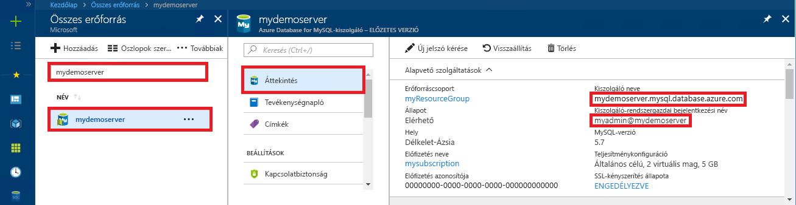

# <a name="azure-database-for-mysql-use-connectorc-to-connect-and-query-data"></a>A MySQL-hez készült Azure Database: Csatlakozás és adatlekérdezés összekötő/C++ használatával
Ebben a rövid útmutatóban azt szemléltetjük, hogy miként lehet C++-alkalmazás használatával csatlakozni egy Azure Database for MySQL kiszolgálóhoz. Azt is bemutatja, hogyan lehet SQL-utasítások használatával adatokat lekérdezni, beszúrni, frissíteni és törölni az adatbázisban. Ez a témakör azt feltételezi, hogy a C++ használata terén rendelkezik fejlesztési tapasztalatokkal, de az Azure Database for MySQL használatában még járatlan.

## <a name="prerequisites"></a>Előfeltételek
Ebben a rövid útmutatóban a következő útmutatók valamelyikében létrehozott erőforrásokat használunk kiindulási pontként:
- [Azure-adatbázis létrehozása MySQL-kiszolgálóhoz az Azure Portal használatával](./quickstart-create-mysql-server-database-using-azure-portal.md)
- [Azure-adatbázis létrehozása MySQL-kiszolgálóhoz az Azure CLI használatával](./quickstart-create-mysql-server-database-using-azure-cli.md)

Emellett a következőket kell elvégezni:
- A [.NET-keretrendszer](https://www.microsoft.com/net/download) telepítése
- A [Visual Studio](https://www.visualstudio.com/downloads/) telepítése
- A [MySQL-összekötő/C++](https://dev.mysql.com/downloads/connector/cpp/) telepítése 
- A [Boost](http://www.boost.org/) telepítése

## <a name="install-visual-studio-and-net"></a>A Visual Studio és a .NET telepítése
A jelen szakaszban ismertetett lépések feltételezik, hogy Ön rendelkezik .NET-fejlesztési tapasztalatokkal.

### <a name="windows"></a>**Windows**
- Telepítse a Visual Studio 2017 Community kiadását, amely egy minden funkcióval ellátott, bővíthető, ingyenes IDE, és amellyel korszerű alkalmazásokat hozhat létre Android, iOS és Windows operációs rendszerre, valamint webes illetve adatbázis-alkalmazásokhoz és felhőszolgáltatásokhoz. Telepítheti a teljes .NET-keretrendszert vagy csak a .NET Core-t: a rövid útmutatóban foglalt kódrészletek mindkettővel működnek. Ha a Visual Studio már telepítve van a számítógépén, a következő két lépés kihagyható.
   1. Töltse le a [Visual Studio 2017 telepítőt](https://www.visualstudio.com/thank-you-downloading-visual-studio/?sku=Community&rel=15). 
   2. Futtassa a telepítőt, és kövesse a telepítési utasításokat a telepítés befejezéséhez.

### <a name="configure-visual-studio"></a>**A Visual Studio konfigurálása**
1. A Visual Studióban válassza a Project (Projekt) -> Properties (Tulajdonságok) -> Linker (Kapcsolószerkesztő) -> General (Általános) -> Additional Library Directories (További kódtárkönyvtárak) lehetőséget, és adja hozzá a C++-összekötő „ \lib\opt” könyvtárát (pl.: C:\Program Files (x86)\MySQL\MySQL Connector C++ 1.1.9\lib\opt).
2. A Visual Studióban válassza a Project -> Properties -> C/C++ -> General -> Additional Include Directories (További belefoglalt könyvtárak) lehetőséget:
   - Adja hozzá a C++-összekötő „\include” könyvtárát (pl.: C:\Program Files (x86)\MySQL\MySQL Connector C++ 1.1.9\include\).
   - Adja hozzá a Boost kódtár gyökérkönyvtárát (pl.: C:\boost_1_64_0\).
3. A Visual Studióban válassza Project -> Properties -> Linker -> Input (Bemenet) -> Additional Dependencies (További függőségek) lehetőséget, és adja hozzá a **mysqlcppconn.lib** elemet a szövegmezőhöz.
4. Másolja át a **mysqlcppconn.dll** fájlt a 3. lépésben szereplő C++-összekötő könyvtárából az alkalmazás futtatható fájlját tartalmazó könyvtárba, vagy adja hozzá környezeti változóként, hogy az alkalmazás megtalálhassa azt.

## <a name="get-connection-information"></a>Kapcsolatadatok lekérése
Kérje le a MySQL-hez készült Azure Database-hez való csatlakozáshoz szükséges kapcsolatadatokat. Ehhez szükség lesz a teljes kiszolgálónévre és bejelentkezési hitelesítő adatokra.

1. Jelentkezzen be az [Azure portálra](https://portal.azure.com/).
2. Az Azure Portal bal oldali menüjében kattintson a **Minden erőforrás** lehetőségre, és keressen rá a létrehozott kiszolgálóra (például **mydemoserver**).
3. Kattintson a kiszolgálónévre.
4. A kiszolgáló **Áttekintés** paneléről jegyezze fel a **Kiszolgálónevet** és a **Kiszolgáló-rendszergazdai bejelentkezési nevet**. Ha elfelejti a jelszavát, ezen a panelen új jelszót is tud kérni.
 

## <a name="connect-create-table-and-insert-data"></a>Csatlakozás, táblák létrehozása és adatok beszúrása
A következő kóddal csatlakozhat, és betöltheti az adatokat a **CREATE TABLE** és az **INSERT INTO** SQL-utasításokkal. A kód az sql::Driver osztályt használja a connect() metódussal a MySQL-lel létesített kapcsolat létrehozásához. A kód ezután a createStatement() és az execute() metódust használja az adatbázis-parancsok futtatásához. 

Cserélje le a gazdagép, az adatbázisnév, a felhasználó és a jelszó paramétereit azokra az értékekre, amelyeket a kiszolgáló és az adatbázis létrehozásakor adott meg. 

```c++
#include <stdlib.h>
#include <iostream>
#include "stdafx.h"

#include "mysql_connection.h"
#include <cppconn/driver.h>
#include <cppconn/exception.h>
#include <cppconn/prepared_statement.h>
using namespace std;

//for demonstration only. never save your password in the code!
const string server = "tcp://yourservername.mysql.database.azure.com:3306";
const string username = "username@servername";
const string password = "yourpassword";

int main()
{
    sql::Driver *driver;
    sql::Connection *con;
    sql::Statement *stmt;
    sql::PreparedStatement *pstmt;

    try
    {
        driver = get_driver_instance();
        con = driver->connect(server, username, password);
    }
    catch (sql::SQLException e)
    {
        cout << "Could not connect to server. Error message: " << e.what() << endl;
        system("pause");
        exit(1);
    }

    //please create database "quickstartdb" ahead of time
    con->setSchema("quickstartdb");

    stmt = con->createStatement();
    stmt->execute("DROP TABLE IF EXISTS inventory");
    cout << "Finished dropping table (if existed)" << endl;
    stmt->execute("CREATE TABLE inventory (id serial PRIMARY KEY, name VARCHAR(50), quantity INTEGER);");
    cout << "Finished creating table" << endl;
    delete stmt;

    pstmt = con->prepareStatement("INSERT INTO inventory(name, quantity) VALUES(?,?)");
    pstmt->setString(1, "banana");
    pstmt->setInt(2, 150);
    pstmt->execute();
    cout << "One row inserted." << endl;

    pstmt->setString(1, "orange");
    pstmt->setInt(2, 154);
    pstmt->execute();
    cout << "One row inserted." << endl;

    pstmt->setString(1, "apple");
    pstmt->setInt(2, 100);
    pstmt->execute();
    cout << "One row inserted." << endl;

    delete pstmt;
    delete con;
    system("pause");
    return 0;
}
```

## <a name="read-data"></a>Adatok olvasása

A következő kóddal csatlakozhat, és beolvashatja az adatokat a **SELECT** SQL-utasítással. A kód az sql::Driver osztályt használja a connect() metódussal a MySQL-lel létesített kapcsolat létrehozásához. A kód ezután a prepareStatement() és az executeQuery() metódust használja a select-parancsok futtatásához. Ezután a kód a next() metódust használja az eredményekben lévő rekordokra lépéshez. Végül a kód a getInt() és a getString() metódussal elemzi a rekord értékeit.

Cserélje le a gazdagép, az adatbázisnév, a felhasználó és a jelszó paramétereit azokra az értékekre, amelyeket a kiszolgáló és az adatbázis létrehozásakor adott meg. 

```c++
#include <stdlib.h>
#include <iostream>
#include "stdafx.h"

#include "mysql_connection.h"
#include <cppconn/driver.h>
#include <cppconn/exception.h>
#include <cppconn/resultset.h>
#include <cppconn/prepared_statement.h>
using namespace std;

//for demonstration only. never save your password in the code!
const string server = "tcp://yourservername.mysql.database.azure.com:3306";
const string username = "username@servername";
const string password = "yourpassword";

int main()
{
    sql::Driver *driver;
    sql::Connection *con;
    sql::PreparedStatement *pstmt;
    sql::ResultSet *result;

    try
    {
        driver = get_driver_instance();
        //for demonstration only. never save password in the code!
        con = driver->connect(server, username, password);
    }
    catch (sql::SQLException e)
    {
        cout << "Could not connect to server. Error message: " << e.what() << endl;
        system("pause");
        exit(1);
    }

    con->setSchema("quickstartdb");

    //select  
    pstmt = con->prepareStatement("SELECT * FROM inventory;");
    result = pstmt->executeQuery();

    while (result->next())
        printf("Reading from table=(%d, %s, %d)\n", result->getInt(1), result->getString(2).c_str(), result->getInt(3));

    delete result;
    delete pstmt;
    delete con;
    system("pause");
    return 0;
}
```

## <a name="update-data"></a>Adatok frissítése
A következő kóddal csatlakozhat, és beolvashatja az adatokat az **UPDATE** SQL-utasítással. A kód az sql::Driver osztályt használja a connect() metódussal a MySQL-lel létesített kapcsolat létrehozásához. A kód ezután a prepareStatement() és az executeQuery() metódust használja az update-parancsok futtatásához. 

Cserélje le a gazdagép, az adatbázisnév, a felhasználó és a jelszó paramétereit azokra az értékekre, amelyeket a kiszolgáló és az adatbázis létrehozásakor adott meg. 

```c++
#include <stdlib.h>
#include <iostream>
#include "stdafx.h"

#include "mysql_connection.h"
#include <cppconn/driver.h>
#include <cppconn/exception.h>
#include <cppconn/resultset.h>
#include <cppconn/prepared_statement.h>
using namespace std;

//for demonstration only. never save your password in the code!
const string server = "tcp://yourservername.mysql.database.azure.com:3306";
const string username = "username@servername";
const string password = "yourpassword";

int main()
{
    sql::Driver *driver;
    sql::Connection *con;
    sql::PreparedStatement *pstmt;

    try
    {
        driver = get_driver_instance();
        //for demonstration only. never save password in the code!
        con = driver->connect(server, username, password);
    }
    catch (sql::SQLException e)
    {
        cout << "Could not connect to server. Error message: " << e.what() << endl;
        system("pause");
        exit(1);
    }
    
    con->setSchema("quickstartdb");

    //update
    pstmt = con->prepareStatement("UPDATE inventory SET quantity = ? WHERE name = ?");
    pstmt->setInt(1, 200);
    pstmt->setString(2, "banana");
    pstmt->executeQuery();
    printf("Row updated\n");

    delete con;
    delete pstmt;
    system("pause");
    return 0;
}
```


## <a name="delete-data"></a>Adat törlése
A következő kóddal csatlakozhat, és beolvashatja az adatokat a **DELETE** SQL-utasítással. A kód az sql::Driver osztályt használja a connect() metódussal a MySQL-lel létesített kapcsolat létrehozásához. A kód ezután a prepareStatement() és az executeQuery() metódust használja a delete-parancsok futtatásához.

Cserélje le a gazdagép, az adatbázisnév, a felhasználó és a jelszó paramétereit azokra az értékekre, amelyeket a kiszolgáló és az adatbázis létrehozásakor adott meg. 

```c++
#include <stdlib.h>
#include <iostream>
#include "stdafx.h"

#include "mysql_connection.h"
#include <cppconn/driver.h>
#include <cppconn/exception.h>
#include <cppconn/resultset.h>
#include <cppconn/prepared_statement.h>
using namespace std;

//for demonstration only. never save your password in the code!
const string server = "tcp://yourservername.mysql.database.azure.com:3306";
const string username = "username@servername";
const string password = "yourpassword";

int main()
{
    sql::Driver *driver;
    sql::Connection *con;
    sql::PreparedStatement *pstmt;
    sql::ResultSet *result;

    try
    {
        driver = get_driver_instance();
        //for demonstration only. never save password in the code!
        con = driver->connect(server, username, password);
    }
    catch (sql::SQLException e)
    {
        cout << "Could not connect to server. Error message: " << e.what() << endl;
        system("pause");
        exit(1);
    }
    
    con->setSchema("quickstartdb");
        
    //delete
    pstmt = con->prepareStatement("DELETE FROM inventory WHERE name = ?");
    pstmt->setString(1, "orange");
    result = pstmt->executeQuery();
    printf("Row deleted\n");    
    
    delete pstmt;
    delete con;
    delete result;
    system("pause");
    return 0;
}
```

## <a name="next-steps"></a>További lépések
> [!div class="nextstepaction"]
> [MySQL-adatbázis migrálása a MySQL-hez készült Azure Database-be memóriakép és visszaállítás használatával](concepts-migrate-dump-restore.md)
